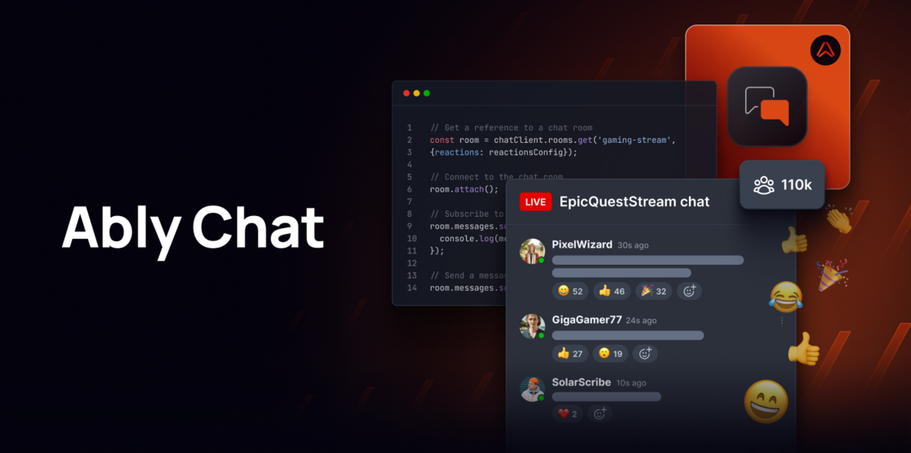

**What's New:** Today, we are thrilled to announce the private beta launch of [Ably Chat](https://ably.com/docs/products/chat) – our new product designed for large-scale chat interactions. Ably Chat is built to handle a wide array of chat use cases, from livestreams and in-game communication to customer support and social interactions within SaaS products.

## Key Features

- Purpose-built APIs: Easily create 1:1, 1:Many, Many:1, and Many: Many chat rooms.

- User interactions: Send/receive messages, track user online status, and monitor room occupancy.

- Engagement features: Typing indicators, room-level reactions, and more features in development like moderation and message interactions.

## Why Ably Chat?

- Scalability: Powered by Ably’s reliable global platform, ensuring low-latency and high-availability.

- Flexibility: Combine chat with other realtime features like live updates, collaboration and notifications.

- Cost Efficiency: Designed with cost optimizations for high concurrency at a stable price.

## How to get Involved?

- [Request a beta invite](https://forms.gle/vB2kXhCXrTQpzHLu5) to start experimenting with Ably Chat.

- [Check out the documentation](https://ably.com/docs/products/chat) for a sneak peek of the current functionality.

- [Browse the API Reference](https://sdk.ably.com/builds/ably/ably-chat-js/main/typedoc/index.html).

- Check out the [live demo](https://ably-livestream-chat-demo.vercel.app/)! to see the chat features in action.

Stay tuned for more updates and features as we roll out this new initiative.

[Sign up for the chat private beta](https://forms.gle/vB2kXhCXrTQpzHLu5) to access new features early and collaborate on upcoming functionality to shape our roadmap.
