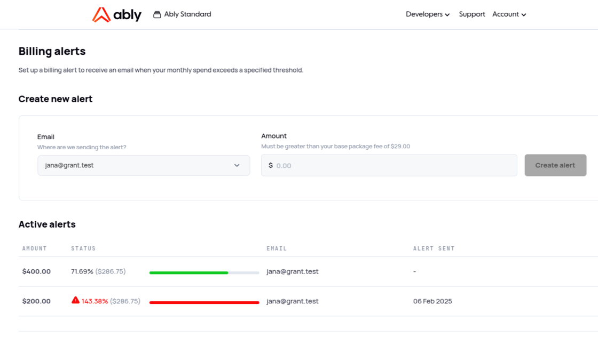

We’re excited to introduce Billing Alerts, a proactive spend-management tool that empowers you to set custom cost limits and receive timely notifications when you approach your thresholds.

**What’s New?**

- **Custom Thresholds:** Customers can now define one or more alerts based on spend thresholds.

- **Automated Monitoring:** Every 10 minutes, your account’s usage and spend (calculated in dollars) are checked. When a configured threshold is crossed an alert is sent out.

- **Flexible Delivery:** You can choose different recipients for different thresholds.

- **Easy Management:** Account owners can create and delete alerts for themselves and any billing users, while billing users can manage their own alerts.

Setting up alerts allows you to monitor your costs and address situation quickly if needed - monitor your usage closely, get in touch with Ably support to investigate any unusual spikes, or even disable an API key if necessary to prevent further charges.

**How to set up Billing Alerts?**

1. Go to Account Billing page and scroll down to Billing Alerts (or follow this [link](http://ably.com/accounts/any/package#billing-alerts-section)).

2. Set up as many limits as you need, and see the full list with the current status in the Active Alerts section.

