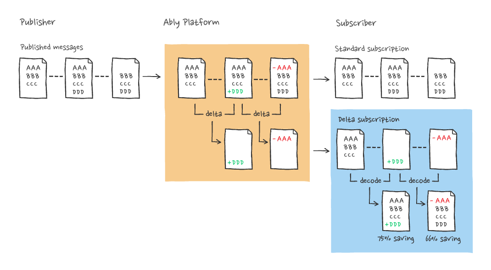

The `delta` channel option enables delta compression. It is applied on the channel you are subscribing to, enabling delta mode.

Delta mode is a way for a client to subscribe to a channel so that message payloads sent contain only the difference between the present message and the previous message sent on the channel.

As `delta` only applies to channel subscriptions, it is only available when using the realtime interface of an Ably SDK, or when using [SSE](/docs/protocols/sse) or [MQTT](/docs/protocols/mqtt).

`delta` is useful for channels that carry messages representing a series of updates to a particular object or document with a significant degree of similarity between successive messages. A client can apply the delta to the previous message to obtain the full payload.

Using delta mode can significantly reduce the encoded size of each message when the difference between successive message payload sizes are small, relative to the overall size. The reduction can reduce bandwidth costs and transit latencies, and enable greater message throughput on a connection.



## Delta processing <a id="processing"/>

Deltas apply to the `data` property of a [`Message`](/docs/channels/messages) payload published via Ably. Other properties, such as `clientId`, `name`, and `extras` remain unchanged and are not compressed when using deltas.

Messages retrieved via [history](/docs/storage-history/history), and messages delivered to [integrations](/docs/platform/integrations) are not compressed.

The `delta` channel option implementation supports a single representation of a delta, [VCDIFF](https://tools.ietf.org/html/rfc3284).

Delta compression via `vcdiff` is supported for all payloads, whether string, binary, or JSON-encoded. The delta algorithm processes message payloads as opaque binaries and has no dependency on the structure of the payload, for example, it does not process line-oriented diffs.

As delta compression is specified by a subscriber, the publisher has no control over whether or not deltas are generated for any given message. Delta processing is performed for all messages if there is at least one subscriber on a channel that has subscribed with the `delta` option.

There is no constraint on how many publishers or subscribers there are. If there are multiple publishers, then deltas can still be generated, and they will be determined based on the order of messages. Deltas are calculated strictly based on the message ordering in that channel, with the effectiveness being dependent on the level of similarity between successive payloads.

If a delta is generated and it results in a difference that is not appreciably smaller than the original message, or is larger than the original message, for example if successive messages are completely different, then the delta will not be sent. Clients will receive the original, unprocessed message.

<Aside data-type='see-evidence'>
Deltas rely on consistent message ordering. Messages published using Realtime from a single publisher are delivered to all subscribers in the same order, with each message assigned a unique serial number. [See evidence here 🕵️](/docs/platform/architecture/message-ordering#message-ordering-guarantees).
</Aside>

<If lang="javascript,nodejs">
## Install vcdiff decoder <a id="vcdiff"/>

The vcdiff decoder is written in pure JavaScript and enables clients to reconstruct full messages from the small "diffs" sent by Ably.

### Installation from npm for Node.js <a id="install"/>

<Code fixed="true">
```shell
npm install @ably/vcdiff-decoder
```
</Code>

and require as:

<Code>
```javascript
const vcdiffPlugin = require('@ably/vcdiff-decoder');
```

```nodejs
const vcdiffPlugin = require('@ably/vcdiff-decoder');
```
</Code>

### Script include for web browsers <a id="browsers"/>

Include the library in your HTML from our CDN:

<Code fixed="true">
```javascript
<script src="https://cdn.ably.io/lib/vcdiff-decoder.min-1.js"></script>
```
</Code>

### Exported functions <a id="exported"/>

The vcdiff decoder library exports the following function for manual delta decoding.

`decode(delta, source)` applies a vcdiff delta to a source message to return a [`Uint8Array`](https://nodejs.org/api/buffer.html#buffer) containing the target message:

* `delta`: The binary delta/diff data.
* `source`: The original message to apply the delta to.
</If>

<If lang="python">
## Install vcdiff decoder <a id="vcdiff"/>

The vcdiff decoder is written in pure Python and enables clients to reconstruct full messages from the small "diffs" sent by Ably.

### Installation from pip as ably package extras <a id="install"/>

<Code fixed="true">
```shell
pip install ably[vcdiff]
```
</Code>
</If>

## Subscribe using delta <a id="subscribe"/>

Set the `delta` property of `params` to `vcdiff` in order to enable deltas when subscribing to a channel.

This will cause delta messages to be generated by the server and sent to the client, and the library reconstitutes the original message payload. Messages on the channel are delivered to the subscriber's listener in the same way as with a normal [subscription](/docs/pub-sub#subscribe).

Note that in some SDKs, the `vcdiff` delta decoding library is excluded from the default distribution in order to avoid increasing the size. In these cases, it is also necessary to supply the delta decoder plugin when instantiating Ably.

<Code>
```realtime_javascript
/* Make sure to include <script src="//cdn.ably.com/lib/vcdiff-decoder.min-1.js"></script> in your head */
const Ably = require('ably');
const vcdiffPlugin = require('@ably/vcdiff-decoder');

const realtime = new Ably.Realtime({
    key: '{{API_KEY}}',
    plugins: {
        vcdiff: vcdiffPlugin
    },
    log: { level: 4 } // optional
});

const channel = realtime.channels.get('your-ably-channel', {
    params: {
        delta: 'vcdiff'
    }
});

channel.subscribe(msg => console.log("Received message: ", msg));
```

```realtime_nodejs
/* Make sure to include <script src="//cdn.ably.com/lib/vcdiff-decoder.min-1.js"></script> in your head */
const Ably = require('ably');
const vcdiffPlugin = require('@ably/vcdiff-decoder');

const realtime = new Ably.Realtime({
    key: '{{API_KEY}}',
    plugins: {
        vcdiff: vcdiffPlugin
    },
    log: { level: 4 } // optional
});

const channel = realtime.channels.get('your-ably-channel', {
    params: {
        delta: 'vcdiff'
    }
});

channel.subscribe(msg => console.log("Received message: ", msg));
```

```realtime_java
AblyRealtime ably = new AblyRealtime("{{API_KEY}}")
ChannelOptions options = new ChannelOptions();
options.params = new HashMap<>();
options.params.put("delta", "vcdiff");
Channel channel = ably.channels.get("{{RANDOM_CHANNEL_NAME}}", options);
channel.subscribe(new MessageListener() {
  @Override
  public void onMessage(Message message) {
    System.out.println("Received `" + message.name + "` message with data: " + message.data);
  }
});
```

```realtime_swift
let options = ARTClientOptions(key: key)
let client = ARTRealtime(options: options)
let channelOptions = ARTRealtimeChannelOptions()
channelOptions.params = [
  "delta": "vcdiff"
]

let channel = client.channels.get(channelName, options: channelOptions)
```

```realtime_csharp
var clientOptions = new ClientOptions();
clientOptions.Key = "{{API_KEY}}";
clientOptions.Environment = AblyEnvironment;
var ably = new AblyRealtime(clientOptions);

var channelParams = new ChannelParams();
channelParams.Add("delta", "vcdiff");
var channelOptions = new ChannelOptions();
channelOptions.Params = channelParams;
var channel = ably.Channels.Get("{{RANDOM_CHANNEL_NAME}}", channelOptions);

channel.Subscribe(message => {
    Console.WriteLine(message.Data.ToString());
});
```

```realtime_go
ablyVCDiffPlugin := ably.NewVCDiffPlugin()
client, err := ably.NewRealtime(
    ably.WithKey("{{API_KEY}}"),
    ably.WithVCDiffPlugin(ablyVCDiffPlugin)
)
if err != nil {
    log.Fatal(err)
}
channel := client.Channels.Get("{{RANDOM_CHANNEL_NAME}}", ably.ChannelWithVCDiff())
channel.SubscribeAll(context.Background(), func(msg *ably.Message) {
    fmt.Printf("Received message: %+v\n", msg)
})
```

```realtime_python
from ably import AblyRealtime, AblyVCDiffDecoder
from ably.realtime.realtime_channel import ChannelOptions

ably = AblyRealtime("{{API_KEY}}", vcdiff_decoder=AblyVCDiffDecoder())

channel = client.channels.get("{{RANDOM_CHANNEL_NAME}}", ChannelOptions(params={
 'delta': 'vcdiff'
}))

def on_message(message):
    print(f"Received message: {message.data}")

await channel.subscribe(on_message);
```
</Code>

## Known limitations <a id="limitations"/>

In principle, `vcdiff` deltas can be applied to encrypted message payloads, but in practice this provides no benefit because there is no similarity between successive encrypted payloads even for identical or near-identical plaintext message payloads.

If a subscriber has a delta subscription and the channel in question experiences a discontinuity, then a non-delta message will be delivered to the client as the first message after the discontinuity. This ensures that lost messages do not prevent the client from reconstituting messages from deltas.

Note that a channel subscriber can experience a discontinuity in the sequence of messages it receives on a given channel for the following reasons:

* The connection can drop, and there will be a discontinuity if the client is unable to reconnect within a two-minute window that preserves [connection continuity](/docs/connect/states).
* The outbound connection may become [rate limited](/docs/platform/pricing/limits), which causes some messages to be dropped.
* There may have been an internal error in the Ably system leading to the server being unable to preserve continuity on the channel.

In these cases, the service indicates the discontinuity to the client, together with the reason, and this is usually visible to the subscriber in a channel `UPDATE` event.
