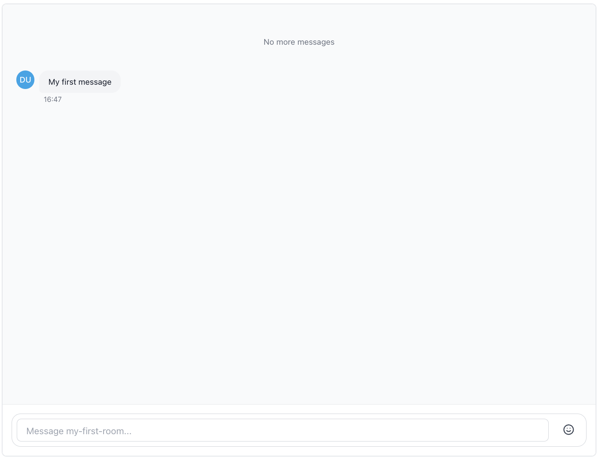
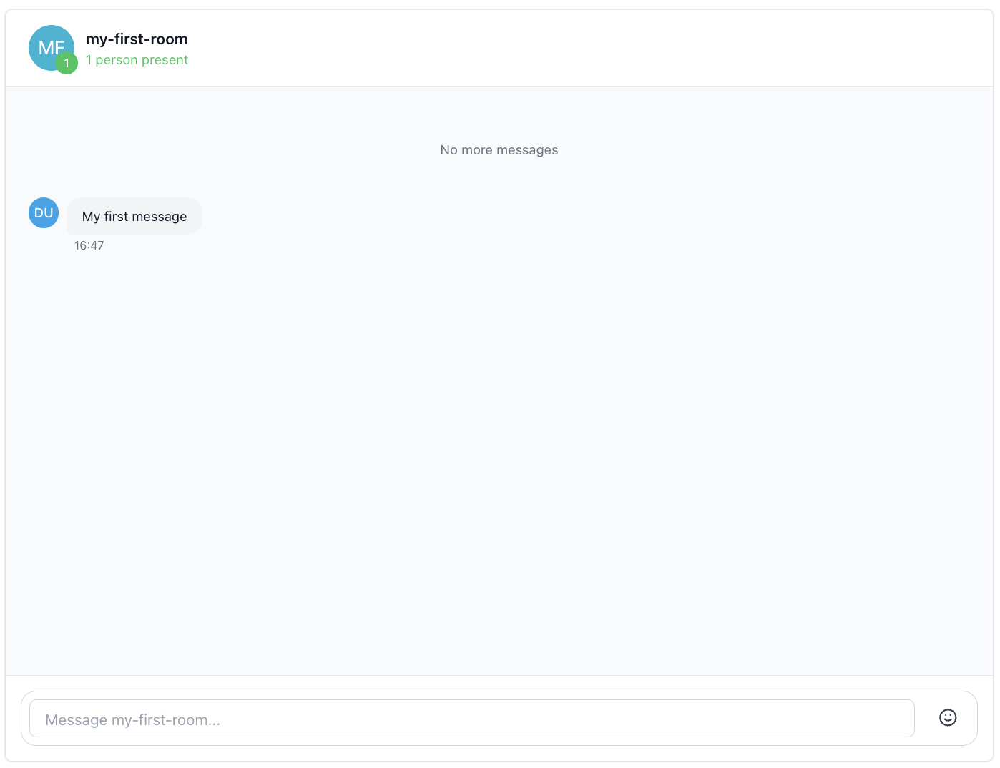
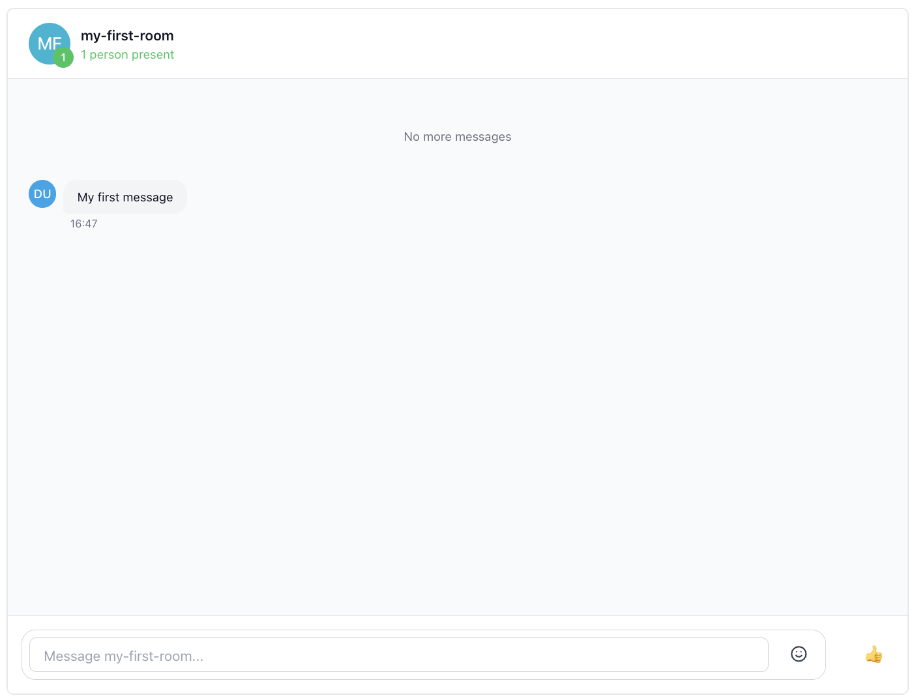
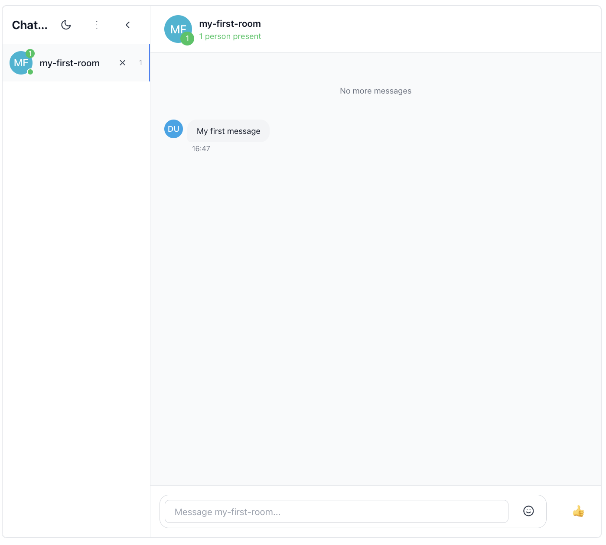
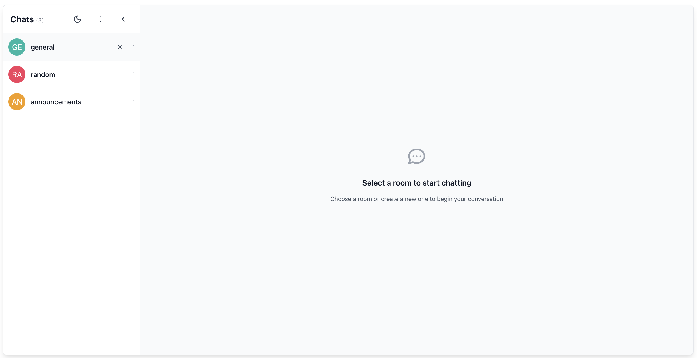

This guide shows you how to add the Ably Chat React UI Kit to a brand-new React app built with Vite.

You'll create Ably clients, install the UI component package, and build a complete chat interface. You'll also cover customizing the look and feel with your own styles, settings, and avatars.

## Prerequisites <a id="prerequisites"/>

1. Sign up for an Ably account.

2. Create a [new app](https://ably.com/accounts/any/apps/new), and get your first API key. You can use the root API key that is provided by default, within the **API Keys** tab to get started.

### Create a new project <a id="prerequisites-project"/>

1. Scaffold a **React + TypeScript** project with Vite:

<Code>
  ```shell
  npm create vite@latest my-chat-ui-app -- --template react-ts
  cd my-chat-ui-app
  ```
</Code>

2. (Optional) Add Tailwind CSS if you want utility classes elsewhere in your app. The UI kit itself ships pre-compiled CSS, so Tailwind isn't required:

<Code>
  ```shell
  npm install -D tailwindcss postcss autoprefixer
  npx tailwindcss init -p
  ```
</Code>

Follow the Tailwind Vite guide to configure the generated files.

3. Install the Chat UI kit and its peers:

<Code>
  ```shell
  npm install ably @ably/chat @ably/chat-react-ui-kit

  # Ensure React 19 is present (Vite template already has these)
  npm install react react-dom
  ```
</Code>

4. Create a `.env` file in your project root and add your API key:

<Code>
```shell
echo "ABLY_API_KEY={{API_KEY}}" > .env
```
</Code>

That's all the setup you need—the kit's CSS is automatically bundled by Vite alongside the rest of your styles.

### (Optional) Install Ably CLI <a id="install-cli"/>

Use the [Ably CLI](https://github.com/ably/cli) as an additional client to quickly test chat features. It can simulate other users by sending messages, entering presence, and acting as another user typing a message.

1. Install the Ably CLI:

<Code>
```shell
npm install -g @ably/cli
```
</Code>

2. Run the following to log in to your Ably account and set the default app and API key:

<Code>
```shell
ably login
```
</Code>

<If loggedIn={false}>
  <Aside data-type='note'>
  The code examples in this guide include a demo API key. If you wish to interact with the Ably CLI and view outputs within your Ably account, ensure that you replace them with your own API key.
  </Aside>
</If>

## Usage <a id="usage"/>

The components and their stylesheet can be imported into your React applications like so:

<Code>
  ```react
  // App.tsx
  import { App, ChatWindow, Sidebar, RoomInfo, AppLayout } from '@ably/chat-react-ui-kit';
  import '@ably/chat-react-ui-kit/dist/style.css';
  ```
</Code>

The `@ably/chat-react-ui-kit/dist/style.css` file contains all the necessary styles for the components, compiled from the Tailwind utility classes used in the component code.

### Providers setup <a id="providers-setup"/>

ably-chat-react-ui-kit relies on the same React context providers as the underlying Chat SDK, plus a few extras for theming and avatars.

#### Basic provider setup <a id="basic-provider-setup"/>

In your main entry file (e.g. `main.tsx`), replace the content with the following code to set up the providers:

<Code>
  ```react
  // main.tsx
  import * as Ably from 'ably';
  import { ChatClient } from '@ably/chat';
  import { ChatClientProvider } from '@ably/chat/react';
  import { ThemeProvider, AvatarProvider, ChatSettingsProvider } from '@ably/chat-react-ui-kit';
  import '@ably/chat-react-ui-kit/dist/style.css';

  // Create Ably Realtime client
  const ablyClient = new Ably.Realtime({
    key: process.env.ABLY_API_KEY,
    clientId: 'your-chat-client-id',
  });

  const chatClient = new ChatClient(ablyClient);

  ReactDOM.createRoot(document.querySelector('#root') || document.createElement('div')).render(
    <React.StrictMode>
      <ThemeProvider>
        <AvatarProvider>
          <ChatSettingsProvider>
            <ChatClientProvider client={chatClient}>
              {/* Your components will go here */}
            </ChatClientProvider>
          </ChatSettingsProvider>
        </AvatarProvider>
      </ThemeProvider>
    </React.StrictMode>
  );
  ```
</Code>

The components you make throughout this guide will be wrapped in these providers to ensure they have access to the necessary context.

In production, you should use [token authentication](/docs/auth/token) to avoid exposing your API keys publicly, the [`clientId`](/docs/auth/identified-clients) is used to identify the client.

### Provider responsibilities <a id="provider-responsibilities"/>

* **`ChatClientProvider`** – supplies the Ably Chat client so child components can publish, subscribe, and manage rooms
* **`ThemeProvider`** – toggles light/dark mode and optionally stores the preference (`persist: true`)
* **`AvatarProvider`** – generates and caches user / room avatars
* **`ChatSettingsProvider`** – provides a place to store and retrieve chat settings that control the UI, such as enabling message editing or reactions
* **`ChatRoomProvider`** – provides the chat room context for components that operate on a specific room, such as the `ChatWindow`, `TypingIndicators` and `RoomInfo` components

## Building your chat interface <a id="building-interface"/>

Let's build up a complete chat interface step by step, starting with individual components and working up to a full application.

### ChatWindow component <a id="chat-window"/>

The `ChatWindow` component provides the main chat interface for a room.
It handles everything related to messages - display, editing, deletion, reactions, history and realtime updates.

**Features:**
- Message display with history loading and infinite scroll
- Message editing, deletion, and reactions
- Typing indicators and presence awareness
- Custom header and footer content areas
- Discontinuity recovery on reconnection
- Configurable message window size for performance

**Requirements:** Must be wrapped in `ChatRoomProvider`, `AvatarProvider`, and `ChatSettingsProvider`. The settings provider controls which message actions (update/delete/react) are available.

Create a simple file called `App.tsx` with the following content:

<Code>
  // App.tsx
  ```react
  import { ChatWindow } from '@ably/chat-react-ui-kit';
  import { ChatRoomProvider } from '@ably/chat/react';

  export function ChatApp() {
    return (
      <div className="bg-gray-50 rounded-lg border">
        <div
          className="overflow-hidden border rounded-lg flex"
          style={{ width: '70vw', height: '70vh' }}
        >
          <ChatRoomProvider name="my-first-room">
            <ChatWindow roomName="my-first-room" enableTypingIndicators={true} />
          </ChatRoomProvider>
        </div>
      </div>
    );
  }
  ```
</Code>

Now import the `ChatApp` component in your `main.tsx` file and render it within the providers:

<Code>
  ```react
  // main.tsx
  import React from 'react';
  import ReactDOM from 'react-dom/client';
  import * as Ably from 'ably';
  import { ChatClient } from '@ably/chat';
  import { ChatClientProvider } from '@ably/chat/react';
  import { ThemeProvider, AvatarProvider, ChatSettingsProvider } from '@ably/chat-react-ui-kit';
  import '@ably/chat-react-ui-kit/dist/style.css';
  import { ChatApp } from './App.tsx'; // Assuming your app.tsx is in the same directory

  const ablyClient = new Ably.Realtime({
    key: process.env.ABLY_API_KEY,
    clientId: 'your-chat-client-id',
  });

  const chatClient = new ChatClient(ablyClient);

  ReactDOM.createRoot(document.querySelector('#root') || document.createElement('div')).render(
    <React.StrictMode>
      <ThemeProvider>
        <AvatarProvider>
          <ChatSettingsProvider>
            <ChatClientProvider client={chatClient}>
              <ChatApp />
            </ChatClientProvider>
          </ChatSettingsProvider>
        </AvatarProvider>
      </ThemeProvider>
    </React.StrictMode>
  );
  ```
</Code>

Typing indicators are enabled by default, but you can disable them by setting `enableTypingIndicators={false}`.

Try sending a message to the room, use the following command:

<Code>
  ```shell
ably rooms messages send my-first-room "Hello, world!" --clientId your-chat-client-id
  ```
</Code>

To simulate typing in the room, use the following command:

<Code>
  ```shell
ably rooms typing keystroke my-first-room --clientId your-chat-client-id
  ```
</Code>



### Adding Room Information <a id="room-info"/>

The `RoomInfo` component displays comprehensive information about a chat room. It shows the room avatar, live presence count, participant details, and typing indicators.

**Features:**
- Room avatar display with automatic generation.
- Live presence count badge showing active participants.
- Interactive hover tooltip with participant preview.
- Expandable participant list with detailed user information.
- In-place avatar with color and image customization via the `AvatarProvider`.
- Typing indicators built-in.
- Accessibility support with ARIA roles and keyboard navigation.

**Requirements:** Must be wrapped in both `ChatRoomProvider` and `AvatarProvider`.

Let's add the RoomInfo component to our chat window's header section, replace the content in `App.tsx` with the following code:

<Code>
  ```react
  // App.tsx
  import { ChatWindow, RoomInfo } from '@ably/chat-react-ui-kit';
  import { ChatRoomProvider } from '@ably/chat/react';

  export function ChatApp() {
    return (
      <div className="bg-gray-50 rounded-lg border">
        <div
          className="overflow-hidden border rounded-lg flex"
          style={{ width: '70vw', height: '70vh' }}>
          <ChatRoomProvider name="my-first-room">
            <ChatWindow
              roomName="my-first-room"
              customHeaderContent={<RoomInfo />}
            />
          </ChatRoomProvider>
        </div>
      </div>
    );
  }
  ```
</Code>

The `RoomInfo` component will automatically display the room avatar, participant count, and typing indicators. You can customize its appearance by passing props like `roomAvatar`, `position`, and `className`.

<Code>
  ```react
  <RoomInfo
    // Optional custom avatar data (overrides AvatarProvider)
    roomAvatar={{
      displayName: 'VIP Lounge',
      color: 'bg-green-500',
      initials: 'VL',
      src: 'https://example.com/vip-avatar.jpg',
    }}
    // Position for dropdown menus
    position={{ top: 60, left: 250 }}
    // Custom styling
    className="p-4 bg-blue-400 rounded-lg shadow-sm"
  />
  ```
</Code>

For now we will just use the defaults for the `RoomInfo` component.

Try using the Ably CLI to enter the rooms presence set, you should see this reflected in the RoomInfo component:

<Code>
  ```shell
  ably rooms presence enter my-first-room --clientId your-chat-client-id
  ```
</Code>

You can also use the CLI to simulate typing in the room too, which will show up in the RoomInfo component's typing indicators:

<Code>
  ```shell
 ably rooms typing keystroke my-first-room --clientId your-chat-client-id
  ```
</Code>



### Adding Room Reactions <a id="room-reactions"/>

The chat window also supports custom footer content, which can be used for additional controls like reactions. You can pass any React component as `customFooterContent`, e.g., the `RoomReaction` component.

To add the `RoomReaction` component, update your `App.tsx` file as follows:

<Code>
  ```react
  // App.tsx
  import { ChatWindow, RoomInfo, RoomReaction } from '@ably/chat-react-ui-kit';
  import { ChatRoomProvider } from '@ably/chat/react';

  export function ChatApp() {
    return (
      <div className="bg-gray-50 rounded-lg border">
        <div
          className="overflow-hidden border rounded-lg flex"
          style={{ width: '70vw', height: '70vh' }}>
          <ChatRoomProvider name="my-first-room">
            <ChatWindow
              roomName="my-first-room"
              customHeaderContent={<RoomInfo />}
              customFooterContent={<RoomReaction />}
            />
          </ChatRoomProvider>
        </div>
      </div>
    );
  }
  ```
</Code>

Now try sending a thumbs up reaction to the room using the Ably CLI:

<Code>
  ```shell
  ably rooms reactions send my-first-room 👍 --clientId your-chat-client-id
  ```
</Code>

You should see the reaction appear on the screen as a small explosion animation.



### Adding a Sidebar <a id="sidebar"/>

Now let's add a Sidebar component to our chat application. The Sidebar provides room navigation and management, allowing users to create, join, and leave rooms. It can be placed next to the ChatWindow to provide a complete chat interface.

**Features:**
- Collapsible interface with avatar-only mode
- Room creation and management
- Theme toggle integration
- Active room highlighting
- Room count display
- Automatic room attachment/detachment

The sidebar automatically manages room connections as users navigate. It also uses occupancy events to provide context about connected and present users in each room.

To add the Sidebar component, update your `App.tsx` file as follows:

<Code>
  ```react
  // App.tsx
  import { ChatWindow, RoomInfo, RoomReaction, Sidebar } from '@ably/chat-react-ui-kit';
  import { ChatRoomProvider } from '@ably/chat/react';
  import { type RoomOptions } from '@ably/chat';
  import { useState, useCallback } from 'react';

  const DEFAULT_ROOM_OPTIONS: RoomOptions = {
    occupancy: { enableEvents: true },
  };

  export function ChatApp() {
    const [roomNames, setRoomNames] = useState<string[]>(['my-first-room', 'general', 'random']);
    const [activeRoom, setActiveRoom] = useState<string | undefined>('my-first-room');
    const [isSidebarCollapsed, setIsSidebarCollapsed] = useState(false);

    const addRoom = useCallback((name: string) => {
      setRoomNames((prev) => (prev.includes(name) ? prev : [...prev, name]));
      setActiveRoom(name);
    }, []);

    const leaveRoom = useCallback(
      (name: string) => {
        setRoomNames((prev) => {
          const next = prev.filter((n) => n !== name);
          if (next.length === 0) {
            setActiveRoom('');
          } else if (name === activeRoom) {
            setActiveRoom(next[0]);
          }
          return next;
        });
      },
      [activeRoom],
    );

    return (
      <div className="bg-gray-50 rounded-lg border">
        <div className="overflow-hidden border rounded-lg flex" style={{width: '70vw', height: '70vh'}}>
          {/* Sidebar */}
          <div className={`flex-shrink-0 ${isSidebarCollapsed ? 'w-16' : 'w-64'}`}>
            <Sidebar
              roomNames={roomNames}
              activeRoomName={activeRoom}
              addRoom={addRoom}
              defaultRoomOptions={DEFAULT_ROOM_OPTIONS}
              setActiveRoom={setActiveRoom}
              leaveRoom={leaveRoom}
              isCollapsed={isSidebarCollapsed}
              onToggleCollapse={() => setIsSidebarCollapsed(prev => !prev)}
            />
          </div>

          {/* Chat Window */}
          <div className="flex-1 overflow-hidden">
            {activeRoom ? (
              <ChatRoomProvider
                key={activeRoom}
                name={activeRoom}
                attach={false}
                release={false}
                options={DEFAULT_ROOM_OPTIONS}
              >
                <ChatWindow
                  roomName={activeRoom}
                  customHeaderContent={<RoomInfo />}
                  customFooterContent={<RoomReaction />}
                />
              </ChatRoomProvider>
            ) : (
              <div className="flex items-center justify-center h-full">
                <p>Select a room to start chatting</p>
              </div>
            )}
          </div>
        </div>
      </div>
    );
  }
  ```
</Code>

<Aside data-type="note">
  When using ChatWindow with Sidebar, set `attach={false}` and `release={false}` on the ChatRoomProvider. This prevents conflicts since the Sidebar automatically manages room connections. This limitation will be removed in a future update when RoomProviders become aware of shared references.
</Aside>

Now we have a complete chat interface with a sidebar for room navigation and a chat window for messaging.



### App component <a id="app-component"/>

Finally, if you prefer a ready-to-use solution, the library provides an `App` component that combines all the components above with sensible defaults. This is great if you need to prototype quickly or see how everything fits together.

**Features:**
- Manages room state (adding, leaving, selecting rooms)
- Shows loading state when not connected
- Renders layout with Sidebar and ChatWindow
- Includes RoomInfo in header and RoomReaction in footer
- Handles connection status and error states

To use the `App` component, import it in your `main.tsx` file and render it within the providers:

<Code>
  ```react
  // main.tsx
  import * as Ably from 'ably';
  import { ChatClient } from '@ably/chat';
  import { ChatClientProvider } from '@ably/chat/react';
  import React from 'react';
  import ReactDOM from 'react-dom/client';
  import {
    App,
    ThemeProvider,
    AvatarProvider,
    ChatSettingsProvider
  } from '@ably/chat-react-ui-kit';
  import '@ably/chat-react-ui-kit/dist/style.css';

  // Create Ably Realtime client
  const ablyClient = new Ably.Realtime({
    key: process.env.ABLY_API_KEY,
    clientId: 'your-chat-client-id',
  });

  const chatClient = new ChatClient(ablyClient);

  ReactDOM.createRoot(document.querySelector('#root') || document.createElement('div')).render(
    <React.StrictMode>
      <ThemeProvider options={{ persist: true, defaultTheme: 'light' }}>
        <AvatarProvider>
          <ChatSettingsProvider>
            <ChatClientProvider client={chatClient}>
              <App initialRoomNames={"my-first-room"}/>
            </ChatClientProvider>
          </ChatSettingsProvider>
        </AvatarProvider>
      </ThemeProvider>
    </React.StrictMode>
  );
  ```
</Code>

You should now see a fully functional chat application with a sidebar, chat window, room info, and reactions and an initial room already created.



## Summary <a id="summary"/>

The kit is designed to be flexible and composable, allowing you to mix and match components as needed. You can also customize appearance and behavior using the context providers like `ThemeProvider`, `AvatarProvider`, and `ChatSettingsProvider`.

You can use the individual components like `RoomInfo`, `ChatWindow`, and `Sidebar` to create custom layouts and functionality, or you can use the complete `App` component for rapid prototyping of a full chat application.

The UI Kit is experimental and highly likely to change in future releases.

## Next steps <a id="next-steps"/>

Continue to explore the documentation with React as the selected language:

* Understand [token authentication](/docs/auth/token) before going to production.
* Read more about using [rooms](/docs/chat/rooms?lang=react) and sending [messages](/docs/chat/rooms/messages?lang=react).
* Find out more regarding [presence](/docs/chat/rooms/presence?lang=react).
* Read into pulling messages from [history](/docs/chat/rooms/history?lang=react) and providing context to new joiners.

Explore the [Ably CLI](https://www.npmjs.com/package/@ably/cli) further, or check out the [Chat JS API references](https://sdk.ably.com/builds/ably/ably-chat-js/main/typedoc/modules/chat-js.html) for additional functionality.
