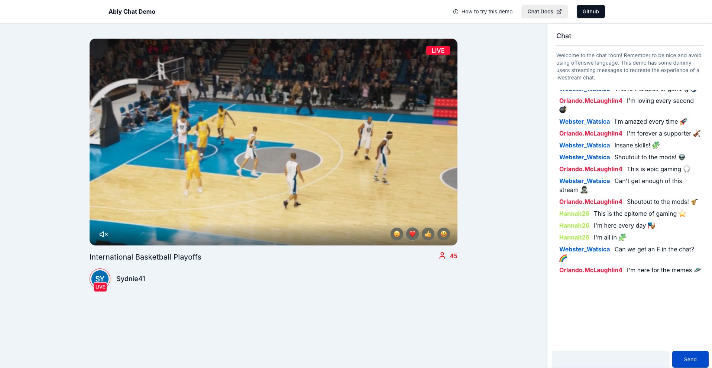

Ably Chat is a product dedicated to making it quick and easy to build chat functionality into new and existing applications. Use Ably Chat to build things such as a 1:1 customer support feature, or add a chat component to a live streaming platform that serves hundreds of thousands of users.

## Why Ably Chat

Ably Chat is built on top of [Ably's Pub/Sub](/docs/pub-sub) messaging infrastructure and powered by Ably's globally distributed [platform](/docs/platform). This means Chat inherits all the scalability, reliability, and performance characteristics of the underlying platform, while providing purpose-built APIs specifically designed for chat use cases. By leveraging Pub/Sub as its foundation, Chat benefits from proven message delivery guarantees, global edge network distribution, and enterprise-grade reliability that Ably's platform provides.

### Built for serious scale and reliability

Ably Chat inherits the performance characteristics of [Ably's globally distributed platform](/docs/platform), which handles **550 billion+ messages per month** and **1 billion+ connections per month**. Our [global edge network](/docs/platform/architecture/edge-network) features 635 points of presence, delivering messages with sub-50ms median roundtrip latency worldwide.

The platform's architecture ensures your chat experiences remain available even during infrastructure failures. With [**99.999% uptime over 5+ years**](https://ably.com/uptime) and automatic multi-region failover, Ably Chat provides the [reliability](/docs/platform/architecture/fault-tolerance) required for mission-critical applications.

### Cost-effective scalability

Choose the pricing model that fits your needs: pay-as-you-go with usage-based pricing that charges by-the-minute for what you actually use, or opt for predictable costs with [Monthly Active Users (MAU) pricing](/docs/platform/pricing). The platform includes built-in cost optimization features like message batching to reduce consumption, and volume discounts that lower your overall cost as you grow. This flexibility means you can power more chat functionality within budget without stifling innovation for fear of cost.

### Enterprise-ready

Ably Chat supports enterprise requirements with **HIPAA and SOC2 compliance** options, dedicated clusters, custom domains (CNAME), SSO integration, and premium support with **sub-15 minute response times**. Whether you're building for thousands or millions of users, Ably Chat scales with your business needs.

## Get started now <a id="get-started"/>

Get building with intuitive APIs and comprehensive SDKs across multiple platforms. The Chat SDK abstracts away architectural complexity, enabling your team to rapidly ship exceptional chat experiences. Pre-built **React UI Kits** accelerate development even further, letting you focus on creating unique experiences rather than building chat infrastructure from scratch.

### SDKs <a id="get-started-sdk" />

<Tiles>
{[
  {
    title: 'JavaScript / Typescript',
    description: 'Start building with Chat using Ably\'s Chat JavaScript SDK',
    image: 'icon-tech-javascript',
    link: '/docs/chat/getting-started/javascript',
  },
  {
    title: 'React',
    description: 'Start building with Chat using Ably\'s Chat React SDK.',
    image: 'icon-tech-react',
    link: '/docs/chat/getting-started/react',
  },
  {
    title: 'React Native',
    description: 'Start building with Chat using Ably\'s Chat React Native SDK.',
    image: 'icon-tech-reactnative',
    link: '/docs/chat/getting-started/react-native',
  },
  {
    title: 'Kotlin (Android)',
    description: 'Start building with Chat using Ably\'s Chat Kotlin SDK for Android.',
    image: 'icon-tech-kotlin',
    link: '/docs/chat/getting-started/android',
  },
  {
    title: 'Kotlin (JVM)',
    description: 'Start building with Chat using Ably\'s Chat Kotlin SDK for JVM applications.',
    image: 'icon-tech-kotlin',
    link: '/docs/chat/getting-started/jvm',
  },
  {
    title: 'Swift',
    description: 'Start building with Chat using Ably\'s Chat Swift SDK.',
    image: 'icon-tech-swift',
    link: '/docs/chat/getting-started/swift',
  },
]}
</Tiles>

### UI tool kits

<Tiles>
{[
  {
    title: 'React UI kits',
    description: 'Start building with Chat using Ably\'s Chat UI components with Chat React SDK.',
    image: 'icon-tech-react',
    link: '/docs/chat/getting-started/react-ui-components',
  },
]}
</Tiles>

## Chat features <a id="features"/>

Ably Chat provides the following key features:

* [Rooms and messages](#rooms)
* [Presence](#presence)
* [Message reactions](#message-reactions)
* [Typing indicators](#typing)
* [Room reactions](#reactions)
* [AI Moderation](#moderation)
* [React UI Kit](#react-ui-kit)
* [React Hooks](#react-hooks)

### Rooms and messages <a id="rooms"/>

[Rooms](/docs/chat/rooms) are used to organize and separate your users and chat messages into 'chat rooms'. They are the entry object into chat and provide access to all other chat features, such as messages, online status, and typing indicators.

Each room can represent a 1:1 chat between an agent and a customer, a private message between two users in a chat application, a group conversation, or the chat section of a livestream with thousands of users.

[Messages](/docs/chat/rooms/messages) enable users to communicate with one another in the room. Messages sent by users are received by all those who have subscribed to receive them within that room.

### Presence <a id="presence"/>

[Presence](/docs/chat/rooms/presence) enables you to display who is currently online in a chat room. Users can also set additional information about their profile such as a status message, profile picture, display name, and more.

### Message reactions <a id="message-reactions"/>

[Message reactions](/docs/chat/rooms/message-reactions) enable users to send reactions to messages, such as 👍 or ❤. Users can also see which other users reacted to a message.

### Typing indicators <a id="typing"/>

[Typing indicators](/docs/chat/rooms/typing) let users see when others start and stop typing a message. They enable you to display a message such as *John is typing...* or when too many users are typing, something like *Multiple people are typing...* or *12 people are typing...*.

### Room reactions <a id="reactions"/>

[Room reactions](/docs/chat/rooms/reactions) enable users to broadcast ephemeral sentiments using emojis, such as 👍 or ❤. Room reactions are used to broadcast a general sentiment to the entire room rather than reacting to a single message. A common use case is sports fans all sending a heart when their team scores.

### Moderation <a id="moderation"/>

[AI Moderation](/docs/chat/moderation) enables you to automatically detect and handle inappropriate content in chat messages. Using AI-powered content filtering, you can identify potentially harmful messages, spam, or content that violates your community guidelines, and take appropriate action either before they reach other users, or retroactively.

You can integrate seamlessly in minutes with a number of third-party moderation providers to take advantage of powerful AI models, or bring your own infrastructure via integrations with the likes of AWS Lambda to customize your experience.

### React UI Kit <a id="react-ui-kit"/>

[React UI Kit](/docs/chat/getting-started/react-ui-kit) provide pre-built, customizable React components that make it even faster to add chat functionality to your applications. These components handle the presentation layer and user interactions, allowing you to focus on your application logic rather than building chat UI from scratch.

 
The UI Kit includes components for message lists, input fields, user avatars, typing indicators, and more. They're designed to be flexible and themeable to match your application's design system. They are fully [open-source](https://github.com/ably/ably-chat-react-ui-kit), so you can easily take the code as a starting point to further customize your own components.

## Demo

Take a look at a [livestream basketball game](https://ably-livestream-chat-demo.vercel.app) with some simulated users chatting built using the Chat SDK. The [source code](https://github.com/ably/ably-chat-js/tree/main/demo) is available in GitHub.

## Next steps <a id="next"/>

* Read more about using [rooms](/docs/chat/rooms) and sending [messages](/docs/chat/rooms/messages).
* Read into pulling messages from [history](/docs/chat/rooms/history) and providing context to new joiners.
* Learn about how to add [chat moderation](/docs/chat/moderation).
* Understand [token authentication](/docs/auth/token) before going to production.
