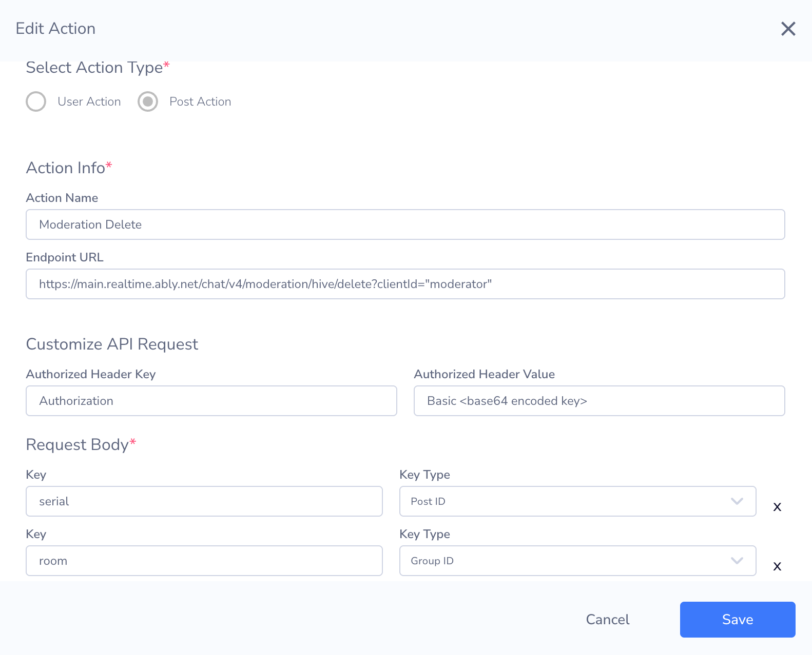

[Hive dashboard](https://hivemoderation.com/dashboard) is a powerful all-in-one moderation tool, which enables you to set up rules to combine automated AI moderation with human review.

The Hive Dashboard rule is a rule applied to chat rooms which enables you to use Hive's [moderation dashboard](https://docs.thehive.ai/docs/what-is-the-moderation-dashboard) to review messages in your chat room.

## Integration setup <a id="setup"/>

Configure the integration rule in your [Ably dashboard](https://ably.com/accounts/any/apps/any/integrations) or using the [Control API](/docs/platform/account/control-api).

The following are the fields specific to Hive dashboard configuration:

| Field | Description |
| ----- | ----------- |
| Hive API Key | The API key for your Hive dashboard account. |
| Chat Room Filter (optional) | A regular expression to match the chat room name. |

## Hive setup <a id="hive_setup"/>

To use the Hive Dashboard rule, you first need to set up a Hive account and an application.

Once you have done this you can get an API key from the [dashboard settings](https://dashboard.thehive.ai/app/_/settings/api_keys) which you can then use to set up the rule.

When the rule is enabled, it will send all published messages in the room to the dashboard for review.
Please note that messages get sent to Hive _after_ they have been published, so users will see them in the chat room until they have been deleted by a moderation rule, although in the case of automatic moderation this will be near-instantaneous.
If you want to prevent messages from reaching users until they have been approved automatically by an AI moderation rule, check out the [Hive model only rule](/docs/chat/rooms/moderation/hive-model-only).

In order for hive dashboard to delete messages, you need to set up an [action](https://docs.thehive.ai/docs/actions) in the dashboard.
The setup is as follows:

1. Go to the [post actions](https://dashboard.thehive.ai/app/_/actions/post) page in the dashboard.
2. Click "+ Create new"
3. Ensure that the "Action type" is set to "POST"
4. Enter a descriptive name for the action, for example "Delete message"
5. Set the "Endpoint URL" field to `https://rest.ably.io/chat/v4/moderation/hive/delete` (if you have a [dedicated cluster](https://ably.com/docs/platform/account/enterprise-customization#setting-up-a-custom-environment) the domain should be your custom REST domain)
6. Under "Customize API Request" add the `Authorization` header with the value `Bearer <your Base64 encoded Ably API key>`, make sure to Base64 encode the API key you get from the Ably dashboard.
7. Under "Request Body" add the following two params:
   * `serial` := `Post ID`
   * `clientId` := `User ID`
8. Click "Save"

Please refer to the below screenshot for an example of the action setup:

You should now see the action in the list of actions, and it will be available to human moderators in the dashboard, as well as for use by auto-moderation rules.

Within the Hive dashboard, messages within a room will appear as part of the same group, where the `group_id` is the `name` of the room, and edits to a message will appear as children of the original message.

For more information on how to use the Hive Dashboard, please refer to the [Hive Dashboard documentation](https://docs.thehive.ai/docs/what-is-the-moderation-dashboard).
