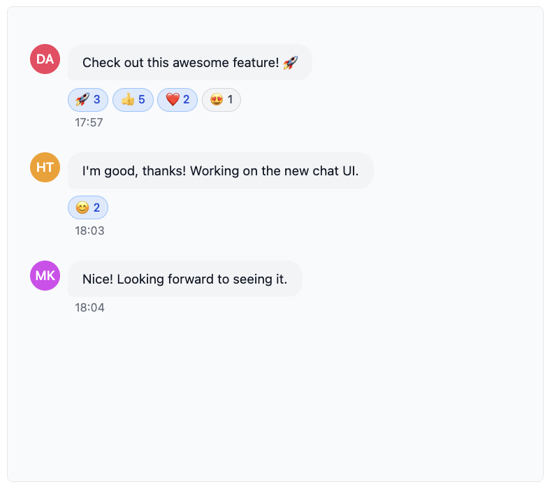
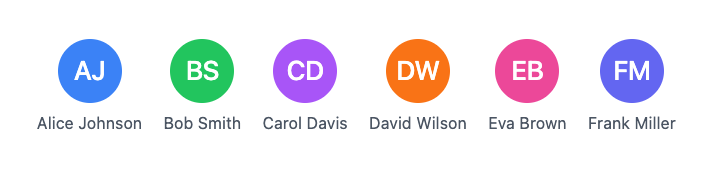

# Components

This page documents the components available in the Ably Chat React UI Components library. These components provide a comprehensive UI for building chat applications with Ably.

## Styling and Theming <a id="styling-and-theming"/>

The Ably Chat React UI Components use Tailwind CSS for styling. Here's how styling works and how you can customize the appearance of the components:

### CSS Import

The components come with pre-compiled CSS that you can import directly into your application:

<Code>
```react
// Import the pre-compiled CSS
import '@ably/chat-react-ui-components/dist/style.css';
```
</Code>

This CSS file contains all the necessary styles for the components, compiled from the Tailwind utility classes used in the component code. You don't need to install Tailwind CSS in your project to use these components.

### Light and Dark Mode

The components support both light and dark modes through the `ThemeProvider`:

<Code>
```react
import { ThemeProvider } from '@ably/chat-react-ui-components';

// Basic usage with default options
<ThemeProvider>
  <YourApp />
</ThemeProvider>

// With custom configuration
<ThemeProvider
  options={{
    persist: true, // Save preference to localStorage
    detectSystemTheme: true, // Use system preference
    defaultTheme: 'light' // Initial theme if no preference found
  }}
>
  <YourApp />
</ThemeProvider>
```
</Code>

The `ThemeProvider` manages theme state and automatically applies the appropriate CSS classes to enable light or dark mode styling. It also provides a `useTheme` hook that you can use to access and change the current theme:

<Code>
```react
import { useTheme } from '@ably/chat-react-ui-components';

function ThemeToggle() {
  const { theme, toggleTheme } = useTheme();

  return (
    <button onClick={toggleTheme}>
      Current theme: {theme}
    </button>
  );
}
```
</Code>

### Customizing Component Styles

Currently, there are two main ways to customize the appearance of components:

1. **Using the `className` prop**: Most components accept a `className` prop that allows you to add custom CSS classes:

<Code>
```react
<ChatWindow
  roomName="general"
  className="my-custom-chat-window border-red-500"
/>
```
</Code>

2. **Component-specific style props**: Some components have specific props for styling, such as the `Avatar` component's `color` prop:

<Code>
```react
<Avatar
  alt="User Name"
  color="bg-blue-500"
  size="lg"
/>
```
</Code>

### Future Styling Improvements

We are planning to enhance the theming and customization capabilities in future releases:

- Full theming support with customizable color palettes
- Component-level style overrides through a theme context
- Additional theme variants beyond light/dark (e.g., high contrast)
- Custom user/brand theming options

These improvements will provide more flexibility for integrating the chat components into your application's design system.


## App <a id="app"/>

The `App` component is a complete, ready-to-use chat application that combines all the components above with sensible defaults. It's ideal for quickly prototyping a chat interface or seeing how everything fits together.

### Features

- Manages room state (adding, leaving, selecting rooms)
- Shows loading state when not connected
- Renders layout with Sidebar and ChatWindow
- Includes RoomInfo in header and RoomReaction in footer
- Handles connection status and error states
- Provides customizable width and height
- Shows empty state when no room is selected


### Props

| Prop | Description |
|------|-------------|
| `initialRoomNames` | An optional array of room names to populate the sidebar initially |
| `width` | Width of the app container |
| `height` | Height of the app container |

### Usage


<Code>
```react
import { App } from '@ably/chat-react-ui-components';
import * as Ably from 'ably';
import { ChatClient } from '@ably/chat';
import { ChatClientProvider } from '@ably/chat/react';
import { ThemeProvider, AvatarProvider, ChatSettingsProvider } from '@ably/chat-react-ui-components';
import '@ably/chat-react-ui-components/dist/style.css';

// Create Ably Realtime client
const ablyClient = new Ably.Realtime({
  key: '{{API_KEY}}',
  clientId: 'user-' + Math.random().toString(36).substring(2, 15),
});

const chatClient = new ChatClient(ablyClient);

// Basic usage
function QuickChatPrototype() {
  return (
    <ThemeProvider>
      <AvatarProvider>
        <ChatSettingsProvider>
          <ChatClientProvider client={chatClient}>
            <App initialRoomNames={['my-first-room']} />
          </ChatClientProvider>
        </ChatSettingsProvider>
      </AvatarProvider>
    </ThemeProvider>
  );
}

// With custom dimensions
function CustomSizedChat() {
  return (
    <ChatClientProvider client={chatClient}>
      <App
        initialRoomNames={['my-first-room']}
        width="100%"
        height="600px"
      />
    </ChatClientProvider>
  );
}
```
</Code>

## ChatWindow <a id="chat-window"/>

The `ChatWindow` component provides the main chat interface for a room. This includes message display, input, and custom header/footer content.

### Features

- Message display with history loading
- Message editing, deletion, and reactions
- Typing indicators and presence awareness
- Custom header and footer content
- Discontinuity recovery on reconnection
- Active chat window management to control which messages are rendered in the UI


### Props

| Prop | Description |
|------|-------------|
| `roomName` | Unique identifier for the chat room |
| `customHeaderContent` | Optional custom content for the header area of the chat window |
| `customFooterContent` | Optional custom content for the footer area of the chat window |
| `enableTypingIndicators` | Whether to show typing indicators in the chat window |
| `autoEnterPresence` | Whether to automatically enter presence when the component mounts |
| `windowSize` | Controls the window size for rendering messages in UI |
| `className` | Additional CSS class names to apply to the root container |
| `onError` | List of callbacks triggered when an error occurs in the chat window |

### Usage

<Code>
```react
import { ChatWindow, RoomInfo, RoomReaction } from '@ably/chat-react-ui-components';
import { ChatRoomProvider } from '@ably/chat/react';

// Basic usage
<ChatRoomProvider name="general">
  <ChatWindow roomName="general" />
</ChatRoomProvider>

// With custom header and footer
<ChatRoomProvider name="general">
  <ChatWindow
    roomName="general"
    customHeaderContent={<RoomInfo />}
    customFooterContent={<RoomReaction />}
  />
</ChatRoomProvider>

// With typing indicators disabled
<ChatRoomProvider name="general">
  <ChatWindow
    roomName="general"
    enableTypingIndicators={false}
  />
</ChatRoomProvider>

// Setting a custom window size
<ChatRoomProvider name="general">
  <ChatWindow
    roomName="general"
    windowSize={300} // Custom size for message rendering in the UI
  />
</ChatRoomProvider>
```
</Code>


### Integration with Other Components

The ChatWindow component integrates several other components:

- **ChatMessageList**: Displays the messages with infinite scrolling
- **MessageInput**: Allows users to compose and send messages
- **ChatWindowHeader**: Contains room information and controls
- **ChatWindowFooter**: Contains additional controls and features

## MessageInput <a id="message-input"/>

The `MessageInput` component provides a comprehensive text input interface for composing and sending chat messages. This component supports multi-line input, emoji selection, and typing indicators.

### Features

- Multi-line text input with automatic height adjustment (max 150px)
- Enter key to send (Shift+Enter for new line)
- Integrated emoji picker with cursor position insertion
- Typing indicators to alert others when composing messages
- Automatic input cleanup and focus management
- Accessible form controls with proper ARIA attributes


### Props

| Prop | Description |
|------|-------------|
| `onSent` | Callback function triggered when a message is sent |
| `placeholder` | Placeholder text displayed in the input field when empty |
| `className` | Additional CSS class names to apply to the input container |
| `enableTyping` | Whether to enable typing indicators on user input |
| `onSendError` | Callback triggered when an error occurs while sending a message |

### Typing Indicators

The MessageInput component automatically triggers typing indicators when the user is typing. This is handled through the Ably Chat SDK's typing indicators feature:

- Triggered on each keystroke when content is present
- Automatically stopped when input is cleared or message is sent
- Integrated with the useTyping hook from @ably/chat/react


### Usage

<Code>
```react
import { MessageInput } from '@ably/chat-react-ui-components';
import { useMessages } from '@ably/chat/react';

// Basic usage
const { send } = useMessages();

const handleSendMessage = (text: string) => {
  console.log(`Sending message: ${text}`);
  send({ text });
};

<MessageInput
  onSend={handleSendMessage}
  placeholder="Type your message here..."
/>
```
</Code>

## Sidebar <a id="sidebar"/>

The `Sidebar` component provides room navigation and management.

### Features

- Collapsible interface with avatar-only mode
- Room creation and management
- Theme toggle integration
- Active room highlighting
- Room count display
- Automatic room attachment/detachment


### Props

| Prop | Description |
|------|-------------|
| `roomNames` | Rooms to display |
| `activeRoomName` | Currently-active room (optional) |
| `defaultRoomOptions` | Ably options passed to each ChatRoomProvider |
| `addRoom` | Adds (or joins) a room |
| `setActiveRoom` | Sets the active room |
| `leaveRoom` | Leaves a room |
| `className` | Optional CSS class names for additional styling |
| `isCollapsed` | Whether the sidebar is in collapsed mode (avatar-only) |
| `onToggleCollapse` | Callback to toggle the collapsed state |

### Room Management

The Sidebar component handles room management through the following functions:

- **addRoom**: Adds a new room to the list or joins an existing room
- **setActiveRoom**: Sets the active room for display in the main content area
- **leaveRoom**: Removes a room from the list and handles cleanup

### Usage

<Code>
```react
import { Sidebar } from '@ably/chat-react-ui-components';
import { RoomOptions } from '@ably/chat';
import { useState } from 'react';

const [rooms, setRooms] = useState<string[]>(['general', 'random']);
const [activeRoom, setActiveRoom] = useState<string | undefined>('general');
const [isSidebarCollapsed, setIsSidebarCollapsed] = useState(false);
const [roomOptions] = useState<RoomOptions>({ occupancy: { enableEvents: true } });

const addRoom = (name: string) => {
  console.log(`Adding room: ${name}`);
  setRooms(prev => prev.includes(name) ? prev : [...prev, name]);
};

const leaveRoom = (name: string) => {
  console.log(`Leaving room: ${name}`);
  setRooms(prev => prev.filter(n => n !== name));
  if (activeRoom === name) {
    setActiveRoom(rooms.length > 0 ? rooms[0] : undefined);
  }
};

const handleSetActiveRoom = (name?: string) => {
  console.log(`Setting active room to: ${name}`);
  setActiveRoom(name);
};

<Sidebar
  roomNames={rooms}
  activeRoomName={activeRoom}
  defaultRoomOptions={roomOptions}
  addRoom={addRoom}
  setActiveRoom={handleSetActiveRoom}
  leaveRoom={leaveRoom}
  isCollapsed={isSidebarCollapsed}
  onToggleCollapse={() => setIsSidebarCollapsed(prev => !prev)}
/>
  ```
</Code>

Rooms are automatically attached when the Sidebar is mounted, and detached when the component unmounts.

## ChatMessageList <a id="chat-message-list"/>

The `ChatMessageList` component displays a list of chat messages with advanced scrolling functionality. It supports infinite scrolling, message history loading, and automatic scrolling to new messages.

### Features

- Message display with history loading and infinite scroll
- Automatic scrolling to new messages
- Loading indicators for history fetching
- Typing indicators integration
- Scroll position preservation when loading history
- Virtualized rendering for performance with large message lists
- Accessibility support with proper ARIA roles



### Props

| Prop | Description |
|------|-------------|
| `messages` | Array of Ably Chat Message objects to render |
| `onLoadMoreHistory` | Callback triggered when user scrolls near the top of the message list |
| `isLoading` | Whether a history loading operation is currently in progress |
| `hasMoreHistory` | Whether there are more historical messages available to load |
| `onMessageInView` | Callback triggered when the user scrolls to view a specific message |
| `onViewLatest` | Callback triggered when the user scrolls to the bottom of the message list |
| `onEdit` | Callback triggered when a user saves an edited message |
| `onDelete` | Callback triggered when a user confirms deletion of their message |
| `onReactionAdd` | Callback triggered when a user adds an emoji reaction to any message |
| `onReactionRemove` | Callback triggered when a user removes their emoji reaction from a message |
| `children` | Optional React elements to render after all messages (e.g., TypingIndicators) |
| `autoScroll` | Whether to automatically scroll to bottom when new messages arrive |
| `loadMoreThreshold` | Distance in pixels from the top edge that triggers onLoadMoreHistory callback |
| `enableTypingIndicators` | Whether to enable built-in typing indicators in the chat window |

### Scrolling Behavior

The ChatMessageList component implements sophisticated scrolling logic:

1. **Auto-scrolling**: When new messages arrive, the list automatically scrolls to the bottom if the user is already near the bottom. This prevents interrupting the reading experience when viewing older messages.

2. **Infinite scrolling**: When the user scrolls near the top of the list, the `onLoadMoreHistory` callback is triggered to load older messages.

3. **Scroll position preservation**: When older messages are loaded, the scroll position is preserved so the user doesn't lose their place.

### Usage

<Code>
```react
import { ChatMessageList } from '@ably/chat-react-ui-components';
import { Message } from '@ably/chat';
import { useState } from 'react';

// Example with useState for messages
const [messages, setMessages] = useState<Message[]>([]);
const [isLoadingHistory, setIsLoadingHistory] = useState(false);
const [hasMoreMessages, setHasMoreMessages] = useState(true);

const fetchPreviousMessages = () => {
  console.log('Loading more message history');
  setIsLoadingHistory(true);
  // Fetch logic would go here
  setIsLoadingHistory(false);
};

const handleEditMessage = (message: Message, newText: string) => {
  console.log(`Editing message with serial: ${message.serial}, setting text to: ${newText}`);
};

const handleDeleteMessage = (message: Message) => {
  console.log(`Deleting message with serial: ${message.serial}`);
};

const handleAddReaction = (message: Message, emoji: string) => {
  console.log(`Adding reaction ${emoji} to message with serial: ${message.serial}`);
};

const handleRemoveReaction = (message: Message, emoji: string) => {
  console.log(`Removing reaction ${emoji} from message with serial: ${message.serial}`);
};

<ChatMessageList
  messages={messages}
  onLoadMoreHistory={fetchPreviousMessages}
  isLoading={isLoadingHistory}
  hasMoreHistory={hasMoreMessages}
  enableTypingIndicators={true}
  onEdit={handleEditMessage}
  onDelete={handleDeleteMessage}
  onReactionAdd={handleAddReaction}
  onReactionRemove={handleRemoveReaction}
  autoScroll={true}
  loadMoreThreshold={150}
>
</ChatMessageList>
```
</Code>

## ChatMessage <a id="chat-message"/>

The `ChatMessage` component displays an individual chat message with interactive capabilities. It allows users to view, edit, delete, and react to messages.

### Features

- Message content display with sender avatar
- Edit/delete functionality for own messages with confirmation dialogs
- Emoji reactions system with picker and toggle functionality
- Status indicators (edited, deleted)
- Basic ARIA support (role, aria-label)
- Hover tooltips showing sender information


### Props

| Prop | Description |
|------|-------------|
| `message` | The Ably Chat message object used to display the message content |
| `onEdit` | Callback triggered when the user saves an edited message |
| `onDelete` | Callback triggered when the user confirms message deletion |
| `onReactionAdd` | Callback triggered when a user adds an emoji reaction to the message |
| `onReactionRemove` | Callback triggered when a user removes their emoji reaction from the message |
| `className` | Additional CSS class names to apply to the message container |

### Usage

<Code>
```react
import { ChatMessage } from '@ably/chat-react-ui-components';
import { Message } from '@ably/chat';
import { useMessages } from '@ably/chat/react';

const { update, deleteMessage, addReaction, removeReaction } = useMessages();

<ChatMessage
  message={message}
  onEdit={(message: Message, newText: string) => {
    console.log(`Editing message with serial: ${message.serial}, setting text to: ${newText}`);
    update(message.serial, { text: newText });
  }}
  onDelete={(message: Message) => {
    console.log(`Deleting message with serial: ${message.serial}`);
    deleteMessage(message.serial);
  }}
  onReactionAdd={(message: Message, emoji: string) => {
    console.log(`Adding reaction ${emoji} to message with serial: ${message.serial}`);
    addReaction(message.serial, emoji);
  }}
  onReactionRemove={(message: Message, emoji: string) => {
    console.log(`Removing reaction ${emoji} from message with serial: ${message.serial}`);
    removeReaction(message.serial, emoji);
  }}
/>
```
</Code>

## Avatar <a id="avatar"/>

The `Avatar` component displays a user or room avatar with fallback to initials when no image is available.

### Features
- Displays user or room avatar image
- Generates initials from the `alt` text if no image is provided
- Customizable background color when no image is available
- Supports different sizes (small, medium, large, extra-large)
- Click handler for interaction



### Props

| Prop | Description |
|------|-------------|
| `src` | URL to the avatar image |
| `alt` | Alternative text for the avatar image, also used for generating initials if needed |
| `color` | Background color for the avatar when no image is provided (uses Tailwind CSS color classes) |
| `size` | Size of the avatar |
| `initials` | Custom initials to display when no image is available |
| `onClick` | Click handler for the avatar |

### Usage

<Code>
```react
import { Avatar } from '@ably/chat-react-ui-components';

// Basic usage
<Avatar
  src="https://example.com/avatar.jpg"
  alt="John Doe"
  size="md"
/>

// With fallback to initials
<Avatar
  alt="John Doe"
  color="bg-blue-500"
  size="lg"
/>

// With custom initials
<Avatar
  alt="John Doe"
  initials="JD"
  color="bg-green-500"
  size="xl"
/>

// With click handler
<Avatar
  alt="John Doe"
  onClick={() => console.log('Avatar clicked')}
/>
```
</Code>


### Integration with AvatarProvider

The Avatar component is designed to integrate with the `AvatarProvider` to display consistent avatars across your application, but it also works independently. The `AvatarProvider` can be used to manage avatar generation and caching for users and rooms.:

<Code>
```react
import { Avatar, useUserAvatar } from '@ably/chat-react-ui-components';
const { userAvatar } = useUserAvatar({
    clientId: 'user-123',
    displayName: 'John Doe',
  });

<Avatar
  src={userAvatar?.src}
  alt={userAvatar?.displayName}
  color={userAvatar?.color}
  initials={userAvatar?.initials}
/>
```
</Code>

## ParticipantList <a id="participant-list"/>

The `ParticipantList` component displays a positioned modal showing all room participants.


### Features

- Modal overlay with absolute positioning based on provided coordinates
- Participant list with avatars, names, and status indicators
- Smart sorting: current user appears first, followed by alphabetical order
- Typing indicators for active participants
- Participant count display in header
- Scrollable list with fixed maximum height for large participant counts
- Accessible modal dialog with proper ARIA attributes and focus management

### Props

| Prop | Description |
|------|-------------|
| `presenceData` | Array of Ably Chat presence members currently in the room |
| `currentClientId` | Client ID of the current Ably Connection for the room |
| `currentlyTyping` | Set of client IDs for users who are currently typing |
| `onToggle` | Callback function to toggle the list open/closed state |
| `position` | Absolute positioning coordinates for rendering the modal |

### Live Participant Tracking

The ParticipantList component can be used to show currently active participants in the room.

- Only shows users who are currently present in the room based on presence data
- Displays typing indicators for users who are currently typing
- Sorts the current user to the top of the list for easy identification

### Usage

<Code>
```react
import { ParticipantList } from '@ably/chat-react-ui-components';
import { useChatClient, usePresence, useTyping } from '@ably/chat/react';
import { useState } from 'react';

// Integration with presence and typing hooks
const { presenceData } = usePresence();
const { currentlyTyping } = useTyping();
const { clientId } = useChatClient();
const [participantListOpen, setParticipantListOpen] = useState(false);

const toggleParticipantList = () => {
  console.log('Toggling participant list');
  setParticipantListOpen(prev => !prev);
};

{participantListOpen && (
  <ParticipantList
    presenceData={presenceData}
    currentClientId={clientId}
    currentlyTyping={currentlyTyping}
    onToggle={toggleParticipantList}
    position={{ top: 100, left: 200 }}
  />
)}
```
</Code>
