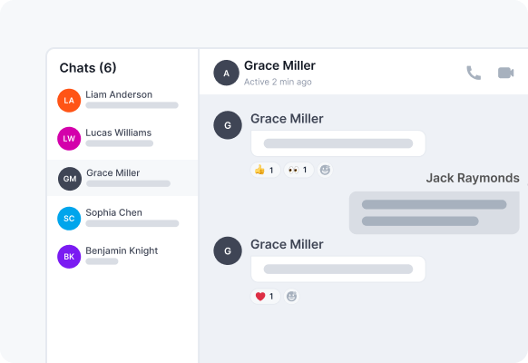

The Ably Chat React UI Kit is a UI Kit for building chat interfaces with Ably Chat, designed to work with the Ably Chat SDK and its React hooks and providers.

The kit includes components for displaying messages, message lists, chat windows, avatars, and more.
It also includes providers and hooks for managing state within the components.

Some of the benefits include:

* **Faster prototyping** – drop in ready-made components and see a working chat UI within minutes and see how chat features could integrate into your application.
* **Shorter time to market** – concentrate on product-specific features instead of rebuilding common chat patterns.
* **Tried and tested** – rely on components that are already fully covered by a suite of tests.
* **Chat-centric design** – layouts, interactions, and accessibility are built with chat workflows in mind.

## Components and Providers

The React UI Kit is organized into two main categories:

* [Components](/docs/chat/react-ui-kit/components) - UI components for building chat interfaces
* [Providers and their Hooks](/docs/chat/react-ui-kit/providers) - Context providers and hooks for managing state

## Key Components

The kit includes the following key components:

* **ChatWindow** - A complete chat interface for a room, including message display, input, and custom header/footer content
* **ChatMessageList** - Displays a list of chat messages with advanced scrolling functionality
* **ChatMessage** - Displays an individual chat message with interactive capabilities
* **MessageInput** - A text input interface for composing and sending chat messages
* **Avatar** - Displays a user or room avatar with fallback to initials
* **Sidebar** - Provides room navigation and management
* **ParticipantList** - Displays a list of room participants
* **App** - A complete, ready-to-use chat application

There are also various utility components for displaying typing indicators, message reactions, and more that can be used to build a custom chat interface.

## Key Providers

The kit includes the following providers:

* **ThemeProvider** - Manages theme state, persistence, and system theme integration
* **AvatarProvider** - Manages avatar data for users and rooms
* **ChatSettingsProvider** - Manages global and room-level chat settings

## Next Steps

* Learn more about the available [Components](/docs/chat/react-ui-kit/components).
* Explore the [Providers and Hooks](/docs/chat/react-ui-kit/providers) for managing state.
* Check out the [getting started guide](/docs/chat/getting-started/react-ui-kit) for using Ably Chat with React UI Components.
