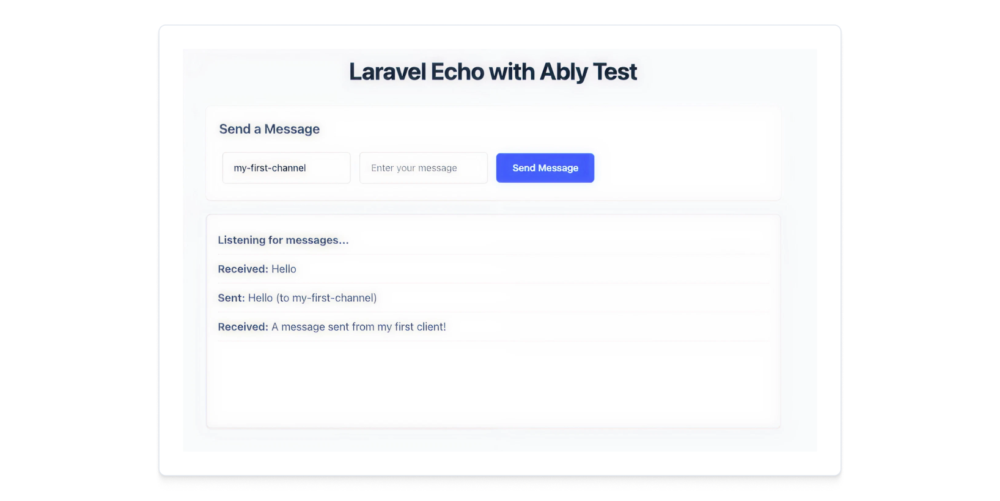

This guide will get you started with Ably Pub/Sub in Laravel 12.

It will take you through the following steps:

* Create a client and establish a connection to Ably with:
  * The Laravel Broadcaster an independent service provider library for [Laravel](https://laravel.com/) using [ably-php](https://github.com/ably/ably-php)
  * [Echo](https://github.com/ably-forks/laravel-echo), a Laravel Echo fork that adds native Ably integration for Laravel's realtime broadcasting features.
* Create an event to broadcast (publish) messages from the backend.
* Set up a frontend client to receive (subscribe) and publish messages to a channel.

## Prerequisites <a id="prerequisites"/>

1. [Sign up](https://ably.com/signup) for an Ably account.
2. Create a new app, and create your first API key.
3. Your API key will need the `publish`, `presence`, and `history` capabilities.
4. Install the Ably CLI:

<Code>
```shell
npm install -g @ably/cli
```
</Code>

5. Run the following to log in to your Ably account and set the default app and API key:

<Code>
```shell
ably login

ably apps switch
ably auth keys switch
```
</Code>

6. Install [PHP](https://www.php.net/downloads.php) version 8.2 or greater and [Laravel](https://laravel.com/docs) version 12.0 or greater.
7. Create a new Laravel project and install the Ably Broadcaster for Laravel:

<Code>
```shell
# Create a new Laravel project
composer create-project laravel/laravel ably-laravel-quickstart
cd ably-laravel-quickstart

# Install the Ably Broadcaster for Laravel
composer require ably/laravel-broadcaster

# Setup API route
php artisan install:api
```
</Code>

8. Now run the two dev servers (PHP and Vite) in separate Terminal windows:

<Code>
```shell
php artisan serve # http://localhost:8000
npm install
npm run dev
```
</Code>

<Aside data-type='note'>
The code examples in this guide include a demo API key. If you wish to interact with the Ably CLI and view outputs within your Ably account, ensure that you replace them with your own API key.
</Aside>

## Step 1: Configure the Ably Laravel SDK <a id="step-1"/>

The Ably Laravel SDK integrates with Laravel's broadcasting system. You need to configure it to establish a connection with Ably.

First, add your Ably credentials to your `.env` file:

<Code fixed="true">
```php
BROADCAST_CONNECTION=ably
ABLY_KEY={{API_KEY}}
```
</Code>

In Laravel 12, broadcasting is enabled by default. Verify that `BroadcastServiceProvider` is included in `bootstrap/providers.php`:

<Code>
```php
<?php

return [
    App\Providers\AppServiceProvider::class,
    App\Providers\BroadcastServiceProvider::class,
];
```
</Code>

Publish the broadcasting configuration file if it doesn't exist:

<Code>
```shell
php artisan install:broadcasting --ably
```
</Code>

This will create the `config/broadcasting.php` file and add the Ably configuration automatically.

## Step 2: Create the event that will be broadcast <a id="step-2"/>

To send events from Laravel to Ably, create an event file by running the following command in your terminal:

<Code>
```shell
php artisan make:event PublicMessageEvent
```
</Code>

This command will create a `PublicMessageEvent.php` file in the `app/Events` directory. Replace the content of the file with following to handle the broadcasting of messages to a public channel:

<Code>
```php
<?php

namespace App\Events;

use Illuminate\Broadcasting\Channel;
use Illuminate\Broadcasting\InteractsWithSockets;
use Illuminate\Contracts\Broadcasting\ShouldBroadcastNow;
use Illuminate\Foundation\Events\Dispatchable;
use Illuminate\Queue\SerializesModels;

/**
 * Event for broadcasting public messages.
 */
class PublicMessageEvent implements ShouldBroadcastNow
{
    use Dispatchable, InteractsWithSockets, SerializesModels;

    public $channelName;
    public $message;

    /**
     * Create a new event instance.
     */
    public function __construct($channelName, $message)
    {
        $this->channelName = $channelName;
        $this->message = $message;
    }

    /**
     * Get the channels the event should broadcast on.
     *
     * @return array<\Illuminate\Broadcasting\Channel>
     */
    public function broadcastOn(): array
    {
        return [new Channel($this->channelName)];
    }
}
```
</Code>

## Step 3: Add an API route to broadcast <a id="step-3"/>

To handle API requests from frontend, open the `routes/api.php` file and add following route:

<Code>
```php
<?php

use Illuminate\Http\Request;
use Illuminate\Support\Facades\Route;
use App\Events\PublicMessageEvent;

Route::post('/public-event', function (Request $request) {
    $channelName = $request->input('channelName');
    $message = $request->input('message');
    broadcast(new PublicMessageEvent($channelName, $message));
    return response()->json(['success' => true, 'message' => 'Event broadcasted']);
})->middleware('throttle:60,1'); // 60 requests/minute are allowed.
```
</Code>

This endpoint `public-event` will accept POST requests with `channelName` and `message` parameters, and broadcast the event to the specified channel.

## Step 4: Test the API route <a id="step-4"/>

To test the API route, first you need at least one client subscribed to the channel. You can use the Ably CLI to subscribe to a channel:

<Code>
```shell
ably channels subscribe public:my-first-channel
```
</Code>

Now you can publish a message to the channel using the API route you created in Step 3. You can use `curl` or any HTTP client to send a POST request:

<Code>
```shell
curl --location --request POST 'localhost:8000/api/public-event' \
--header 'Content-Type: application/json' \
--data-raw '{
    "channelName":"my-first-channel",
    "message":"A message sent from my first client!"
}'
```
</Code>

## Step 5: Frontend setup <a id="step-5"/>

Install `Ably's Pub/Sub JavaScript SDK`, Ably's fork of `laravel-echo`, and `axios` in your Laravel project:

<Code>
```shell
npm install @ably/laravel-echo ably axios
```
</Code>

Create or update `resources/js/bootstrap.js` to include Echo configuration:

<Code fixed="true">
```php
import axios from 'axios';
window.axios = axios;

window.axios.defaults.headers.common['X-Requested-With'] = 'XMLHttpRequest';

// Configure Laravel Echo with Ably
import Echo from '@ably/laravel-echo';
import * as Ably from 'ably';

window.Ably = Ably;

window.Echo = new Echo({
    broadcaster: 'ably',
    key: import.meta.env.VITE_ABLY_KEY, // Add this to your .env file as VITE_ABLY_KEY
});
```
</Code>

## Step 6: Create a frontend file to listen for events <a id="step-6"/>

Create a new CSS stylesheet `resources/css/echo.css` and add the Tailwind imports:

<Code fixed="true">
```text
@tailwind base;
@tailwind components;
@tailwind utilities;
```
</Code>

Now create a new Blade view file named `echo.blade.php` in the `resources/views` directory, which will be the page rendered in your browser as your front end client to publish and subscribe to a channel:

<Code fixed="true">
```php
<!DOCTYPE html>
<html>
<head>
    <title>Laravel Echo with Ably</title>
    <meta name="csrf-token" content="{{ csrf_token() }}">
    @vite(['resources/css/app.css','resources/css/echo.css', 'resources/js/app.js'])
</head>
<body class="font-sans max-w-4xl mx-auto p-5 bg-gray-50 leading-relaxed">
    <h1 class="text-slate-800 text-4xl mb-8 text-center font-bold tracking-tight">Laravel Echo with Ably Test</h1>

    <form id="messageForm" class="my-5 p-5 bg-white rounded-lg shadow-sm">
        <h3 class="text-slate-700 text-xl mb-4 font-semibold">Send a Message</h3>
        <input type="text" id="channelName" placeholder="Channel name" value="my-first-channel"
               class="w-48 px-4 py-3 m-1 border-2 border-gray-200 rounded-md text-sm bg-white transition-colors focus:outline-none focus:border-blue-500 focus:ring-2 focus:ring-blue-100">
        <input type="text" id="messageInput" placeholder="Enter your message" required
               class="w-48 px-4 py-3 m-1 border-2 border-gray-200 rounded-md text-sm bg-white transition-colors focus:outline-none focus:border-blue-500 focus:ring-2 focus:ring-blue-100">
        <button type="submit" class="px-6 py-3 m-1 bg-blue-600 text-white border-none rounded-md text-sm font-semibold cursor-pointer transition-colors hover:bg-blue-700 active:translate-y-px">Send Message</button>
    </form>

    <div id="messages" class="border-2 border-gray-200 rounded-lg p-4 h-80 overflow-y-auto my-5 bg-white shadow-sm">
        <p class="message py-2 border-b border-gray-100 text-gray-600"><strong>Listening for messages...</strong></p>
    </div>

    <script>
        document.addEventListener('DOMContentLoaded', function() {
            console.log('Echo instance:', window.Echo);

            console.log('Attempting to join channel: my-first-channel');

            const channel = Echo.channel('my-first-channel')
                .subscribed(() => {
                    console.log('Successfully subscribed to channel');
                })
                .listenToAll((eventName, data) => {
                    console.log("Event :: " + eventName + ", data is :: " + JSON.stringify(data));
                })
                .listen('PublicMessageEvent', (data) => {
                    document.getElementById('messages').innerHTML +=
                        `<div class="message py-2 border-b border-gray-100 text-gray-600"><strong>Received:</strong> ${data.message}</div>`;
                })
                .error((err) => {
                    if (err?.statusCode === 401){
                        alert("You don't have the access to join this public room.");
                    } else {
                        alert("An error occurred while trying to join a public room, check the console for details.");
                    }
                    console.error(err);
                });

            // Handle form submission
            document.getElementById('messageForm').addEventListener('submit', function(e) {
                e.preventDefault();

                const channelName = document.getElementById('channelName').value;
                const message = document.getElementById('messageInput').value;
                const csrfToken = document.querySelector('meta[name="csrf-token"]').getAttribute('content');

                if (!message.trim()) {
                    alert('Please enter a message');
                    return;
                }

                // Send message to Laravel API
                fetch('/api/public-event', {
                    method: 'POST',
                    headers: {
                        'Content-Type': 'application/json',
                        'X-CSRF-TOKEN': csrfToken,
                        'Accept': 'application/json'
                    },
                    body: JSON.stringify({
                        channelName: channelName,
                        message: message
                    })
                })
                .then(response => response.json())
                .then(data => {
                    console.log('Message sent successfully:', data);
                    document.getElementById('messageInput').value = ''; // Clear the input
                    document.getElementById('messages').innerHTML +=
                        `<div class="message py-2 border-b border-gray-100 text-gray-600"><strong>Sent:</strong> ${message} (to ${channelName})</div>`;
                })
                .catch(error => {
                    console.error('Error sending message:', error);
                    alert('Error sending message. Check console for details.');
                });
            });
        });
    </script>
</body>
</html>
```
</Code>

Add the route to serve the frontend file in `routes/web.php` to expose this new file to the browser:

<Code>
```php
<?php

use Illuminate\Support\Facades\Route;

Route::get('/', function () {
    return view('welcome');
});

Route::get('/echo', function () {
    return view('echo');
});
```
</Code>

In your browser, open the url `http://localhost:8000/echo` to see the frontend page.

Use `curl` or any HTTP client to send a POST request, you should see the message appear in the `#messages` div on the page:

<Code>
```shell
curl --location --request POST 'localhost:8000/api/public-event' \
--header 'Content-Type: application/json' \
--data-raw '{
    "channelName":"my-first-channel",
    "message":"A message sent from my first client!"
}'
```
</Code>



## Next steps <a id="next-steps"/>

Continue to explore the documentation with Laravel as the selected language:

Read more about the concepts covered in this guide:

* Read more about [Ably Laravel Echo](https://github.com/ably-forks/laravel-echo)
* Fetch message [history](/docs/storage-history/history?lang=php) in your apps
* Learn more about [Laravel Broadcasting](https://laravel.com/docs/broadcasting)
* Explore the [Ably Laravel Broadcast app](https://github.com/ably-labs/laravel-broadcast-app) - a comprehensive example that builds upon this guide with features like:
  * User authentication (registration + login)
  * Public channels for guests
  * Private channels with presence for authenticated users
  * Typing indicators
  * Multi-room support

You can also explore the Ably CLI further, or visit the Pub/Sub [API references](/docs/api/rest-sdk?lang=php).
