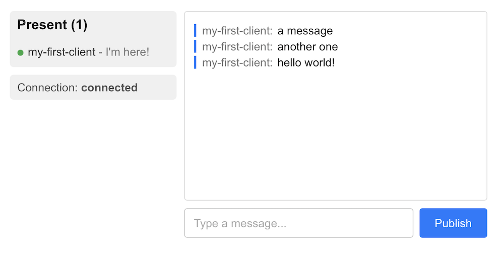

This guide will get you started with Ably Pub/Sub in a new Next.js application.

You'll establish a realtime connection to Ably and learn to publish and subscribe to messages. You'll also implement presence to track other online clients, and learn how to retrieve message history.

<Aside data-type='note'>
Using an AI coding assistant? [Teach it Ably](/docs/platform/ai-llms#agent-skills) with Agent Skills for all popular AI coding agents. Run `claude plugin add ably/agent-skills` or `npx skills add ably/agent-skills` to get started.
</Aside>

## Prerequisites <a id="prerequisites"/>

1. [Sign up](https://ably.com/signup) for an Ably account.
2. Create a [new app](https://ably.com/accounts/any/apps/new), and create your first API key in the **API Keys** tab of the dashboard.
3. Your API key will need the `publish`, `subscribe`, `presence` and `history` capabilities.

### Create a Next.js project <a id="prerequisites-create-project"/>

Create a new Next.js project using the official scaffolding tool. Select **App Router** and **TypeScript** when prompted:

<Code>
```shell
npx create-next-app@latest ably-pubsub-nextjs
cd ably-pubsub-nextjs
```
</Code>

### Update globals.css <a id="prerequisites-globals-css"/>

Replace the contents of `src/app/globals.css` with the following to reset browser defaults and ensure consistent font sizing across all elements including inputs and buttons:

<Code>
```css
/* src/app/globals.css */
html {
  height: 100%;
}

html,
body {
  max-width: 100vw;
  overflow-x: hidden;
}

body {
  min-height: 100%;
  display: flex;
  flex-direction: column;
  color: #171717;
  background: #ffffff;
  font-family: Arial, Helvetica, sans-serif;
  font-size: 15px;
  -webkit-font-smoothing: antialiased;
  -moz-osx-font-smoothing: grayscale;
}

*,
input,
button {
  box-sizing: border-box;
  padding: 0;
  margin: 0;
  font-size: inherit;
  font-family: inherit;
}
```
</Code>

### Install Ably Pub/Sub JavaScript SDK <a id="prerequisites-ably-pubsub"/>

Install the Ably Pub/Sub JavaScript SDK:

<Code>
```shell
npm install ably
```
</Code>

### (Optional) Install Ably CLI <a id="install-cli"/>

Use the [Ably CLI](/docs/platform/tools/cli) as an additional client to quickly test Pub/Sub features. It can simulate other clients by publishing messages, subscribing to channels, and managing presence states.

[`ably init`](/docs/cli/init) installs the Ably CLI, authenticates, and sets the default app and API key in a single command:

<Code>
```shell
npx -p @ably/cli ably init
```
</Code>

<If loggedIn={false}>
  <Aside data-type='note'>
  The code examples in this guide include a demo API key. If you wish to interact with the Ably CLI and view outputs within your Ably account, ensure that you replace them with your own API key.
  </Aside>
</If>

## Step 1: Connect to Ably <a id="step-1"/>

Clients establish a connection with Ably when they instantiate an SDK instance. This enables them to send and receive messages in realtime across channels.

Open up the [dev console](https://ably.com/accounts/any/apps/any/console) of your first app before you start so that you can see what happens.

### Set up AblyProvider <a id="step-1-ably-provider"/>

The Ably Pub/Sub SDK provides React hooks and context providers that make it easy to use Pub/Sub features in your components.

Because the Ably Pub/Sub client uses browser APIs such as WebSocket, it cannot run during server-side rendering. Create a new file `src/app/AblyProvider.tsx` that initializes the client inside a `useEffect` and wraps children in the `AblyProvider`:

<Code>
```react
// src/app/AblyProvider.tsx
'use client';

import * as Ably from 'ably';
import { AblyProvider as AblyReactProvider } from 'ably/react';
import { ReactNode, useEffect, useState } from 'react';

export function AblyProvider({ children }: { children: ReactNode }) {
  const [client, setClient] = useState<Ably.Realtime | null>(null);

  useEffect(() => {
    const ably = new Ably.Realtime({
      key: '{{API_KEY}}',
      clientId: 'my-first-client',
    });
    setClient(ably);
    return () => {
      ably.close();
    };
  }, []);

  if (!client) return null;
  return <AblyReactProvider client={client}>{children}</AblyReactProvider>;
}
```
</Code>

<Aside data-type='note'>
Creating the client inside `useEffect` ensures it only runs in the browser, avoiding SSR hydration mismatches. Returning `null` until the client is ready prevents child components from rendering before the Ably context is available. The cleanup function closes the connection when the component unmounts.
</Aside>

Add the `AblyProvider` to your root layout in `src/app/layout.tsx`:

<Code>
```react highlight="+2-3,+9"
// src/app/layout.tsx
import type { ReactNode } from 'react';
import { AblyProvider } from './AblyProvider';

export default function RootLayout({ children }: { children: ReactNode }) {
  return (
    <html lang='en'>
      <body>
        <AblyProvider>{children}</AblyProvider>
      </body>
    </html>
  );
}
```
</Code>

This establishes a connection to Ably as soon as your application mounts in the browser. While using an API key is fine for this guide, you should use [token authentication](/docs/auth/token) in production. A [`clientId`](/docs/auth/identified-clients) identifies the client, which is required for features such as presence.

### Display the connection state <a id="step-1-connection-state"/>

To display the connection state in your UI, create a client component at `src/app/ConnectionState.tsx`:

<Code>
```react
// src/app/ConnectionState.tsx
'use client';

import { useAbly, useConnectionStateListener } from 'ably/react';
import { useState } from 'react';

export function ConnectionState() {
  const ably = useAbly();
  const [connectionState, setConnectionState] = useState(ably.connection.state);

  useConnectionStateListener((stateChange) => {
    setConnectionState(stateChange.current);
  });

  return (
    <p style={{ color: '#555', padding: '8px 10px', background: '#f0f0f0', borderRadius: '5px' }}>
      Connection: <strong>{connectionState}</strong>
    </p>
  );
}
```
</Code>

Update `src/app/page.tsx` to render the component:

<Code>
```react highlight="+2,+8"
// src/app/page.tsx
import { ConnectionState } from './ConnectionState';

export default function Home() {
  return (
    <main style={{ fontFamily: 'Arial, sans-serif', padding: '20px', maxWidth: '900px', margin: '0 auto' }}>
      <h1 style={{ marginBottom: '20px', fontSize: '36px', textAlign: 'center' }}>Ably Pub/Sub - Next.js</h1>
      <ConnectionState />
    </main>
  );
}
```
</Code>

Start the development server:

<Code>
```shell
npm run dev
```
</Code>

Open [http://localhost:3000](http://localhost:3000) and you should see `Connection: connected`. You can also inspect the connection event in the [dev console](https://ably.com/accounts/any/apps/any/console) of your app.

## Step 2: Subscribe to a channel and publish a message <a id="step-2"/>

To publish and subscribe to messages on a channel use the `ChannelProvider` component from the Ably Pub/Sub SDK, which scopes child components to a specific channel.

### ChannelProvider <a id="step-2-channel-provider"/>

The `ChannelProvider` must be nested inside the `AblyProvider`. Update `src/app/page.tsx` to include the `ChannelProvider`:

<Code>
```react highlight="+2,+4,+12-14"
// src/app/page.tsx
'use client';

import { ChannelProvider } from 'ably/react';
import { ConnectionState } from './ConnectionState';

export default function Home() {
  return (
    <main style={{ fontFamily: 'Arial, sans-serif', padding: '20px', maxWidth: '900px', margin: '0 auto' }}>
      <h1 style={{ marginBottom: '20px', fontSize: '36px', textAlign: 'center' }}>Ably Pub/Sub - Next.js</h1>
      <ConnectionState />
      <ChannelProvider channelName='my-first-channel'>
        {/* Channel-scoped components go here */}
      </ChannelProvider>
    </main>
  );
}
```
</Code>

### Subscribe to a channel <a id="step-2-subscribe"/>

Use the `useChannel()` hook to subscribe to messages on a channel. Create a new file `src/app/Messages.tsx`:

<Code>
```react
// src/app/Messages.tsx
'use client';

import type { Message } from 'ably';
import { useChannel } from 'ably/react';
import { useState } from 'react';

export function Messages() {
  const [messages, setMessages] = useState<Message[]>([]);

  useChannel('my-first-channel', (message) => {
    setMessages((prev) => [...prev, message]);
  });

  return (
    <div style={{ border: '1px solid #ddd', borderRadius: '4px', padding: '12px', width: '400px', height: '250px', overflowY: 'auto', background: '#fff' }}>
      {messages.map((msg) => (
        <p key={msg.id} style={{ margin: '4px 0', borderLeft: '3px solid #007bff', paddingLeft: '8px', color: '#171717' }}>
          {String(msg.data)}
        </p>
      ))}
    </div>
  );
}
```
</Code>

Add `Messages` to `page.tsx` inside the `ChannelProvider`:

<Code>
```react highlight="+6,+14"
// src/app/page.tsx
'use client';

import { ChannelProvider } from 'ably/react';
import { ConnectionState } from './ConnectionState';
import { Messages } from './Messages';

export default function Home() {
  return (
    <main style={{ fontFamily: 'Arial, sans-serif', padding: '20px', maxWidth: '900px', margin: '0 auto' }}>
      <h1 style={{ marginBottom: '20px', fontSize: '36px', textAlign: 'center' }}>Ably Pub/Sub - Next.js</h1>
      <ConnectionState />
      <ChannelProvider channelName='my-first-channel'>
        <Messages />
      </ChannelProvider>
    </main>
  );
}
```
</Code>

Test it by publishing a message from the CLI:

<Code>
```shell
ably channels publish my-first-channel 'Hello from CLI!'
```
</Code>

### Publish a message <a id="step-2-publish"/>

The `useChannel()` hook also returns a `publish` method. Update `src/app/Messages.tsx` to add a message input:

<Code>
```react highlight="+10,+12,+16-20,+23,+27,+32-47"
// src/app/Messages.tsx
'use client';

import type { Message } from 'ably';
import { useChannel } from 'ably/react';
import { useState } from 'react';

export function Messages() {
  const [messages, setMessages] = useState<Message[]>([]);
  const [inputValue, setInputValue] = useState('');

  const { publish } = useChannel('my-first-channel', (message) => {
    setMessages((prev) => [...prev, message]);
  });

  const handlePublish = () => {
    if (!inputValue.trim()) return;
    publish('my-first-messages', inputValue.trim()).catch(console.error);
    setInputValue('');
  };

  return (
    <div style={{ display: 'flex', flexDirection: 'column', gap: '10px' }}>
      <div style={{ border: '1px solid #ddd', borderRadius: '4px', padding: '12px', width: '400px', height: '250px', overflowY: 'auto', background: '#fff' }}>
        {messages.map((msg) => (
          <p key={msg.id} style={{ margin: '4px 0', borderLeft: '3px solid #007bff', paddingLeft: '8px', color: '#171717' }}>
            <span style={{ color: '#777', marginRight: '6px' }}>{msg.clientId}:</span>
            {String(msg.data)}
          </p>
        ))}
      </div>
      <div style={{ display: 'flex', gap: '8px' }}>
        <input
          type='text'
          value={inputValue}
          placeholder='Type a message...'
          onChange={(e) => setInputValue(e.target.value)}
          onKeyDown={(e) => e.key === 'Enter' && handlePublish()}
          style={{ flex: 1, padding: '10px 12px', border: '1px solid #ccc', borderRadius: '4px', outline: 'none' }}
        />
        <button
          onClick={handlePublish}
          style={{ padding: '10px 20px', background: '#007bff', color: '#fff', border: 'none', borderRadius: '4px', cursor: 'pointer' }}
        >
          Publish
        </button>
      </div>
    </div>
  );
}
```
</Code>

Type a message and click **Publish** to see it appear in your UI. Open another browser window to see messages arriving in realtime.

## Step 3: Join the presence set <a id="step-3"/>

Presence enables clients to be aware of one another on the same channel. You can show who is online, provide status updates, and notify the channel when someone goes offline.

Use the `usePresence()` and `usePresenceListener()` hooks from the Ably Pub/Sub SDK. Create a new file `src/app/PresenceStatus.tsx`:

<Code>
```react
// src/app/PresenceStatus.tsx
'use client';

import { usePresence, usePresenceListener } from 'ably/react';

export function PresenceStatus() {
  usePresence('my-first-channel', { status: "I'm here!" });

  const { presenceData } = usePresenceListener('my-first-channel');

  return (
    <div style={{ padding: '8px 10px', background: '#f0f0f0', borderRadius: '5px' }}>
      <h3 style={{ marginTop: 0, marginBottom: '12px', fontSize: '18px' }}>
        Present ({presenceData.length})
      </h3>
      <ul style={{ listStyle: 'none', padding: 0, margin: 0 }}>
        {presenceData.map((member, idx) => (
          <li key={idx} style={{ padding: '4px 0', color: '#333' }}>
            <span style={{ display: 'inline-block', width: 8, height: 8, borderRadius: '50%', background: '#28a745', marginRight: 6 }} />
            {member.clientId}
            {member.data?.status ? <span style={{ color: '#777' }}> - {member.data.status}</span> : null}
          </li>
        ))}
      </ul>
    </div>
  );
}
```
</Code>

Update `src/app/page.tsx` to include `PresenceStatus` and `ConnectionState` inside the `ChannelProvider`, alongside `Messages`:

<Code>
```react highlight="+7,+14-22"
// src/app/page.tsx
'use client';

import { ChannelProvider } from 'ably/react';
import { ConnectionState } from './ConnectionState';
import { Messages } from './Messages';
import { PresenceStatus } from './PresenceStatus';

export default function Home() {
  return (
    <main style={{ fontFamily: 'Arial, sans-serif', padding: '20px', maxWidth: '900px', margin: '0 auto' }}>
      <h1 style={{ marginBottom: '20px', fontSize: '36px', textAlign: 'center' }}>Ably Pub/Sub - Next.js</h1>
      <ChannelProvider channelName='my-first-channel'>
        <div style={{ display: 'flex', gap: '10px' }}>
          <div style={{ flex: '0 0 220px', display: 'flex', flexDirection: 'column', gap: '10px' }}>
            <PresenceStatus />
            <ConnectionState />
          </div>
          <div style={{ flex: 1 }}>
            <Messages />
          </div>
        </div>
      </ChannelProvider>
    </main>
  );
}
```
</Code>

Your client ID will appear in the presence list. Join presence via the CLI to see another client joining:

<Code>
```shell
ably channels presence enter my-first-channel --data '{"status":"From CLI"}'
```
</Code>

## Step 4: Retrieve message history <a id="step-4"/>

Ably stores messages for 2 minutes by default. You can [extend the storage period](/docs/storage-history/storage) if required.

The `useChannel()` hook returns a `channel` instance. Use its `history()` method to load previously published messages on mount. Update your `Messages` component in `src/app/Messages.tsx` to load history with a `useEffect`:

<Code>
```react highlight="+6,+12,+16-22"
// src/app/Messages.tsx
'use client';

import type { Message } from 'ably';
import { useChannel } from 'ably/react';
import { useEffect, useState } from 'react';

export function Messages() {
  const [messages, setMessages] = useState<Message[]>([]);
  const [inputValue, setInputValue] = useState('');

  const { publish, channel } = useChannel('my-first-channel', (message) => {
    setMessages((prev) => [...prev, message]);
  });

  useEffect(() => {
    async function loadHistory() {
      const history = await channel.history({ limit: 5 });
      setMessages((prev) => [...history.items.reverse(), ...prev]);
    }
    loadHistory().catch(console.error);
  }, [channel]);

  const handlePublish = () => {
    if (!inputValue.trim()) return;
    publish('my-first-messages', inputValue.trim()).catch(console.error);
    setInputValue('');
  };

  return (
    <div style={{ display: 'flex', flexDirection: 'column', gap: '10px' }}>
      <div style={{ border: '1px solid #ddd', borderRadius: '4px', padding: '12px', width: '400px', height: '250px', overflowY: 'auto', background: '#fff' }}>
        {messages.map((msg) => (
          <p key={msg.id} style={{ margin: '4px 0', borderLeft: '3px solid #007bff', paddingLeft: '8px', color: '#171717' }}>
            <span style={{ color: '#777', marginRight: '6px' }}>{msg.clientId}:</span>
            {String(msg.data)}
          </p>
        ))}
      </div>
      <div style={{ display: 'flex', gap: '8px' }}>
        <input
          type='text'
          value={inputValue}
          placeholder='Type a message...'
          onChange={(e) => setInputValue(e.target.value)}
          onKeyDown={(e) => e.key === 'Enter' && handlePublish()}
          style={{ flex: 1, padding: '10px 12px', border: '1px solid #ccc', borderRadius: '4px', outline: 'none' }}
        />
        <button
          onClick={handlePublish}
          style={{ padding: '10px 20px', background: '#007bff', color: '#fff', border: 'none', borderRadius: '4px', cursor: 'pointer' }}
        >
          Publish
        </button>
      </div>
    </div>
  );
}
```
</Code>

Publish a few messages first if needed:

<Code>
```shell
ably channels publish --count 5 my-first-channel "Message number {{.Count}}"
```
</Code>

Reload the page. The last 5 messages will appear immediately, loaded from history before any new realtime messages arrive.

Your completed application should look like this:



## Next steps <a id="next-steps"/>

Continue to explore the documentation with Next.js as the selected language:

* Understand [token authentication](/docs/auth/token) before going to production.
* Understand how to effectively [manage connections](/docs/connect#close?lang=nextjs).
* Explore more [advanced](/docs/pub-sub/advanced?lang=nextjs) Pub/Sub concepts.

You can also explore the [Ably CLI](https://www.npmjs.com/package/@ably/cli) further, visit the Pub/Sub [API references](/docs/api/realtime-sdk?lang=javascript), or browse the [Ably Next.js Fundamentals Kit](https://github.com/ably/ably-nextjs-fundamentals-kit) for more complete examples.
