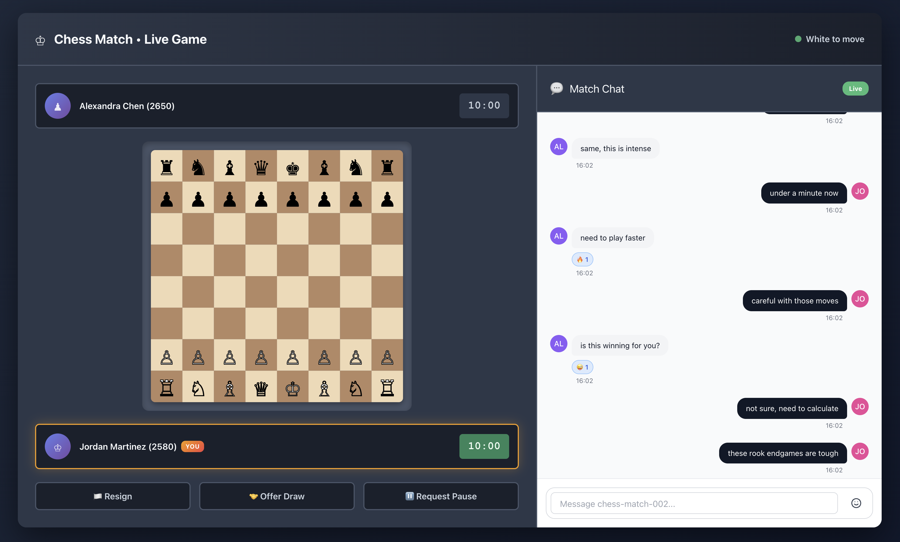

Ably Chat is purpose-built for all types of chat experiences, from 1:1 conversations to small group interactions that enhance specific activities and workflows.

If you need to deliver seamless embedded chat experiences that enhance tasks like support tickets, deliveries, gaming sessions, collaborative work, or transactional processes, without sacrificing performance, reliability, or costs, then Ably is the proven choice.

Building with Ably means that you no longer need to worry about managing websocket servers, handling failover, network disruptions, or keeping latency low. Ably handles all of this for you, leaving you free to focus on creating engaging experiences.

This guide explains the architectural decisions, technical challenges, and unique benefits of building embedded chat experiences with Ably, focusing on 1:1 and small group chats. It will help you design efficient embedded chat solutions for scenarios like customer support, delivery tracking, gaming sessions, collaborative work, marketplace transactions, and more - all with performance, user experience, and cost optimization in mind.

**What are embedded chats?** Any chat that serves as a companion to a specific activity or workflow: resolving a support ticket, coordinating a delivery, discussing a chess game, collaborating on a project, or facilitating a marketplace transaction. They can be 1:1 or group conversations.

## Why Ably for embedded chats?

Ably is trusted by organizations delivering chat to millions of users in realtime. Its platform is engineered around the four pillars of dependability:

* **[Performance](/docs/platform/architecture/performance):** Ultra-low latency messaging, even at global scale.
* **[Integrity](/docs/platform/architecture/message-ordering):** Guaranteed message ordering and delivery, with no duplicates or data loss.
* **[Reliability](/docs/platform/architecture/fault-tolerance):** 99.999% uptime SLA, with automatic failover and seamless re-connection.
* **[Availability](/docs/platform/architecture/edge-network):** Global edge infrastructure ensures users connect to the closest point for optimal experience.


Delivering chat messages in realtime is key to a smooth online experience. Ably's [serverless architecture](/docs/platform/architecture) eliminates the need for you to manage websocket servers. It automatically scales to handle millions of concurrent connections without provisioning or maintenance. Ably routinely handles 600 billion messages every month globally, across 2 billion devices with median delivery [latencies](/docs/platform/architecture/latency#message-delivery-latency) under 6.5ms even during peak traffic. Ably also handles all of the edge-cases around delivery, failover and scaling.

Despite the challenges of delivering these guarantees, Ably is designed to keep costs predictable. You can choose between MAU-based (more predictable for a known number of users) or per-minute pricing (consumption-based, pay for what you use), depending on your needs. Both pricing models are designed to be cost-effective and scalable. Features such as efficient connection management are available to help you reduce costs.

## Architecting your chat: UX first, scale always

The most important decision when developing embedded chat applications is the experience you want users to have within their specific context. This will determine how chat integrates with your task flow and ultimately how effectively it enhances the user experience.

For large-scale chat scenarios with many users per room, see our [building livestream chat guide](/docs/guides/chat/build-livestream).

**Room architecture:** The optimal approach for embedded chats is one chat room per context or task, where all participants join to communicate within that specific context. Rooms are:

* **Automatically scaled** - Ably handles any number of concurrent rooms without provisioning.
* **History-enabled** - messages stored for 30 days by default (configurable up to a year on request).
* **Kept under control** - [capabilities](/docs/chat/setup#authentication) let you control who can join and the level of access to features and actions.

Each room includes all relevant participants: customers and agents in support, buyers and sellers in marketplaces, all players in games, team members in projects. Participants can join and leave for the duration of the chat. Access to message history and other features can be granted to all or select participants via capabilities.

Key considerations for embedded chat rooms:
- When will the room be joined by participants and how will it be linked to the rest of your application (delivery, support ticket, game session and so on)? Examples:
  - For something like support, create a ticket when the user opens the chat window; optionally ask for some details before creating the ticket. Return an authentication token and room name with the new ticket details, the user will then join using this information.
  - For games, use one room per game session for games such as chess, or for a MMORPG, allocate a room for each location or instance of a quest.
  - For deliveries, appointments, or calls, there is a clear 1:1 mapping of task to room and users join the room when they join the task.
- Will users be active at the same time, or will they come and go with periods of inactivity?
  - Only attaching to rooms when they are needed is more cost-effective and saves resources.
  - For example, during a delivery, the chat room doesn't always have to be active. With a good strategy for push notifications to alert inactive users of new messages, they can attach for very short periods of time for each delivery.
- Do you need any spam prevention measures applied before allowing users to join rooms?
  - For example, in a support chat scenario, use a captcha or other measures before allowing users to join a room or create a new ticket.
- Do you need long-term archiving of the chat history?
  - Check out the guide for [exporting chat data](/docs/guides/chat/export-chat) for an overview of your options.

Ably has been tested to handle millions of concurrent connections and rooms. Whether you're managing 100 support conversations or 100,000 simultaneous delivery chats, the architecture remains the same - no re-engineering required as you grow.

## Authentication

Authentication is a design decision. 

In some cases, you'll want to tie participants to their identity in your application. In others, anyone can join and participate. Ably Chat supports both of these scenarios - you don't need to go through the hassle of setting up users in Ably and trying to keep them in sync with your application. Every client has a `clientId`. If you want to allow random users, just use a random string. If you want to tie it to your application, then use the ID of the user or some other well-known identifier. Just make sure you can tell them apart if you allow both at the same time, for example by using distinct prefixes.

<Code>
```javascript
const jwt = require("jsonwebtoken");

const header = {
    "typ": "JWT",
    "alg": "HS256",
    "kid": "{{ API_KEY_NAME }}"
}
const currentTime = Math.round(Date.now() / 1000);

// The clientId could be the users ID in your application,
// or a random string if you want to make users anonymous.
//
// The capabilities here allow the holder of this token to publish and subscribe to messages,
// typing indicators and room reactions in the chat room called "foo".

const claims = {
    "iat": currentTime, /* current time in seconds */
    "exp": currentTime + 14400, /* time of expiration in seconds */
    "x-ably-capability": "{\"foo\":[\"publish\", \"subscribe\"]}",
    "x-ably-clientId": "your-client-id",
}

ablyJwt = jwt.sign(
    claims,
    "{{ API_KEY_SECRET }}",
    { header: header }
)

console.log('JWT is: ' + ablyJwt);
```
</Code>

How you authenticate is also key. To balance security and experience, you want short-lived tokens that can be easily revoked if a user is misbehaving or needs their permissions changed, but automatically expire after a period of time. This means that if a token is compromised, it will only be valid for a limited time. **In production apps, you should not use API keys for client-side authentication**. You can use them server-side, but as they are long-lived and require explicit revocation, exposure to untrusted users poses a continuing risk.

Authentication is best achieved using JSON Web Tokens (JWTs). These are tied to a particular `clientId` and come with a set of [capabilities](/docs/chat/setup#authentication) that control what a client can and cannot do - for example whether they can send messages, join a certain room or moderate. Ably's SDKs handle the timing and process of requesting a new token for you, refreshing it when it expires. All you need to do is provide a server-side endpoint that can generate the JWT for the client. This enables clients to use your existing authentication systems or user sessions to generate their Ably token.

## Presence: Know who's available in the room

[Presence](/docs/chat/rooms/presence) shows you who's currently active in the room, enabling you to bring more live context to your application.

Presence is especially valuable for scenarios where when showing who is online can directly enhance the user experience:

* **Support tickets:** See when agents are online and available to help.
* **Deliveries:** Know if the delivery driver or customer is actively monitoring the chat.
* **Gaming sessions:** See which players are currently active in the game.
* **Collaborative work:** Know who's available for real-time discussion.

Beyond just online/offline status, presence can include rich information:

* **Current status:** "Available", "In a meeting", "Driving", "On break".
* **Task context:** "Working on ticket #123", "In delivery zone A".
* **User info:** Use presence to show an avatar, display name, role, or other information about the user.

This contextual presence information helps participants understand not just who's online, but who's ready and able to engage with the current task.

```javascript
// subscribe to presence events
const { unsubscribe } = room.presence.subscribe((event) => {
  console.log(`${event.member.clientId} entered with data: ${event.member.data}`);

  const presentMembers = await room.presence.get();
  console.log('Present members:', presentMembers);
});

// attach the room
await room.attach();

// join presence
await room.presence.enter({ status: 'available' });

// change presence data
await room.presence.update({ status: 'busy' });

// leave presence
await room.presence.leave();
```

## Typing indicators

[Typing indicators](/docs/chat/rooms/typing) are a common feature in most chat applications. They show when someone is actively composing a message, helping to:

* **Manage expectations:** Users know when a response is being prepared.
* **Reduce duplicate messages:** See that someone is already addressing the question.
* **Improve flow:** Better conversation pacing in support and collaborative scenarios.

In Ably Chat typing indicators are a core feature with a simple API:

```javascript
const room = await chatClient.rooms.get('support-ticket-123');

// show who's typing
room.typing.subscribe((event) => {
  console.log('Currently typing:', event.currentlyTyping);
});

// attach the room
await room.attach();

// show a typing indicator (call on every keystroke, Ably Chat SDKs throttle this to a predefined interval)
await room.typing.keystroke();

// stop the typing indicator (for example when a message is sent)
await room.typing.stop();
```

## Message reactions

Message reactions are a ubiquitous feature in modern chat experiences and are a great way to enhance engagement and enable users to quickly express sentiment to key points in the conversation.

Send a message reaction:
<Code>
```javascript
const message; // your message
await room.messages.reactions.send(message.serial, {name: '❤️'});
```
</Code>

Message reactions in Ably Chat come in three types: `unique`, `distinct` and `multiple`, to suit different use cases: from one reaction per message to multiple reactions per message with or without counts. See the [Message reactions](/docs/chat/rooms/message-reactions) documentation for more details.

## Message history: essential task context <a id="history"/>

Message history is crucial for chat, ensuring continuity and context even when participants join mid-conversation or leave and return.

Ably stores [chat history](/docs/chat/rooms/history) for 30 days by default, with options to extend up to a year on request.

Message history provides users with:
* **Task continuity:** New participants can quickly understand the current state and previous decisions.
* **Context preservation:** Users returning to a task don't lose important information.
* **Audit trail:** Complete conversation records for compliance, training, or dispute resolution.

History is almost always beneficial:

* **Collaborative work:** Team members can catch up on decisions and progress.
* **Gaming sessions:** Players can review discussions and have context when joining a new room.
* **Marketplace transactions:** Complete communication record for orders and deliveries.

<Code>
```javascript
// Get the chat room
const room = await chatClient.rooms.get('support-ticket-123');

// Subscribe to messages
const subscription = room.messages.subscribe((messageEvent) => {
  console.log('Received:', messageEvent);
  // handle message event to update state and UI
});

// attach the room
await room.attach();

// Load recent history for context
// This ensures you get a complete picture without missing messages
let historyResponse = await subscription.historyBeforeSubscription({limit: 50});

// Iterate through all pages
while (true) {
  console.log('Messages: ', historyResponse.items);
  if (historyResponse.hasNext()) {
    historyResponse = await historyResponse.next();
  } else {
    break;
  }
}
```
</Code>

## Handling network disruption

Network disruption happens - mobile internet loses signal or someone drives through a tunnel. All of Ably's SDKs are designed with this in mind, so that you don't have to handle complicated reconnection logic.

Every SDK instance keeps track of its own position in the message stream. If the connection is lost, the library will [automatically attempt to reconnect](/docs/platform/architecture/connection-recovery) to the servers and in doing so, resume its position in the stream. This enables the chat to continue as if the user never left. After extended periods of disconnection, the client can make use of [history](#history) to backfill missing messages.

It's incredibly rare, but sometimes a client might lose connection to a particular data center. Ably operates in multiple data centers around the world with multiple fallback regions available. If a client can't reach the nearest data center, it will try the next one until the connection is re-established, ensuring minimal downtime and that network issues don't disrupt the experience that you are trying to build. Ably's [fault tolerance guide](/docs/platform/architecture/fault-tolerance) describes how we do this and shows that even if an entire region goes down, it has little-to-no impact on the global service and your application.


## Build quickly with the React UI Kit

The [React UI Kit](/docs/chat/react-ui-kit) provides ready-made components for building chat interfaces. Drop in the [App](/docs/chat/react-ui-kit/components#app) component to see a working chat UI within minutes, or use individual components like [ChatWindow](/docs/chat/react-ui-kit/components#chat-window), [ChatMessageList](/docs/chat/react-ui-kit/components#chat-message-list), [MessageInput](/docs/chat/react-ui-kit/components#message-input), and [ParticipantList](/docs/chat/react-ui-kit/components#participant-list) to build custom interfaces.

Components handle message display with history loading, editing and deletion, reactions, typing indicators, and presence. [Providers](/docs/chat/react-ui-kit/providers) manage themes, avatars, and chat settings. See the [getting started guide](/docs/chat/getting-started/react-ui-kit) for setup details.

## Enriching experiences with Ably's realtime services

Ably's comprehensive platform enables you to combine chat with other realtime features to create rich, interactive experiences.

[**Pub/Sub channels**](/docs/basics) enable you to build rich, interactive experiences:
- **Live polls:** Quick feedback during collaborative decisions.
- **Status updates:** Real-time progress indicators for tasks.
- **Interactive ratings:** Instant feedback collection.
- **Live auctions:** Real-time bidding in marketplace scenarios.

These combined services transform basic chat into comprehensive task management platforms, where communication, coordination, and real-time updates work together seamlessly.

## Moderation: maintaining quality conversations

Effective moderation ensures your chats remain safe for all users. Maintaining conversation quality is crucial for providing a pleasant and positive online environment and keeping your users engaged.

Ably supports [moderating messages](/docs/chat/moderation) both before and after publication, making it easy to integrate with AI-powered or human moderation systems.

* **After-publish moderation:** Messages appear instantly, then are removed if flagged as inappropriate. Best for scenarios where immediacy matters. It can be used to detect abusive behavior or inappropriate content after the fact.
* **Before-publish moderation:** Messages are held until approved. Use this for high-stakes scenarios where every message must be vetted.

### Key moderation considerations for chat

1. **Platform standards**
   * What level of moderation is appropriate for your audience?
   * How will you handle different types of content? For example:
     * **Hate speech and harassment:** Detecting discriminatory language, threats, or targeted abuse.
     * **Inappropriate content:** Flagging adult content, violence, or graphic material.
     * **Toxicity:** Measuring overall message sentiment and hostility.

2. **Technical integration**
   * **Latency impact:** AI moderation adds up to 100ms to message delivery.
   * **Integration options:** Choose from pre-built integrations or connect your existing moderation systems via webhooks, serverless functions, or queues.

3. **Context-specific approaches**
   * **Customer support:** Protect both customers and agents from abuse and harassment.
   * **Gaming:** Prevent harassment while allowing enthusiastic expressions.
   * **Marketplace:** Ensure rules are being followed such as detecting if outside-platform contact info is exchanged.

### How Ably enhances chat moderation

Ably's flexible moderation system adapts to your requirements:

* **Per-room policies:** Different moderation rules for different chat rooms.
* **Fallback handling:** Configure what happens when moderation services are unavailable.
* **Custom integration:** Connect your existing moderation infrastructure via webhooks, serverless functions, or message queues.
* **Role-based permissions:** Give moderators special capabilities to manage conversations.

<Code>
```javascript
import { ErrorCode } from '@ably/chat';

const room = await chatClient.rooms.get('support-ticket-123');

room.messages.send({text: 'Can you help me with my order?'}).then((message) => {
    console.log('Message sent:', message);
}).catch((error) => {
    if (error.code === ErrorCode.MessageRejectedByModeration) {
        console.log('Message rejected by moderation:', error.message);
        return;
    }
    console.error('Message failed to send:', error);
});
```
</Code>

## Push notifications

Push notifications are a great way to re-engage users in your chat, and to let them know of important updates even if they have temporarily left the chat. For example, you could send a push notification to a user when a new message is received in 1:1 chat, or when there are important updates about the task at hand, such as a delivery driver arriving.

With Ably you can send push notifications to a channel, to a device, or to a user by their `clientId`. This allows you to send push notifications that are tailored to the specific needs of your application.

To send push notifications, we recommend using an integration to forward chat messages to your own servers. Then you can decide on the server-side when and to whom to send push notifications. This gives you full control and customisation.

Read more about push notifications with Ably in the [Push notifications](/docs/push/publish) documentation, and about [integrations](/docs/platform/integrations) for more details.

## AI Integrations

AI chatbots are revolutionizing the way we interact with digital platforms. Integrating AI functionality into your chat experience can provide automated contextual moderation, personalized interactions, automatically creating training material, and more.

Ably's flexible [integration capabilities](/docs/chat/integrations) make it easy to connect your chat system with AI services. Through Ably's integrations, you can automatically route messages to:

* Serverless functions (AWS Lambda, Azure Functions, and others).
* Event streaming services including Kafka, SQS and Pulsar.
* Webhooks and custom endpoints.
* An [Ably Queue](/docs/platform/integrations/queues).

This enables powerful AI features like:

* Sentiment analysis of chat messages.
* AI-powered responses. From chatbots and assistants to smarter in-game characters that join the chat.
* Chat summarization and key point extraction. For analytics and finding insights.

For example, you could set up an integration that sends all messages from each chat room to an AI service for sentiment analysis, which then automatically flags detected negative customer sentiments for review, to ensure they are handled appropriately, which could increase overall customer satisfaction. Or route messages to a language model to generate contextual responses to common questions.

## Room reactions

Room reactions are a great engagement feature for chats that accompany calls, meetings, collaborative tools, and games. They are a way to quickly express a sentiment to the entire room at a point in time without adding to chat history or being tied to a message.

<Code>
```javascript
// Subscribe to room reactions
room.reactions.subscribe((event) => {
  console.log('Room reaction received:', event.reaction.name, "from", event.reaction.clientId);
});

// Send a room reaction
await room.reactions.send({name: '👍'});
```
</Code>

## Priced for efficiency

Embedded chats are typically short-lived with participants joining briefly to complete specific actions like resolving a support ticket or coordinating a delivery. In Monthly Active Users (MAU) pricing models, this often leads to bills that far outweigh the actual usage. Ably offers a competitive pricing model that is based on consumption, with discounted rates for higher usage. You won't be billed for users that join briefly or tasks that end quickly, only for the actual messages and time they spend engaged in the conversation.

If you have participants that engage consistently, for example teams collaborating regularly on tasks or gaming communities that maintain ongoing sessions, Ably also offers a competitive MAU pricing model in addition to the traditional consumption-based model for these scenarios.

A full breakdown of Ably's pricing can be found on the [pricing page](https://ably.com/pricing).

### Efficient connection and attachment management

When a client abruptly disconnects from Ably, there is a 2 minute delay before the connection is cleaned up on the server, to enable the client to resume the connection from where it left off. When you're finished with an Ably connection, be sure to call the `close()` method to gracefully shut down the connection.

All Ably SDKs also perform "heartbeats" with the server to enable detection of dropped or disrupted connections. The default interval for this is 15 seconds. By adjusting the heartbeat interval, you can control how quickly a connection is deemed to have dropped and therefore reduce the amount of time connections remain open for.

<Code>
```javascript
import * as Ably from 'ably';

const realtimeClient = new Ably.Realtime({
   // Other options omitted for brevity
   transportParams: { heartbeatInterval: 5000 }
})
```
</Code>

Closing connections as well as detaching from rooms when no longer needed is important to ensure that you are not charged for unused resources.

## Production-ready checklist

Before you go live with your chat feature, review these key points:

* **Authentication strategy:** Ensure you're using token authentication for all client-side communication with appropriate JWT expiration times for your task duration.
* **Permission model:** Apply the principle of least privilege - participants should only have access to their specific task rooms and relevant capabilities.
* **Monitoring setup:** Monitor task room activity, message delivery success rates, and connection stability across your user base.
* **Scale planning:** Confirm you are on the right Ably package for your expected volume.
* **Error handling:** Implement proper error handling for network disruptions and ensure graceful degradation when network connections are interrupted.
* **Data retention:** Verify your message history retention policy aligns with your task lifecycle and any compliance requirements.
* **Integration testing:** Test all third-party integrations (AI services, moderation, external APIs) under realistic task scenarios.

## Next steps

* **Explore Ably Chat:** Dive into the [Ably Chat documentation](/docs/chat) for comprehensive API details and advanced features.
* **Try the examples:** Play around with [chat examples](/examples?product=chat) to see real implementations.
* **Get started quickly:** Follow the [React UI Kit](/docs/chat/getting-started/react-ui-kit), [JavaScript/TypeScript](/docs/chat/getting-started/javascript), or [React](/docs/chat/getting-started/react) getting started guides. On mobile? Check out our [Swift](/docs/chat/getting-started/swift) and [Kotlin](/docs/chat/getting-started/android) getting started guides.
* **Add intelligence:** Learn how to integrate [AI assistance](/docs/chat/integrations) for smarter task experiences.
* **Secure your chats:** Understand [token authentication](/docs/auth/token#jwt) for production-ready security.
* **Moderate effectively:** Implement [chat moderation](/docs/chat/moderation) tailored to your task scenarios.
* **Scale with confidence:** Explore [server-side batching](/docs/messages/batch#server-side) for optimal performance.
* **Combine services:** Learn how to integrate [Ably's broader platform](/docs/platform) for rich task experiences.
