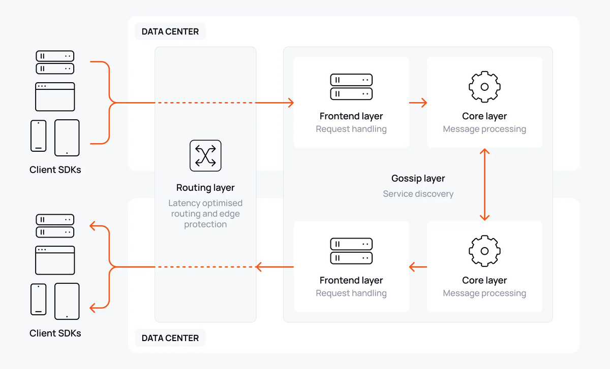
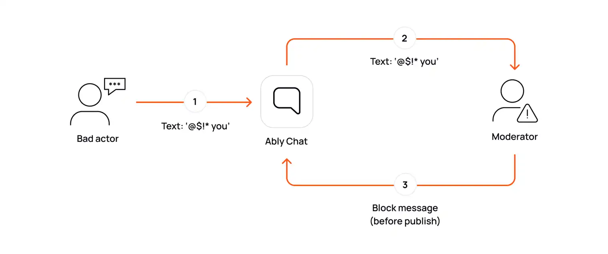

Ably Chat is purpose-built for livestream chat at scale. If you need to deliver a seamless, high-throughput chat experience to thousands or millions of users, without sacrificing performance, reliability, or costs then Ably is the proven choice.

Building with Ably means that you no longer need to worry about scaling websocket servers, handling failover or keeping latency low. Ably handles all of this for you, leaving you free to focus on your end-user experience.

This guide explains the architectural decisions, technical challenges, and unique benefits of building livestream chat with Ably. It will help you design for scale, user experience, with cost optimization in mind whilst implementing the key features of a successful livestream chat application.

## Why Ably for livestream chat?

Ably is trusted by organizations delivering chat to millions of users in realtime. Its platform is engineered around the four pillars of dependability:

* **[Performance](/docs/platform/architecture/performance):** Ultra-low latency messaging, even at global scale.
* **[Integrity](/docs/platform/architecture/message-ordering):** Guaranteed message ordering and delivery, with no duplicates or data loss.
* **[Reliability](/docs/platform/architecture/fault-tolerance):** 99.999% uptime SLA, with automatic failover and seamless re-connection.
* **[Availability](/docs/platform/architecture/edge-network):** Global edge infrastructure ensures users connect to the closest point for optimal experience.



Delivering chat messages in realtime is key to an engaging experience. Ably's [serverless architecture](/docs/platform/architecture) eliminates the need for you to manage websocket servers. It automatically scales to handle millions of concurrent connections without provisioning or maintenance. Ably also handles all of the edge-cases around delivery, failover and scaling.

Despite the challenges of delivering these guarantees, Ably is designed to keep costs predictable. Using features such as server-side batching and efficient connection management, along with Ably's consumption-based pricing model ensures costs are kept as low as possible, no matter the scale.

## Architecting your chat rooms: UX first, scale always

The most important decision you can make when developing a livestream chat application is the experience you want users to have. This will determine the look and feel of the livestream and ultimately the impression your users leave with.

The key architectural decision is how best to structure your chat rooms. With Ably, you are not limited by technology - only by the user experience you want to deliver. There are two main options for architecting your rooms:

- **Single massive room:** Ably seamlessly supports millions of users in a single room, by automatically distributing websocket connections across multiple servers to ensure endless connection scalability. This is ideal for global events or streams where all users are participating together.
- **Many concurrent rooms:** You can run thousands of rooms in parallel, each with their own audience and message flow. Not only do connections scale horizontally, but Ably uses [consistent hashing](/docs/platform/architecture/platform-scalability) to evenly distribute the management of chat rooms across instances, enabling the number of rooms to grow without limit, and without causing load spikes when you do.

In making this decision, there are several considerations:

* Should everyone see the same messages, or do you need to segment by language, region, friend group or topic?
  * If you're running livestreams over multiple languages or geographical regions, you may want to consider separating users similarly so that everybody understands the chat. This can be achieved by using logged-in users provided location or using GeoIP to determine the location of each user.
  * Alternatively, you may want to make use of translation services, that can translate messages on the fly to the language of the user. Many translation APIs including Google Translate are available and modern devices often come with on-device translation, which enables everyone to receive the same messages but in their own language.
* Do you want an environment where everyone has time to read every message, or the chat to go wild with hype when something exciting happens?
  * At anything more than 5-10 messages per second, a chat becomes unreadable for the audience. This may be ok in the moment when a goal is scored, for example, but may degrade the experience if it's for the entire game.
  * **Sharding** is one approach to this problem - separating users into smaller groups so that the chat is more manageable. This can be done randomly, or using some predefined scheme, e.g. language, geographical region.
  * You can also simply _drop_  a proportion of messages on the client to keep it readable. If you're not worried about everyone seeing everything, this is a simple approach.
  * You could rate-limit how often users send messages. This controls the rate of messages, but can negatively impact the user experience if they're not able to respond when they want to.
* Do you need to support both public and private chat?
  * Some livestream experiences may have one big stream chat, but also enable individual users and groups to have private conversations.
  * In this situation, Ably's [horizontal and vertical scalability](/docs/platform/architecture/platform-scalability) means you can have one big room for public chat and many smaller rooms for private conversations.

Ably gives you the flexibility to design for your users, not your infrastructure.

## Message throughput and rate management

Livestream chat is defined by high message rates and unpredictable spikes. Ably [is engineered](/docs/platform/architecture/platform-scalability) to handle these loads without degradation.

* **Proven at scale:** Ably delivers over 500 million messages per day for customers, with individual rooms supporting over 1 million concurrent users.
* **Server-side batching:** Reduce costs and network overhead by grouping messages before delivery. As shown in the [example](#server-side-batching), [batching messages](#server-side-batching) reduces the number of outbound messages such that it increases linearly with the number of users in the chatroom.
* **Rate limiting:** Control the flow of messages per user to maintain readability and prevent spam. Choose between per-connection rate limits or global throttling.

Decisions that you need to make around throughput and rates:

* What is the maximum message rate you want users to experience on average?
  * In livestream chat, spikes are common and expected - when the winning goal is scored, we'd usually expect the chat to go wild.
  * The average message rate is the more important metric to consider when designing your chat, as it represents the overall experience you want to provide.
* What balance do you want to strike between realtime delivery and cost efficiency?
  * Batching messages naturally introduces a delay in the time it takes for a message to be delivered to the user, or acknowledged by the server.
  * Larger batching intervals mean less frequent delivery of messages, but also means that fewer messages in total are sent out (and thus lower costs).
  * For a large room chat scenario, we recommend a batching interval of **no more than 1 second**, which keeps the chat responsive but can still [significantly reduce costs](#server-side-batching).
  * For smaller groups and 1:1 chats, you may find that batching does not make a material difference to costs, but does affect the latency of the chat. In the rooms handling those chats, you may choose to not use batching.

## Authentication

Authentication in livestream chat is a design decision. In some cases, you'll want to tie participants to their identity in your application. In others, anyone can join and participate. Ably Chat supports both of these scenarios - you don't need to go through the hassle of setting up users in Ably and trying to keep them in sync with your application. Every client has a `clientId`. If you want to allow random users, just use a random string. If you want to tie it to your application, then use the UUID of the user or some other well-known identifier.

<Code>
```javascript
const jwt = require("jsonwebtoken");

const header = {
    "typ": "JWT",
    "alg": "HS256",
    "kid": "{{ API_KEY_NAME }}"
}
const currentTime = Math.round(Date.now() / 1000);

// The clientID could be the users UUID in your application,
// or a random string if you want to make users anonymous.
//
// The capabilities here allow the holder of this token to publish and subscribe to messages,
// typing indicators and room reactions in the chat room called "foo".

const claims = {
    "iat": currentTime, /* current time in seconds */
    "exp": currentTime + 14400, /* time of expiration in seconds */
    "x-ably-capability": "{\"foo\":[\"publish\", \"subscribe\"]}",
    "x-ably-clientId": "your-client-id",
}

ablyJwt = jwt.sign(
    claims,
    "{{ API_KEY_SECRET }}",
    { header: header }
)

console.log('JWT is: ' + ablyJwt);
```
</Code>

How you authenticate is also key. To balance security and experience, you want short-lived tokens that can be easily revoked if a users is misbehaving or needs their permissions changed, but automatically expire after a period of time. This means that if a token is compromised, it will only be valid for a limited time. **In production apps, you should not use API keys for client-side authentication**. You can use them server-side, but as they are long-lived and require explicit revocation, exposure to untrusted users poses a continuing risk.

With Ably Chat, authentication is best achieved using JSON Web Tokens (JWTs). These are tied to a particular clientID and come with a set of [capabilities](/docs/chat/setup#authentication) that control what a client can and cannot do - for example whether they can send messages, join a certain room or moderate. Ably's SDKs handle the timing and process of requesting a new token for you, refreshing it when it expires. All you need to do is provide a server-side endpoint that can generate the JWT for the client. This enables clients to use your existing authentication systems or user sessions to generate their Ably token.

## Moderation: Protecting your community

Effective moderation is essential for livestream chat to maintain a safe and engaging environment, prevent spam and inappropriate content, and ensure compliance with platform guidelines. While human moderators are valuable, they cannot scale to handle the high message volumes of popular livestreams, especially when a single stream can generate thousands of messages per minute. Automated moderation solutions are therefore crucial for realtime content filtering at scale.

Ably supports [moderating messages](/docs/chat/moderation) before they've been published to the livestream, and retroactively after they've been published. This makes it easy to integrate with AI-powered moderation tools.

* **After-publish moderation:** Messages appear instantly, then are removed if flagged as inappropriate. This minimizes latency and is suitable for high-velocity chats.
* **Before-publish moderation:** Messages are held until approved. Use this for sensitive streams where content control is paramount.



### Key moderation considerations

When implementing chat moderation, consider these essential factors:

1. **Community standards**
   * What level of moderation is appropriate for your audience?
   * How will you handle different types of content? For example:
     * **Hate speech and harassment:** Detecting discriminatory language, threats, or targeted abuse
     * **Inappropriate content:** Flagging adult content, violence, or graphic material
     * **Toxicity:** Measuring overall message sentiment and hostility
   * AI moderation systems typically classify text according to categories similar to those above, usually with a severity and confidence level. If you have a provider in mind, what thresholds would you set for your chat?
   * Do you need different rules for different user groups?

2. **Technical requirements**
   * How latency-sensitive is your chat?
     * Inline AI moderation can add up to 100ms to message delivery
     * If you're using [server-side batching](#server-side-batching), you'll also need to account for the batching interval
   * Will you use a third-party moderation service or build your own?

3. **Community-specific approaches**
   * **Gaming streams:** More relaxed rules for casual language and humor
   * **News and current affairs:** Strict moderation of misinformation and hate speech
   * **Educational content:** Emphasis on respectful discussion and spam prevention

### How Ably helps keep your chats safe

Ably's integration with moderation providers enables you to customize the moderation policy on a per-room basis, enabling you to implement different rules and sensitivity levels for different types of content and communities. You can even configure what happens if the moderation provider can't be reached - for example, it could publish the message anyway. Ably offers out-of-the-box integrations and takes care of all of the complex bits of invoking the moderation provider, handling the results, and all failure conditions.

Of course, you may already have built moderation in other parts of your organization and want to reuse it for your livestream chat. Ably's bring-your-own moderation integrations enable you to connect your chat rooms to your own infrastructure via popular transports including serverless functions, queues and webhooks. By implementing simple APIs, you can integrate your own moderation solution seamlessly with Ably.

<Code>
```javascript
import { ErrorCode } from '@ably/chat';

const room = await chatClient.rooms.get('my-livestream');

room.messages.send({text: 'some horrible message'}).then((message) => {
    console.log('Message sent:', message);
}).catch((error) => {
    if (error.code === ErrorCode.MessageRejectedByModeration) {
        console.log('Message rejected by moderation:', error.message);
        return;
    }

    console.error('Message failed to send:', error);
});
```
</Code>

## Occupancy: Give volume to your livestream

Ably's [occupancy](/docs/chat/rooms/occupancy) feature provides you with realtime metrics of how many users are engaging with your livestream. The metrics are based on the number of connections to the Ably service and can be delivered to clients in realtime. These can be used to build excitement in your streams, showing users how many others are experiencing it with them.

* **Within a stream:** Show the number of active users in realtime.
* **Across streams:** Aggregate occupancy data for stream lists or dashboards.

Occupancy updates are debounced, so your clients aren't overwhelmed with updates and more importantly, you don't have to worry about occupancy spikes inflating your bill.

## Reactions and typing indicators

Enhance engagement with [room reactions](/docs/chat/rooms/reactions) and [typing indicators](/docs/chat/rooms/typing). Celebrate the winning goal or protest the controversial decision by enabling users to express sentiment en-masse.

* **Typing indicators:** Show when users are composing messages.
* **Room reactions:** Broadcast sentiment (e.g., 👍, ❤️) to all users.
* **Message reactions:** React to messages with emojis.

Typing indicators are less common in large livestream chat, where a large number of users are typing at once. However, in more intimate experiences such as supporting 1:1 and group chats, they can be a great way to enhance engagement. So a key design decision is whether or not user engagement will benefit from them.

<Code>
```javascript
const room = await chatClient.rooms.get('my-livestream');

// Subscribe to typing events
room.typing.subscribe((event) => {
  console.log('Currently typing clients', event.currentlyTyping);
});

// Each time a user does a keystroke, call the keystroke method.
// This method is self-throttling, to prevent large numbers of messages being sent
// and keep costs down
await room.typing.keystroke();

// You can let the typing indicator stop naturally, or explicitly stop it
await room.typing.stop();
```
</Code>

Room reactions are a great way to enhance engagement in a livestream and enable users to quickly express sentiment to key moments in the stream. They are not persisted, and are optimized for scale. Ably's platform is designed to support the spikey traffic of livestream chat, ensuring that you don't encounter any performance issues during pivotal moments.

<Code>
```javascript
// Get the chat room
const room = await chatClient.rooms.get('my-livestream');

// Subscribe to room reactions
room.reactions.subscribe((event) => {
  console.log('A reaction was sent:', event.reaction);
});

// Send a room reaction
await room.reactions.send({type: '👍'});
```
</Code>

If you're planning a large busy room, messages may go by quicker than people can react. However, in a more intimate setting, for example 1:1 DMs or small group chats, message reactions can be a great way to enhance engagement and allow users to express their sentiments to key points in the discussion.

<Code>
```javascript
const room = await chatClient.rooms.get('my-livestream');

// Subscribe to message reactions
room.messages.reactions.subscribe((event) => {
  console.log('A reaction was sent:', event.summary);
});

// Send a message reaction
await room.messages.reactions.send(message, {name: '👍'});
```
</Code>

All of these features are presented as simple APIs in the Ably Chat SDKs, enabling you to add them to your livestream with minimal effort.

## Message history and context <a id="history"/>

Some users may join your livestream late, or miss important information. Ably stores [chat history](/docs/chat/rooms/history) for 30 days by default, with options to extend. You can retrieve your previously published messages to provide context to users joining mid-stream.

* **Contextual history:** Show recent messages on join.
* **Deep history:** Enable users to scroll back through older messages in batches.

Again, there is a design decision to make here. In a large, high-throughput livestream, by the time history has been delivered, just as many messages will have been published. In this case, it may be better to skip history and let the stream populate itself naturally.

If you decide that you do want history, the Ably Chat SDKs provide a paginated API to fetch message history that ensures you don't have any gaps and can go as far back as you need.

<Code>
```javascript
// Get the chat room
const room = await chatClient.rooms.get('my-livestream');

// Subscribe to messages
const subscription = room.messages.subscribe((messageEvent) => {
  console.log('A message was sent:', messageEvent.message);
});

// Get the last 100 messages, based on the subscription.
// This ensures you don't miss any get a fully joined up history.
await subscription.historyBeforeSubscription({limit: 100});
```
</Code>

## Handling network disruption

Network disruption happens - mobile internet loses signal or someone drives through a tunnel. All of Ably's SDKs are designed with this in mind, so that you don't have to handle complicated reconnection logic.

Every SDK instance keeps track of where it's at in the message stream. If the connection is lost, the library will [automatically attempt to reconnect](/docs/platform/architecture/connection-recovery) to the servers and in doing so, resume its position in the stream. This enables the chat to continue as if the user never left. After extended periods of disconnection, the client can make use of [history](#history) to backfill missing messages.

It's incredibly rare, but sometimes a client might lose connection to a particular data center. Ably operates in multiple data centers around the world with multiple fallback regions available. If a client can't reach the nearest data center, it will try the next one until the connection is re-established, ensuring minimal downtime and that network issues don't disrupt the experience that you are trying to build. Ably's [fault tolerance guide](/docs/platform/architecture/fault-tolerance) describes how we do this and that, even if an entire region goes down, it has little-to-no impact on the global service and your application.

## Priced for scale

Livestreams can be a high-churn affair, with many users coming and going throughout. In Monthly Active Users (MAU) pricing models, this often leads to bills that far outweigh the actual usage. Ably offers a competitive pricing model that is based on consumption, with discounted rates for higher usage. You won't be billed for users that come and go, only for the time they spend engaging with your application.

If you have an audience that is relatively consistent, for example a number of people sign up for an event and then stay for the duration, Ably also offers a competitive MAU pricing model in addition to the traditional consumption-based model for these scenarios.

A full breakdown of Ably's pricing can be found on the [pricing page](/pricing).

### Server-side message batching <a id="server-side-batching"/>

In large livestream chats, the majority of the cost comes from delivering websocket messages (whether that's chat messages, typing indicators, room reactions or other events) to all of the participants. It also limits how many messages per second can be processed.

With server-side batching, Ably groups together messages sent in quick succession on the server and fans them out to clients as one unit. This reduces the total amount of messages sent to each client, greatly reducing your bill. All of this is fully configurable - you can control the rollup period to balance responsiveness in your chat versus cost.

Let's calculate the fanout for a chat room with 100 users, each sending a message once per second:

#### Unbatched scenario:

* 100 users sending 1 message per second.
* Total fanout: 100 × 100 (assuming the message is echoed back to the publisher)
* Total outbound message rate: **10,000 outbound messages/second**, or 600,000 messages/minute.

#### With 500ms batching:

* Messages are grouped into 500ms batches, so users will see a maximum of 500ms delay from publish to receiving
* In 500ms, we expect each batch to contain 50 messages. So over the course of 1 second, 2 batches are sent out.
* Each batch is delivered once to each user
* Total outbound message rate: 200 messages/second, or 12,000 messages/minute.

That's a **50x reduction** in the number of messages sent out to clients per minute.

#### Cost grows linearly as you do

The key takeaway is what happens once you increase the number of users to 1000 (10x the original number of users), the inbound message rate goes up to 1000/second, which unbatched is 1 million outbound messages/second or 60 million messages/minute. With 500ms batching, each batch has 500 messages, with 2 batches sent out per second. For 1000 users, that's **2000 outbound messages/second** or 120,000 messages/minute - a **500x reduction**.

As you can see, with server-side batching, the cost grows linearly as you scale. As the number of chat participans grows, the greater the cost reduction increases compared to the unbatched scenario.

### Aggressive connection management

When a client abruptly disconnects from Ably, there is a 2 minute delay before the connection is cleaned up on the server, to enable the client to resume the connection from where it left off. When you're finished with an Ably connection, be sure to call the `close()` method to gracefully shut down the connection.

All Ably SDKs also perform "heartbeats" with the server to enable detection of dropped or disrupted connections. The default interval for this is 15 seconds. By adjusting the heartbeat interval, you can control how quickly a connection is deemed to have dropped and therefore reduce the amount of time connections remain open for.

<Code>
```javascript
import * as Ably from 'ably';

const realtimeClient = new Ably.Realtime({
   // Other options omitted for brevity
   transportParams: { heartbeatInterval: 5000 }
})
```
</Code>

## AI Integrations

AI chatbots are revolutionizing the way we interact with digital platforms. As livestreaming continues to grow, integrating AI functionality into your chat experience can provide enhanced engagement, automated moderation, and personalized interactions.

Ably's flexible [integration capabilities](/docs/platform/integrations) make it easy to connect your chat system with AI services. Through Ably's integrations, you can automatically route messages to:

* Serverless functions (AWS Lambda, Azure Functions, etc.)
* Event streaming services including Kafka, SQS and Pulsar
* Webhooks and custom endpoints

This enables powerful AI features like:

* Sentiment analysis of chat messages
* AI-powered responses to common questions
* Realtime language translation
* Chat summarization and key point extraction

For example, you could set up an integration that sends all messages to an AI service for sentiment analysis, then automatically flags or removes messages that exceed a certain negativity threshold. Or route messages to a language model to generate contextual responses to viewer questions.

Ably's realtime infrastructure ensures your AI integrations can keep up with the pace of livestream chat, while maintaining the reliability and scalability you need.

## Production-ready checklist

Before you go live, review these key points:

* Ensure that you're using token authentication for all client-side communication.
* Apply the principle of least privilege for client permissions.
* Validate your message rate and batching configuration.
* Monitor your stream's occupancy and message delivery metrics.
* Confirm you are on the right Ably package for your scale.

## Next steps

* Explore the [Ably Chat documentation](/docs/chat) for API details.
* Play around with the [Ably Chat examples](/examples?product=chat).
* Try out the [livestream chat demo](https://ably-livestream-chat-demo.vercel.app).
* Read the [JavaScript / TypeScript](/docs/chat/getting-started/javascript) or [React](/docs/chat/getting-started/react) getting started guides.
* Learn about how to add [chat moderation](/docs/chat/moderation).
* Understand [token authentication](/docs/platform/auth/token#jwt) before going to production.
* Learn how to set up [server-side batching](/docs/messages/batch#server-side).
