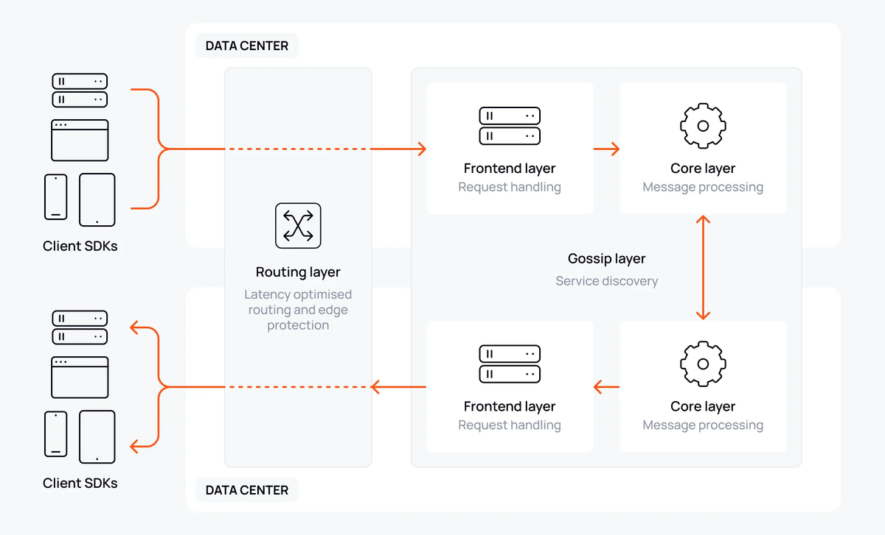

Ably Chat is purpose-built for task-oriented chat experiences, from 1:1 conversations to small group interactions that enhance specific activities and workflows.

> If you need to deliver seamless, contextual chat experiences that enhance tasks like support tickets, deliveries, gaming sessions, collaborative work, or transactional processes, without sacrificing performance, reliability, or costs, then Ably is the proven choice.

Building with Ably means that you no longer need to worry about managing websocket servers, handling failover, network disruptions, or keeping latency low. Ably handles all of this for you, leaving you free to focus on creating engaging task-oriented experiences.

This guide explains the architectural decisions, technical challenges, and unique benefits of building task-oriented chat experiences with Ably. It will help you design contextual, efficient chat solutions for scenarios like customer support, delivery tracking, gaming sessions, collaborative work, marketplace transactions, and more - all with performance, user experience, and cost optimization in mind.

## Why Ably for task-oriented chat?

Ably is trusted by organizations delivering chat to millions of users in realtime. Its platform is engineered around the four pillars of dependability:

* **[Performance](/docs/platform/architecture/performance):** Ultra-low latency messaging, even at global scale.
* **[Integrity](/docs/platform/architecture/message-ordering):** Guaranteed message ordering and delivery, with no duplicates or data loss.
* **[Reliability](/docs/platform/architecture/fault-tolerance):** 99.999% uptime SLA, with automatic failover and seamless re-connection.
* **[Availability](/docs/platform/architecture/edge-network):** Global edge infrastructure ensures users connect to the closest point for optimal experience.



Delivering chat messages in realtime is key to a smooth online experience. Ably's [serverless architecture](/docs/platform/architecture) eliminates the need for you to manage websocket servers. It automatically scales to handle millions of concurrent connections without provisioning or maintenance. Ably also handles all of the edge-cases around delivery, failover and scaling.

Despite the challenges of delivering these guarantees, Ably is designed to keep costs predictable.
You can choose between MAU-based or per-minute pricing, depending on your needs.
Both pricing models are designed to be cost-effective and scalable.
Features such as efficient connection management are available to help you reduce costs.

## Architecting your task-oriented chat: UX first, scale always

The most important decision when developing task-oriented chat is the experience you want users to have within their specific context. This will determine how chat integrates with your task flow and ultimately how effectively it enhances the user experience.

**What are task-oriented chats?** Any chat that serves as a companion to a specific activity or workflow: resolving a support ticket, coordinating a delivery, discussing a chess game, collaborating on a project, or facilitating a marketplace transaction. These chats are typically short-lived (minutes to days) and highly contextual. They can be 1:1 or small group conversations.

For large-scale chat scenarios with many users per room, see our [building livestream chat guide](/docs/guides/chat/build-livestream).

**Task-oriented room architecture:** The optimal approach is one chat room per task, where all participants join to communicate within that specific context. Rooms are:

* **Automatically scaled** - Ably handles any number of concurrent rooms without provisioning
* **History-enabled** - messages stored for 30 days by default (configurable up to a year on request)
* **Kept under control** - [capabilites](/docs/chat/setup#authentication) let you control who can join and the level of access to features and actions

Each room includes all task participants: customers and agents in support, buyers and sellers in marketplaces, players in games, team members in projects. Participants can join and leave as the task evolves. Access to message history and other features can be granted to all or select participants via capabilities.

### Pricing flexibility

Depending on the specifics of your platform, you can choose between per-minute or per-MAU pricing.

Note that one chat room is backed by a single Ably Pub/Sub channel. When the room is active, the channel is active.

With per-minute pricing, you will be charged per message and active room (active channel). This pricing model is ideal if you have a large number of users who might not be active for a long time. Things like deliveries, support tickets, and marketplace transactions are all good examples of this.

With MAU-based pricing you will only be charged for the number of unique active users in the month (and ovarage if you go over the message limits). This pricing model is ideal if your users are very active throughout the month. Collaboration tools and some gaming scenarios are good examples of this. Paying per MAU is typically more predictable than per-minute pricing. Another use case for MAU-based pricing is if you are a platform and you also charge per MAU, to keep costs in sync with your own pricing model.

## Message throughput and rate management

In task-oriented chat, each room is typically low throughput. Scaling comes by running as many rooms as you need at the same time. Ably handles everything from 1:1 conversations and small group discussions to [livestream chats](/docs/guides/chat/build-livestream) with the same reliability and scalability guarantees.

Chat rooms scale horizontally. Ably allows you to have as many rooms as you need running in parallel.

* **Proven at scale:** Ably delivers over 500 million messages per day for customers.
* **Rate limiting:** Prevent spam and maintain conversation quality with global or per-user throttling appropriate for your use case.

## Authentication

Authentication is a design decision. 

In some cases, you'll want to tie participants to their identity in your application.
In others, anyone can join and participate.
Ably Chat supports both of these scenarios - you don't need to go through the hassle of setting up
users in Ably and trying to keep them in sync with your application. Every client has a `clientId`.
If you want to allow random users, just use a random string. If you want to tie it to your application,
then use the ID of the user or some other well-known identifier. Just make sure you can tell them apart if
you allow both at the same time, for example by using distinct prefixes.

<Code>
```javascript
const jwt = require("jsonwebtoken");

const header = {
    "typ": "JWT",
    "alg": "HS256",
    "kid": "{{ API_KEY_NAME }}"
}
const currentTime = Math.round(Date.now() / 1000);

// The clientID could be the users ID in your application,
// or a random string if you want to make users anonymous.
//
// The capabilities here allow the holder of this token to publish and subscribe to messages,
// typing indicators and room reactions in the chat room called "foo".

const claims = {
    "iat": currentTime, /* current time in seconds */
    "exp": currentTime + 14400, /* time of expiration in seconds */
    "x-ably-capability": "{\"foo\":[\"publish\", \"subscribe\"]}",
    "x-ably-clientId": "your-client-id",
}

ablyJwt = jwt.sign(
    claims,
    "{{ API_KEY_SECRET }}",
    { header: header }
)

console.log('JWT is: ' + ablyJwt);
```
</Code>

How you authenticate is also key. To balance security and experience, you want short-lived tokens that can be easily revoked if a user is misbehaving or needs their permissions changed, but automatically expire after a period of time. This means that if a token is compromised, it will only be valid for a limited time. **In production apps, you should not use API keys for client-side authentication**. You can use them server-side, but as they are long-lived and require explicit revocation, exposure to untrusted users poses a continuing risk.

With Ably Chat, authentication is best achieved using JSON Web Tokens (JWTs). These are tied to a particular clientID and come with a set of [capabilities](/docs/chat/setup#authentication) that control what a client can and cannot do - for example whether they can send messages, join a certain room or moderate. Ably's SDKs handle the timing and process of requesting a new token for you, refreshing it when it expires. All you need to do is provide a server-side endpoint that can generate the JWT for the client. This enables clients to use your existing authentication systems or user sessions to generate their Ably token.

## Presence: Know who's available for your task

Ably's [presence](/docs/chat/rooms/presence) feature shows you who's currently active in your task-oriented chat. This is especially valuable for scenarios where task completion depends on participant availability:

* **Support tickets:** See when agents are online and available to help.
* **Deliveries:** Know if the delivery driver or customer is actively monitoring the chat.
* **Gaming sessions:** See which players are currently active in the game.
* **Collaborative work:** Know who's available for real-time discussion.

Beyond just online/offline status, presence can include rich information:

* **Current status:** "Available", "In a meeting", "Driving", "On break".
* **Task context:** "Working on ticket #123", "In delivery zone A".
* **User info:** Use presence to show an avatar, display name, role, or other information about the user.

This contextual presence information helps participants understand not just who's online, but who's ready and able to engage with the current task.

## Typing indicators

Typing indicators are now a common feature in most chat applications. They show when someone is actively composing a message, helping to:

* **Manage expectations:** Users know when a response is being prepared.
* **Reduce duplicate messages:** See that someone is already addressing the question.
* **Improve flow:** Better conversation pacing in support and collaborative scenarios.

In Ably Chat typing indicators are a core feature with a simple API:

```javascript
const room = await chatClient.rooms.get('support-ticket-123');

// show who's typing
room.typing.subscribe((event) => {
  console.log('Currently typing:', event.currentlyTyping);
});

// show a typing indicator (call on every keystroke, Ably Chat SDKs throttle this to a predefined interval)
await room.typing.keystroke();

// stop the typing indicator (for example when a message is sent)
await room.typing.stop();
```

## Message reactions

Message reactions are a great way to enhance engagement in a task-oriented chat and enable users to quickly express sentiment to key points in the conversation.

**Message reactions** provide granular feedback on specific content:

* **Validate information:** ✅ for confirmed details in deliveries or transactions.
* **Request clarification:** ❓ for questions about specific messages.
* **Show appreciation:** ⭐ for helpful responses in support.

Send a message reaction:
<Code>
```javascript
const message; // your message
await room.messages.reactions.send(message.serial, {name: '✅'});
```
</Code>

Message reactions in Ably Chat come in three types: `unique`, `distinct` and `multiple`, to suit different use cases: from one reaction per message to multiple reactions per message with or without counts. See the [Message reactions](/docs/chat/rooms/message-reactions) documentation for more details.

## Message history: essential task context <a id="history"/>

Message history is crucial for task-oriented chats, ensuring continuity and context even when participants join mid-task or return after interruptions.

Ably stores [chat history](/docs/chat/rooms/history) for 30 days by default, with options to extend up to a year.

* **Task continuity:** New participants can quickly understand the current state and previous decisions.
* **Context preservation:** Users returning to a task don't lose important information.
* **Audit trail:** Complete conversation records for compliance, training, or dispute resolution.

For task-oriented scenarios, history is almost always beneficial:

* **Support tickets:** Agents can see the full conversation history to understand the issue, after handover from automated/AI support or another agent.
* **Collaborative work:** Team members can catch up on decisions and progress.
* **Gaming sessions:** Players can review moves and strategy discussions.
* **Marketplace transactions:** Complete communication record for orders and deliveries.

<Code>
```javascript
// Get the chat room
const room = await chatClient.rooms.get('support-ticket-123');

// Subscribe to messages
const subscription = room.messages.subscribe((messageEvent) => {
  console.log('Received:', messageEvent);
  // handle message event to update state and UI
});

// Load recent history for context
// This ensures you get a complete picture without missing messages
await subscription.historyBeforeSubscription({limit: 50});
```
</Code>

You can use our [React UI Kit](/docs/chat/react-ui-kit) to easily create a [fully featured chat window](/docs/chat/getting-started/react-ui-kit#chat-window) 
that handles subscrbing to messages, loading history, message updates and deletes, message reactions, and more.
See the [React UI Kit](/docs/chat/react-ui-kit) for more details.

## Enriching tasks with Ably's realtime services

Ably's comprehensive platform enables you to combine chat with other realtime features to create rich, interactive task experiences.

**Pub/Sub channels** add interactive elements:
- **Live polls:** Quick feedback during collaborative decisions
- **Status updates:** Real-time progress indicators for tasks
- **Interactive ratings:** Instant feedback collection
- **Live auctions:** Real-time bidding in marketplace scenarios

These combined services transform basic chat into comprehensive task management platforms, where communication, coordination, and real-time updates work together seamlessly.

## Moderation: maintaining quality conversations

Effective moderation ensures your task-oriented chats remain professional, safe, and productive. While task-oriented chats typically involve fewer participants than livestreams, maintaining conversation quality is crucial for successful task completion and keeping your users safe.

Ably supports [moderating messages](/docs/chat/moderation) both before and after publication, making it easy to integrate with AI-powered or human moderation systems.

* **After-publish moderation:** Messages appear instantly, then are removed if flagged as inappropriate. Best for most task-oriented scenarios where immediacy matters.
* **Before-publish moderation:** Messages are held until approved. Use this for high-stakes tasks where every message must be vetted.

### Key moderation considerations for task-oriented chat

1. **Platform standards**
   * What level of moderation is appropriate for your audience?
   * How will you handle different types of content? For example:
     * **Hate speech and harassment:** Detecting discriminatory language, threats, or targeted abuse.
     * **Discrimination:** Detecting discriminatory language, threats, or targeted abuse.
     * **Inappropriate content:** Flagging adult content, violence, or graphic material.
     * **Toxicity:** Measuring overall message sentiment and hostility


2. **Technical integration**
   * **Latency impact:** AI moderation adds up to 100ms to message delivery.
   * **Integration options:** Choose from pre-built integrations or connect your existing moderation systems via webhooks, serverless functions, or queues

3. **Task-specific approaches**
   * **Customer support:** Protect both customers and agents from abuse and harassment.
   * **Gaming:** Prevent harassment while allowing enthusiastic expressions.
   * **Marketplace:** Ensure rules are being followed such as detecting if outside-platform contact info is exchanged.

### How Ably enhances task-oriented moderation

Ably's flexible moderation system adapts to your task requirements:

* **Per-room policies:** Different moderation rules for different task types or user roles
* **Fallback handling:** Configure what happens when moderation services are unavailable
* **Custom integration:** Connect your existing moderation infrastructure via webhooks, serverless functions, or message queues
* **Role-based permissions:** Give moderators special capabilities to manage conversations

<Code>
```javascript
import { ErrorCode } from '@ably/chat';

const room = await chatClient.rooms.get('support-ticket-123');

room.messages.send({text: 'Can you help me with my order?'}).then((message) => {
    console.log('Message sent:', message);
}).catch((error) => {
    if (error.code === ErrorCode.MessageRejectedByModeration) {
        console.log('Message rejected by moderation:', error.message);
        return;
    }
    console.error('Message failed to send:', error);
});
```
</Code>

## Room reactions

Room reactions are a great engagement feature for chats that accompany calls, meetings, collaborative tools, and games. They are a way to quickly express a sentiment to the entire room at a point in time without adding to chat history or being tired to a message.

<Code>
```javascript
// Subscribe to room reactions
room.reactions.subscribe((event) => {
  console.log('Room reaction received:', event.reaction.name, "from", event.reaction.clientId);
});

// Send a room reaction
await room.reactions.send({name: '👍'});
```
</Code>

## Handling network disruption

Network disruption happens - mobile internet loses signal or someone drives through a tunnel. All of Ably's SDKs are designed with this in mind, so that you don't have to handle complicated reconnection logic.

Every SDK instance keeps track of where it's at in the message stream. If the connection is lost, the library will 
[automatically attempt to reconnect](/docs/platform/architecture/connection-recovery) to the servers and in
doing so, resume its position in the stream. This enables the chat to continue as if the user never left.
After extended periods of disconnection, the client can make use of [history](#history) to backfill missing messages.

It's incredibly rare, but sometimes a client might lose connection to a particular data center. Ably operates in multiple data centers around
the world with multiple fallback regions available. If a client can't reach the nearest data center, it will try the next one until the
connection is re-established, ensuring minimal downtime and that network issues don't disrupt the experience that you are trying to build.
Ably's [fault tolerance guide](/docs/platform/architecture/fault-tolerance) describes how we do this and that, even if an entire region
goes down, it has little-to-no impact on the global service and your application.

## Priced for task-oriented efficiency

Task-oriented chats are typically short-lived but can be numerous, making efficient pricing crucial for cost management.

**Consumption-based pricing** is ideal for most task-oriented scenarios:

* **Pay per message/minute:** Only pay for actual engagement, perfect for sporadic task conversations
* **Volume discounts:** Lower rates as your usage scales across all your tasks
* **No user-based fees:** You're not charged for users who join briefly or tasks that end quickly

**MAU-based pricing** works well when you have:

* **Consistent task volume:** Regular support tickets, frequent deliveries, or ongoing collaborative work
* **Predictable user engagement:** Teams or customers who regularly participate in tasks
* **Longer-term task relationships:** Ongoing gaming communities or service subscriptions

For example:
- **Support platforms:** Often benefit from consumption pricing due to variable ticket volume
- **Delivery services:** MAU pricing if you have consistent delivery personnel and customers
- **Gaming platforms:** Consumption pricing for casual games, MAU for subscription-based gaming

A full breakdown of pricing options, including a cost estimator tailored to your task-oriented scenario, can be found on the [pricing page](/pricing).

### Aggressive connection management

When a client abruptly disconnects from Ably, there is a 2 minute delay before the connection is cleaned up on the server, to enable the client to resume the connection from where it left off. When you're finished with an Ably connection, be sure to call the `close()` method to gracefully shut down the connection.

All Ably SDKs also perform "heartbeats" with the server to enable detection of dropped or disrupted connections. The default interval for this is 15 seconds. By adjusting the heartbeat interval, you can control how quickly a connection is deemed to have dropped and therefore reduce the amount of time connections remain open for.

<Code>
```javascript
import * as Ably from 'ably';

const realtimeClient = new Ably.Realtime({
   // Other options omitted for brevity
   transportParams: { heartbeatInterval: 5000 }
})
```
</Code>

## Push notifications

Ably Pub/Sub channels can be used for push notifications. See the [Push notifications](/docs/push/publish) documentation for more details. Since Ably Chat rooms are backed by a single Ably Pub/Sub channel, you can use the same channel for push notifications to notify all participants in the room when something happens.

You can also use a separate channel to control notifications, in which case you can tailor them to individual users. Read more about push notifications with Ably in the [Push notifications](/docs/push/publish) documentation.

## Production-ready checklist

Before you go live with your task-oriented chat, review these key points:

* **Authentication strategy:** Ensure you're using token authentication for all client-side communication with appropriate JWT expiration times for your task duration.
* **Permission model:** Apply the principle of least privilege - participants should only have access to their specific task rooms and relevant capabilities.
* **Performance tuning:** Validate your message rate and batching configuration based on your typical task conversation patterns.
* **Monitoring setup:** Monitor task room activity, message delivery success rates, and connection stability across your user base.
* **Scale planning:** Confirm you are on the right Ably package for your expected task volume and user concurrency.
* **Error handling:** Implement proper error handling for network disruptions and ensure graceful degradation when tasks are interrupted.
* **Data retention:** Verify your message history retention policy aligns with your task lifecycle and any compliance requirements.
* **Integration testing:** Test all third-party integrations (AI services, moderation, external APIs) under realistic task scenarios.

## Next steps

* **Explore Ably Chat:** Dive into the [Ably Chat documentation](/docs/chat) for comprehensive API details and advanced features.
* **Try the examples:** Play around with [task-oriented chat examples](/examples?product=chat) to see real implementations.
* **Get started quickly:** Follow the [JavaScript/TypeScript](/docs/chat/getting-started/javascript) or [React](/docs/chat/getting-started/react) getting started guides.
* **Add intelligence:** Learn how to integrate [AI assistance](/docs/platform/integrations) for smarter task experiences.
* **Secure your chats:** Understand [token authentication](/docs/auth/token#jwt) for production-ready security.
* **Moderate effectively:** Implement [chat moderation](/docs/chat/moderation) tailored to your task scenarios.
* **Scale with confidence:** Explore [server-side batching](/docs/messages/batch#server-side) for optimal performance.
* **Combine services:** Learn how to integrate [Ably's broader platform](/docs/platform) for rich task experiences.
