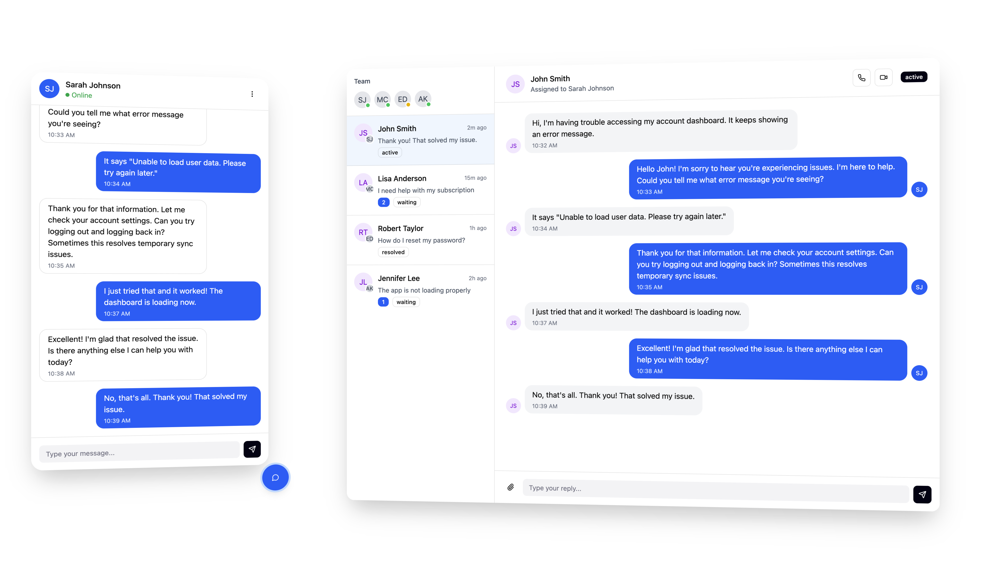

Building support chat is unlike other chat applications. There are two distinct interfaces to consider in a support chat system: the customer-facing widget and the agent dashboard. The customer-facing widget requires reliable messaging, presence detection, typing indicators, and seamless reconnection. Ably Chat handles all of these challenges for you. The agent dashboard presents a different class of complexity: managing multiple concurrent conversations, discovering new tickets in realtime, coordinating between agents. For both, integrating automation and AI is key to reducing the workload on agents and improving the customer experience.

This guide covers both sides of a support chat system with Ably, with particular attention to the architectural patterns that make agent dashboards work at scale.

<div class="mb-6">

</div>

## Why Ably for support chat? <a id="why-ably"/>

Ably is trusted by organizations delivering chat to millions of users in realtime. The Ably platform is engineered around the four pillars of dependability:

* **[Performance](/docs/platform/architecture/performance):** Ultra-low latency messaging ensures customers and agents communicate without delay.
* **[Integrity](/docs/platform/architecture/message-ordering):** Guaranteed message ordering and delivery means no messages are lost or duplicated.
* **[Reliability](/docs/platform/architecture/fault-tolerance):** 99.999% uptime SLA with automatic failover keeps your support running.
* **[Availability](/docs/platform/architecture/edge-network):** Global edge infrastructure ensures optimal experience for customers and agents worldwide.


### Scaling support chat <a id="scaling-support-chat"/>

Support chat has unique scaling requirements. You might have thousands of concurrent tickets, each with its own chat room, while each agent handles multiple tickets simultaneously. Ably's architecture scales automatically to handle this load without provisioning or re-engineering as you grow.

Delivering chat messages in realtime is key to a smooth online experience. Ably's [serverless architecture](/docs/platform/architecture) eliminates the need for you to manage websocket servers. It automatically scales to handle millions of concurrent connections without provisioning or maintenance. Ably routinely handles 600 billion messages every month globally, across 2 billion devices with a global median [latency](/docs/platform/architecture/latency#message-delivery-latency) of 37ms. Ably also handles all of the edge-cases around delivery, failover and scaling.

Ably uses [consistent hashing](/docs/platform/architecture/platform-scalability) to evenly distribute the management of chat rooms across instances, enabling the number of rooms to grow without limit and without causing load spikes. Whether you're managing 100 support chat rooms or 100,000 simultaneous chat rooms, the architecture remains the same.

### Seamless network disruption handling <a id="seamless-network-disruption-handling"/>

Network disruption happens - mobile internet loses signal or someone drives through a tunnel. All of Ably's SDKs are designed with this in mind, so that you don't have to handle complicated reconnection logic.

If the connection is lost, the Ably SDK libraries [automatically attempt to reconnect](/docs/platform/architecture/connection-recovery) to the servers and resume the position in the message stream. This enables the chat to continue as if the user never left. After extended periods of disconnection, you receive a [discontinuity event](/docs/connect/states#discontinuity), after which the client can use [history](#history) to backfill missing messages.

It's rare, but sometimes a client might lose connection to a particular data center. Ably operates in multiple data centers around the world with multiple fallback regions available. If a client can't reach the nearest data center, it tries the next one until the connection is re-established, ensuring minimal downtime. Ably's [fault tolerance guide](/docs/platform/architecture/fault-tolerance) describes how this works and shows that even if an entire region goes down, it has little-to-no impact on the global service and your application.

## Architecture overview <a id="architecture-overview"/>

A support chat system has a straightforward core architecture: **one room per ticket**. The key decisions involve the flow of support tickets through the system and the customer and agent experience:

* How do customers open a new ticket?
* How much context is collected before opening a ticket?
* What automations are in place? Is there an AI or LLM in the loop? If yes, how does a ticket get escalated for human support?
* Can tickets be reopened once closed?
* How are chats for tickets archived for long-term storage?
* How are tickets assigned to human agents?

**Understanding room and ticket lifecycle:** Ably Chat rooms don't require explicit creation or deletion. When a client attaches to a room, it becomes active. When all clients detach, it becomes inactive. Message history persists regardless of room activity. This means you must manage ticket lifecycle (open, in progress, resolved, closed) in your own system. Your database tracks ticket status, and the room serves as the communication channel for that ticket.

A typical support chat system follows this flow:

1. Customer opens the support page or widget.
2. If not logged in, the customer provides basic contact information.
3. The chat UI loads and prompts the customer for their initial message. After they send it, the ticket is created.
4. Agents or bots receive notification of the new ticket and join the ticket's chat room.
5. The ticket is resolved or escalated to another agent (for example, from an LLM to a human).

### Pub/Sub channels and Chat rooms <a id="channels-and-rooms"/>

Ably Chat handles the messaging experience within a ticket, powered by a single chat room, while Ably Pub/Sub coordinates system-wide events like new ticket notifications and agent routing. Use both to build a complete support chat system. The high-level architecture is as follows:

- Use a dedicated chat room for each ticket, for example `support-chat:ticket-342`.
- Use one or more Pub/Sub channels to notify agents of new tickets and chats requiring attention:
  - One channel for the whole system: `support:inbox`.
  - One channel per team or department: `support:sales`.
  - One channel per agent: `support:agent:123`.
- For agent coordination:
  - Create a dedicated chat room for agents across the whole system, team, or department.
  - Use presence in this chat room to share agent availability and workload with the rest of the team.

### Build quickly: Chat React UI Kit <a id="react-ui-kit"/>

If you use React, the [Chat React UI Kit](/docs/chat/react-ui-kit) provides ready-made components for building chat interfaces. It is a great fit for building both the customer-facing chat widget and the agent dashboard, or just one of them.

Drop in the [App](/docs/chat/react-ui-kit/components#app) component to see a working chat UI within minutes, or use individual components like [ChatWindow](/docs/chat/react-ui-kit/components#chat-window), [ChatMessageList](/docs/chat/react-ui-kit/components#chat-message-list), [MessageInput](/docs/chat/react-ui-kit/components#message-input), and [ParticipantList](/docs/chat/react-ui-kit/components#participant-list) to build custom interfaces.

Components handle message display with history loading, editing and deletion, reactions, typing indicators, and presence. [Providers](/docs/chat/react-ui-kit/providers) manage themes, avatars, and chat settings. See the [getting started guide](/docs/chat/getting-started/react-ui-kit) for setup details.

## Customer-facing chat widget <a id="customer-widget"/>

Building a polished chat widget requires handling message delivery guarantees, reconnection logic, presence synchronization, and typing indicators. Ably Chat abstracts away these challenges, so you can focus on the user experience rather than the infrastructure. Customers interact with one room at a time, typically through an embedded widget.

### Designing ticket flow <a id="ticket-flow"/>

How tickets begin and progress through your system affects customer experience, agent efficiency, and operational costs.

**Opening a new ticket:** When a customer initiates support, you need to connect them to a chat room and track the ticket in your system. The room name typically encodes the relationship—for example, `support:ticket-123`—making it straightforward to look up context. Your server generates this room name when creating the ticket, returns it along with an authentication token, and the customer attaches to that room.

You can add a pre-chat flow to collect information before connecting to the room. For example, asking for name, email, and initial message helps with routing and context. The trade-off is friction: more steps before the customer can chat means some will abandon the process, but agents get better context and routing can be smarter.

**Authenticated vs. anonymous customers:** For logged-in users, tie the `clientId` to their user ID for seamless context. For anonymous visitors, generate a random identifier with a clear prefix (for example, `anon:abc123`). This distinction matters for routing, analytics, and whether you can pull in account context automatically.

**Handling returning customers:** Since message history persists in Ably Chat, customers can return to existing tickets and see the full chat history. When a customer returns to a ticket you've marked as resolved, you can reopen it in your system and notify agents again. The room is already there with all history intact—your ticket management logic decides what happens.

After the chat has started, you can provide a rich chat experience with the Ably Chat SDK. It requires minimal setup and provides a comprehensive set of features out of the box. See the [embedded chat guide](/docs/guides/chat/build-embedded-chat) for implementation patterns.

### Authentication <a id="customer-authentication"/>

Customers need access only to their own support tickets, not to other customers' chat rooms. A room naming convention that encodes ownership makes this straightforward to enforce.

Name each support chat room uniquely by using the user ID as a prefix followed by the ticket ID. For example, `support:user-343:ticket-992`.

This approach allows you to grant permission for users to access all their own support tickets, even before they are created, making authentication and access control straightforward. Grant each customer a JWT with access to their own support tickets by using a capability resource specifier such as `support:user-343:*`.

Example capabilities for a customer:

<Code>
```json
{
    "support:user-343:*": [
        "publish",
        "subscribe",
        "presence"
    ]
}
```
</Code>

### Typing indicators <a id="typing-indicators"/>

[Typing indicators](/docs/chat/rooms/typing) are a common feature in most chat applications. They show when someone is actively composing a message, helping to:

* **Manage expectations:** Users know when a response is being prepared.
* **Reduce duplicate messages:** See that someone is already addressing the question.
* **Improve flow:** Better chat pacing.

In Ably Chat typing indicators are a core feature with a simple API:

<Code>
```javascript
const room = await chatClient.rooms.get('support-ticket-123');

// show who's typing
room.typing.subscribe((event) => {
  console.log('Currently typing:', event.currentlyTyping);
});

// attach the room
await room.attach();

// show a typing indicator (call on every keystroke, Ably Chat SDKs throttle this to a predefined interval)
await room.typing.keystroke();

// stop the typing indicator (for example when a message is sent)
await room.typing.stop();
```
</Code>

### Message reactions <a id="message-reactions"/>

Message reactions are a ubiquitous feature in modern chat experiences and are a great way to enhance engagement and enable users to quickly express sentiment to key points in the chat.

Send a message reaction:

<Code>
```javascript
const message; // your message
await room.messages.reactions.send(message.serial, {name: '👍'});
```
</Code>

Message reactions in Ably Chat come in three types: `unique`, `distinct`, and `multiple`, to suit different use cases: from one reaction per message to multiple reactions per message with or without counts. See the [Message reactions](/docs/chat/rooms/message-reactions) documentation for more details.

### Message history <a id="history"/>

Message history is crucial for chat, ensuring continuity and context even when participants join mid-chat or return after interruptions.

Ably stores [chat history](/docs/chat/rooms/history) for 30 days by default, with options to extend up to a year on request.

Message history provides users with:

* **Ticket continuity:** New participants can quickly understand the current state and previous decisions, preventing repeated questions and ensuring a seamless support experience.
* **Context preservation:** Users returning to a ticket don't lose important information.
* **Audit trail:** Complete chat records for compliance, training, or dispute resolution.

<Code>
```javascript
// Get the chat room
const room = await chatClient.rooms.get('support:ticket-123');

// Subscribe to messages
const subscription = room.messages.subscribe((messageEvent) => {
  console.log('Received:', messageEvent);
  // handle message event to update state and UI
});

// attach the room
await room.attach();

// Load recent history for context
// This ensures you get a complete picture without missing messages
let historyResponse = await subscription.historyBeforeSubscription({limit: 50});

// Iterate through all pages
while (true) {
  console.log('Messages: ', historyResponse.items);
  if (historyResponse.hasNext()) {
    historyResponse = await historyResponse.next();
  } else {
    break;
  }
}
```
</Code>

### Presence: see when agents and customers are online <a id="presence"/>

[Presence](/docs/chat/rooms/presence) shows who is currently active in the room, enabling you to bring more live context to your application. You can display in realtime when an agent joins the room, along with their status, such as "Available" or "Gathering context, will join shortly". You can also display to the agent if the customer is still active, and attach information about the customer.

Beyond online or offline status, presence can include rich information about the user, such as their name, avatar, role, and other details.

<Code>
```javascript
// subscribe to presence events
const { unsubscribe } = room.presence.subscribe((event) => {
  console.log(`${event.member.clientId} entered with data: ${event.member.data}`);

  const presentMembers = await room.presence.get();
  console.log('Present members:', presentMembers);
});

// attach the room
await room.attach();

// join presence
await room.presence.enter({ status: 'available' });

// change presence data
await room.presence.update({ status: 'will be back shortly' });

// leave presence
await room.presence.leave();
```
</Code>
Presence can also be used to share data about the current user to the support agent, such as what page they are currently on, to assist them better with their query.

## Assigning tickets to agents

With the customer-facing widget handling message delivery and presence, the next challenge is connecting those conversations to agents. A key part of a support system is deciding how tickets reach the right agent at the right time. You can either do this on your server as tickets are created by tracking agent workload, or by broadcasting all tickets to all agents in a shared queue.

How do agents know about new tickets without being attached to every room?

The pattern is a dedicated Pub/Sub channel where your server publishes notifications when tickets need agent attention. Agents subscribe to this single channel to learn about all tickets requiring action, without attaching to each room individually. This approach scales efficiently because agents receive lightweight notifications rather than subscribing to every active room.

<Code>
```javascript
const channel = realtimeClient.channels.get('support:inbox');

// send new ticket info
channel.publish('new-ticket',{
    ticketId: "123",
    roomName: "support:ticket-123",
    summary: "Question about building support chat",
    customerName: "John Doe",
    customerId: "123",
});
```
</Code>

Your server publishes to this channel when:

- A new ticket is created and needs agent attention (after automation).
- A customer returns to an existing ticket.
- AI couldn't resolve and escalates to human.
- A human agent reassigned the ticket to another agent.

Each notification includes metadata: ticket ID, room name, and a summary. This information helps agents decide which tickets to pick up. When an agent selects a ticket, they attach to that specific room to start working.

Depending on how you assign tickets to agents, you may need to use a single channel for all tickets, or a separate channel for each agent, team, or department.

### Server-side ticket assignment

If you assign agents on your server, Ably can help you notify agents of new tickets and chats requiring attention. In this pattern, assign a Pub/Sub channel to each agent, for example `agent:inbox:<ID>`. The agent attaches to this channel when online.

When a new ticket is assigned to an agent, publish a message summarizing the ticket to the agent's inbox channel. Include the ticket ID, customer name, and a title or summary. The agent's dashboard or push notifications can display this information before the agent joins the chat room associated with the ticket.

<Code>
```javascript
const channel = realtimeClient.channels.get('agent:inbox:123');
channel.publish('new-ticket',{
    ticketId: "123",
    roomName: "support:ticket-123",
    summary: "Question about building support chat",
    customerName: "John Doe",
    customerId: "123",
});
```
</Code>

Depending on your requirements, you may choose to use more restrictive access control such that each agent can only see and join the tickets they are assigned to.

### Shared inbox queue

If you don't assign tickets to agents on the server, you can use a shared inbox channel, for example `support:inbox`. This Pub/Sub channel is subscribed to by all agents. When a new ticket is created, publish it to this channel:

<Code>
```javascript
const channel = realtimeClient.channels.get('support:inbox');
channel.publish('new-ticket',{
    ticketId: "123",
    roomName: "support:ticket-123",
    summary: "Question about building support chat",
    customerName: "John Doe",
    customerId: "123",
});
```
</Code>

Optionally you can enable [push notifications](/docs/push/publish#via-channels) on this channel to alert agents of new tickets even if they don't have the app or page open.

All agents receive this message and display the new ticket with a summary, without attaching to the chat room.

When an agent starts working on a ticket, save the assignment in your system and publish a message on the inbox channel to remove the ticket from the queue. If the ticket needs to be reassigned, publish another message to the inbox channel to add it back to the queue.

<Code>
```javascript
const channel = realtimeClient.channels.get('support:inbox');

// publish the fact that a ticket was assigned
channel.publish('ticket-assigned',{
    ticketId: "123",
    roomName: "support:ticket-123",
});
```
</Code>

When the agents dashboard receives this message, it removes the ticket from the inbox if it was displayed. Your server remains responsible for conflict resolution if multiple agents try to work on the same ticket. You can create an endpoint that handles assignment where only the first agent to claim a ticket succeeds. Ably provides the realtime updates after tickets have been assigned.

### Team or department inbox

Instead of using a channel per agent, use a channel per team or department, for example `support:sales` or `support:engineering`. Follow the same pattern as the server-side ticket assignment to decide which channel to use for each ticket, then apply the shared inbox queue pattern for tickets that reach a team or department.

This hybrid approach works well for organizations with specialized teams: route tickets to the appropriate department first, then let agents within that team claim them from the shared queue.

## Agent dashboard <a id="agent-dashboard"/>

The agent dashboard is where support chat demands careful architectural thinking. Agents need to see and respond to multiple tickets, know when new tickets need attention, coordinate with other agents, and access context and AI assistance.

Ably's architecture supports this complexity without requiring you to manage connection pooling, message routing, or server infrastructure. Agents can work efficiently across many tickets while Ably handles the realtime communication layer.

### Multi-room management <a id="multi-room"/>

Agents handle multiple tickets, but attaching to many chat rooms simultaneously isn't practical. The pattern is to attach only to chat rooms the agent is currently viewing or working on, and detach when switching away.

Each attachment maintains a subscription with new messages, typing indicators, and presence updates. Keeping attachments focused reduces client-side memory, network traffic, and cost. Attach to rooms when agents start working on the relevant ticket and detach when the ticket is resolved, paused, or reassigned.

### Agent presence and availability <a id="agent-presence"/>

Agents need to signal their status and availability with other agents, for the whole application or their team. This is separate to the presence information displayed to customers. We call this app-wide presence, even though it can be scoped to a team or department.

**App-wide presence** uses a dedicated channel (for example, `support:agents`, or `support:agents-sales`) where agents enter presence when they sign in and update their status (available, busy, away) and current workload. Other agents and routing systems can see who is online and available.

This is different to the **room-level presence** which connects the agent to individual chat rooms and customers. When an agent opens a ticket room, they enter presence with their role and name, providing reassurance that help has arrived. Agents can also see if customers are still active.

### Push notifications for agents <a id="push-notifications"/>

Agents aren't always watching the dashboard. You can use Ably to send [push notifications](/docs/push) to alert agents of important events, such as:

- New tickets in their inbox.
- Mentions from other agents.
- Customer activity on tickets assigned to them.

## Adding AI to the loop

AI chatbots are revolutionizing the way we interact with digital platforms. Integrating an AI agent (such as an LLM) into your support chat flow can reduce the workload for your agents and provide faster responses to customers. AI can also help support agents be more effective by providing contextual information and suggested responses. Additionally, AI can help you analyze past chats for training, monitoring, and building knowledge bases.

Ably's flexible [integrations](/docs/chat/integrations) make it straightforward to connect your chat system with AI services. Through Ably's integrations, you can automatically route messages to:

* Serverless functions (AWS Lambda, Azure Functions, and others).
* Event streaming services including Kafka, SQS, and Pulsar.
* Webhooks and custom endpoints.
* An [Ably Queue](/docs/platform/integrations/queues).

### Example architecture for adding an LLM to your support chat

When a customer opens a new support request, your server:

1. Creates a new ticket.
2. Issues a JWT token for Ably Chat to give the customer access to the ticket's chat room.
3. An integration routes each message to an AI service, which responds:
   - Directly to the customer with a message by publishing it to the chat room.
   - Or escalates to a human agent with the full context of the chat by pushing the ticket to the agent's inbox channel.

You need to signal to the integrations when the ticket is no longer handled by AI. Keep a flag in your system that controls whether AI or a human agent handles the ticket. Always check this flag before calling an AI tool.

### Example architecture for aiding support agents with AI

Beyond handling customer conversations directly, AI can work alongside human agents to make them more effective. AI can assist agents in several ways:

- Drafting responses for agents.
- Searching for similar tickets and how they were resolved.
- Providing a list of common questions and answers relevant to the current chat.
- Providing a list of knowledge base articles.
- Summarizing the context of the ticket, such as previous tickets from this customer or recent purchase history.

Implement this client-side in the agent dashboard, where each message from the chat is passed to your backend or AI service as it arrives. The responses can be rendered in a sidebar where the agent can review, copy and paste, or read the information to help answer the customer's questions faster.


## Ticket resolution and archiving <a id="ticket-resolution"/>

Whether resolved by AI or a human agent, every ticket eventually reaches its conclusion. When a ticket is resolved, update its status in your system, optionally collect customer feedback, and export the chat history for long-term storage.

**Collecting feedback:** A straightforward approach is to send a feedback request message when the agent marks the ticket resolved. The customer responds with a rating (for example, emojis or stars), which your server captures and associates with the ticket.

**Exporting chat history:** Ably Chat excels at realtime messaging, but your support system likely needs features Ably doesn't provide: full-text search across all tickets, long-term storage spanning years, analytics, and compliance reporting. This means exporting chat history from Ably into your own systems.

The simplest export strategy for support is to fetch the complete message history when a ticket is closed:

1. Your ticket management logic marks a ticket as resolved.
2. This triggers an export: fetch all messages from the room using the Chat SDK's history API.
3. Store the messages in your archive system (database, object storage, or others).
4. Associate the archive with the ticket for future reference.

If the ticket is reopened and more messages are exchanged, re-export the full history when it closes again. The complete chat history is always available via Ably's history API.

For more sophisticated export patterns such as continuous ingestion and streaming, see the [exporting chat data guide](/docs/guides/chat/export-chat).

## Production-ready checklist

The patterns in this guide handle the core architecture. Before you go live with your support chat, review these key points to ensure your implementation is production-ready:

* **Authentication strategy:** Ensure you're using token authentication for all client-side communication with appropriate capabilities for each participant. Make sure capabilities are configured correctly for each type of participant (agents and customers).
* **Scale planning:** Confirm you are on the right Ably package for your expected volume of concurrent tickets.
* **Error handling:** Implement proper error handling for network disruptions and ensure graceful degradation.
* **Data retention:** Verify your message history retention policy aligns with your compliance requirements.
* **Export strategy:** Set up a process for archiving closed tickets to your long-term storage.
* **AI integrations:** Ensure AI integrations are configured correctly and are ready to handle the expected volume of messages.
* **Push notifications:** Test push notifications in all scenarios and all supported platforms.


## Next steps

* **Explore Ably Chat:** Dive into the [Ably Chat documentation](/docs/chat) for comprehensive API details and advanced features.
* **Try the examples:** Play around with [chat examples](/examples?product=chat) to see real implementations.
* **Get started quickly:** Follow the [React UI Kit](/docs/chat/getting-started/react-ui-kit), [JavaScript/TypeScript](/docs/chat/getting-started/javascript), or [React](/docs/chat/getting-started/react) getting started guides. On mobile? Check out our [Swift](/docs/chat/getting-started/swift) and [Kotlin](/docs/chat/getting-started/android) getting started guides.
* **Add intelligence:** Learn how to integrate [AI assistance](/docs/chat/integrations) for smarter support experiences.
* **Secure your chats:** Understand [token authentication](/docs/auth/token#jwt) for production-ready security.
* **Export chat data:** Implement [chat data export](/docs/guides/chat/export-chat) for compliance and analytics.
* **Build embedded chat:** See the [embedded chat guide](/docs/guides/chat/build-embedded-chat) for additional implementation patterns.
