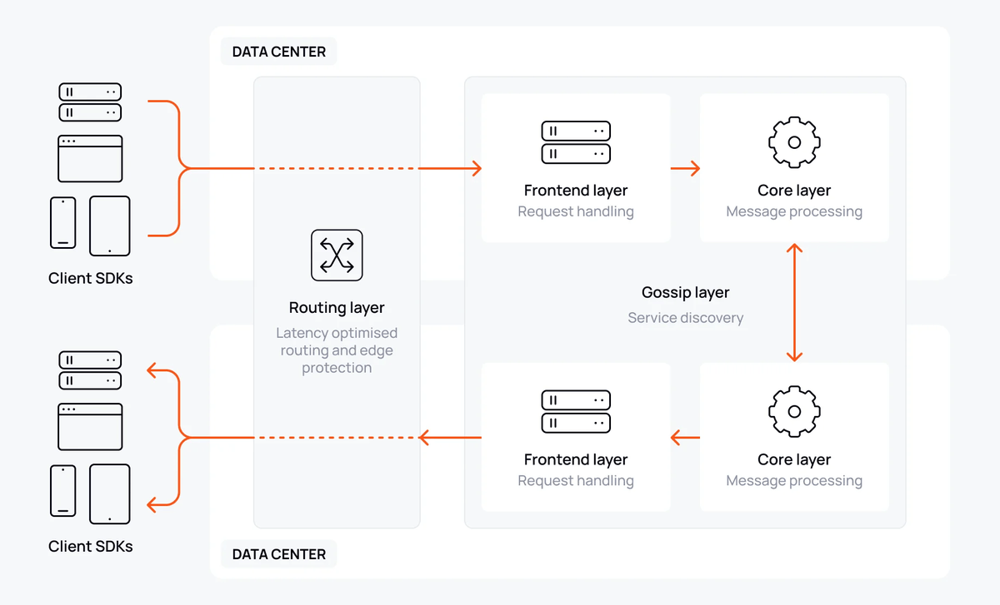

Ably provides the infrastructure to build a robust, scalable notification center that can handle everything from individual user notifications to system-wide broadcasts. Whether you're building friend requests for a social platform, order updates for e-commerce, or alerts for a gaming application, Ably's platform enables you to deliver notifications reliably at any scale.

Building with Ably means you can focus on your application logic while Ably handles the complexities of realtime delivery, connection management, and global distribution. This guide explains how to architect a notification center using the inbox pattern, with a focus on security, scalability, and cost optimization.

## Why Ably for notification centers?

Ably is trusted by organizations delivering notifications to millions of users in realtime. Its platform is engineered around the four pillars of dependability:

* **[Performance](/docs/platform/architecture/performance):** Ultra-low latency messaging ensures notifications reach users instantly, even at global scale.
* **[Integrity](/docs/platform/architecture/message-ordering):** Guaranteed message ordering and delivery, with no duplicates or data loss.
* **[Reliability](/docs/platform/architecture/fault-tolerance):** 99.999% uptime SLA, with automatic failover and seamless re-connection.
* **[Availability](/docs/platform/architecture/edge-network):** Global edge infrastructure ensures users connect to the closest point for optimal experience.



Delivering notifications in realtime is critical for user engagement. Ably's [serverless architecture](/docs/platform/architecture) eliminates the need to manage websocket servers. It automatically scales to handle millions of concurrent connections without provisioning or maintenance, while handling all edge-cases around delivery, failover, and scaling.

For notifications that need to reach users even when they're offline, Ably integrates seamlessly with push notification services like [Apple Push Notification Service](https://developer.apple.com/notifications/) (APNS), [Firebase Cloud Messaging](https://firebase.google.com/docs/cloud-messaging) (FCM)] and [web push](https://developer.mozilla.org/en-US/docs/Web/API/Push_API), ensuring your users never miss important updates.

## Architecting your notification center

The inbox pattern is a proven architecture for building scalable notification systems. It provides clear separation of concerns, secure authentication, and flexible processing workflows.

### The pattern

The architecture consists of three main components:

* **Notification trigger:** Notifications can originate from various sources - frontend clients sending requests (like friend requests), backend systems or jobs (like game events or scheduled alerts), or event-driven processes. These are sent to your backend for processing.
* **Backend processing:** Your backend receives the trigger, validates it, applies business logic, determines the target recipients, and publishes notifications to Ably.
* **Inbox channels:** Notifications are published to client-specific inbox channels (e.g., `inbox:clientId`), where recipients are subscribed to receive realtime updates.

### Key benefits

This pattern provides several advantages:

* **Security:** Clients only have subscribe access to their own inbox channels. All notification publishing flows through your backend, ensuring complete control over validation and authorization.
* **Flexibility:** Your backend can implement any business logic - validation, rate limiting, enrichment, filtering, or integration with other services before publishing to Ably.
* **Scalability:** Each component scales independently. Ably handles the inbox channels and realtime delivery, while your backend scales based on request load.
* **Auditability:** All notification requests pass through your backend, enabling logging, analytics, and compliance tracking.

### Channel structure

When designing your notification center, use the following channel structure:

* Each client has their own inbox channel following the pattern `notifications:inbox:clientId`. Your backend publishes notifications to the specific client's inbox channel.
* A shared channel like `notifications:inbox:general` can be used for system-wide notifications that should reach all clients.

Inboxes are client-specific, one per client. The general channel is optional and used for notifications that should reach all clients.

### Handling broadcasts

For notifications that need to reach all clients, you have two architectural options:

**Option 1: Individual inboxes**
Iterate through the list of target clients and publish to each clients's inbox channel individually. Ably's [batch publish REST endpoint](/docs/api/rest-api#batch-publish) makes this efficient, allowing you to publish to multiple channels in a single HTTP request.

**Option 2: General broadcast channel**
Create a shared channel where all clients subscribe.
Notifications published to this channel reach all subscribers.

The decision comes down to cost and frequency:

* **Individual inboxes:** are best when broadcast notifications are infrequent. You pay per message published and per user receiving it.
* **General channel:** is best when broadcast notifications are frequent. You pay per channel attachment per minute, but save on message costs since you publish once regardless of the number of subscribers.

See the [cost optimization section](#cost-optimization) for detailed calculations to help you decide.

## Authentication: Securing your notification center

Authentication is critical in a notification center. You need to ensure that clients can only receive notifications intended for them and cannot access other users' notifications.

### Token-based authentication

Ably's [token authentication](/docs/auth/token) with JSON Web Tokens (JWT) provides the flexibility to implement fine-grained access control. Tokens are short-lived, can be easily revoked, and include [capabilities](/docs/auth/capabilities) that define what actions a client can perform.

For a notification center, clients typically need subscribe-only access to their specific inbox channel, plus optional access to a general broadcast channel.

### Creating a token

The following example shows how to generate a JWT that grants subscribe access to a specific inbox channel. It also includes the `clientId` to identify the client:

<Code>
```javascript
const jwt = require("jsonwebtoken");

const header = {
    "typ": "JWT",
    "alg": "HS256",
    "kid": "{{ API_KEY_NAME }}"
}

const currentTime = Math.round(Date.now() / 1000);

const claims = {
    "iat": currentTime,
    "exp": currentTime + 3600, // Token expires in 1 hour
    "x-ably-capability": JSON.stringify({
        "inbox:client123": ["subscribe", "history"], // Inbox subscribe + history access
        "inbox:general": ["subscribe"] // Optional: general broadcast channel
    }),
    "x-ably-clientId": "client123" // Identify the client
}

const token = jwt.sign(
    claims,
    "{{ API_KEY_SECRET }}",
    { header: header }
);

console.log('Inbox JWT:', token);
```
</Code>

**History capability:**
Including the `history` capability allows clients to retrieve notifications they might have missed while offline.
Message persistence must be enabled to use history - see [message history documentation](/docs/channels/history) for details.

### Best practices

* **Use short-lived tokens:** Set token expiry to 1-4 hours to limit exposure if a token is compromised. Ably's SDKs automatically handle token renewal.
* **Tie tokens to clientId:** Always include a `clientId` in your tokens to identify the client and enable auditing. You can also setup a rule to prevent anonymous connections.
* **Implement token refresh:** Use [`authUrl`](/docs/auth/token#auth-url) or [`authCallback`](/docs/auth/token#auth-callback) to automatically refresh expiring tokens.
* **Validate on the server:** Never trust client-provided data. Your backend should validate all notification request data before publishing to Ably.
* **Restrict channel access:** Use wildcard patterns in capabilities (like `inbox:*`) sparingly. Always scope tokens to the specific channels a client needs access to.

## Publishing notifications from your backend

Your backend is responsible for processing notification requests and publishing them to Ably inbox channels. Ably provides some methods for backends to publish notifications:

### REST API publishing

The simplest approach is to use Ably's [REST API](/docs/api/rest-api) directly from your backend. All Ably SDKs provide REST client libraries for various languages (JavaScript, Python, Go, Java, Ruby, and more).

#### Single channel publishing

<Code>
```javascript
const Ably = require('ably');

// Initialize REST client with your API key
const ably = new Ably.Rest({ key: process.env.ABLY_API_KEY });

// Publish a notification to a specific user's inbox
const inbox = ably.channels.get('inbox:user123');
await inbox.publish('notification', {
    type: 'friend-request',
    fromUserId: 'user456',
    fromUserName: 'Jane Doe',
    timestamp: Date.now()
});
```
</Code>

#### Batch publishing

For notifications targeting multiple recipients, use the [batch publish REST endpoint](/docs/api/rest-api#batch-publish) to publish to multiple channels in a single HTTP request, reducing latency and improving efficiency.

<Code>
```javascript
const Ably = require('ably');
const ably = new Ably.Rest({ key: process.env.ABLY_API_KEY });

// Publish to multiple inboxes at once
const specs = [
    {
        channel: 'inbox:user123',
        messages: [{ name: 'notification', data: { type: 'system-alert', message: 'Server maintenance scheduled' } }]
    },
    {
        channel: 'inbox:user456',
        messages: [{ name: 'notification', data: { type: 'system-alert', message: 'Server maintenance scheduled' } }]
    },
    // ... up to 100 channels per request
];

await ably.request('post', '/messages', null, specs, null);
```
</Code>

### Kafka Connector publishing

You can also publish directly from your existing Kafka infrastructure through [Ably's Kafka Connector](/docs/platform/integrations/kafka-connector). This allows your backend to produce messages to Kafka topics, which are then automatically published to Ably channels based on your [configured mappings](docs/platform/integrations/inbound/kafka-connector#mapping).

The Kafka Connector supports dynamic channel routing, allowing you to determine the target Ably channel based on Kafka message attributes like topic, partition, key, or custom headers.

#### Publishing via Kafka

Ably channels are very lightweight, and it would be typical to have one inbox channel per client. To route messages to the correct inbox channel, you can use the Kafka message key or headers to specify the target client ID.

For example, you could define a channel mapping such as `inbox:${key}` to route messages to the appropriate inbox based on the Kafka message key.

<Code>
```javascript
const { Kafka } = require('kafkajs');

const kafka = new Kafka({
    clientId: 'notification-service',
    brokers: ['kafka:9092']
});

const producer = kafka.producer();
await producer.connect();

// Publish notification - will be routed to inbox:client123
await producer.send({
    topic: 'notifications',
    messages: [{
        key: 'client123',
        value: JSON.stringify({
            type: 'friend-request',
            fromUserId: 'client123',
            fromUserName: 'Jane Doe',
            timestamp: Date.now()
        })
    }]
});
```
</Code>

### Choosing your publishing approach

The right approach depends on your infrastructure and ordering requirements.

#### REST API

Ably's Rest API is the simplest option and is recommended for most use cases. It's built into all Ably SDKs for ease of use and requires no additional infrastructure. Each publish is a synchronous HTTP request, and multiple requests can be batched together to reduce API calls.

When using the REST API, and making concurrent publish requests, ordering is not guaranteed. If you're publishing via the batch publish endpoint, messages within a single batch maintain order, but batches themselves may be processed out of order. This is a consequence of HTTP's stateless nature and network variability.

To maintain ordering when using the REST API:
* Publish related notifications sequentially rather than concurrently.
* Use [idempotency keys](/docs/platform/architecture/idempotency) to prevent duplicate processing if retries occur.

#### Kafka Connector

Ably's kafka connector should be used when you have existing Kafka infrastructure and want to integrate this directly with Ably. The Kafka Connector preserves Kafka's ordering guarantees, so messages in the same Kafka partition are published to Ably in order.

* Use consistent partition keys (e.g., clientId) for related client notifications.
* Configure appropriate partition counts for your throughput needs.
* Messages published to the same channel from the same partition maintain order, but this requires some [configuration](https://github.com/ably/kafka-connect-ably?tab=readme-ov-file#message-ordering).

## Receiving notifications on the client

Clients subscribe to their inbox channels using Ably's realtime SDKs. When your backend publishes a message to a client's inbox channel, the client will receive it in realtime provided they are attached and subscribed to the channel.

Using the token-based authentication described earlier, clients can securely connect and subscribe to their permitted channels.

<Code>
```javascript
const ably = new Ably.Realtime({ authUrl: '/path/to/your/auth/api' });

// Subscribe to your personal inbox channel
const inbox = ably.channels.get('inbox:client123');
await inbox.subscribe((message) => {
    const notification = message.data;
    displayNotification(notification);
    }
});
```
</Code>

If you're using a general broadcast channel for system-wide notifications, clients can subscribe to it alongside their personal inbox.

<Code>
```javascript
// Subscribe to general broadcast channel
const general = ably.channels.get('inbox:general');
await general.subscribe((message) => {
    displaySystemNotification(message.data);
});
```
</Code>

Clients can subscribe to multiple channels simultaneously over a single connection, allowing them to receive both personal and broadcast notifications efficiently.

## Cost optimization <a id="cost-optimization"/>

Understanding the cost implications of different architectural decisions helps you build efficiently at scale.

### Individual inboxes vs general channel

Ably's pricing includes two main components relevant to notifications:

* **Channel attachments:** Priced per channel minute. When a client subscribes to a channel, that channel is "attached" for as long as the client remains subscribed.
* **Messages:** Priced per message. Each message published and delivered counts toward your usage.

#### Scenario: System-wide notification

Assume you want to send a notification to 10,000 clients. Let's compare the costs:

**Option 1: Individual inboxes**

* Publish to 10,000 individual inbox channels (using [batch publish](/docs/api/rest-api#batch-publish) to reduce API calls)
* Each channel publish counts as a separate inbound message
* Each client receives 1 message
* Cost: 10,000 inbound messages + 10,000 outbound messages = **20,000 messages**

If you send this notification once per day:
* Monthly messages: 20,000 × 30 = **600,000 messages/month**
* No additional channel attachment costs (clients are already attached to their inboxes)

**Option 2: General broadcast channel**

* Publish 1 notification to the general channel
* 10,000 clients are subscribed to the general channel
* Cost: 1 inbound message + 10,000 outbound messages = **10,001 messages**
* Plus: Channel attachment cost for 10,000 clients subscribed to the general channel

If clients are connected for an average of 4 hours per day:
* Channel minutes per client per day: 4 × 60 = 240 minutes
* Total channel minutes per month: 10,000 clients × 240 minutes × 30 days = **72,000,000 channel minutes/month**

#### Cost comparison

Using Ably's pricing (check current [pricing page](/pricing) for exact rates):

We will assume an approximate cost per million messages of $2.50, and a cost per million channel minutes of $1.00.

**Individual inboxes (1 notification/day):**
* 600,000 messages/month
* No extra channel costs (inbox channels needed anyway)
* **Estimated cost:** 600,000 messages × ($2.50 / 1,000,000) = **$1.50/month**

**General channel (1 notification/day):**
* ~300,000 messages/month (half the message cost)
* 72 million channel minutes/month (significant channel attachment cost)
* **Estimated cost:**
  * Messages: 300,000 × ($2.50 / 1,000,000) = $0.75
  * Channel minutes: 72,000,000 × ($1.00 / 1,000,000) = $72.00
  * **Total: $72.75/month**

For this scenario, individual inboxes are significantly more cost-effective.

#### The crossover point

For infrequent broadcasts (daily or less), the general channel's message savings are offset by its channel attachment costs. As notification frequency increases, the message cost differential becomes more significant.

Example with just 100 notifications per day:

**Individual inboxes:**
* Messages: 20,000 × 100 × 30 = **60,000,000 messages/month**
* **Estimated cost:** 60,000,000 × ($2.50 / 1,000,000) = **$150/month**

**General channel:**
* Messages: 10,001 × 100 × 30 = **30,003,000 messages/month** (half the messages)
* Channel minutes: **72,000,000 channel minutes/month** (same channel cost)
* **Estimated cost:**
  * Messages: 30,003,000 × ($2.50 / 1,000,000) = $75.01
  * Channel minutes: 72,000,000 × ($1.00 / 1,000,000) = $72.00
  * **Total: $147.01/month**

At 100 notifications per day, the general channel pattern is already cheaper, and the savings grow with frequency:

| Notifications per day | Individual inboxes | General channel | Cost difference |
|-----------------------|-------------------|-----------------|-----------------|
| 100 | $150.00 | $147.01 | -$2.99 (2% cheaper) |
| 200 | $300.00 | $222.02 | -$77.98 (26% cheaper) |
| 400 | $600.00 | $372.04 | -$227.96 (38% cheaper) |
| 800 | $1,200.00 | $672.08 | -$527.92 (44% cheaper) |

Individual inbox costs scale linearly with notification frequency (doubling notifications doubles the cost), while the general channel's primary cost (channel minutes at $72/month) remains constant regardless of notification frequency. This makes the general channel increasingly attractive as broadcast frequency grows and message costs dominate.

#### Recommendation

* **Use individual inboxes** for targeted notifications or when broadcast notifications are rare.
* **Use a hybrid approach** with both individual inboxes for targeted notifications and a general channel for high-frequency system-wide broadcasts.

### Other cost optimizations

* **Connection management:** Call `close()` on Ably clients when users log out to immediately clean up connections. Adjust [heartbeat intervals](/docs/connect#heartbeat) to detect dropped connections faster.
* **Token lifetime:** Use appropriate token TTLs to balance security and token refresh overhead.
* **Batch outbound messages:** If inboxes receive multiple notifications per second, consider [batching](/docs/messages/batch#server-side) them with Ably's server-side batching to reduce outbound message counts.

## Handling offline notifications <a id="offline-notifications"/>

Clients may not always be online when a notification arrives. Ably provides multiple mechanisms to ensure they receive important notifications:

### Temporary disconnections

Ably stores messages by default for 2 minutes to support short-term [history](/docs/storage-history/storage) and automatic connection recovery. Ably's [resume feature](/docs/platform/architecture/connection-recovery#why) allows clients to reconnect and receive any messages they missed during a temporary disconnection. It is enabled by default in all Ably SDKs and handled automatically.

### Longer-term message history

If longer retention is required, you can enable this using a rule to [persist all messages](/docs/storage-history/storage#all-message-persistence) for a particular channel or namespace.
This defaults to 24 hours, but can be extended for some plans. Speak to [Ably customer support](https://ably.com/contact) to discuss your requirements.

When clients come online, they can retrieve missed notifications from their inbox. If notfications need to be handled idempotently, messages have a [`message.id`](/docs/api/realtime-sdk/types#message) field that can be tracked client-side to avoid processing duplicates.

Server-side tracking is also possible with [message annotations](/docs/messages/annotations), and can be used to mark messages as "read" or "delivered". This same process can also be used as a means to accurately track message acknowledgment from recipient clients.

#### Tracking via message ID

Each message has a unique [`id`](/docs/api/realtime-sdk/types#message) assigned by Ably. Clients can track which messages they've processed by storing the last message ID. When reconnecting, they can query history to retrieve any missed notifications.

<Code>
```javascript
const inbox = ably.channels.get('inbox:client456');

// Query history for messages since a specific timestamp
const historyPage = await inbox.history({
    start: lastProcessedTimestamp,
    limit: 100,
    untilAttach: true
});

// Process messages until you find the last one you've seen
for (const message of historyPage.items) {
    if (message.id === lastProcessedId) {
        break;
    }
    handleNotification(message.data);
}
```
</Code>

History queries can be paginated if needed, allowing you to retrieve larger sets of missed notifications across multiple requests.

#### Tracking via message annotations

[Message annotations](/docs/messages/annotations) enable clients to mark messages with metadata such as "read" or "delivered" receipts. Annotating a message will mutate the original, and this change is persisted by Ably – on querying history, clients can see which messages have been marked without needing to track individual message IDs.

The act of annotating a message will result in a new annotation type message being published to the same channel. As such, it can also be used to track if a message has been acknowledged by a client in realtime, backed by all the same reliability and delivery guarantees as any other message.

##### Enable annotations

To use annotations, you must first enable them on your inbox channel namespace. Follow the instructions in the [message annotations documentation](/docs/messages/annotations#enable) to configure the *Message annotations, updates, and deletes* rule for your inbox namespace.

##### Configure capabilities

Annotations are controlled by specific [capabilities](/docs/auth/capabilities) that must be included in your client JWT tokens:

* **`annotation-publish`:** Required for clients to publish annotations (such as marking messages as "delivered" or "read")
* **`subscribe`:** Required to receive annotation summaries (aggregated views of annotations applied to a message, with a small delay)
* **`annotation-subscribe`:** Required to subscribe to individual annotation events (no delay, but higher message rates)

If you only require annotations for client-side tracking of message delivery/read status, you can include the additional `annotation-publish` in your clients' capability set when generating a token.

For message acknowledgment tracking, it is recommended to use annotation summaries (with the `subscribe` capability) rather than subscribing to individual annotation events, as this reduces message volume and cost.

##### Publishing annotations

Messages delivered to clients on a channel with annotations enabled also include a `serial` field. This unique identifier is used to reference the specific message when annotating it.

<Code>
```javascript
const inbox = ably.channels.get('inbox:client456');
// Mark a notification as delivered when received
await inbox.subscribe('notification', async (message) => {
    // Display the notification
    handleNotification(message.data);

    // Publish a "delivered" annotation
    await inbox.annotations.publish(message.serial, {
        type: 'receipts:flag.v1',
        name: 'delivered'
    });
});
```
</Code>

##### Receiving annotation summaries

To track which messages have been acknowledged, subscribe to annotation summaries on the inbox channel:

<Code>
```javascript
const inbox = ably.channels.get('inbox:client456');

// Subscribe to annotation summaries
await inbox.subscribe((message) => {
    if (message.action === 'message.summary') {
        const summary = message.annotations.summary;

        if (summary['receipts:flag.v1']) {
            const { delivered, read } = summary['receipts:flag.v1'];
            console.log(`Message ${message.serial}: ${delivered?.total || 0} delivered, ${read?.total || 0} read`);

            // Update your tracking system
            updateDeliveryStatus(message.serial, {
                delivered: delivered?.clientIds || [],
                read: read?.clientIds || []
            });
        }
    }
});
```
</Code>

Annotations are automatically included when [querying history](/docs/messages/annotations#annotation-summaries), so you can see which historical messages have been marked as read without additional tracking infrastructure.

<Aside data-type='important'>
Message annotations are not suitable for general broadcast channels or scenarios with high fanout. When many clients annotate the same message simultaneously (for example, thousands of clients marking a broadcast notification as "delivered"), the volume of annotation messages can exceed [channel rate limits](/docs/platform/pricing/limits#channels), causing many annotations to be rejected.

For this reason, annotations work best with individual inbox channels where each client annotates only their own messages.
</Aside>

### Push notifications for critical alerts

For user-facing applications where notifications require attention even when the app is not running, push notifications can be used. These are particularly useful for social interactions, time-sensitive alerts, or critical updates that users should act upon immediately.

Ably provides native support for push notifications through integration with [Apple Push Notification Service (APNs)](/docs/push/configure/device) and [Firebase Cloud Messaging (FCM)](/docs/push/configure/device). This enables your processing pipeline to send notifications directly to users' devices, ensuring delivery even when they're offline.

For detailed information on configuring and using push notifications with Ably, including device registration, notification payloads, and platform-specific setup, see the [push notifications guide](/docs/guides/pubsub/push-notifications).

### Best practices for offline handling

* **Enable history on inbox channels** to allow users to retrieve missed notifications
* **Set appropriate history retention** based on your use case (2 minutes to 1 year)
* **Use push notifications for critical alerts** that require immediate user attention
* **Consider notification priorities** - not all notifications need push delivery
* **Export notifications** to external systems for auditing or compliance, or if long-term storage is required beyond Ably's retention limits.

## Production-ready checklist

Before launching your notification center, review these key points:

* **Authentication:** Use JWT authentication for all client-side communication with short TTLs (1-4 hours max).
* **Capabilities:** Apply the principle of least privilege - clients should only have subscribe access to their own inbox channels.
* **Rate limiting:** Implement rate limiting in your backend to help prevent abuse.
* **Scalability:** Ensure your backend can scale horizontally to handle request and publishing load.
* **Cost monitoring:** Set up billing alerts and monitor usage patterns to optimize costs.
* **Offline handling:** Enable message history on inbox channels and consider push notifications for critical alerts.

## Next steps

* Read the [JWT authentication documentation](/docs/auth/token) for detailed auth implementation.
* Review the [REST API documentation](/docs/api/rest-api) for publishing to Ably from your backend.
* Explore the [Kafka Connector](/docs/platform/integrations/kafka-connector) for high-throughput scenarios.
* Learn about [push notifications](/docs/push) to handle offline delivery.
* Review the [batch publish API](/docs/api/rest-api#batch-publish) for efficient multi-channel publishing.
* Understand [message history](/docs/channels/history) for retrieving missed notifications.
* Check the [pricing page](/pricing) to understand costs at your scale.
* Try the [pub/sub getting started guide](/docs/getting-started) to build a proof of concept.
