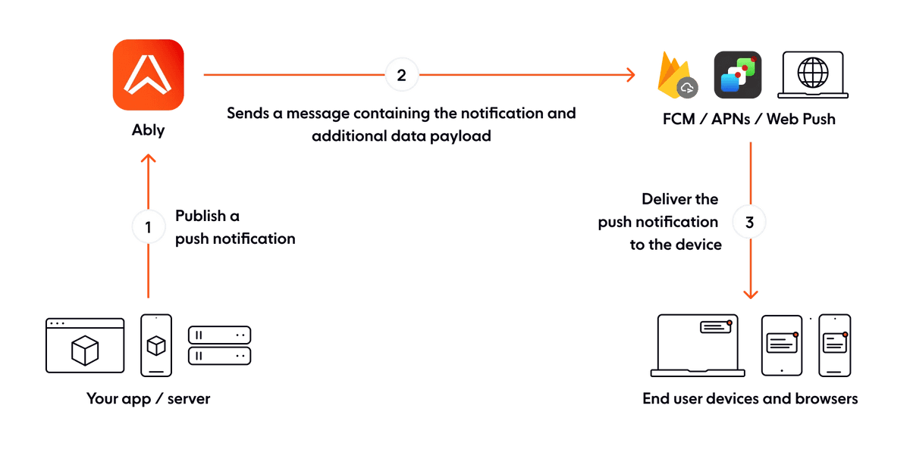

Push notifications are an important channel for engaging users outside of your application. Whether you're sending transactional alerts, breaking news, or marketing messages, push notifications need to be reliable, fast, and work seamlessly across iOS, Android, and web platforms.

This guide walks through the architectural decisions and practical considerations for implementing push notifications at scale using Ably. You'll learn how to design your notification system, manage devices across platforms, optimize for cost and performance, and handle the complexities of multi-platform delivery.

## Why Ably for push notifications?

Push notifications require integration with multiple platform-specific services: Apple Push Notification Service (APNs) for iOS, Firebase Cloud Messaging (FCM) for Android, and Web Push for browsers. Each has its own authentication mechanisms, payload formats, and reliability characteristics.

Ably's platform is engineered around the [four pillars of dependability](/four-pillars-of-dependability):

* **[Performance](/docs/platform/architecture/performance):** Ultra-low latency messaging ensures notifications are delivered quickly, even at global scale.
* **[Integrity](/docs/platform/architecture/message-ordering):** Guaranteed message delivery with no duplicates or lost notifications.
* **[Reliability](/docs/platform/architecture/fault-tolerance):** 99.999% uptime SLA with automatic failover and seamless recovery.
* **[Availability](/docs/platform/architecture/edge-network):** Global edge infrastructure ensures reliable connectivity worldwide.

Ably provides a unified API that handles all three platforms, managing:

* **Platform abstraction:** Write once, deliver everywhere. Ably translates your notifications into platform-specific formats.
* **Credential management:** Store your APNs certificates, FCM service accounts, and VAPID keys securely in one place.
* **Delivery reliability:** Ably handles retries, tracks delivery status, and provides error reporting through meta channels.
* **Scale:** From hundreds to millions of devices, Ably's [serverless architecture](/docs/platform/architecture) scales automatically without requiring you to manage connection pools or rate limits. Backed by a [99.999% uptime SLA](/uptime).
* **Users and devices:** Ably provides methods to send notifications to the right recipients. Send notifications to channels, users by `clientId`, or devices by `deviceId`.

The alternative is maintaining separate integrations with each push service, handling their individual quirks, managing credentials across multiple systems, building your own retry and error handling logic, mapping between devices and users in your application, and managing subscriptions to topics.



## High-volume delivery and targeting at scale

One of the hardest problems with push notifications at scale is managing who gets what. A news app might have millions of users subscribed to hundreds of topic combinations. A collaboration tool needs dynamic subscriptions as users join and leave projects.

Ably handles this complexity server-side. You don't need to maintain subscription databases or fan-out logic - Ably tracks which devices are subscribed to which channels and delivers efficiently.

Ably supports two fundamentally different approaches to targeting notifications, each suited to different use cases. The same app can use both approaches for different features.

### Direct publishing

[Direct publishing](/docs/push/publish#direct-publishing) sends notifications to specific devices or users without requiring them to subscribe to channels. You target notifications using one of:
* `deviceId`: The unique identifier Ably assigns to each device during activation.
* `clientId`: Your application's user identifier, which can target all of a user's devices at once.
* **Recipient attributes:** Direct targeting using device tokens or transport types.

This approach works well for:
* Transactional notifications (order confirmations, password resets, account alerts).
* User-specific messages that don't fit into predefined topics.
* Migrating from an existing push system where you already have device tokens.
* Applications where notification preferences are complex and user-specific.
* Chat features such as at-mentions or direct messages.

<Code>
```javascript
// Send to a specific device
await client.push.admin.publish(
  { deviceId: 'device-123' },
  {
    notification: {
      title: 'Your order has shipped',
      body: 'Track your package in the app'
    }
  }
);

// Send to all devices for a user
await client.push.admin.publish(
  { clientId: 'user-456' },
  {
    notification: {
      title: 'New message from Sarah',
      body: 'Hey, are you free tomorrow?'
    }
  }
);
```

```ruby
# Send to a specific device
client.push.admin.publish(
  { deviceId: 'device-123' },
  {
    notification: {
      title: 'Your order has shipped',
      body: 'Track your package in the app'
    }
  }
)

# Send to all devices for a user
client.push.admin.publish(
  { clientId: 'user-456' },
  {
    notification: {
      title: 'New message from Sarah',
      body: 'Hey, are you free tomorrow?'
    }
  }
)
```

```python
# Send to a specific device
client.push.admin.publish(
    {'deviceId': 'device-123'},
    {
        'notification': {
            'title': 'Your order has shipped',
            'body': 'Track your package in the app'
        }
    }
)

# Send to all devices for a user
client.push.admin.publish(
    {'clientId': 'user-456'},
    {
        'notification': {
            'title': 'New message from Sarah',
            'body': 'Hey, are you free tomorrow?'
        }
    }
)
```

```php
// Send to a specific device
$client->push->admin->publish(
    ['deviceId' => 'device-123'],
    [
        'notification' => [
            'title' => 'Your order has shipped',
            'body' => 'Track your package in the app'
        ]
    ]
);

// Send to all devices for a user
$client->push->admin->publish(
    ['clientId' => 'user-456'],
    [
        'notification' => [
            'title' => 'New message from Sarah',
            'body' => 'Hey, are you free tomorrow?'
        ]
    ]
);
```

```java
// Send to a specific device
JsonObject devicePayload = JsonUtils.object()
    .add("notification", JsonUtils.object()
        .add("title", "Your order has shipped")
        .add("body", "Track your package in the app")
    )
    .toJson();

client.push.admin.publish(
    new Param[] { new Param("deviceId", "device-123") },
    devicePayload
);

// Send to all devices for a user
JsonObject userPayload = JsonUtils.object()
    .add("notification", JsonUtils.object()
        .add("title", "New message from Sarah")
        .add("body", "Hey, are you free tomorrow?")
    )
    .toJson();

client.push.admin.publish(
    new Param[] { new Param("clientId", "user-456") },
    userPayload
);
```
</Code>

#### Batch API

The [batch push API](/docs/push/publish#via-batch-push-api) allows you to send up to 10,000 personalized notifications in a single request. This is ideal for scenarios like daily digests, re-engagement campaigns, or any case where each user gets different content. See the [batch push API docs](/docs/push/publish#via-batch-push-api) for implementation details.

### Channel-based publishing

[Publishing via channels](/docs/push/publish#via-channels) uses Ably's pub/sub model. Devices subscribe to channels representing topics, and notifications are broadcast to all subscribers. Ably delivers the same notification to all push subscribers of a channel. Ably handles the fan-out - whether that's 100 or 1 million devices.

This approach works well for:

* Topic-based notifications (news categories, sports scores, stock alerts).
* Group messaging or team notifications.
* Geographic or demographic targeting (if channels are organized that way).
* Scenarios where users explicitly opt into notification categories.

Using channels here is a form of organizing the notifications into categories or topics. While users (or devices) must subscribe to channels for push notifications using `subscribeDevice()` or `subscribeClient()` to receive channel push notifications, they do not need to be attached to the channels to receive them. The notifications are delivered efficiently via the relevant push service (APNs, FCM, or Web Push). Depending on the target device and permissions, they can be received when the app is closed or in the background.

Subscribe a device or clientId to a channel:
<Code>
```javascript
// Device subscribes to a channel
const channel = client.channels.get('news:breaking');
await channel.push.subscribeDevice(); // or subscribeClient()
```

```kotlin
// Device subscribes to a channel
val channel = client.channels.get("news:breaking")
channel.push.subscribeDevice(context) // or subscribeClient()
```

```swift
// Device subscribes to a channel
let channel = client.channels.get("news:breaking")
channel.push.subscribeDevice { error in      // or subscribeClient()
    // Check error
}
```
</Code>

Publish to all subscribers:

<Code>
```javascript
const channel = client.channels.get('news:breaking');
await channel.publish({
  name: 'alert',
  data: 'Breaking news story',
  extras: {
    push: {
      notification: {
        title: 'Breaking News',
        body: 'Major development in ongoing story'
      }
    }
  }
});
```

```java
Channel channel = rest.channels.get("news:breaking");

JsonObject extras = JsonUtils.object()
    .add("push", JsonUtils.object()
        .add("notification", JsonUtils.object()
            .add("title", "Breaking News")
            .add("body", "Major development in ongoing story")
        )
    )
    .toJson();

Message message = new Message("alert", "Breaking news story");
message.extras = new MessageExtras(extras);

channel.publish(message);
```

```python
extras = {
    'push': {
        'notification': {
            'title': 'Breaking News',
            'body': 'Major development in ongoing story'
        }
    }
}

channel = rest.channels.get('news:breaking')
message = ably.types.message.Message(name='alert', data='Breaking news story', extras=extras)
asyncio.run(channel.publish(message))
```

```ruby
channel = rest.channels.get('news:breaking')

message = Ably::Models::Message(
  name: 'alert',
  data: 'Breaking news story',
  extras: {
    push: {
      notification: {
        title: 'Breaking News',
        body: 'Major development in ongoing story'
      }
    }
  }
)

channel.publish message
```

```php
$channel = $rest->channels->get('news:breaking');

$msg = new \Ably\Models\Message();
$msg->name = 'alert';
$msg->data = 'Breaking news story';
$msg->extras = [
    'push' => [
        'notification' => [
            'title' => 'Breaking News',
            'body' => 'Major development in ongoing story'
        ]
    ]
];

$channel->publish($msg);
```

```go
channel := rest.Channels.Get("news:breaking")

message := &ably.Message{
    Name: "alert",
    Data: "Breaking news story",
    Extras: map[string]interface{}{
        "push": map[string]interface{}{
            "notification": map[string]interface{}{
                "title": "Breaking News",
                "body":  "Major development in ongoing story",
            },
        },
    },
}

err := channel.PublishMultiple(ctx, []*ably.Messages{message})
```
</Code>

To publish push notifications to a channel, you need to enable the push notifications [rule](/docs/channels#rules) for the channel or channel namespace. You can configure this in the Ably dashboard.

For bulk operations - like subscribing a user to all their team channels when they join - use the [push admin API](/docs/api/realtime-sdk/push-admin) from your server.

#### Channel design for scale

Your channel structure determines how efficiently you can target notifications. Examples:

* **Topic channels** (`news:sports:basketball`) let users subscribe to specific interests.
* **Geographic channels** (`alerts:uk:london`) enable location-based targeting.
* **Dynamic channels** (`document:5b2aca2d`) handle user-specific contexts like documents, threads, or game sessions.

### Choosing between the two

Many applications use both models for different features. For example:

* Channel-based for optional categories users can subscribe to (sports updates, promotions, new messages to a group chat).
* Direct publishing for critical user-specific alerts (account security, payment confirmations, direct chat messages).

Consider your notification taxonomy. If you broadcast the same notification to many users, channels simplify this. You can also enable users to have granular preferences ("I want basketball scores but not football") by using different channels for different choices they can make. On the other hand, if most notifications are personal and transactional, direct publishing is simpler: either by `clientId` (target all devices of a specific user) or `deviceId` (target a specific device).

How you publish affects cost. Ably charges per notification delivered, plus inbound messages. Publishing to a channel with 100 subscribers costs 1 inbound + 100 outbound, in total 101 billable messages. Publishing individually to 100 devices costs 100 inbound + 100 outbound, in total 200 billable messages. Read more about Ably's pricing [here](/docs/platform/pricing). Ably offers both [MAU-based pricing](/docs/platform/pricing#mau) and [per minute pricing](/docs/platform/pricing#per-minute).

## Multi-platform considerations

A core challenge of push notifications is handling three different platforms with different capabilities and payload formats.

### Platform features

Each platform has unique features:

* **iOS (APNs):** Rich notifications with media, notification categories, thread grouping, critical alerts.
* **Android (FCM):** Custom notification colors, large icons, notification channels, background data messages.
* **Web Push:** Basic notifications with icons and actions, limited styling, varies by browser.

Ably provides a [unified payload structure](/docs/push/publish#payload) that maps to each platform.

```javascript
{
  notification: {
    title: 'Hello from Ably',       // Maps to all platforms
    body: 'This is a notification', // Maps to all platforms
    icon: '/icon.png',              // Used by FCM and Web Push, ignored by APNs
    sound: 'default',               // Used by APNs and FCM, ignored by Web Push
    collapseKey: 'chat'             // Maps to collapse_key (FCM) and thread-id (APNs)
  },
  data: {                           // Available on all platforms
    customField: 'value'
  }
}
```

### Platform-specific overrides

For platform-specific features, you can override the generic payload:

```javascript
{
  notification: {
    title: 'New Message',
    body: 'You have a new message'
  },
  // iOS-specific overrides
  apns: {
    aps: {
      alert: {
        title: 'Hello, iOS',      // Different title for iOS
      },
    }
  },
  // Android-specific overrides
  fcm: {
    notification: {
      color: '#FF5722',              // Android accent color
    }
  },
  // Web-specific overrides
  web: {
    badge: '/badge.png',
  }
}
```

This lets you use platform-specific features while maintaining a single codebase for notification publishing. Without Ably, you would need to implement a transformation layer for each platform you want to target (such as web, APNs, and FCM).

### Testing across platforms

When developing, test notifications on all target platforms early. Platform-specific bugs often relate to:

* Images don't show, for example, because the URLs are not accessible from all platforms.
* Sound files that don't exist or are in the wrong format.
* Custom data that exceeds platform size limits (4KB for iOS, 4KB for FCM data payload).
* Character encoding issues in titles or bodies.

## Device activation at scale

Before [devices](/docs/push/configure/device) or [browsers](/docs/push/configure/web) can receive push notifications, they must be activated - registered with both the platform's push service (APNs, FCM, or Web Push) and with Ably. Ably handles the complexity of maintaining these registrations at scale, including token refresh, mapping devices to users, and keeping track of subscriptions to channels.

At scale, stale registrations accumulate quickly - devices go inactive, users reinstall apps, or tokens expire. Ably automatically detects and excludes stale registrations from fanout, so you don't need to track or clean up outdated device entries. Ably also handles refreshing server credentials for communicating with FCM and APNs, removing the operational burden of certificate and key rotation. You can monitor push delivery events and errors in real-time by subscribing to the [`[meta]log:push`](/docs/push#Error) metachannel.

### Client-side activation

Client-side activation is the simplest approach. Registration happens fully on the client device or browser. Ably SDKs provide a simple API to activate push notifications for devices and browsers:

<Code>
```javascript
// Browsers
import Ably from "ably";
import Push from "ably/push";

const realtimeClient = new Ably.Realtime({
  authCallback: getTokenFromYourServer,
  pushServiceWorkerUrl: '/service-worker.js',
  plugins: { Push }
});

await realtimeClient.push.activate();
```

```swift
// iOS
let options = ARTClientOptions()
// Implement getTokenFromServer to fetch a token from your server
options.authCallback = getTokenFromServer
let realtimeClient = ARTRealtime(options: options)

realtimeClient.push.activate()
```

```kotlin
// Android
val options = ClientOptions().apply {
    authCallback = Auth.TokenCallback { params ->
        // Implement this function to get a token from your server
        getTokenFromServer()
    }
}
val realtimeClient = AblyRealtime(options)

realtimeClient.setAndroidContext(context)
realtimeClient.push.activate()
```
</Code>

The device gets a `deviceId` from Ably and can immediately subscribe to channels or receive direct notifications. If the Ably client is using a `clientId`, the registration will also be associated with that `clientId`.

Always deactivate the device when the user logs out or the device is no longer needed. This can be done by calling `push.deactivate()` on the Ably client:

<Code>
```javascript
await realtimeClient.push.deactivate();
```

```swift
realtimeClient.push.deactivate()
```

```kotlin
realtimeClient.push.deactivate()
```
</Code>

Client-side activation is preferred when:

* You need a simple, managed solution for device activation and deactivation.
* You do not need to use FCM as a proxy for push notifications on iOS and web.
* You can activate clients using client-side activation and use the [Push Notifications Admin API](/docs/api/realtime-sdk/push-admin) as needed for specific use cases.
* You want to avoid the complexity of device lifecycle management on your own servers.

### Server-side activation

Server-side activation gives you more control. The device obtains its platform token (FCM registration token, APNs device token, or Web Push subscription) on the client, and then sends it to your server. Your server registers the device with Ably using the push admin API. This approach can also be used to migrate push notifications to Ably without reactivating push notifications on all devices for all platforms.

Server-side activation also allows you to use FCM for both Android and iOS devices for unified push messaging.

On the client, get the platform token and send it to your server. On your server, use the [Push Notifications Admin API](/docs/api/realtime-sdk/push-admin) to register the device with Ably:

<Code>
```javascript
// On your server: Register with Ably using a platformToken, platform, and clientId
await ablyClient.push.admin.deviceRegistrations.save({
  id: generateDeviceId(clientId, platform),  // use your own function to generate a unique device id
  platform: platform,
  formFactor: 'phone',
  clientId: clientId,
  push: {
    recipient: {
      transportType: platform === 'ios' ? 'apns' : 'fcm',
      deviceToken: platformToken
    }
  }
});
```

```java
// On your server: Register with Ably using a platformToken, platform, and clientId
DeviceDetails d = new DeviceDetails();
d.id = generateDeviceId(clientId, platform); // use your own function to generate a unique device id
d.platform = "ios";
d.clientId = clientId;
d.formFactor = "phone";
d.push = new DeviceDetails.Push();
d.push.recipient = new com.google.gson.JsonObject();
d.push.recipient.addProperty("transportType", "apns");
d.push.recipient.addProperty("deviceToken", platformToken);

ablyRest.push.admin.deviceRegistrations.save(d);
```

```ruby
// On your server: Register with Ably using a platformToken, platform, and clientId
device = {
  "id": generateDeviceId(clientId, platform), // use your own function to generate a unique device id
  "clientId": clientId,
  "platform": platform,
  "formFactor": "phone",
  "push": {
    "recipient": {
      "transportType": platform == 'ios' ? 'apns' : 'fcm',
      "deviceToken": platformToken
    }
  }
}
ablyRest.push.admin.device_registrations.save(device)
```

```python
device = {
  "id": generateDeviceId(clientId, platform), # use your own function to generate a unique device id
  "clientId": clientId,
  "platform": platform,
  "formFactor": "phone",
  "push": {
    "recipient": {
      "transportType": 'apns' if platform == 'ios' else 'fcm',
      "deviceToken": platformToken
    }
  }
}
asyncio.run(ablyRest.push.admin.device_registrations.save(device))
```

```go
// On your server: Register with Ably using a platformToken, platform, and clientId
transportType := "fcm"
if platform == "ios" {
  transportType = "apns"
}
_, err := ablyRest.Request("PUT", "/push/deviceRegistrations/"+url.PathEscape(deviceId), ably.RequestWithBody(map[string]any{
  "id":         generateDeviceId(clientId, platform), // use your own function to generate a unique device id
  "clientId":   clientId,
  "platform":   platform,
  "formFactor": "phone",
  "push": map[string]any{
    "recipient": map[string]any{
      "transportType": transportType,
      "deviceToken":   platformToken,
    },
  },
})).Items(ctx)
```

```php
// On your server: Register with Ably using a platformToken, platform, and clientId
$device = [
  "id" => generateDeviceId(clientId, platform), // use your own function to generate a unique device id
  "clientId" => clientId,
  "platform" => platform,
  "formFactor" => "phone",
  "push" => [
    "recipient" => [
      "transportType" => $transportType,
      "deviceToken" => $platformToken,
    ],
  ],
];
$ablyRest->push->admin->deviceRegistrations->save($device);
```
</Code>

Server-side activation is preferred when:

* You need strict control over device registrations.
* You're migrating from another push provider and already have server-side device management.
* You want to use FCM for both Android and iOS devices for unified push messaging.

## Authentication and security

Ably uses [capability-based authentication](/docs/auth/capabilities) to control what clients can do with push notifications. Two capabilities matter for push notifications:

* **push-subscribe:** Allows a device to manage its own registration and subscribe to channels. Suitable for end user devices.
* **push-admin:** Full access to push admin API - register any device, subscribe any device to channels, send direct notifications. Only for servers.

You can read more about [authentication with Ably here](/docs/auth).

### Security considerations

Follow these practices:

* Never give clients `push-admin` capability. They could manage registrations and subscriptions for push notifications for any device.
* Do not give `publish` capability to clients on channels used for push notifications. This will allow the clients to publish push notifications to that channel. Only do this for use cases such as admin dashboards, where sending push notifications by the user is allowed.
* To make permission management straightforward, use separate channels for push notifications and other parts of your application.
* Only grant the capabilities that are needed for the specific use case.
* Use token authentication and not API key authentication.
* Remember to deregister or update device registrations when users log out.

## Delivery monitoring

Push notification failures are inevitable: devices go offline, users uninstall apps, tokens expire. At scale, you need visibility into what's happening across millions of delivery attempts.

Ably publishes delivery feedback to the `[meta]log:push` channel in real-time. This gives you immediate visibility into failures - invalid tokens, expired registrations, platform outages - so you can maintain a clean device registry and debug issues quickly. Ably also handles automatic retries when APNs or FCM experience transient issues, so you don't need to build retry logic yourself.

## Production-ready checklist

Ably handles the hard parts of push at scale - unified delivery across APNs, FCM, and Web Push, automatic token refresh, stale device cleanup, and a [99.999% uptime SLA](/uptime) - so you can focus on what to send rather than how to deliver it. Before launching:

* **Platform configuration:** Ensure APNs certificates/tokens, FCM service account credentials, and Web Push service worker are properly configured and tested across all target platforms.
* **Authentication and security:** Use token authentication for all client-side communication, restrict the `push-admin` capability to your backend servers only, and verify that clients cannot access admin push APIs.
* **Device lifecycle management:** Implement device activation, deactivation, and token refresh handling, and have a strategy in place for removing devices that are no longer active.
* **Channel structure and subscriptions:** Design your channel naming strategy and implement subscription management that allows users to control their notification preferences and easily unsubscribe.
* **Channel rules:** Make sure the push notifications rule is enabled for the channels you want to use for push notifications.
* **Monitoring and error tracking:** Subscribe to the `[meta]log:push` meta channel to monitor push notification delivery errors.
* **Cross-platform testing:** Test notifications across all target platforms to ensure consistent delivery and behavior.
* **Scale planning:** Confirm you are on the right Ably package for your expected notification volume and user base size.

## Next steps

* Review the [push notifications documentation](/docs/push) for API details.
* Learn how to [configure devices](/docs/push/configure/device) and [web browsers](/docs/push/configure/web).
* Understand [publishing methods](/docs/push/publish) in depth.
* Explore the [push admin API](/docs/api/realtime-sdk/push-admin).
* Check out [authentication best practices](/docs/auth).
* Read about our [platform architecture](/docs/platform/architecture) for scale considerations.
