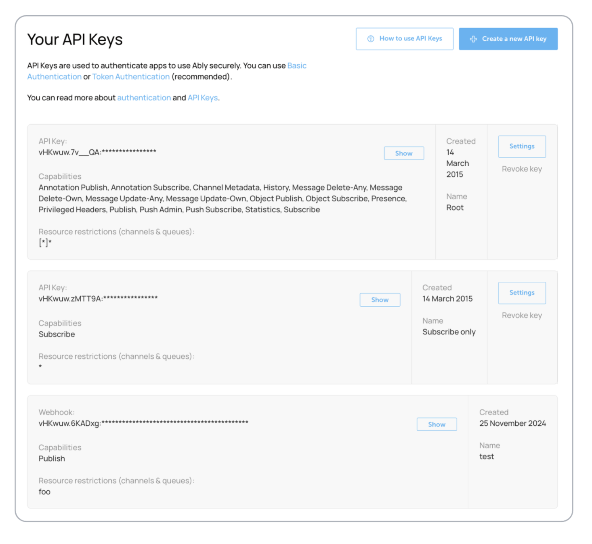

The API keys tab lists all API keys associated with your account and provides information on each key's capabilities and restrictions. Manage your API keys in the [app dashboard](https://ably.com/accounts/any/apps/any/app_keys) under the API Keys section. You can [create a new API key](#create) and manage an existing one.

<Aside data-type='note'>
Before setting up multiple API keys with different permissions or sharing API keys with untrusted parties, consider using [token authentication](/docs/auth/token) instead. Token authentication provides more flexible access control and better security for client-side applications.
</Aside>

## Create a new API key <a id="create"/>

Create a new API key:

1. Click **Create a new API key**.
2. Assign a friendly name.
3. Give the new API key a descriptive name (e.g. chat app key) so it is easy to identify later.

To manage an API key: set [capabilities](/docs/auth/capabilities), define resource restrictions, use revocable tokens for security, and adjust key settings as needed.

### Capabilities <a id="capabilities"/>

[Capabilities](/docs/auth/capabilities) define what permissions your API key has. You can select from core messaging capabilities (subscribe, publish, presence), content management (message updates/deletes, annotations), data access (history, stats), push notifications, and administrative features. See the [capabilities documentation](/docs/auth/capabilities) for the complete list and detailed descriptions.

### Set resource restrictions <a id="resource-restrictions"/>

Control which channels and queues the API key can access. You can choose from **None** (unrestricted access), **Only channels** (no queue access), **Only queues** (no channel access), or **Selected channels and queues** for specific access rules.

When selecting specific resources, provide a comma-separated list. Use exact names (`channel-name`) or wildcards (`namespace:*`). Queues need the `[queue]` prefix and meta channels use `[meta]`. See [capabilities documentation](/docs/auth/capabilities#wildcards) for wildcard syntax.

<Aside data-type='important'>
A single API key cannot support complex permission combinations, such as publish access on one channel and subscribe access on another. For such requirements, use [token authentication](/docs/auth/token) instead.
</Aside>

### Revocable tokens <a id="revocable-tokens"/>

Enable [revocable tokens](/docs/auth/revocation#revocable-tokens) to enhance security by allowing shorter token lifetimes and the ability to revoke tokens issued by this API key.

### Change your API key settings <a id="change-settings"/>

Click **Settings** on the required API key to change its settings. The same settings apply as when creating a new API key.
