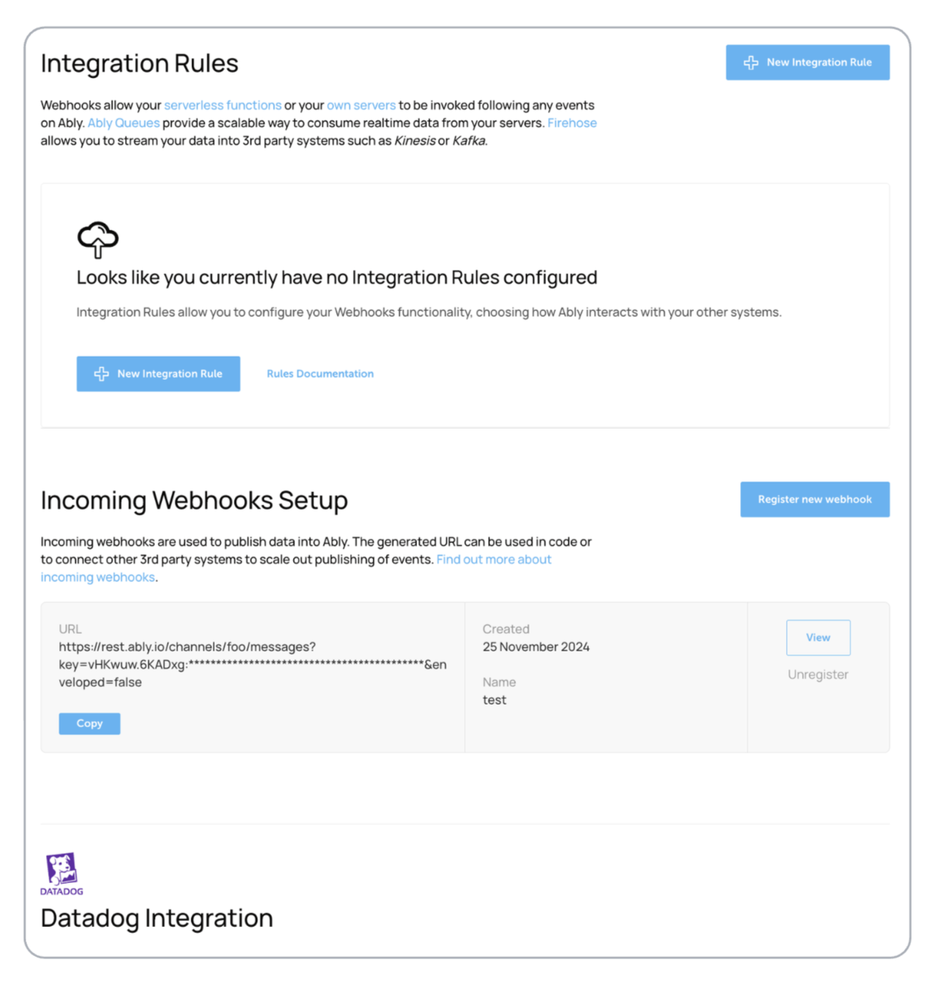

The Integrations section allows you to connect your Ably application with external services and systems. Configure and manage your integrations in the [app dashboard](https://ably.com/accounts/any/apps/any/integrations).

## Available integration types <a id="available-integrations"/>

You can configure the following types of integrations:

- [Inbound webhooks](/docs/platform/integrations/webhooks#inbound) - Receive events from external services into Ably
- [Outbound webhooks](/docs/platform/integrations/webhooks) - Trigger serverless functions or custom servers on Ably events
- [Outbound streaming](/docs/platform/integrations/streaming) - Stream data to external systems like Kinesis or Kafka
- [Third-party integrations](/docs/platform/integrations) - Connect with external services like Datadog

<Aside data-type='note'>
Integration configuration requires admin-level permissions. Contact your account owner if you need access to create or modify integrations.
</Aside>

