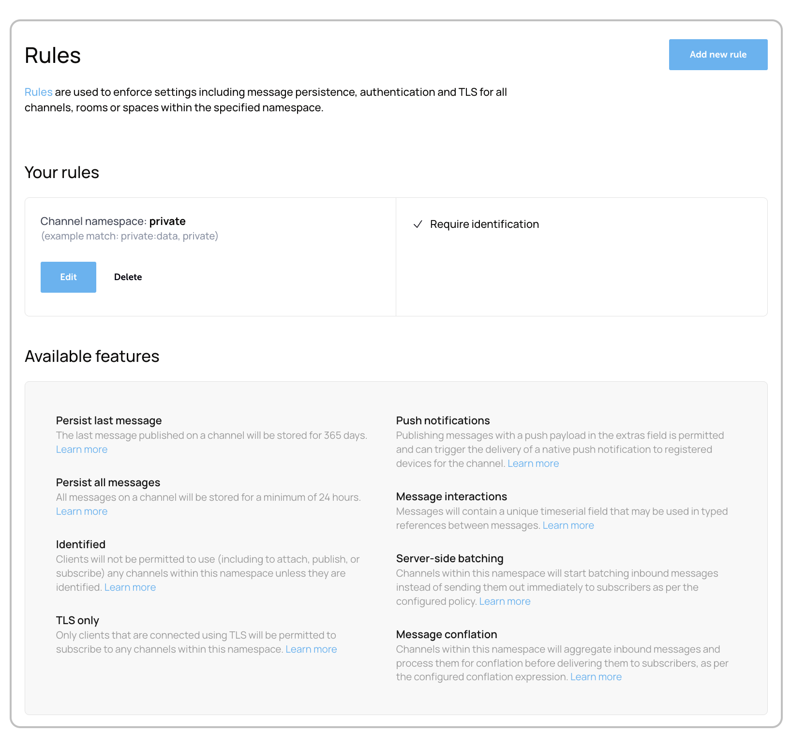

The rules section in your Ably dashboard enables you to enforce settings and configure features for channels, rooms, or spaces within specified namespaces. Configure and manage your rules in the [app dashboard](https://ably.com/accounts/any/apps/any/rules) under the rules section. Rules provide granular control over message persistence, authentication requirements, security settings, and advanced functionality across your application.

## Your rules <a id="your-rules"/>

The rules interface displays your configured namespace rules and their applied settings:

### Channel namespace configuration <a id="namespace-configuration"/>

Each rule is defined by a channel namespace pattern that determines which channels the rule applies to:

| Configuration element | Description |
|---|---|
| Channel namespace | The namespace pattern that determines which channels the rule applies to |

For example, a namespace `coco` would apply to channels matching the pattern, with example matches like `coco:data` or `coco`.

## Available features <a id="features"/>

The Rules system provides access to multiple feature categories that can be enabled for your namespaces:

### Message persistence features <a id="persistence-features"/>

| Feature | Description |
|---|---|
| Persist last message | Store the most recent message published to channels. |
| Persist all messages | Store all messages published to channels. |

### Security and access features <a id="security-features"/>

| Feature | Description |
|---|---|
| Identified | Require client identification for channel access. |
| TLS only | Enforce encrypted connections for channel access. |

### Push notification features <a id="push-features"/>

| Feature | Description |
|---|---|
| Push notifications | Enable push notification delivery. |

### Message processing features <a id="processing-features"/>

| Feature | Description |
|---|---|
| Message interactions | Enable message references and threading. |
| Server-side batching | Enable message batching optimization. |
| Message conflation | Enable message optimization. |
