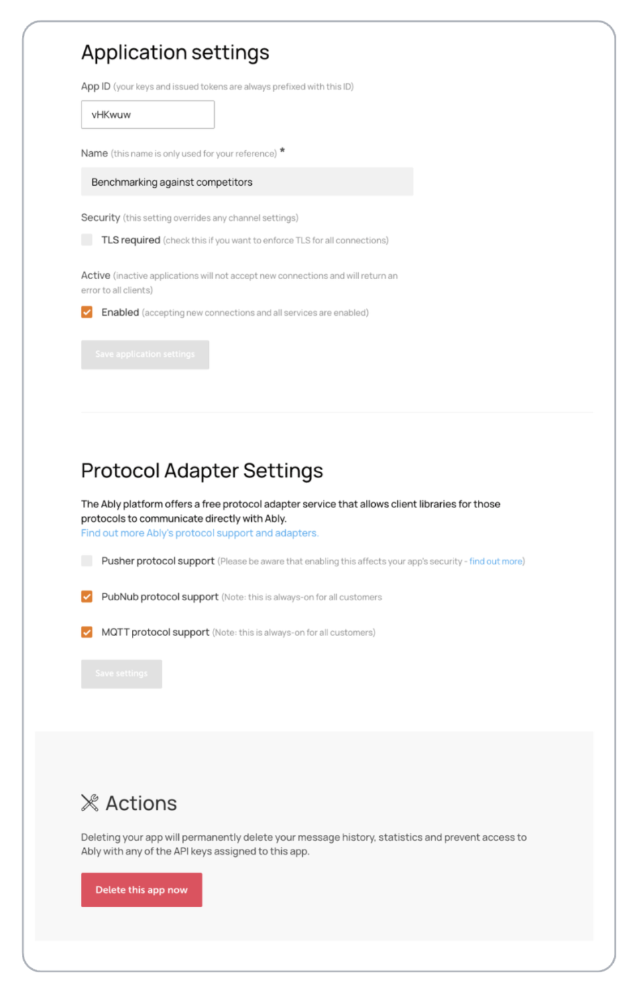

The Settings section in your Ably dashboard provides centralized configuration management for your application's core settings, security requirements, and protocol support. Configure your application settings in the [app dashboard](https://ably.com/accounts/any/apps/any/settings) under the Settings section. This interface enables you to customize your application's behavior, enforce security policies, and enable protocol adapters for different client types.

## Application settings <a id="application-settings"/>

The application settings section contains the fundamental configuration options that define your application's identity and basic operational parameters.

### Basic application configuration <a id="basic-configuration"/>

| Setting | Description |
|---|---|
| App ID | Unique identifier for your application. |
| Name | Friendly name for your application. |

### Security settings <a id="security-settings"/>

Configure security requirements that apply across your entire application:

| Security setting | Description |
|---|---|
| TLS required | Enforce encrypted connections for all clients. |

<Aside data-type='note'>
When TLS required is enabled, this setting overrides any channel settings and ensures that all client connections must use encrypted transport protocols.
</Aside>

### Application status <a id="application-status"/>

Control whether your application accepts new connections and processes requests:

| Status setting | Description |
|---|---|
| Active | Application operational status. |
| Enabled | Service availability status. |

## Protocol Adapter Settings <a id="protocol-adapter-settings"/>

The Ably platform offers protocol adapter services that enable client libraries for different protocols to communicate directly with Ably, extending compatibility beyond native Ably SDKs.

### Protocol adapter overview <a id="protocol-adapter-overview"/>

Protocol adapters allow clients using standard messaging protocols to connect to your Ably application without requiring Ably-specific client libraries. This enables integration with existing systems and tools that support these protocols.

### Available protocol adapters <a id="available-adapters"/>

| Protocol | Description |
|---|---|
| [Pusher protocol support](/docs/protocols/pusher) | Compatibility with Pusher client libraries (optional). |
| [PubNub protocol support](/docs/protocols/pubnub) | Compatibility with PubNub client libraries (always-on). |
| [MQTT protocol support](/docs/protocols/mqtt) | Standard MQTT messaging protocol support (always-on). |
