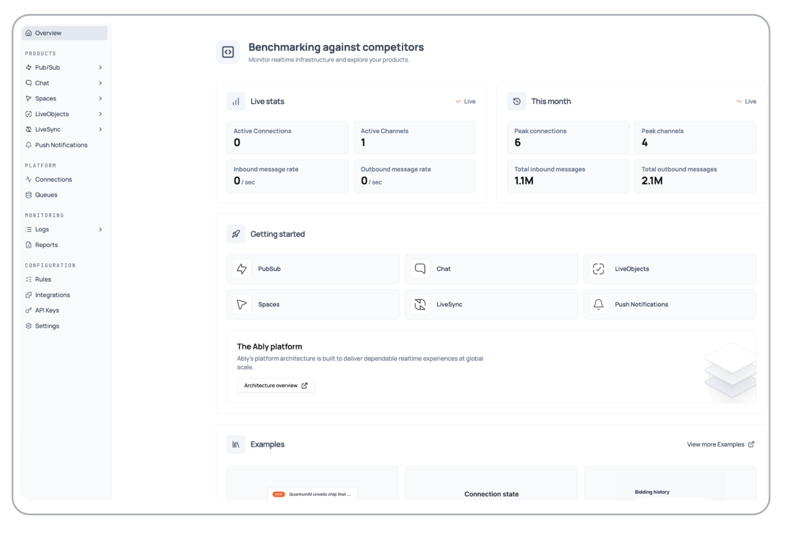

Manage and monitor your applications on the Ably platform using the Ably dashboard. Create new apps, view existing ones, and configure settings from your browser.

### Navigation structure <a id="navigation"/>

The dashboard is organized into several main sections:

- [Products](#products): Core Ably services including Pub/Sub, Chat, Spaces, LiveObjects, LiveSync, and Push Notifications
- [Platform](#platform): Infrastructure components like Connections and Queues
- [Monitoring](#monitoring): Logs and Reports for tracking performance and debugging
- [Configuration](#configuration): Rules, Integrations, API Keys, and Settings for customizing your application

### Live statistics <a id="live-stats"/>

Monitor your application's realtime performance with live statistics displayed prominently on the dashboard. View current activity like active connections and channels, message rates, and monthly totals including peak usage metrics.

## Products <a id="products"/>

Your app dashboard provides access to Ably's core products for building realtime applications:

### Pub/Sub <a id="pubsub"/>

Publish and subscribe to realtime messages across channels for instant communication between clients and servers.

Access the [channel overview](https://ably.com/accounts/any/apps/any/channels) to monitor usage and manage individual channels, or use the [web client](https://ably.com/accounts/any/apps/any/console) for browser-based testing.

### Chat <a id="chat"/>

Build chat applications with message history, user presence, and moderation capabilities for engaging conversational experiences.

Access the [chat overview](https://ably.com/accounts/any/apps/any/chat) to monitor usage and [manage chat rooms](https://ably.com/accounts/any/apps/any/rooms).

### Spaces <a id="spaces"/>

Create collaborative spaces with member awareness and live cursors for realtime collaborative applications.

Access the [spaces overview](https://ably.com/accounts/any/apps/any/spaces) to monitor usage and [manage individual spaces](https://ably.com/accounts/any/apps/any/spaces/spaces).

### LiveObjects <a id="liveobjects"/>

Synchronize application state in realtime across connected clients for shared data experiences.

Access the [LiveObjects overview](https://ably.com/accounts/any/apps/any/liveobjects) to monitor usage and performance metrics.

### LiveSync <a id="livesync"/>

Stream database changes to frontend applications instantly for reactive user interfaces.

Access the [LiveSync overview](https://ably.com/accounts/any/apps/any/livesync) to monitor usage and performance metrics.

### Push Notifications <a id="push-notifications"/>

Send notifications to mobile devices and web browsers to keep users engaged and informed.

Access the [push notifications overview](https://ably.com/accounts/any/apps/any/push) to configure services, inspect registrations, and manage device subscriptions.

## Platform <a id="platform"/>

Monitor and manage your application's infrastructure components:

### Connections <a id="connections"/>

Monitor active client connections and connection statistics to understand your application's usage patterns.

Access the [connections page](https://ably.com/accounts/any/apps/any/connections) to search for specific connections, filter by country or SDK version, and inspect connection details.

### Queues <a id="queues"/>

Manage message queues for reliable message delivery and processing in asynchronous workflows.

Access [queue overview](https://ably.com/accounts/any/apps/any/queues) to view and manage your queues, or [create new queues](https://ably.com/accounts/any/apps/any/queues/new) with customizable settings.

## Monitoring <a id="monitoring"/>

Monitor your application's performance and troubleshoot issues:

### Logs <a id="logs"/>

Access detailed logging information to monitor and debug your application activity.

Access the [logs page](https://ably.com/accounts/any/apps/any/logs) to view API requests, channel activity, connection events, integration errors, and push notification logs.

### Reports <a id="reports-monitoring"/>

Analyze your application's performance, usage patterns, and billable consumption metrics.

Access the [reports page](https://ably.com/accounts/any/apps/any/reports) to view detailed analytics and usage statistics.

## Configuration <a id="configuration"/>

Configure and customize your application's behavior and integrations:

### Rules <a id="rules"/>

Set up automated message routing and transformations to process messages as they flow through your application.

Access the [rules page](https://ably.com/accounts/any/apps/any/rules) to configure authentication requirements, message persistence, and push notifications for channels within specified namespaces.

### Integrations <a id="integrations"/>

Connect external services like webhooks, Kafka, and cloud functions to extend your application's capabilities.

Access the [integrations page](https://ably.com/accounts/any/apps/any/integrations) to configure webhooks, Ably Queues, and Firehose for streaming data to third-party systems.

### API Keys <a id="api-keys"/>

Create and manage authentication keys with specific capabilities to control access to your application's resources.

Access the [API keys page](https://ably.com/accounts/any/apps/any/app_keys) to manage secure app authentication, create new keys, and configure capabilities and resource restrictions.

### Settings <a id="settings-section"/>

Configure app-level settings including security and protocol support to customize your application's behavior.

Access the [settings page](https://ably.com/accounts/any/apps/any/edit?focus=settings) to manage application information, security settings, TLS enforcement, and protocol adapter settings.

