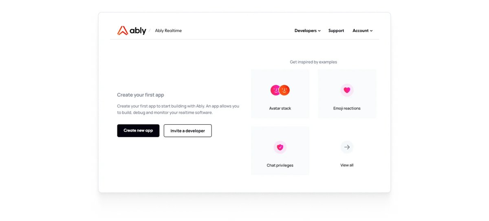
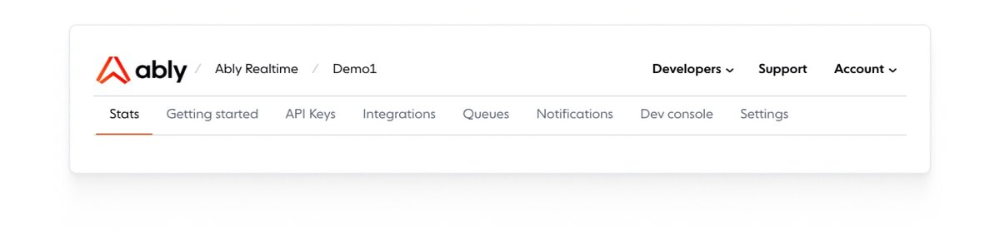

Manage and monitor your applications on the Ably platform using the Ably dashboard. Create new apps, view existing ones, and configure settings from your browser.

Begin by [logging](https://ably.com/login) in to Ably through your browser. Once you're logged in, you have access to the Ably [dashboard](https://ably.com/accounts), where you can [create a new app](#create) or [view your existing apps.](#view)

## Create a new app <a id="create"/>

The following image displays the Ably dashboard when no apps have been created yet. To get started, you can easily **Create new app**:

## View your apps <a id="view"/>

If you have created apps already, your dashboard will look similar to the one shown in the following image. Each app displayed is a link to its specific dashboard, where you can view and configure settings, as well as monitor usage and statistics:

### Environments <a id="environment"/>

Each Ably app acts as a sandboxed environment, isolated from other apps in your account. This makes it straightforward to set up separate environments for development, staging, and production by creating dedicated apps for each.

For example, if you're building a product called "chat-app", you could create:

- `chat-app-production` for your live production environment
- `chat-app-staging` for pre-production testing
- `chat-app-development` for ongoing development work

This approach provides complete isolation between environments, ensuring that development activities don't interfere with production traffic. An alternative approach for complete resource isolation, consider using separate Ably accounts for development and production environments. This ensures development activities cannot impact production resources under any circumstances.

<Aside data-type='important'>
Account limits are shared. While apps are sandboxed from each other, they share the same [account limits](/docs/platform/pricing/limits) such as connection counts and channel limits. A development app experiencing high usage could potentially impact your production app if account limits are reached.
</Aside>

## App overview

Your app dashboard provides the following tabs for monitoring and configuring your app settings:

### Stats

Monitor and analyze your app's performance through a [stats](/docs/platform/account/app/stats) table and chart:

* Track messages, presence events, and performance metrics to understand usage and capacity.
* Compare data over time to identify trends and optimize resources.
* Adjust chart views with zoom options and set specific time ranges for detailed insights.

### Getting started

Get started by connecting to Ably, and publishing your first message.

### API keys

Create, manage, and configure [API keys](/docs/platform/account/app/api) by setting capabilities:

* Users can create a new API key, assigning a descriptive name for easy identification.
* Capabilities include permissions like publishing messages, subscribing to channels, retrieving message history, managing presence, and accessing statistics.
* Control access by defining whether the key has unrestricted access, channel-only, queue-only, or specific access to selected channels and queues.

### Integrations

[Integrate](/docs/platform/integrations) Ably with external services, enabling data to flow between Ably channels and third-party platforms:

* Ably events can trigger webhook requests to external services, or external services can send data to Ably using incoming webhooks.
* Ably enables continuous streaming of events to external services like Amazon Kinesis or Kafka, or can receive inbound streams from external services.
* Ably supports various integration methods, including HTTP callbacks, cloud functions, and streaming services.

### Queues

View, monitor, and adjust Ably [queues:](/docs/platform/account/app/queues)

* Queues provide access to manage existing queues, monitor data flow, and adjust settings such as TTL, max length, and region.
* Users can contact Ably support for assistance with increasing limits or customizing their queue settings.

### Notifications

Manage [notifications](/docs/platform/account/app/notifications) using Ably. Create, test, and send notifications to specific devices or channels, and enure everything works correctly.

* Configure push notifications for devices using FCM for Android or APNs for iOS.
* Use the push inspector tool to test and debug notifications by sending them manually and reviewing device, client, and channel registrations.
* Use the push inspector widget below to browse and inspect channel subscriptions, device and client registrations.

### Dev console

Monitor your application's health in realtime using Ably's [dev console](/docs/platform/account/app/console) by -- tracking events like connection status changes and channel activity. Connect to channels, publish messages, manage presence, and view event logs for troubleshooting:

* The dev console provides realtime insights into application-wide events like connection status changes, channel activity, and event logs.
* You can connect to channels, publish messages, and manage presence, tracking interactions within the channel through the console.
* The event log table displays detailed records of connection events, which can be used for troubleshooting and diagnosing application issues.
* Interact with Ably channels using command-line tools like cURL.

### Settings

Manage key aspects of your application [settings](/docs/platform/account/app/settings), including security, enabling or disabling the app, configuring rules for channels, and setting up protocol support for different SDKs:

* Manage settings like App ID, name, security (TLS), and enable/disable the application, affecting its ability to accept connections and use Ably services.
* Create channel rules to enforce settings for specific channels, or channel namespaces, such as message persistence, TLS-only access, push notifications, and server-side batching.
* Enable compatibility with various protocols like Pusher, PubNub, and MQTT for communication between client libraries and Ably.
* Manage notifications for channel activity and occupancy to gain realtime insights into channel usage and performance.

