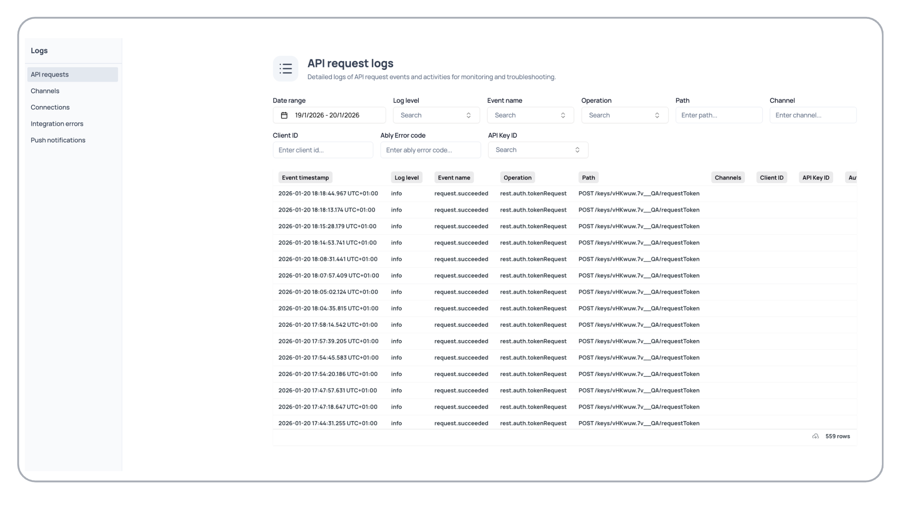

Use the monitoring section of the dashboard to view [logs](https://ably.com/accounts/any/apps/any/logs/api_requests_logs) and [reports](https://ably.com/accounts/any/apps/any/reports) for your applications.

## Logs

The [logs](https://ably.com/accounts/any/apps/any/logs/api_requests_logs) section provides historical event logging for monitoring and debugging your application.

Logs are organized by their specific resource:

| Log section | Description |
|---|---|
| API requests | REST API calls and authentication attempts. |
| Channels | Channel lifecycle events. |
| Connections | Client connection lifecycle events. |
| Integration errors | Integration failures and webhook issues. |
| Push notifications | Push notification delivery errors. |

Each section provides date range filtering and search capabilities for the specific type of events being monitored.

<Aside data-type='note'>
Live logs are available when monitoring a specific resource such as a connection or channel.
</Aside>

## Reports

The [reports](https://ably.com/accounts/any/apps/any/reports) section provides analytics and usage insights for your application.

<Aside data-type='note'>
Reports are available at different levels: organization, account, and app. The scope of the data depends on which level you are viewing.
</Aside>
