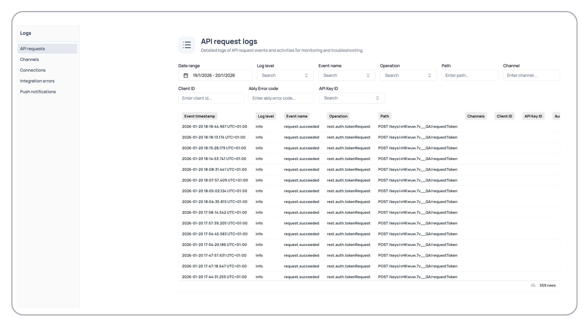

The Logs section in your Ably dashboard provides comprehensive monitoring and debugging capabilities through detailed historical event logging across all aspects of your application. Access your application logs in the [app dashboard](https://ably.com/accounts/any/apps/any/logs) under the Logs section. These are historical logs with a short delay, not live logs. This interface enables you to track system activities, troubleshoot issues, and analyze patterns across API requests, channels, connections, integrations, and push notifications.

## Log sections overview <a id="sections-overview"/>

The logs interface is organized into five specialized sections, each focused on different aspects of your Ably implementation:

| Log section | Description |
|---|---|
| API requests | Monitor REST API calls and authentication attempts |
| Channels | Track channel events and activities |
| Connections | Monitor client connection events |
| Integration errors | Track integration failures and webhook issues |
| Push notifications | Monitor push notification delivery and errors |
| API integrations | Monitor third-party API integration events and errors |

Each section provides date range filtering and specialized search capabilities tailored to the specific type of events being monitored.

## API requests <a id="api-requests"/>

The API requests section provides detailed logs of REST API calls, authentication attempts, and system operations for monitoring and troubleshooting API usage.

### API request filtering options <a id="api-filtering"/>

Filter your API request logs to find specific events:

| Filter | Description |
|---|---|
| Date range | Select start and end dates to focus on specific timeframes. |
| Log level | Choose specific log levels to focus on errors or informational events. |
| Event name | Enter event names to find particular API operations. |
| Operation | Search for specific REST operations like GET, POST, PUT, DELETE. |
| Path | Enter API paths to track specific endpoint usage. |
| Channel | Enter channel names to see API requests affecting specific channels. |
| Client ID | Track API requests from specific clients. |
| Ably Error code | Enter error codes to investigate specific failure types. |
| API Key ID | Track API usage by specific API keys. |

## Channels <a id="channels"/>

The channels section provides detailed logs of channel events and activities, enabling you to monitor channel lifecycle, message flow, and channel-specific operations.

### Channel log filtering options <a id="channel-filtering"/>

Filter your channel logs to analyze specific events:

1. Select dates to focus on specific channel activity periods.
2. Filter by specific levels to focus on channel errors or events.
3. Type event names like channel.attached, channel.detached.
4. Enter channel names to monitor specific channel activities.
5. Toggle to include or exclude metadata channels in results.
6. Enter Ably error codes to investigate channel-specific issues.

## Connections <a id="connections"/>

The connections section provides detailed logs of client connection events, helping you troubleshoot connection issues and monitor client behavior patterns.

### Connection log filtering options <a id="connection-filtering"/>

Filter your connection logs to analyze events and client behavior:

1. Select dates to focus on specific connection activity periods.
2. Filter by specific levels to focus on connection errors or state changes.
3. Type events like connection.connected, connection.disconnected.
4. Monitor events for individual client connections using the connection ID filter.
5. Monitor connection events for specific application clients using the client ID filter.
6. Analyze connection patterns by region or investigate regional issues using the country filter.
7. Search for WebSocket, HTTP, or other transport-specific events using the transport filter.
8. Enter Ably error codes to investigate connection failures.
9. Track connection events by API key usage.

## Integration errors <a id="integration-errors"/>

The integration errors section provides detailed logs of integration failures, webhook issues, and external service connectivity problems.

### Integration error filtering options <a id="integration-filtering"/>

Filter your integration error logs to troubleshoot issues:

1. Select dates to focus on specific integration activity periods.
2. Select specific integrations like webhooks, queues, or streaming services.
3. Track events for individual integration configurations using the integration ID filter.
4. Enter channel names to see integration events from specific channels.
5. Enter error codes to investigate integration failure types.

## Push notifications <a id="push-notifications"/>

The push notifications section provides detailed logs of push notification events, delivery status, and related errors for troubleshooting notification delivery issues.

### Push notification filtering options <a id="push-filtering"/>

Filter your push notification logs to analyze delivery and troubleshoot issues:

1. Select dates to focus on specific notification delivery periods.
2. Enter channel names to track notifications from specific channels.
3. Enter Ably error codes to investigate notification delivery failures.

