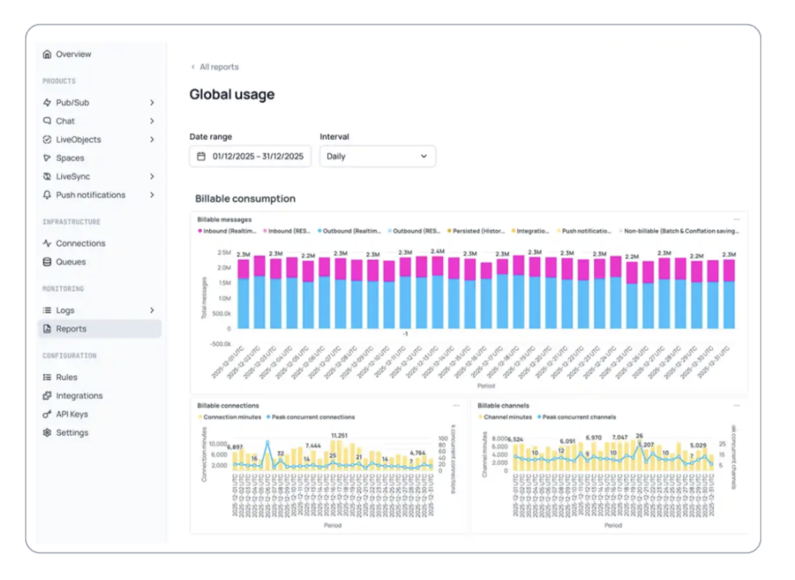

The Reports section in your Ably dashboard provides comprehensive analytics and insights for your application, enabling you to monitor usage patterns, analyze costs, and optimize your implementation. View your application reports in the [app dashboard](https://ably.com/accounts/any/apps/any/reports) under the Reports section. This interface offers both high-level summaries and detailed breakdowns of your application's activity.

### Available report sections <a id="available-sections"/>

Currently available reports:

| Report | Description |
|---|---|
| Global usage report | Comprehensive usage metrics and cost analysis for your application |

## Global usage report <a id="global-usage"/>

### Billable consumption reports <a id="billable-consumption"/>

The billable consumption section provides detailed usage metrics and cost analysis through the Global usage report.

#### Global usage report <a id="global-usage-detail"/>

The Global usage report offers a consolidated view of your application's realtime activity and efficiency, showing:

- Growth trends and traffic patterns
- Resource consumption breakdowns
- Billable usage patterns and optimization opportunities

Click on the Global usage report to access detailed consumption analytics and usage breakdowns.

## Global usage detailed view <a id="global-usage-detailed"/>

When you access the Global usage report, you see comprehensive analytics across multiple categories that help you understand your application's resource consumption and identify optimization opportunities.

### Billable messages <a id="billable-messages"/>

The billable messages section tracks message traffic across delivery methods including inbound/outbound realtime and REST messages, persisted messages, integrations, push notifications, and optimization savings. The total messages chart displays volume trends over time.

### Billable connections <a id="billable-connections"/>

Connection analytics track your application's client connectivity patterns including connection minutes and peak concurrent connections to help you understand connection patterns and plan for scaling requirements.

### Billable channels <a id="billable-channels"/>

Channel usage metrics provide insights into your messaging infrastructure utilization including channel minutes and peak concurrent channels to help you monitor channel scaling patterns.

### Message type traffic <a id="message-type-traffic"/>

This section breaks down message activity by content type including messages, presence events, objects, and annotations.

### Cost optimization insights <a id="cost-optimization"/>

The reports include analysis of Ably's built-in optimization features that reduce your costs including delta bandwidth savings and batching/conflation savings that eliminate unnecessary messages.

### Usage breakdown <a id="usage-breakdown"/>

The detailed usage breakdown provides granular analysis with comprehensive hourly data tables showing metrics such as messages, bandwidth, connections, channels, and push notifications. This tabular data enables detailed analysis of usage patterns and helps identify opportunities for further optimization.

#### Export functionality <a id="export-functionality"/>

The usage breakdown data can be exported as a CSV file for further analysis in external tools. CSV exports are automatically named with timestamps (for example, `app_stats_details_v2_0_1_2025-12-29T19_09_45.352702118Z.csv`) to help you organize and track different export versions.
