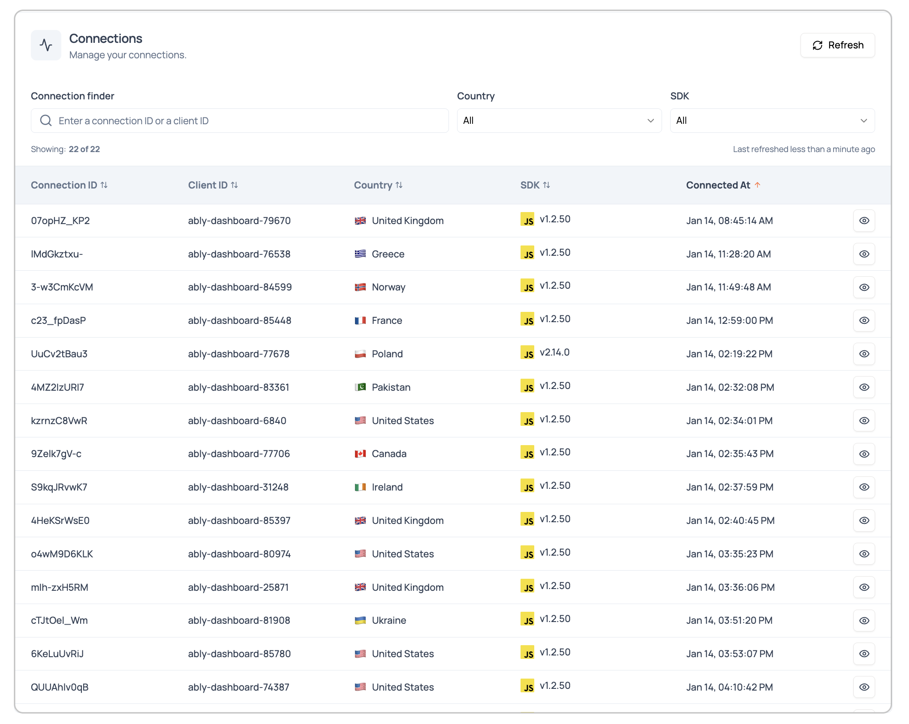

The Connections section in your Ably dashboard shows you exactly who's connected to your application and which channels they're attached to. Monitor your connections through the [app dashboard](https://ably.com/accounts/any/apps/any/connections) under the Connections section. This interface provides visibility into active client connections and their channel subscriptions, enabling you to understand how your application is being used in realtime.

## Connection browser <a id="connection-browser"/>

The main connections interface shows you who's currently connected to your application. You can see each client's identity, location, and quickly access which channels they're using.

### Connection finder and filtering <a id="connection-filtering"/>

Find and filter connections in your dashboard:

1. **Search for specific connections** - Use the connection finder search box to filter by connection ID or client ID.
2. **Filter by location** - Use the country filter to view connections from specific geographic locations.
3. **Filter by SDK** - Use the SDK filter to view connections using specific client SDK versions.

The interface shows connection totals, giving you immediate awareness of active connections and helping you track connection volume over time.

### Connection list <a id="connection-list"/>

Each connection entry displays essential information for rapid assessment:

| Column | Description |
|---|---|
| Connection ID | Unique identifier for each client connection. |
| Client ID | Application-defined client identifier or blank. |
| Country | Geographic location with flag indicator. |
| SDK | Client SDK version and platform icon. |
| Inspect button | Eye icon for detailed connection access. |

Click the **inspect** button (eye icon) next to any connection to access detailed connection information and monitoring tools.

## Connection inspection <a id="connection-inspection"/>

When you click the **inspect** button on any connection, you access a comprehensive connection monitoring interface that provides detailed visibility into that specific connection's behavior and configuration.

### Connection overview <a id="connection-overview"/>

The inspection page opens with a detailed overview showing critical connection information and realtime status. The header displays the full Connection ID with a copy button for easy reference, along with breadcrumb navigation back to the main connections list.

#### Connection details <a id="connection-details"/>

The overview displays essential connection information:

| Detail | Description |
|---|---|
| Client ID | Application-defined identifier (shows N/A if not set). |
| Transport type | Connection method such as WebSocket. |
| Created | Connection establishment timestamp. |
| Status | Current connection state with indicator. |
| IP address | Geographic location and IP address. |
| SDK | Client library version and platform. |
| Platform | Operating system or runtime environment. |

#### Authentication section <a id="authentication"/>

The authentication section shows the security configuration for this connection:

| Authentication detail | Description |
|---|---|
| Auth type | Authentication method used, for example Basic. |
| Security | Security protocol in use, for example TLS. |
| Key ID | API key identifier used for authentication. |

#### Capabilities <a id="capabilities"/>

The capabilities section displays feature support for this connection, shown as capability strings that indicate which Ably features the client can use.

#### Activity monitoring <a id="activity-monitoring"/>

The activity section provides realtime metrics with message flow visualization:

| Activity metric | Description |
|---|---|
| Inbound message rate | Messages per second sent by this client. |
| Outbound message rate | Messages per second delivered to this client. |

The activity chart visualizes message flow over time with separate tracking for inbound and outbound messages, helping you identify usage patterns and potential issues.

#### Live logs <a id="live-logs"/>

The live logs section shows realtime events specific to this connection:

| Log detail | Description |
|---|---|
| Timestamp | When each event occurred. |
| Resource ID | Which channel or resource was involved. |
| Event type | Type of connection event. |
| Level | Severity indicator with status badges. |

## Attached channels <a id="attached-channels"/>

The "Attached channels" tab shows you exactly which channels each connected client is using - this is where you can see how clients are engaging with different parts of your application.

### Channel activity monitoring <a id="channel-activity"/>

Monitor channel activity for this connection:

1. **Search channels** - Use the channel finder search box to filter channels by name.
2. **View channel count** - Check the total number of attached channels.
3. **Review channel list** - Examine each channel with its activity metrics.

### Individual channel details <a id="individual-channels"/>

For each attached channel, the interface shows:

| Channel detail | Description |
|---|---|
| Channel name | Full channel identifier. |
| Modes | Connection modes like presence, publish, subscribe. |
| Inbound message rate | Messages per second sent by this client to the channel. |
| Outbound message rate | Messages per second delivered to this client from the channel. |
| Activity chart | Realtime message flow visualization. |
| Inspect button | Eye icon for detailed channel access. |

### Channel inspection navigation <a id="channel-navigation"/>

When you click the **Inspect** button on any channel in the attached channels list, you navigate to the comprehensive channel inspection interface in the Pub/Sub section. This provides detailed channel monitoring including:

- Channel overview and analytics
- All connections to that channel
- Message history and realtime flow
- Presence tracking
- Channel configuration and rules

This seamless navigation allows you to move from connection-specific monitoring to channel-wide analysis, enabling comprehensive troubleshooting across both connection and channel perspectives.
