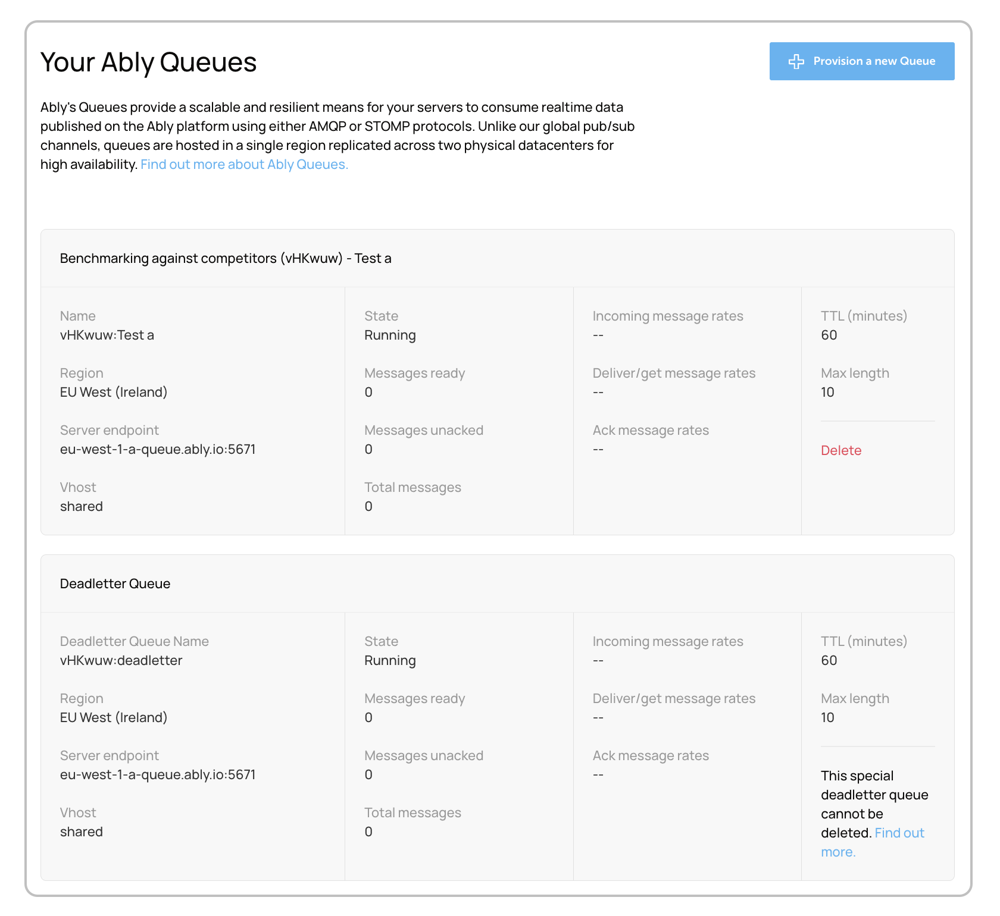

Ably queues provide a way to consume realtime data using the [AMQP](/docs/platform/integrations/queues#consume-amqp) or [STOMP](/docs/platform/integrations/queues#consume-stomp) protocols. Manage your queues through the [app dashboard](https://ably.com/accounts/any/apps/any/queues) under the Queues section. Find out more about using [Ably queues](/docs/platform/integrations/queues#what).

## Manage your Ably queues <a id="manage-queues"/>

The Ably queues tab enables you to:

* Access a list of all your existing queues.
* Monitor realtime data flow and queue performance.
* Click on any queue to view and adjust its settings, such as TTL, maximum length, and region.

### Provision a new queue <a id="provision-queue"/>

When creating a new queue, you need to specify:

* Name - Choose a unique identifier for your queue.
* Region - Select the geographic location for optimal latency and data residency.
* TTL (Time to Live) - Set how long messages remain before automatic deletion (default limit: 60 minutes).
* Max length - Define maximum message capacity (default: 10,000 messages).

Contact Ably support if you need higher limits for TTL or message capacity.

### Set up queue rules <a id="setup"/>

Once you have provisioned a physical queue, you need to set up one or more queue rules to republish messages, presence events or channel events from pub/sub channels into a queue. Queue rules can either be used to publish to internal queues (hosted by Ably) or external external streams or queues (such as Amazon Kinesis and RabbitMQ). Publishing to external streams or queues is part of our [Ably Firehose servers](/docs/platform/integrations/streaming).

Ably queue rules are setup in the **Integrations** tab found within your app **dashboard**. Find out more about setting up [queue rules](/docs/platform/integrations/queues#setup).
