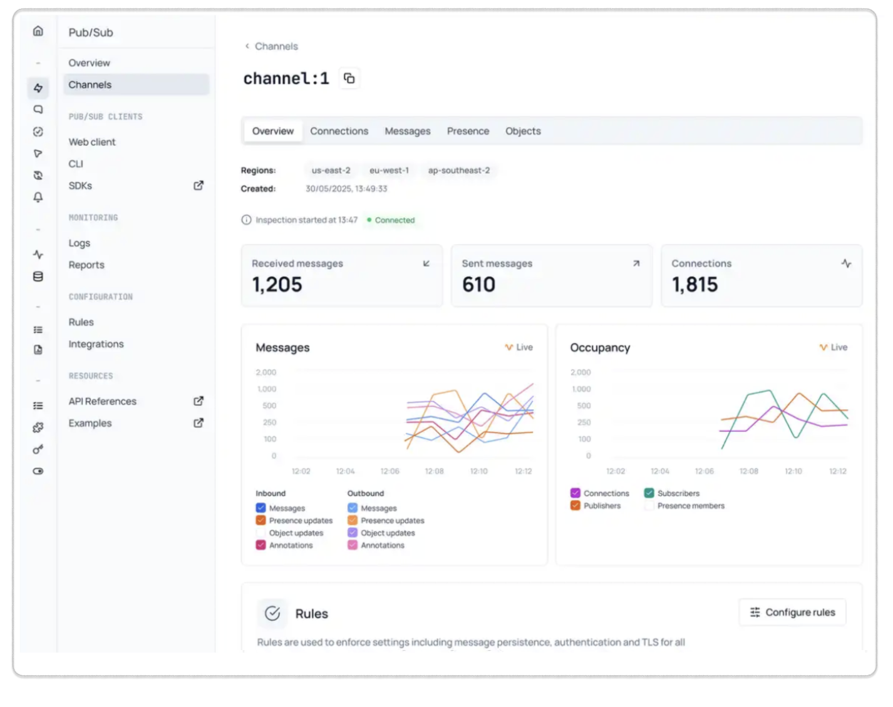

The Chat section in your Ably dashboard provides a centralized hub for managing realtime messaging and user interactions across your chat application. Access the [Chat dashboard](https://ably.com/accounts/any/apps/any/chat) to monitor and manage your chat rooms. From this overview page, you can quickly access getting started guides for different platforms, explore ready-to-use examples, and review recent product updates through the changelog.

The dashboard makes it easy to jump into room monitoring, review implementation patterns, and stay updated with the latest Chat features and fixes.

## Rooms <a id="rooms"/>

The rooms interface serves as your primary dashboard for monitoring and managing all chat messaging activity across your application. This section provides realtime visibility into room performance, user connections, and message flow, enabling you to quickly identify issues and optimize your chat implementation.

Navigate to the rooms section through the dashboard sidebar under Products > Chat > Rooms. The main rooms view displays all active rooms in a clean, searchable interface that makes it easy to monitor your entire chat infrastructure at a glance.

### Room browser functionality <a id="room-browser"/>

The room finder search box allows you to quickly locate specific rooms by name - essential when managing applications with numerous rooms across different features or namespaces. Simply enter a room name or partial match to filter the results and find the rooms you need to inspect.

The interface shows exactly how many rooms are currently active with a counter display, giving you immediate awareness of your application's chat scope and helping you track room growth over time.

Each room entry shows the **room name** for identification, the **user count** displaying realtime connected users for monitoring activity patterns, and an **inspect button** (eye icon) for accessing detailed monitoring and configuration.

The user count column is particularly valuable for identifying rooms experiencing high activity, unusual participation patterns, or potential connection issues. Rooms with unexpectedly high or low user counts can indicate performance problems, client-side issues, or changes in user behavior that need investigation.

## Room inspection <a id="inspection"/>

When you click the inspect button (eye icon) next to any room in the rooms list, you access a comprehensive room monitoring interface that provides deep visibility into that specific room's behavior, performance, and configuration.

### Room inspection overview <a id="inspection-overview"/>

The inspection page opens with a detailed overview showing critical room information and realtime metrics. The header displays the full room name with a copy button for easy reference, along with breadcrumb navigation back to the main rooms list.

#### Live analytics and visualization

The inspection interface provides two primary analytics sections with live, updating charts that help you understand room behavior over time.

##### Messages analytics

The messages chart displays realtime inbound and outbound message flow with color-coded tracking for different message types. Use this to identify message patterns and delivery bottlenecks.

##### Occupancy analytics

The occupancy chart tracks connections, participants, and presence members over time. Use this data to understand user engagement patterns and optimize your chat architecture.

#### Room configuration and rules

The rules section provides comprehensive configuration options for controlling room behavior and security requirements. You can configure three categories of rules:

| Rule category | Configuration options |
|---|---|
| Storage rules | Persist last message, persist all messages. |
| Room rules | Identification required, TLS required. |
| Feature rules | Push notifications, message annotations/updates/deletes. |

#### Integrations

The integrations section allows you to connect rooms to external services and configure automated workflows triggered by room activity.

Use the **Add integration** button to set up new external connections.

#### Live logs and debugging

The live logs section provides essential debugging capabilities through realtime event monitoring and error tracking.

| Log type | Description |
|---|---|
| API requests | Monitor REST API calls and authentication attempts. |
| Rooms | Track room creation, configuration changes, and lifecycle events. |
| Connections | Monitor user connections, disconnections, and connection state changes. |
| Integration errors | Identify webhook failures, external service timeouts, and integration issues. |

When the logs show no entries, this indicates normal room operation without errors or notable events. During active debugging or high-traffic periods, you'll see realtime event streams that help diagnose issues and verify system behavior.

## Connections <a id="connections"/>

The connections tab provides detailed visibility into all users currently connected to your room, enabling you to monitor individual user behavior and troubleshoot client-specific issues.

### Connection overview <a id="connection-overview"/>

When you select the connections tab from the room inspection interface, you'll see a comprehensive list of all active connections to that specific room. The interface displays key connection information in an organized table format.

The following outlines the connection information displayed:

| Column | Information displayed |
|---|---|
| Connection ID | Unique identifier for each user connection. |
| Client ID | Application-defined user identifier. |
| Country | Geographic location of the connection. |
| SDK | Client SDK version and platform. |

The connection list shows practical information including the total number of active connections. Each connection entry includes an inspect button (eye icon) for detailed connection analysis.

### Individual connection inspection <a id="individual-connection"/>

When you click the inspect button on any connection, you access a detailed connection monitoring interface that provides comprehensive information about that specific user's behavior and configuration.

#### Overview

The overview tab displays essential information about the user connection:

| Connection detail | Information displayed |
|---|---|
| Client ID | Application-defined identifier (shows N/A if not set) |
| Transport type | Connection method, for example WebSocket |
| Created | Connection establishment timestamp |
| Status | Current connection state (Connected/Disconnected) |
| IP address | User's geographic location and IP |
| SDK | Client library version and platform |
| Platform | Operating system or runtime environment |

#### Authentication

The authentication section shows the security configuration for this connection:

| Authentication detail | Information displayed |
|---|---|
| Auth type | Authentication method used, for example Basic |
| Security | Security protocol in use, for example TLS |
| Key ID | API key identifier used for authentication |

#### Capabilities

The capabilities section displays what features this user supports, shown as capability strings that indicate which Ably features the client can use.

#### Activity

The activity section provides realtime metrics for this specific connection with message flow visualization:

| Activity metric | Information displayed |
|---|---|
| Inbound message rate | Messages per second sent by this user |
| Outbound message rate | Messages per second delivered to this user |

The activity chart visualizes message flow over time with separate tracking for inbound and outbound messages, helping you identify usage patterns and potential issues for individual connections.

#### Live logs

The live logs section shows realtime events specific to this connection, including connection establishment, message activity, and any errors:

| Log detail | Information displayed |
|---|---|
| Timestamp | When each event occurred |
| Resource ID | Which room or resource was involved |
| Event type | Type of connection event, for example connection.error, connection.attached |
| Level | Severity indicator (Info, Error, etc.) |

This connection-specific logging helps troubleshoot individual user issues and verify that connections are behaving as expected.

## Messages <a id="messages"/>

The messages tab provides access to all messages flowing through your room, enabling you to inspect message content and debug messaging issues in realtime.

### Message browser interface <a id="message-browser"/>

Use the message browser to monitor all messages in your room:

1. **Search messages** - Use the message finder search box to filter messages by content.
2. **Check API status** - Verify your API key connection status in the indicator.
3. **Monitor activity** - View the message counter to see total message count.
4. **Control updates** - Use the detach option to stop live message streaming when needed.

### Message list details <a id="message-list"/>

Each message entry provides key information for debugging:

| Message detail | Information displayed |
|---|---|
| Message ID | Unique identifier for each message |
| Connection ID | Source connection identifier (N/A for REST API messages) |
| Name | Message name or event type |
| Data | Message payload content preview |
| Timestamp | When the message was published |
| Message button | Click to view full JSON details |

### JSON message inspection <a id="json-message"/>

Click on any message to view the complete JSON structure in the right panel. The JSON view organizes information into categories for debugging:

| Field category | JSON elements |
|---|---|
| ID and identification | Message identifiers and client references |
| Action and encoding | Message action type and encoding information |
| Data payload | Complete message content with nested data structures |
| Timestamps and metadata | Message timing and system information |

The JSON view provides syntax highlighting and expandable structures for debugging message format, verifying data integrity, and understanding the complete message structure.

## Presence <a id="presence"/>

The presence tab allows you to monitor user presence activity in your room, tracking when users enter, leave, or update their status.

### Presence interface <a id="presence-interface"/>

Use the presence browser to monitor user activity in your room:

1. **Search presence events** - Use the presence finder search box to filter presence events.
2. **Check API status** - Verify your API key connection status in the indicator.
3. **Monitor presence activity** - View the presence counter to see total presence events.
4. **Control updates** - Use the detach option to stop live presence monitoring when needed.

### Presence event details <a id="presence-events"/>

Each presence event entry provides key information for monitoring user activity:

| Presence detail | Information displayed |
|---|---|
| Client ID | Application-defined identifier (shows N/A if not set) |
| Action | Event type such as enter, leave, or update |
| Data | User-provided presence data payload |
| Timestamp | When the presence event occurred |
| Event button | Click to view full JSON details |

### JSON presence inspection <a id="json-presence"/>

Click on any presence event to view the complete JSON structure in the right panel. The JSON view organizes information into categories for debugging:

| Field category | JSON elements |
|---|---|
| ID and identification | User identifiers and connection references |
| Action and state | Presence action type and current state |
| Data payload | Complete presence data with nested structures |
| Timestamps and metadata | Event timing and system information |

The JSON view provides syntax highlighting and expandable structures for debugging presence data format, verifying user information, and understanding the complete presence event structure.

When the interface shows no presence events, this indicates no recent presence activity. This is normal for rooms where users connect for messaging without requiring presence tracking.

## Clients <a id="clients"/>

### Web client <a id="web-client"/>

The [web client](/docs/platform/account/app/client) provides a browser-based interface for testing and debugging your chat implementation without writing code. Use it to send messages, join rooms, and verify your application behavior during development.

### CLI <a id="cli"/>

The [Ably CLI](/docs/platform/tools/cli) offers command-line tools for managing chat operations, testing rooms, and automating messaging workflows. Use it for scripting, CI/CD integration, and server-side debugging.
