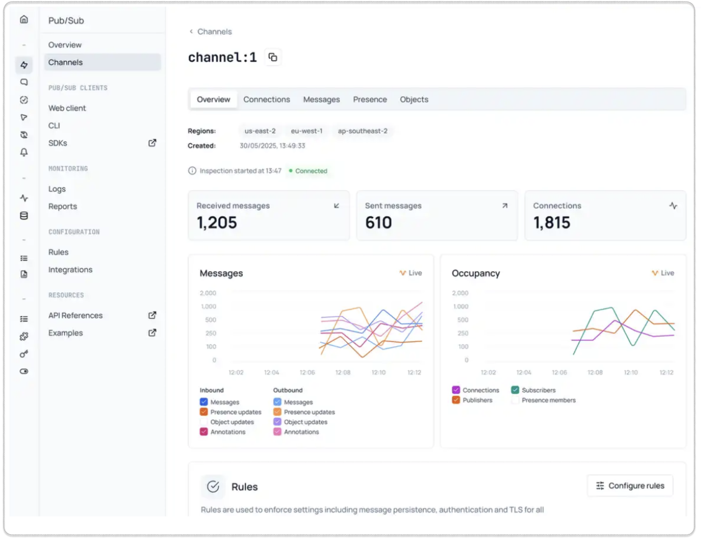

The Pub/Sub section of the [app dashboard](https://ably.com/accounts/any/apps/any/channels) provides tools for monitoring and managing realtime messaging across your application. From this page, you can access getting started guides, explore examples, and monitor channels.

## Channels <a id="channels"/>

The channels section lists all active channels with their connection counts. Use the search box to filter channels by name. Click the inspect button (eye icon) on any channel to view detailed monitoring information.

## Channel inspection <a id="inspection"/>

The channel inspection page shows detailed information for a specific channel:

### Live analytics <a id="live-analytics"/>

The inspection page displays two live charts:

- Messages analytics showing inbound and outbound message flow
- Occupancy analytics tracking connections, publishers, subscribers, and presence members over time

### Configuration and rules <a id="configuration-rules"/>

The rules section shows the channel's configuration including storage rules (message persistence and history retention), rules (security requirements like identification and TLS), and feature rules (push notifications, message annotations).

### Integrations <a id="integrations"/>

Connect channels to external services and configure automated workflows triggered by channel activity.

### Live logs <a id="live-logs"/>

The live logs section shows realtime events for the channel, including API requests, channel events, connection events, and integration errors.

## Connections <a id="connections"/>

The connections tab lists all clients connected to the channel. Each entry shows the connection ID, client ID (if set), geographic location, and SDK version. Click inspect on any connection to view details including authentication, capabilities, activity metrics, and live logs.

## Messages <a id="messages"/>

The messages tab displays messages flowing through the channel. Use the search box to filter messages. Click any message to view the full JSON structure in the detail panel.

## Presence <a id="presence"/>

The presence tab shows client presence activity on the channel, tracking when clients enter, leave, or update their status. Click any presence event to view the full JSON details.

## Clients <a id="clients"/>

### Web client <a id="web-client"/>

The [web client](/docs/platform/account/app/client) provides a browser-based interface for testing your pub/sub implementation without writing code.

### CLI <a id="cli"/>

The [Ably CLI](/docs/platform/tools/cli) provides command-line tools for managing pub/sub operations, testing channels, and automating messaging workflows.
