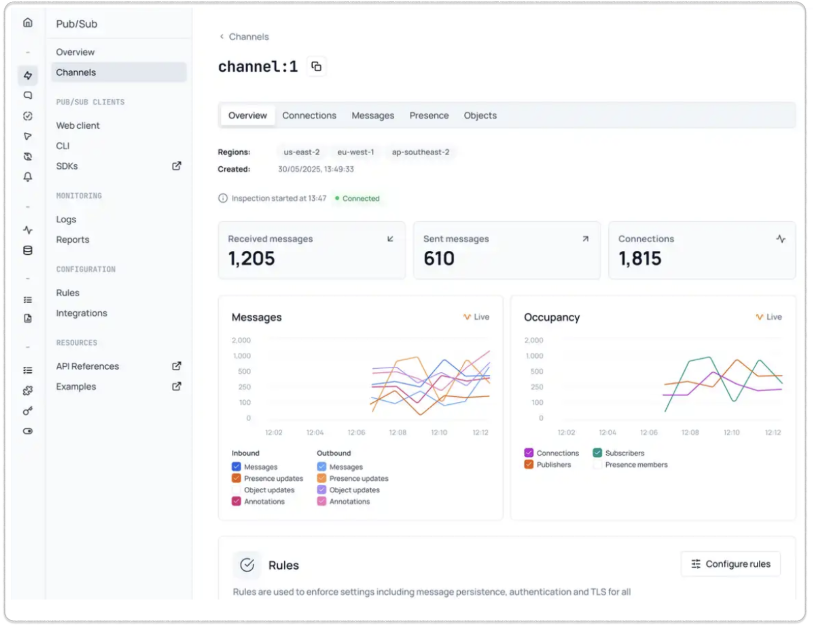

The Pub/Sub section of the [app dashboard](https://ably.com/accounts/any/apps/any/channels) provides tools for monitoring and managing realtime messaging across your application that is specific to [Ably Pub/Sub](/docs/basics).

## Channels <a id="channels"/>

The channels section lists all active channels with their connection counts. Use the search box to filter channels by name. Click the inspect button on any channel to view detailed information about that channel, along with a live feed of events being published to it.

### Channel overview <a id="channel-overview"/>

The channel overview provides a realtime view of activity on the channel:

This view also includes:

* Live analytics showing the current rate of messages on the channel.
* Any configured [rules](/docs/channels#rules) that apply to the channel.
* Any configured [integrations](/docs/integrations) that will run against the channel.
* Live logs showing lifecycle events for that channel, such as the regions it is active in.

### Connections <a id="connections"/>

The connections tab lists all clients currently connected to the channel. Click **Inspect** on any connection to view details of that [connection](/docs/platform/account/app/connections), including a list of channels it is connected to.

## Messages <a id="messages"/>

The messages tab displays a realtime view of messages and events being published to the channel.

## Presence <a id="presence"/>

The presence tab displays a realtime view of presence events occurring on the channel, every time a client enters, leaves, or updates their presence state.
