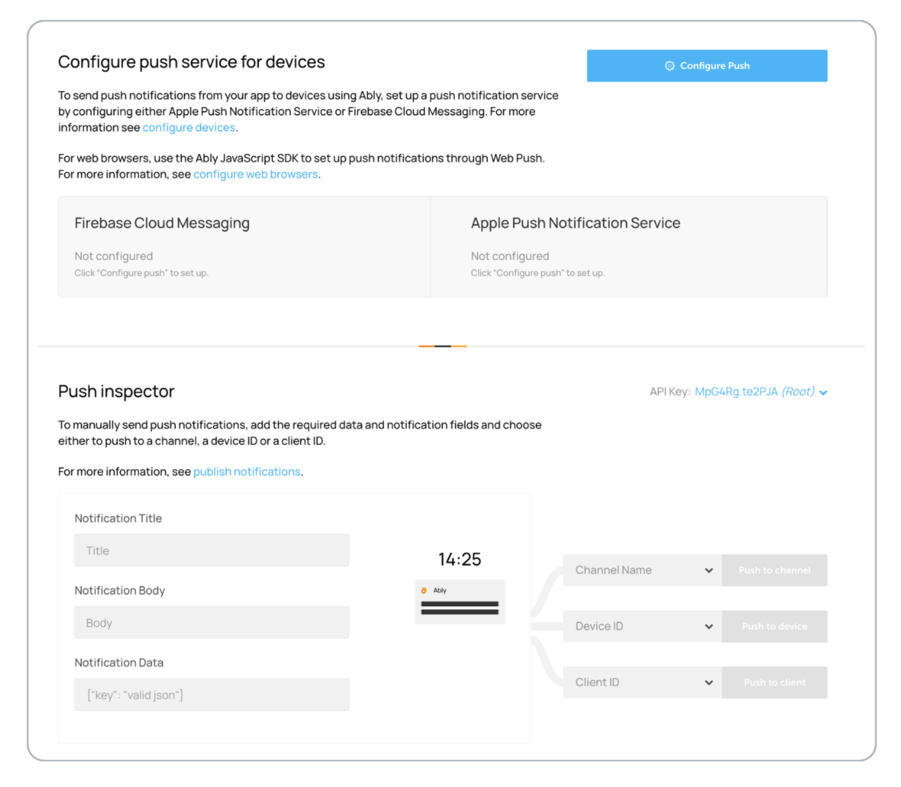

Before you can start using Ably's push notification services, you must configure the credentials for the third-party services you wish to integrate:

* [FCM](/docs/push/configure/device#fcm) for Android devices.
* [APNS](/docs/push/configure/device#apns) for iOS devices.
* [Web Push](/docs/push/configure/web) for web browsers.

## Push inspector <a id="push-inspector"/>

The Push inspector enables you to manually send push notifications to test and debug your notification setup.

Each push notification requires a title and body. You can also include extra data for app functionality:

1. Write a short, clear title that captures the essence of the notification.
2. Include the key information or message that you want the user to read.
3. Optionally, add any extra data needed for app functionality, such as custom metadata or instructions.

Push notifications can be sent to a channel, a specific device, or a specific client:

* Channel: enter the channel name in the target field and click "push to channel".
* Device: enter the Device ID in the target field and click "push to device".
* Client: enter the Client ID in the target field and click "push to client".

## Push inspector widget <a id="push-widget"/>

Use the Push inspector widget to monitor your push notification infrastructure. It provides inspection tools for channels, devices, and clients:

* Channel subscriptions: view and inspect all channels currently subscribed to push notifications.
* Device registrations: access a list of all devices registered to receive push notifications.
* Client registrations: get an overview of all clients registered for push notifications within the Ably account.
