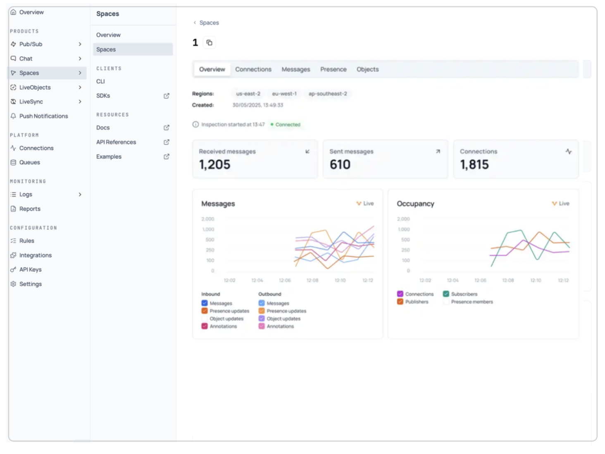

The Spaces section in your Ably dashboard provides a centralized hub for managing collaborative features and realtime interactions across your application. Access the [Spaces dashboard](https://ably.com/accounts/any/apps/any/spaces) to monitor and manage your collaborative spaces. From this overview page, you can quickly access getting started guides for different platforms, explore ready-to-use examples, and review recent product updates through the changelog.

The dashboard makes it easy to jump into space monitoring, review implementation patterns, and stay updated with the latest Spaces features and fixes.

## Spaces <a id="spaces"/>

The spaces interface serves as your primary dashboard for monitoring and managing all collaborative activity across your application. This section provides realtime visibility into space performance, member connections, and interaction flow, enabling you to quickly identify issues and optimize your collaborative implementation.

Navigate to the spaces section through the dashboard sidebar under Products > Spaces > Spaces. The main spaces view displays all active spaces in a clean, searchable interface that makes it easy to monitor your entire collaborative infrastructure at a glance.

### Space browser functionality <a id="space-browser"/>

The space finder search box allows you to quickly locate specific spaces by name - essential when managing applications with numerous collaboration areas across different features or namespaces. Simply enter a space name or partial match to filter the results and find the spaces you need to inspect.

The interface shows exactly how many spaces are currently active with a counter display, giving you immediate awareness of your application's collaborative scope and helping you track space growth over time.

Each space entry shows the **space name** for identification, the **member count** displaying realtime connected members for monitoring activity patterns, and an **inspect button** (eye icon) for accessing detailed monitoring and configuration.

The member count column is particularly valuable for identifying spaces experiencing high activity, unusual participation patterns, or potential connection issues. Spaces with unexpectedly high or low member counts can indicate performance problems, client-side issues, or changes in user behavior that need investigation.

## Space inspection <a id="inspection"/>

When you click the inspect button (eye icon) next to any space in the spaces list, you access a comprehensive space monitoring interface that provides deep visibility into that specific space's behavior, performance, and configuration.

### Space inspection overview <a id="inspection-overview"/>

The inspection page opens with a detailed overview showing critical space information and realtime metrics. The header displays the full space name with a copy button for easy reference, along with breadcrumb navigation back to the main spaces list.

#### Live analytics and visualization <a id="live-analytics"/>

The inspection interface provides two primary analytics sections with live, updating charts that help you understand space behavior over time.

##### Messages analytics <a id="messages-analytics"/>

The messages chart displays realtime inbound and outbound message flow with color-coded tracking for different message types. Use this to identify interaction patterns and delivery bottlenecks.

##### Occupancy analytics <a id="occupancy-analytics"/>

The occupancy chart tracks connections, members, and presence data over time. Use this data to understand collaboration patterns and optimize your space architecture.

#### Space configuration and rules <a id="configuration-rules"/>

The rules section provides configuration options for controlling space behavior and security requirements. Configure **Storage rules** to control message persistence and history retention, **Space rules** to enforce security requirements like identification and TLS, and **Feature rules** to enable advanced capabilities such as push notifications and message annotations.

#### Integrations <a id="integrations"/>

The integrations section allows you to connect spaces to external services and configure automated workflows triggered by collaborative activity.

Use the **Add integration** button to set up new external connections.

#### Live logs and debugging <a id="live-logs-debugging"/>

The live logs section provides essential debugging capabilities through realtime event monitoring and error tracking.

Live logs track **API requests** for monitoring REST API calls and authentication, **Spaces** for creation and configuration changes, **Connections** for member state changes, and **Integration errors** for webhook failures and external service issues.

When the logs show no entries, this indicates normal space operation without errors or notable events. During active debugging or high-traffic periods, you'll see realtime event streams that help diagnose issues and verify system behavior.

## Connections <a id="connections"/>

The connections tab provides detailed visibility into all members currently connected to your space, enabling you to monitor individual member behavior and troubleshoot client-specific issues.

### Connection overview <a id="connection-overview"/>

When you select the connections tab from the space inspection interface, you'll see a comprehensive list of all active connections to that specific space. The interface displays key connection information in an organized table format.

Each connection shows its unique connection ID, client ID (if set), geographic location, and SDK version. The connection list displays the total number of active connections, with an inspect button (eye icon) for detailed analysis of each connection.

### Individual connection inspection <a id="individual-connection"/>

When you click the inspect button on any connection, you access a detailed connection monitoring interface that provides comprehensive information about that specific member's behavior and configuration.

#### Overview <a id="overview"/>

The overview tab displays essential information about the member connection, including client ID, transport type, creation timestamp, connection status, IP address and geographic location, SDK version, and platform.

#### Authentication <a id="authentication"/>

The authentication section shows the security configuration for this connection, including the auth type, security protocol, and API key identifier.

#### Capabilities <a id="capabilities"/>

The capabilities section displays what features this member supports, shown as capability strings that indicate which Ably features the client can use.

#### Activity <a id="activity"/>

The activity section provides realtime metrics for this specific connection, showing inbound and outbound message rates. The activity chart visualizes interaction flow over time, helping you identify usage patterns and potential issues for individual connections.

#### Live logs <a id="connection-logs"/>

The live logs section shows realtime events specific to this connection, including connection establishment, interaction activity, and any errors. Each log entry shows the timestamp, resource ID, event type, and severity level. This connection-specific logging helps troubleshoot individual member issues and verify that connections are behaving as expected.

## Messages <a id="messages"/>

The messages tab provides access to all messages flowing through your space, enabling you to inspect interaction content and debug messaging issues in realtime.

### Message browser interface <a id="message-browser"/>

Use the message browser to monitor all messages in your space:

1. Use the message finder search box to filter messages by content.
2. Verify your API key connection status in the indicator.
3. View the message counter to see total message count.
4. Use the detach option to stop live message streaming when needed.

### Message list details <a id="message-list"/>

Each message entry displays the message ID, source connection ID, message name, data payload preview, and timestamp. Click any message to view the full JSON details.

### JSON message inspection <a id="json-message"/>

Click on any message to view the complete JSON structure in the right panel. The JSON view organizes information into identification, action and encoding, data payload, and timestamps and metadata categories with syntax highlighting and expandable structures.

## Presence <a id="presence"/>

The presence tab allows you to monitor member presence activity in your space, tracking when members enter, leave, or update their status.

### Presence interface <a id="presence-interface"/>

Use the presence browser to monitor member activity in your space:

1. Use the presence finder search box to filter presence events.
2. Verify your API key connection status in the indicator.
3. View the presence counter to see total presence events.
4. Use the detach option to stop live presence monitoring when needed.

### Presence event details <a id="presence-events"/>

Each presence event entry displays the client ID, action type (enter, leave, or update), data payload, and timestamp. Click any event to view the full JSON details.

### JSON presence inspection <a id="json-presence"/>

Click on any presence event to view the complete JSON structure in the right panel. The JSON view organizes information into identification, action and state, data payload, and timestamps and metadata categories with syntax highlighting and expandable structures.

When the interface shows no presence events, this indicates no recent presence activity. This is normal for spaces where members connect for collaboration without requiring presence tracking.

## Clients <a id="clients"/>

### Web client <a id="web-client"/>

The [web client](/docs/platform/account/app/client) provides a browser-based interface for testing and debugging your spaces implementation without writing code. Use it to interact with collaborative features, join spaces, and verify your application behavior during development.

### CLI <a id="cli"/>

The [Ably CLI](/docs/platform/tools/cli) offers command-line tools for managing spaces operations, testing collaborative features, and automating interaction workflows. Use it for scripting, CI/CD integration, and server-side debugging.
