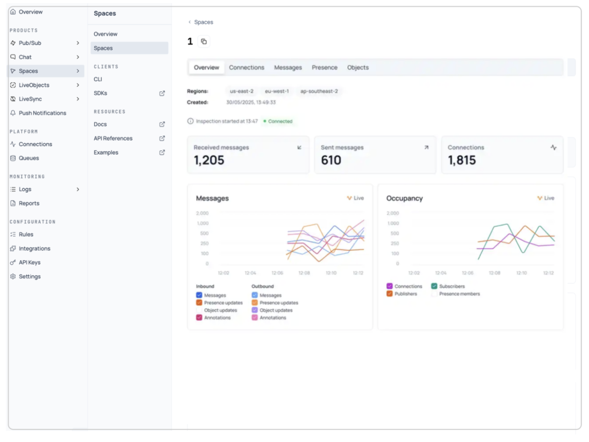

The Spaces section of the [app dashboard](https://ably.com/accounts/any/apps/any/spaces) provides tools for monitoring and managing collaborative spaces across your application that is specific to [Ably Spaces](/docs/spaces).

## Spaces <a id="spaces"/>

The spaces section lists all active spaces with their member counts. Use the search box to filter spaces by name. Click the inspect button on any space to view detailed information about that space, along with a live feed of events being published to it.

### Space overview <a id="space-overview"/>

The space overview provides a realtime view of activity on the space:

This view also includes:

* Live analytics showing the current rate of messages on the space.
* Any configured [rules](/docs/channels#rules) that apply to the space.
* Any configured [integrations](/docs/integrations) that will run against the space.
* Live logs showing lifecycle events for that space, such as the regions it is active in.

### Connections <a id="connections"/>

The connections tab lists all members currently connected to the space. Click **Inspect** on any connection to view details of that [connection](/docs/platform/account/app/connections), including a list of spaces it is connected to.

## Messages <a id="messages"/>

The messages tab displays a realtime view of messages and events being published to the space.

## Presence <a id="presence"/>

The presence tab displays a realtime view of presence events occurring on the channel, every time a member enters, leaves, or updates their member data.
