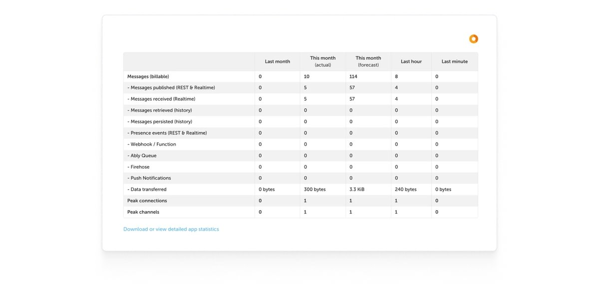
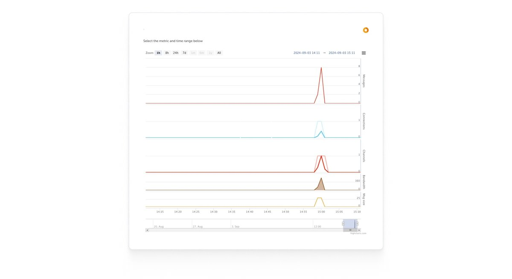

The stats tab is an interface to monitor your app's performance and usage via the [statistics table](#table) and [statistics chart](#chart).

## Statistics table <a id="table"/>

The statistics table provides a summary of your app's messaging and data usage patterns over different time frames, including the previous month, the current month, and more granular insights from the last hour and last minute:

The following explains the statistics table metrics:

| Metric | Description |
|--------|-------------|
| Messages (billable) | Total number of messages used. |
| Messages published (REST & Realtime) | Number of messages sent via REST and Realtime. |
| Messages received (Realtime) | Number of messages received. |
| Messages persisted (history) | Number of messages retrieved from history. |
| Messages retrieved (history) | Number of messages retrieved from history. |
| Presence events (REST & Realtime) | Number of presence-related events via REST and Realtime. |
| Webhook / Function | Number of messages transferred through functions and webhooks. |
| Ably Queue | Number of messages transferred through queues. |
| Firehose | Number of messages transferred through Firehose. |
| Push notifications | Number of push notifications sent. |
| Data transferred | Amount of data transferred, in bytes. |
| Peak connections | Highest number of concurrent connections. |
| Peak channels | Highest number of concurrent channels. |

<Aside data-type='note'>
Download or view detailed app statistics for a more granular analysis, enabling deeper dives into specific metrics as needed.
</Aside>

## Statistics chart <a id="chart"/>

The Stats page also includes a chart that visualizes your app's data over time:

The following explains how to use the statistics chart:

* **Duration**: Define a specific time range for the statistics you want to view. This enables you to focus on periods of particular interest. For example, set the time range from "2024-06-17 00:00" to "2024-08-06 11:18" to analyze data within that period.
* **Zoom**: Use preset zoom options (1h, 8h, 24h, 7d, 1m, 6m, 1y, all) to adjust the chart's view to different periods, enabling you to analyze data at various granularities.
