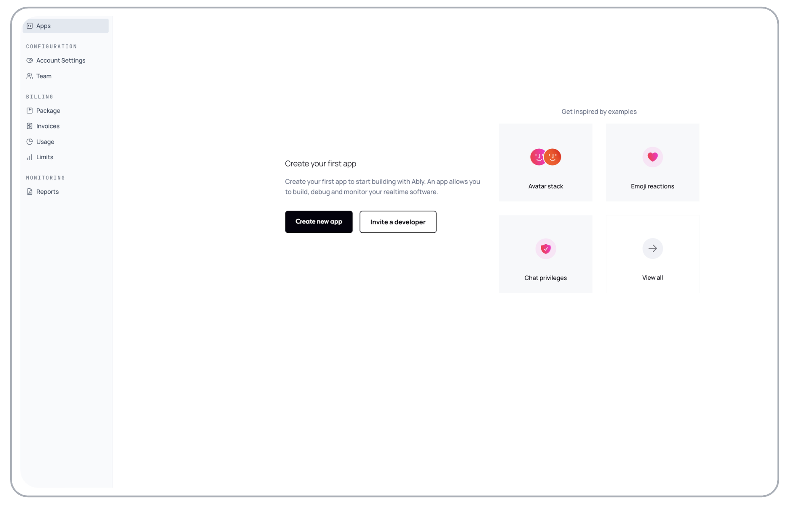

The app dashboard enables you to manage your realtime applications with complete oversight and control. From this central hub, you can create new apps to start building with Ably and view all your existing apps to monitor their performance and configuration.

Begin by [logging](https://ably.com/login) in to Ably through your browser. Once you're logged in, you have access to the Ably [dashboard](https://ably.com/accounts), where you can [create a new app](#create) or [view your existing apps](#view). Learn more about [getting started with Ably](/docs/getting-started).

## Create a new app <a id="create"/>

The following image displays the Ably dashboard when no apps have been created yet. To get started, you can easily [Create new app](https://ably.com/accounts/any/apps/new):

## View your apps <a id="view"/>

If you have created apps already, your dashboard will look similar to the one shown in the following image. Each app displayed is a link to its specific dashboard, where you can view and configure settings, as well as monitor usage and statistics:

### Environments <a id="environment"/>

Each Ably app acts as a sandboxed environment, isolated from other apps in your account. This makes it straightforward to set up separate environments for development, staging, and production by creating dedicated apps for each.

For example, if you're building a product called "chat-app", you could create:

- `chat-app-production` for your live production environment
- `chat-app-staging` for pre-production testing
- `chat-app-development` for ongoing development work

This approach provides complete isolation between environments, ensuring that development activities don't interfere with production traffic. An alternative approach for complete resource isolation, consider using separate Ably accounts for development and production environments. This ensures development activities cannot impact production resources under any circumstances.

<Aside data-type='important'>
Account limits are shared. While apps are sandboxed from each other, they share the same [account limits](/docs/platform/pricing/limits) such as connection counts and channel limits. A development app experiencing high usage could potentially impact your production app if account limits are reached.
</Aside>

## Account settings <a id="account-settings"/>

Secure your account and maintain control over core configurations with centralized account management features that protect your data and streamline administration.

The [Account settings page](https://ably.com/accounts/any/account) allows you to manage core account configurations. It includes the following features:

The account ID displays your unique Ably account identifier, which can be useful for support requests and API integrations.

The authentication settings section configures [two-factor authentication (2FA)](/docs/platform/account/2fa) requirements for all account users. When enabled, users who haven't set up 2FA will be prompted to do so when accessing the account. A setup guide is available for configuring 2FA.

As the account owner, you are the only person who can access the account settings page and make changes to packages and billing. Ownership can be transferred by contacting [Ably support](https://ably.com/support).

The delete profile option enables you to request account deletion. This requires contacting [Ably support](https://ably.com/support) to process the deletion.

## Team <a id="team"/>

Scale your development efforts by collaborating with team members while maintaining precise control over who can access what aspects of your Ably account.

The [Team page](https://ably.com/accounts/any/account/users) (also called Users) manages who has access to your Ably account. Learn more about [team management](/docs/platform/account/teams). Features include:

The account owner is displayed as the primary owner of the account with full permissions.

You can invite team members by email to collaborate on your Ably account.

Assign different [roles](/docs/platform/account/users#roles) to team members, including admin, developer, and billing roles. This allows for granular control over what each team member can access.

Track pending invitations, including expired invitations that can be resent.

Remove team members who no longer need access to the account.

## Package <a id="package"/>

Choose the right plan for your needs and manage your subscription to ensure you have the capacity and features required for your realtime applications to succeed.

The [Package page](https://ably.com/accounts/any/account/billing) is where you manage your subscription plan and billing information. Learn more about [Ably pricing](/docs/platform/pricing). It contains:

The current package shows your active subscription tier (Free, Standard, Pro, or Enterprise) with its included features and capacity limits.

### Package tiers <a id="package-tiers"/>

- [Free](/docs/platform/pricing/free): For building proof of concepts with 200 concurrent connections, 500 messages/second, and 6M messages/month
- [Standard](/docs/platform/pricing/standard) ($29/month + usage): For production rollout with 10k concurrent connections and channels, 2.5k messages/second, and 1-day email support SLA
- [Pro](/docs/platform/pricing/pro) ($399/month + usage): For scaling business-critical workloads with 50k concurrent connections and channels, 10k messages/second, 4-hour email support SLA, and Datadog integration
- [Enterprise](/docs/platform/pricing/enterprise) (Custom pricing): For unlimited workloads with 24/7 support, 99.999% uptime SLAs, committed use discounts, and advanced features like CNAME and SSO

The billing details form collects company name, billing email address, full address, telephone, timezone, and VAT number for invoicing purposes.

Upgrade options are available to move from your current plan to higher tiers.

## Invoices <a id="invoices"/>

Keep track of your billing history and payment methods to maintain transparent financial oversight of your Ably usage and ensure seamless payment processing.

The [Invoices section](https://ably.com/accounts/any/account/billing) (accessible via the Package page) displays. Learn more about [billing](/docs/platform/pricing/billing):

Payment method information shows details about your saved payment methods.

The invoice history lists all past invoices once you have an upgraded account. For free accounts, this section shows a message that invoices will appear when the account is upgraded.

Only the account owner can access billing pages and make package changes.

## Limits <a id="limits"/>

Monitor your usage patterns and understand your account's capacity constraints to optimize performance, avoid service interruptions, and plan for future scaling needs.

The [limits page](https://ably.com/accounts/any/account/limits) provides a comprehensive view of your account's usage limits and current consumption. Learn more about [account limits](/docs/platform/pricing/limits). It includes:

### Package details <a id="package-details"/>

- Package level (Free, Standard, Pro, Enterprise)
- Support contract details (SLA, support hours, response times, support channels)
- Customer Success Manager availability
- Add-on features

The limits summary provides a quick overview showing your monthly allocation versus actual usage for messages, data transferred, concurrent connections, and concurrent channels.

### Detailed account limits <a id="detailed-limits"/>

The detailed limits include:

- Messages and bandwidth: monthly limits (6M messages, 11.5 GiB for Free tier), hourly limits, and rate per second limits
- Other limits: maximum message size (64 KiB for Free), history TTL (24 hours), and chat retention TTL (30 days)
- Connections: concurrent connection limits, new connection rate, and inbound/outbound message rates per connection
- Channels: concurrent channel limits, channel creation rate, channels per connection, message rate per channel, and presence members per channel
- API rate: HTTP API request limits (hourly and per second) and token request limits
- Functions: rate limits for AWS Lambda, Google Functions, and Microsoft Azure integrations
- Webhooks: batched delivery limits and concurrency
- Ably queues: queue rate limits, maximum number of queues, unprocessed message limits, and message storage TTL

Links to view recent limit notifications and download detailed account statistics.

## Reports <a id="reports"/>

Gain valuable insights into your application's performance and usage patterns with comprehensive analytics that help you make data-driven decisions and optimize your realtime infrastructure.

The [Reports section](https://ably.com/accounts/any/account/reports) provides analytics and insights into your account usage. Currently available reports include:

- Global usage: a consolidated view of your account's realtime activity and efficiency, showing growth trends, traffic patterns, and overall performance metrics
- Global usage by app: a breakdown of activity by individual applications within your account, showing app-level metrics and billable consumption for each app

The Reports section is designed to expand over time, with Ably building out a suite of additional reporting features to help users gain deeper insights into their realtime infrastructure usage.
