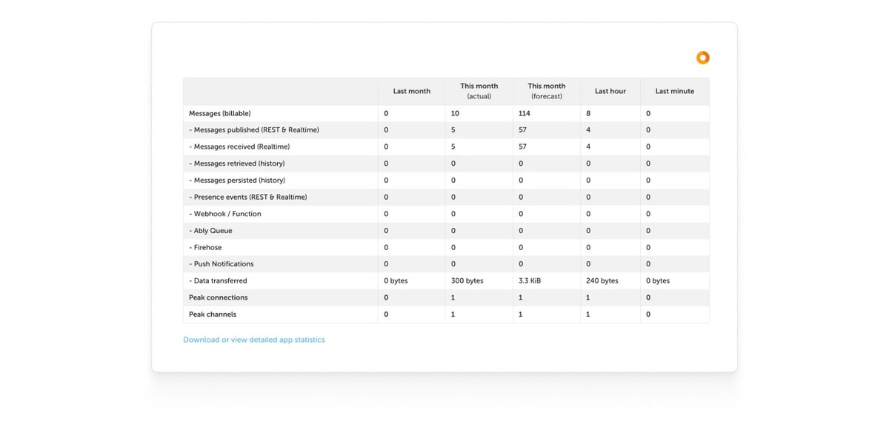
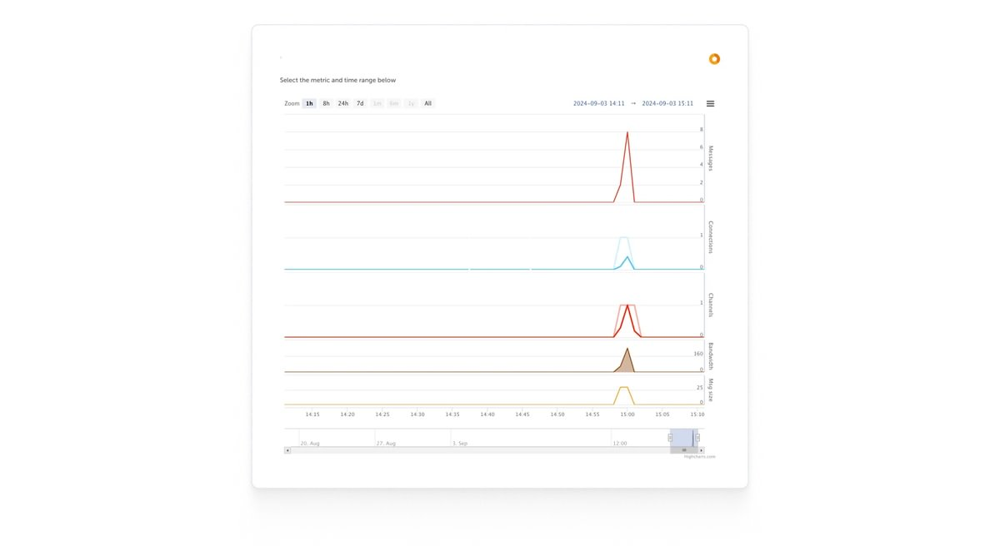

Access your [account](https://ably.com/login) dashboard to manage organizations, apps, team members, billing, usage monitoring, and reports.

## Organization and account selection <a id="organization-and-account-selection"/>

Ably uses a hierarchical structure: Organizations contain Accounts, and Accounts contain Apps. You can switch between organizations using the dropdown, or access standalone accounts that aren't part of an organization. Each account displays its associated pricing plan (Free, Enterprise, etc.) to help you understand the current context and available features.

## Account listing <a id="account-listing"/>

The accounts dropdown displays all available accounts within your selected organization, showing the **Account name** and current status, **Plan type** (Free, Enterprise), and a **View all accounts** option when you have multiple accounts.

## Dashboard tools <a id="dashboard-tools"/>

The dashboard header provides quick access to helpful tools including **Ask AI** for assistance with Ably features and troubleshooting, **Feedback** for reporting issues, **Help** for documentation and support resources, and **CLI** for programmatic testing and dashboard functionality.

## User profile menu <a id="user-profile-menu"/>

The user profile dropdown provides access to **Profile settings** for managing personal information and security, **Personal access tokens** for API authentication, **Sidebar behavior** customization, and secure **Logout** functionality.

## Apps <a id="apps-overview"/>

The Apps section displays cards for each of your applications, showing key metrics like message counts, connection statistics, and 24-hour activity charts. Each app card provides quick access to detailed dashboards and settings. You can create a new app using the **Create New App** button.

## Team <a id="team"/>

The Team section allows you to manage team members and their roles within your account. View team member details including names and email addresses, assign multiple roles (Admin, Developer, Billing) per user, invite new users or remove existing ones, and monitor two-factor authentication status for enhanced security.

## Usage <a id="usage"/>

Monitor your account's resource consumption with detailed usage statistics:

* The usage statistics table monitors app performance by tracking resource usage, such as messages, data transferred, connections, and channels.
* The statistics chart visualizes app usage data over time, allowing users to define specific time ranges, zoom in on different periods, and analyze metrics in detail.

## Limits <a id="limits"/>

Your account has [limits](/docs/platform/pricing/limits) based on your pricing package. The dashboard displays your current usage across messages, data, connections, and channels, with notifications when you're approaching limits.

## Reports <a id="reports"/>

Access powerful reporting tools to analyze your account's realtime activity and consumption patterns. The **Global usage** report provides a consolidated view showing growth trends and traffic breakdowns, while **Global usage by app** offers the same insights with app-level detail.
