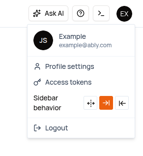

Manage all aspects of your account, from Two-factor authentication ([2FA](/docs/platform/account/2fa)) and billing to user management and personal preferences.

## Account and App relationship

When you sign up to Ably, you are set up with an **account** that contains one or more **applications** (apps). The account acts as the top-level container with the following structure:

Your account contains:
- A subscription package (free or paid) that determines usage limits like maximum concurrent connections and messages per month.
- One or more [users](/docs/platform/account/users) with defined roles, including at least one account owner.
- One or more [applications](/docs/platform/account/app).
- [Usage statistics](/docs/metadata-stats/stats#account) aggregated from all apps within the account.

Each app within your account contains:
- App-specific [usage statistics](/docs/metadata-stats/stats#app).
- A set of [API keys](/docs/platform/account/app/api) for authentication.
- [Channel rules](/docs/channels#rules) and namespace configurations.
- App-specific [settings](/docs/platform/account/app/settings).

Limits and billing are managed at the account level, while app-specific configurations like API keys and channel rules are managed per application.

Begin by [logging](https://ably.com/login) in to Ably through your browser. Once you're logged in, you have access to the Ably dashboard, where you can click on the **Account** navigation dropdown to access the account settings:

### Settings

Manage your Ably account settings, including authentication, [billing](/docs/platform/pricing/billing), and account ownership:

* Use your account's unique identifier (Account ID) when contacting support.
* Account owners can require all users to set up two-factor authentication (2FA) for added security.
* Account owners and users with the billing role can update billing and package details. They are the only users who can modify these settings or transfer account ownership.
* Transfer ownership or cancel the account, contact [Ably support.](https://ably.com/support)

### Billing

Manage your [billing](/docs/platform/pricing/billing) and package settings to scale your services:

* Review your current package to assess if it fits your needs, whether free, pay-as-you-go, or committed use.
* Ensure your billing information is up to date, including company name, billing email (optional), address, international phone number, and timezone.
* View and manage invoices and payment methods once your account has been upgraded.

### Limits

Understand and manage your package [limits](/docs/platform/pricing/limits) by tracking usage across messages, data, connections, and channels:

* Limits are applied to prevent service disruption and vary by package.
* Limits can be time-based, quantity-based, or rate-based, and they may apply either per connection/channel or across the entire account.
* Notifications are provided when limits are nearing or exceeded, and detailed logs of warnings and exceeded limits are accessible in the account dashboard.

### Usage

Monitor your account's resource consumption with detailed usage statistics:

* The usage statistics table monitors app performance by tracking resource usage, such as messages, data transferred, connections, and channels.
* The statistics chart visualizes app usage data over time, allowing users to define specific time ranges, zoom in on different periods, and analyze metrics in detail.

### Users

Manage the [users](/docs/platform/account/users) associated with your account:

* The account owner role has full permissions to manage the account, including inviting and removing users, and assigning roles like **developer**, **billing**, or **admin**.
* Multiple roles can be assigned to a single user.
* Remove, or change user roles within an Ably account.

### My Settings

Control personal account settings:

* View and edit name, email, and password.
* Enable two-factor authentication (2FA) for added security.
* Connect and manage login providers (Google, GitHub).
* Customize Ably email preferences (product updates, news, educational emails)
* Set up notifications for account usage.

### My Access tokens

Create access tokens for the [Control API:](/docs/platform/account/control-api)

* Users can create new tokens by providing a descriptive name, assigning an account, selecting capabilities, and securely storing the token once generated.
* Users can revoke existing tokens through the settings section, but this action is irreversible and will immediately invalidate the token for API access.
* After a token is created, the full token cannot be viewed again, so it must be securely stored upon generation.

### Heroku add-on access

If you are using Ably as a Heroku add-on, accessing your dashboard works differently:

1. Login to Heroku as it acts as your Single Sign-On (SSO) provider.
2. Click on the Ably add-on from your Heroku dashboard.
3. You will be automatically redirected to your Ably app dashboard.

Once in your Ably dashboard, you can view live statistics, manage API keys, configure channel rules, set up webhooks, and use the developer console.
