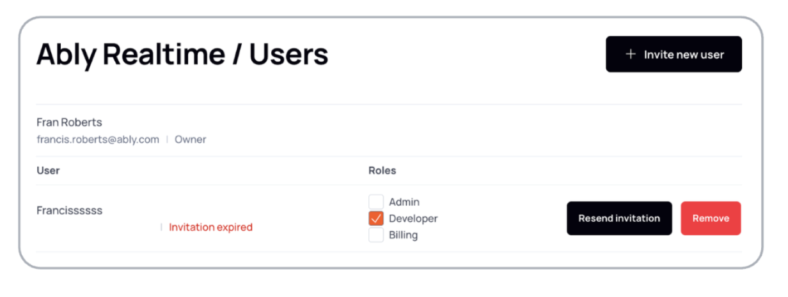

Use team to manage multiple Ably accounts by centralizing user access and roles under a single team structure. Team streamlines user provisioning through [Single Sign-On (SSO)](/docs/platform/account/sso) configuration and utilize SCIM System for Cross-domain Identity Management for group-based access control.

Access your [team settings](https://ably.com/accounts/any/organization) to manage your team configuration and user access.

Team enables the [primary](#primary) account to assign and adjust the roles of users and groups across all accounts.

You can separate accounts within a team to create isolated environments, such as production, staging, and development. Assign each environment a [package](/docs/pricing#packages) that meets its specific needs. For example, production may need high capacity with an **Enterprise** package, staging might use a **Standard** package, and development a **Free** package.

<Aside data-type='note'>
An [Enterprise](/docs/platform/pricing/enterprise) account is required to use team. [Contact us](https://ably.com/support) to enable team for your account.
</Aside>

## Primary account <a id="primary"/>

The primary account is a team's main account and holds the following privileges:

* The highest level of access to the team.
* Ownership of all accounts within the team.
* The default account used for provisioning.

## Create accounts in a team <a id="accounts"/>

Create accounts in a team:

1. Open the **Account** navigation dropdown.
2. Click **Team Accounts**.
3. Click **New account**.
4. Add an account name and **Create account**.

## Provision users via SCIM <a id="scim"/>

<Aside data-type='note'>
Google Workspace *alone* does not natively support SCIM.
</Aside>

Manage access to multiple Ably accounts through a single identity provider. To enable this, configure both [SSO](/docs/platform/account/sso) with your chosen identity provider and [SCIM](#SCIM). Once configured, Ably automatically provisions and deprovisions users with access to the Ably app in your identity provider, either individually or through assigned groups. New users are added to Ably's default provisioning account with the role of **Developer**.

Ably only recognizes one registered email domain per team, unrecognized email domains will result in rejected provisioning attempts.

Users provisioned through SCIM cannot modify their name or email address within Ably. All personal information updates must be made through your identity provider, and changes will sync to Ably on the next SCIM update cycle.

Provision users through SCIM:

1. Configure [SSO](/docs/platform/account/sso) by enabling and setting up SSO between Ably and your identity provider.
2. Copy Ably SCIM configuration values:
   1. Open the **Account** navigation dropdown in the Ably dashboard.
   2. Select **Team Settings** from the menu.
   3. Navigate to the **Users & Groups Provisioning (SCIM)** section and copy:
      * **Service Provider Configuration Endpoint**.
      * **SCIM Username**.
      * **SCIM Password**.
3. In your identity providers provisioning app, paste the following values from Ably:
   * **Service Provider Configuration Endpoint**.
   * **SCIM Username**.
   * **SCIM Password**.
4. Ensure that any additional setup required by your identity provider is completed to finalize the SCIM configuration.

## Manage roles <a id="manage"/>

Manage user and group [roles](/docs/platform/account/users#roles) across accounts within your team. User and group roles include those assigned directly to the user and through the groups the user belongs to. Use the **Team Users** page as a central point of control, rather than managing access individually within each account.

### Group roles <a id="group"/>

When team and your identity provider are configured, the groups you create in the identity provider are synchronized with Ably. This allows you to manage group-based access centrally. Assign roles to these groups and all users in a group will inherit those roles.

Manage group roles in Ably:

1. Open the **Account** navigation dropdown.
2. Click **Team Users**.
3. Under **Ably Realtime identity provider groups**, click **Manage account access**.
4. Select the group whose access you want to manage.
5. Specify the required **Roles** for the group -- and all users in this group inherit these roles automatically.

<Aside data-type='note'>
When modifying an individual user's roles, any rights assigned via groups will be greyed out and cannot be changed directly.
</Aside>
