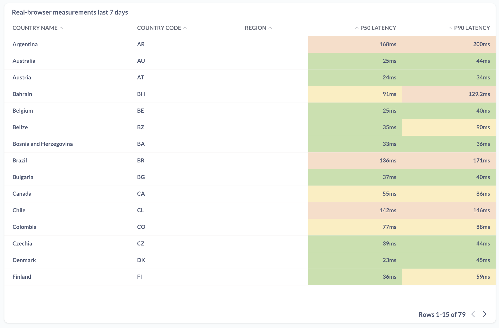
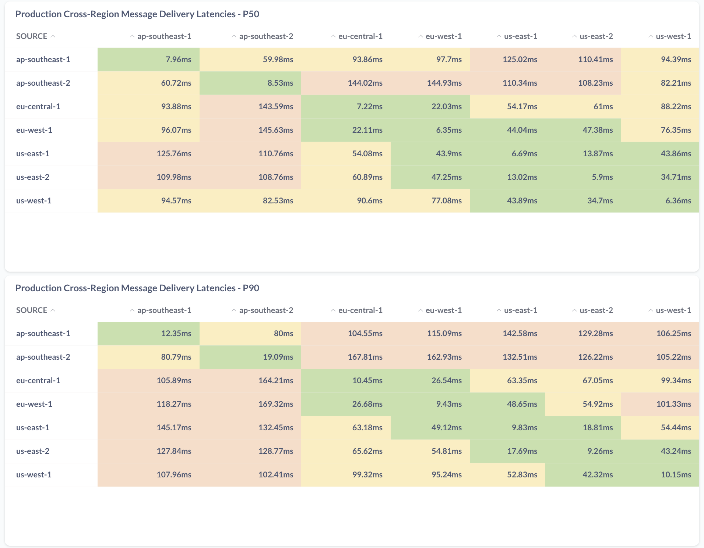

Latency is the most critical performance metric for realtime messaging platforms. Ably's architecture is specifically designed to minimize latency and ensure consistent, predictable message delivery times across the global infrastructure.

## Why latency matters

In realtime applications, latency directly impacts user experience and application responsiveness. Whether it's live chat, collaborative editing, multiplayer gaming, or financial trading, users expect near-instantaneous message delivery. Even small increases in latency can significantly degrade the perceived quality of an application.

Ably's platform is engineered to deliver consistently low latencies across all regions and use cases, ensuring that applications built on Ably provide the responsive experience users expect.

## Key latency metrics

Ably measures and optimizes for several critical latency metrics to ensure consistent performance across the platform:

### Round-trip latency

Round-trip latency measures the total time for a message to travel from a publisher through Ably's infrastructure to a subscriber and back. This is the most important metric for realtime applications as it represents the end-to-end delay users experience.

### Message delivery latency

Message delivery latency measures the time from when a message is published to Ably until it is delivered to a subscriber. This metric focuses on the core messaging performance without including the return path.

## How latency is measured

Ably employs sophisticated measurement methodologies to accurately capture latency performance across the global platform:

### Round-trip latency measurement

Round-trip latency is measured using real browser monitoring through Uptrends Real Browser Monitoring. This approach provides:

1. **Real browser simulation**: Measurements are conducted using actual browser instances, ensuring realistic network conditions
2. **Global coverage**: Monitoring points are distributed across the globe using a third party service
3. **Pub/sub simulation**: Real browsers publish messages and measure the complete round-trip time
4. **Continuous monitoring**: Measurements are conducted continuously to capture performance across different time periods and load conditions

This methodology ensures that round-trip latency measurements reflect the actual experience of end users accessing Ably through web browsers.

### Message delivery latency measurement

Message delivery latency is measured using Ably's internal quality of service (QOS) application. The measurement process includes:

1. **Continuous message publishing**: Messages are sent continuously to a common Ably channel at a rate of 5 messages per second per region
2. **Payload inclusion**: Each message contains a payload with region information and precise publish timestamp
3. **Delivery tracking**: Subscribers across different regions receive and timestamp the messages
4. **Latency calculation**: Delivery latency is calculated by subtracting the publish timestamp from the delivery timestamp
5. **Statistical sampling**: The 5 messages per second rate ensures statistically relevant sample sizes across all regions

This methodology provides comprehensive coverage of Ably's global infrastructure and ensures that latency measurements reflect real-world conditions across all datacenters and regions.

### Measurement infrastructure

Both measurement systems operate continuously to provide real-time insights into Ably's latency performance:

- **Automated collection**: Measurements are collected automatically without manual intervention
- **Real-time analysis**: Latency data is processed and analyzed in real-time
- **Alerting**: Performance thresholds trigger alerts when latency exceeds targets
- **Historical tracking**: Long-term trends are maintained for performance optimization

### Statistical analysis

Latency data is analyzed across multiple percentiles to ensure comprehensive performance understanding:

- **P50 (median)**: Represents typical performance under normal conditions
- **P90**: Ensures 90% of messages meet performance targets

This multi-percentile approach ensures that Ably's latency performance is consistent and predictable across all use cases and load conditions.

## Global infrastructure optimization

Ably's global infrastructure is specifically designed to minimize latency through several key architectural decisions:

### Edge network optimization

Ably's edge network ensures that clients connect to the nearest available datacenter, minimizing the distance messages must travel. The platform uses:

- **Latency-based routing**: Clients are automatically routed to the closest datacenter
- **Global points of presence**: 385+ PoPs ensure minimal distance to users worldwide
- **Intelligent failover**: Automatic routing around network issues without latency impact

### Peer-to-peer routing

Messages travel directly between datacenters on a peer-to-peer basis, eliminating central bottlenecks and reducing hop count. This approach provides:

- **Direct paths**: Messages follow the most efficient route between publisher and subscriber
- **Reduced hops**: Fewer network hops mean less opportunity for latency or packet loss
- **Backbone optimization**: Inter-datacenter traffic uses high-performance network backbones

### Infrastructure placement

Ably's infrastructure is strategically placed to optimize latency:

- **Regional distribution**: 7 physical datacenters across major global regions
- **Proximity optimization**: Datacenters are positioned to minimize distance to major user populations
- **Redundancy without compromise**: Multiple datacenters per region provide fault tolerance without latency impact

## Latency consistency and predictability

Beyond absolute latency numbers, Ably focuses on consistency and predictability to ensure reliable application performance:

### Percentile performance

Ably measures and optimizes for tail latencies (p95, p99, p99.9) to ensure that even the slowest messages meet performance targets. This approach ensures that:

- **Consistent experience**: All users receive similar performance regardless of location or load
- **Predictable behavior**: Applications can rely on consistent latency for realtime interactions
- **Quality assurance**: Even under peak load, latency remains within acceptable bounds

### Load management

Ably's capacity management ensures that latency remains consistent even under high load:

- **Predictive scaling**: Capacity is adjusted ahead of anticipated demand
- **Load distribution**: Intelligent routing spreads load across available infrastructure
- **Quality of service**: Traffic prioritization ensures critical messages maintain performance

## Real-world performance

Ably's latency performance is continuously monitored and optimized across real-world conditions:

### Continuous monitoring

The platform includes comprehensive monitoring that tracks latency performance in real-time:

- **Global measurement**: Latency is measured across all regions and datacenters
- **Load testing**: Performance is validated under various load conditions
- **Trend analysis**: Long-term performance trends are analyzed to identify optimization opportunities

### Performance guarantees

Ably's latency performance is backed by service level agreements that ensure:

- **Consistent delivery**: Messages are delivered within specified latency bounds
- **Reliability**: Performance targets are maintained even during infrastructure changes
- **Transparency**: Performance metrics are available to customers for monitoring

## Optimizing for your use case

While Ably's platform provides excellent baseline latency performance, applications can further optimize latency through several strategies:

### Connection optimization

- **Persistent connections**: Maintain WebSocket connections to avoid connection establishment overhead
- **Connection pooling**: Reuse connections for multiple channels when possible
- **Transport selection**: Use the most efficient transport for your use case

### Message optimization

- **Efficient encoding**: Use binary protocols like MessagePack for reduced bandwidth and parsing overhead
- **Message batching**: Batch multiple messages when appropriate to reduce round-trips
- **Payload optimization**: Minimize message size to reduce transmission time

### Application design

- **Regional awareness**: Design applications to minimize cross-region communication
- **Caching strategies**: Cache frequently accessed data to reduce message frequency
- **Load distribution**: Distribute load across multiple channels when possible

By understanding and leveraging Ably's latency performance characteristics, developers can build applications that provide exceptional realtime experiences for their users. 
