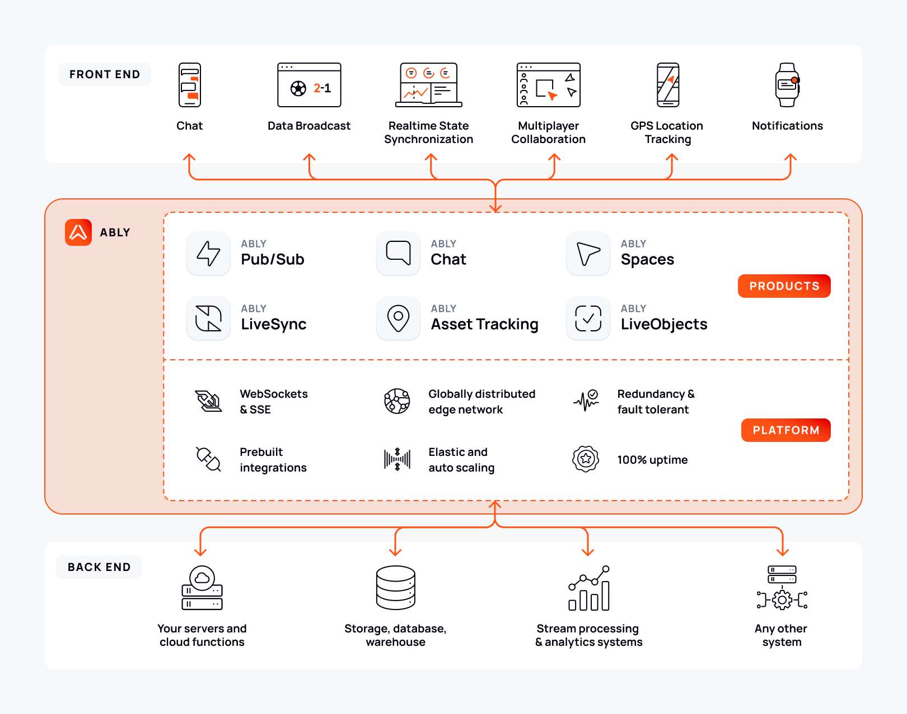

Ably is a highly-scalable serverless WebSocket platform used to power realtime digital experiences.

At its core, Ably is a cloud-based Pub/Sub (publish/subscribe) platform-as-a-service (PaaS). It ensures that any messages published to Ably by any device will be received, in realtime, by any number of subscribing devices.

## Platform <a id="platform"/>

Ably's platform enables data to be streamed between all internet-connected devices, such as browsers, servers and mobile phones. It offers enterprise-scale messaging, that automatically scales to meet demand, a highly-available service, message delivery guarantees, and low latency across the globe.

Ably is engineered around the following four key principles to ensure the dependability of its service:

* [Performance](https://ably.com/four-pillars-of-dependability#performance): high performance ensures that the end-to-end latency and bandwidth for data sent via the platform is minimized, and maintained at scale.
* [Integrity](https://ably.com/four-pillars-of-dependability#integrity): Ably provides guarantees for the realtime messages sent using the Ably platform so that you don't need to handle missed, duplicated or unordered messages yourself.
* [Reliability](https://ably.com/four-pillars-of-dependability#reliability): a fault-tolerant platform is reliable by ensuring that there is sufficient redundancy at a regional and global level to provide continuity of service in the face of infrastructure failures.
* [Availability](https://ably.com/four-pillars-of-dependability#availability): the Ably platform is designed to be elastic and highly-available so that you can use it at any time, even under high load.

## Infrastructure <a id="infrastructure"/>

The Ably platform has fault-tolerant, highly-available, elastic global infrastructure for effortless scaling.

It is built primarily on Amazon's cloud infrastructure. Ably has servers distributed across more than 15 physical datacenters within the AWS network, with 700+ edge locations globally through AWS CloudFront, so that there isn't a single point of failure, nor single point of congestion across the service. Ably is designed to route messages using the least amount of network hops to minimize latency and maximize performance for clients, regardless of their location.

Clients are automatically connected to the nearest datacenter to reduce latency, and each datacenter is physically isolated from the others, ensuring that a failure in one datacenter has no effect on any other datacenter.

Each datacenter scales independently to meet the load within that region. Load is dynamically assigned and reassigned across servers in realtime, and the service auto-heals and routes around network failures.

## Global network information <a id="network-info"/>

For detailed information about Ably's global infrastructure:

* View the [network map](https://ably.com/network) of Ably's datacenters and global points of presence.
* Check the [status of datacenters](https://status.ably.io/) by region.
* See [global round-trip latency statistics](https://ably.com/docs/platform/architecture/latency#latency-metrics) measured externally by Uptrends.

## Security <a id="security"/>

Ably takes security seriously and has implemented comprehensive measures to protect the platform and user data. For detailed information about security measures, see the [edge network security documentation](/docs/platform/architecture/edge-network#protection-against-denial-of-service-attacks) and [encryption options](/docs/channels/options/encryption).

### Reporting security vulnerabilities

If you believe you have found a security or privacy vulnerability that could impact Ably or its users, report it immediately by following the [Vulnerability Disclosure Policy](https://ably.com/disclosure).

#### How to report

1. Submit detailed reports through the official disclosure process.
2. Each report should explain one vulnerability with clear impact assessment.
3. Include step-by-step reproduction instructions or proof of concept.
4. Use responsible disclosure practices.

#### Bug bounty program

Ably operates a bug bounty program that rewards security researchers for legitimate vulnerability reports. Successful researchers are recognized on the [acknowledgements page](https://ably.com/acknowledgements).

#### Legal protection

Activities conducted in accordance with the vulnerability disclosure policy are considered authorized conduct. Ably will not initiate legal action against researchers operating in good faith within policy guidelines.

For questions regarding coordinated disclosure, contact [security@ably.com](mailto:security@ably.com).

## Integrations <a id="integrations"/>

Ably [integrations](/docs/platform/integrations) enable you to send your data from Ably to an external service or push data into Ably from an external service. You can trigger actions in your integrated services when events occur in Ably or send data to Ably from external systems.

Some of the integrations available with Ably include:

* HTTP callbacks for triggering external events.
* IFTTT and Zapier for workflow automation.
* Amazon Lambda, Azure Functions, Google Cloud Functions, and Cloudflare Workers for serverless function execution.
* Kafka, Amazon Kinesis, Amazon SQS, AMQP, and Pulsar for continuous data streaming.

## Products and SDKs <a id="products"/>

Use Ably's products and SDKs to build realtime applications for your clients. They all utilize Ably's reliable platform to ensure that you don't need to worry about managing things such as scaling, latency and data integrity.

### Ably Pub/Sub <a id="pub-sub"/>

Ably's core [Pub/Sub](/docs/basics) product provides flexible APIs that are feature-rich and powerful. These flexible APIs are the building blocks for crafting any type of realtime experience for your customers.

Ably's other products are built on top of Pub/Sub. They utilize the same platform with the some guarantees and benefits. These products can be considered abstractions, with APIs designed to simplify and build applications more quickly for the most popular use cases.

### Ably Chat <a id="chat"/>

Use the Ably [Chat](/docs/chat) SDKs to build live chat components in your applications. It provides a set of purpose-built APIs to manage features such as rooms and messages, users' online status, typing indicators, and room-level reactions.

Chat is an abstraction built over Ably Pub/Sub. It utilizes Ably's platform to benefit from all of the same performance guarantees and scaling potential.

Chat is effective for use cases such as sports and gaming live streams, 1:1 agent chats, and any other use case that requires users to talk and interact with one another in realtime.

### Ably Spaces <a id="spaces"/>

Use the Ably [Spaces](/docs/spaces) SDKs to build multiplayer collaborative components in your applications. It provides a set of purpose-built APIs to manage the participate state of users collaborating synchronously in an application, such as their the position of their cursors, or which elements they are interacting with.

Spaces is an abstraction built over Ably Pub/Sub. It utilizes Ably's platform to benefit from all of the same performance guarantees and scaling potential.

Spaces is effective when building features such as interactive whiteboards, avatar stacks, and displaying and locking elements on a page, such as a cell in a spreadsheet, or a slide in a slideshow presentation.

### Ably LiveObjects <a id="liveobjects"/>

Use Ably [LiveObjects](/docs/liveobjects) to synchronize application state across users and devices in realtime. LiveObjects provides purpose-built APIs and data structures for managing shared state, and it automatically handles concurrency, conflict resolution, synchronization and persistence.

LiveObjects is managed and persisted on Ably Pub/Sub channels. It utilizes Ably's platform to benefit from all of the same performance guarantees and scaling potential.

LiveObjects is effective for use cases such as realtime voting and polling systems, collaborative applications, live leaderboards, multiplayer game state synchronization, and any other scenario where application data is shared, can be updated concurrently by many users, and needs to be synchronized in realtime.

### Ably LiveSync <a id="livesync"/>

Use Ably [LiveSync](/docs/livesync) to synchronize changes between your database and frontend clients. It provides support for PostgreSQL and MongoDB and uses the Ably platform to synchronize your application's data.

LiveSync automatically streams changes you make in your database to clients to keep them in sync with the source of truth in your database.

### Ably AI Transport <a id="ai-transport"/>

Use Ably [AI Transport](/docs/ai-transport) as a drop-in infrastructure layer that upgrades your AI streams into bi-directional, stateful experiences. It provides resumable token streaming, multi-device continuity, human-in-the-loop workflows, and session management that works with any AI model or framework.

AI Transport is built on Ably Pub/Sub. It utilizes Ably's platform to benefit from all of the same performance guarantees and scaling potential.

AI Transport is effective for use cases such as multi-turn conversational AI applications, AI agent coordination, live steering with human takeover, and any scenario where reliable LLM token delivery and session resumability are critical.
