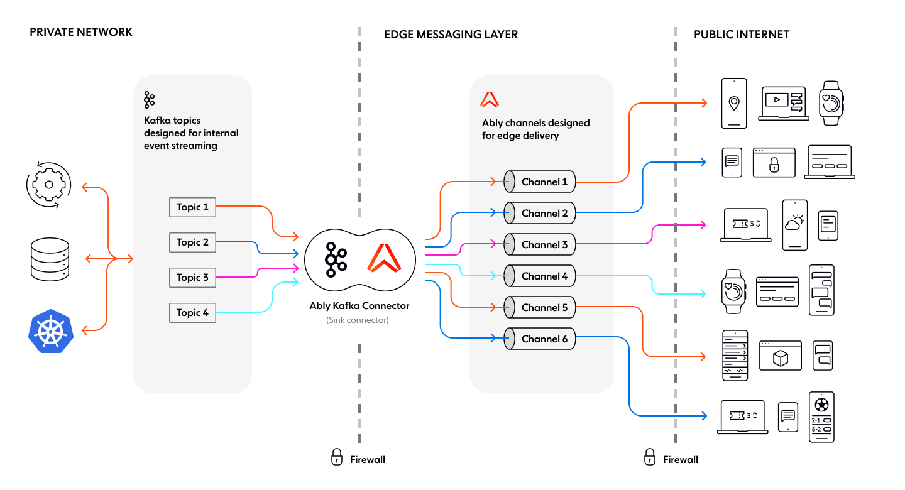

Use the Ably Kafka Connector to send data from one or more Kafka topics to one or more Ably channels.

The connector is Confluent [Gold](https://www.confluent.io/hub/ably/kafka-connect-ably) verified, ensuring compliance with Confluent's [Verified Integrations Program](https://www.confluent.io/partners/connect/).



## Install <a id="install"/>

The Ably Kafka Connector is a sink connector built on top of [Kafka Connect](https://docs.confluent.io/platform/current/connect/index.html#how-kafka-connect-works).

Install the Ably Kafka Connector from:

* [GitHub](https://github.com/ably/kafka-connect-ably) to run within your own infrastructure.
* [Confluent Hub](https://www.confluent.io/hub/ably/kafka-connect-ably) to run on the Confluent Platform.

Once installed, configure it with your [Ably API key](/docs/auth#api-keys) to enable data from Kafka topics to be published into Ably channels.

## Mapping <a id="mapping"/>

The Ably Kafka Connector supports two mapping methods:

* [Static](#static) to assign messages to a fixed Ably channel.
* [Pattern-based](#pattern) to dynamically assign messages based on interpolation of topic and record keys.

### Static mapping <a id="static"/>

Static mapping assigns one or more Kafka topics to a single Ably channel. The channel name stays the same, regardless of the Kafka record.

For example, a sports website streaming live updates can set `channel = basketball`, ensuring all Kafka records, regardless of their Kafka topic, publish to the basketball channel.

The following example maps all Kafka topics to the basketball channel:

<Code>
```javascript
channel = basketball
message.name = news_update
```
</Code>

### Pattern-based mapping <a id="pattern"/>

Pattern-based mapping dynamically maps multiple Kafka topics to different Ably channels. It provides the ability to adjust configuration by interpolating across record key and record topic values. Each Kafka record determines the target channel. Additionally each message is published to the Ably channel corresponding to its Kafka topic. For example, setting `channel = channel_#{topic}` routes Kafka messages to a channel matching their topic name.

The following example maps Kafka topics to Ably channels based on the topic name:

<Code>
```javascript
channel = channel_#{topic}
message.name = message_#{key}
```
</Code>

### Static and pattern-based mapping <a id="mixed"/>

You can use static and pattern-based mapping in conjunction. For example, you can dynamically map the channel while keeping the message name static, ensuring messages are routed to topic-specific channels while maintaining a consistent message name. The following configuration maps Kafka topics to Ably channels based on the topic name, while keeping the message name static:

<Code>
```javascript
channel = channel_#{topic}
message.name = single_message
```
</Code>

## Publish messages with a schema <a id="publish"/>

The Ably Kafka Connector supports messages that include schema information. It converts these messages to JSON before publishing them to Ably using the [Kafka Connect Schema Registry](https://docs.confluent.io/platform/current/schema-registry/connect.html) and supported converters.

For example, if messages on the Kafka topic are serialized using Avro, and schemas are registered in a Schema Registry, configure the connector to convert Avro to JSON.

Set the following properties in your Kafka Connect configuration:

<Code>
```text
value.converter=io.confluent.connect.avro.AvroConverter
value.converter.schema.registry.url=https://<your-schema-registry-host>
```
</Code>

This configuration ensures Kafka messages are correctly deserialized and transformed before reaching Ably.

## Configure the Kafka connector <a id="configure"/>

The Ably Kafka Connector sends Kafka messages to Ably channels in realtime. Configuration depends on the installation method used:

| Installation method | Configuration steps |
| ------------------- | ------------------- |
| Docker | Create a `docker-compose-connector.properties` file inside the `/config` directory. An example file is already available in the repository. |
| Single connect worker | - Provide a configuration file as a command-line argument when running the worker. |
| Distributed connect workers | - Use the Confluent REST API `/connectors` endpoint. Pass the configuration as JSON. |

### Connector configuration properties

You must configure these core properties to get the connector working.

| Property | Description |
| -------- | ----------- |
| `channel` | The Ably channel to which messages are published. Supports [Dynamic Channel Configuration](#pattern). |
| `client.key` | An Ably API key used for authentication. Must have **publish** capability for the specified channel. |
| `client.id` | The Ably client ID the connector uses. Defaults to `"kafka-connect-ably-example"`. |
| `name` | A globally unique name for the connector. Defaults to `"ably-channel-sink"`. |
| `topics` | A comma-separated list of Kafka topics to publish from. |
| `tasks.max` | The maximum number of tasks the connector should run. Defaults to `1`. |
| `connector.class` | The class name for the connector. Must be a subclass of `org.apache.kafka.connect.connector`. Defaults to `io.ably.kafka.connect.ChannelSinkConnector`. |

<Aside data-type='note'>
For a full list of configuration options, refer to the Ably Kafka Connector [properties](https://github.com/ably/kafka-connect-ably?tab=readme-ov-file#configuration-properties).
</Aside>
