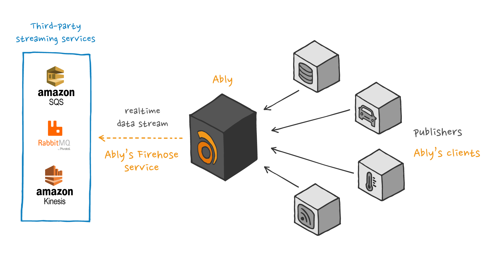

Ably's streaming integrations enable you to stream data that's published in the Ably platform to an external streaming or queueing service.

For example, any device that publishes messages on a channel can immediately stream those messages to [Amazon Kinesis](/docs/platform/integrations/streaming/kinesis), so that you can process the data in realtime.

Each message is delivered once to your streaming or queueing server, making the system well-suited for asynchronous processing of realtime data published by Ably. For example, workers consuming data from your stream or queue can persist each message of a live chat to your own database, start publishing updates when a channel becomes active, or trigger an event if a device submits a location indicating it has reached its destination.



There are two ways to create an outbound streaming integration:

* Using the [Ably dashboard](#dashboard).
* Using the [Control API](#api).

## Create an outbound streaming integration using the dashboard <a id="dashboard"/>

You can create outbound streaming integrations in your [dashboard:](https://ably.com/dashboard/any) for the following services:

* [Amazon Kinesis](/docs/platform/integrations/streaming/kinesis)
* [Amazon SQS](/docs/platform/integrations/streaming/sqs)
* [AMQP](/docs/platform/integrations/streaming/amqp)
* [Apache Kafka](/docs/platform/integrations/streaming/kafka)
* [Apache Pulsar](/docs/platform/integrations/streaming/pulsar)

## Create an outbound streaming integration using the Control API <a id="api"/>

To create a new [integration](/docs/platform/account/control-api#examples-rules) for an Ably application, send a POST request to `/apps/{app_id}/rules` with the integration configuration in the request body.

## Event types <a id="sources"/>

You can configure webhooks to listen for the following event types:

| Event type | Description |
| ---------- | ----------- |
| `channel.lifecycle` | Triggered when a channel is created or discarded. |
| `channel.message` | Triggered when [messages](/docs/messages) are published. |
| `channel.occupancy` | Triggered when the number of users in a channel [changes](/docs/channels/options#occupancy). |
| `channel.presence` | Triggered when users enter, leave, or update their [presence](/docs/presence-occupancy/presence). |

## Channel filter <a id="filter"/>

Set a filter to restrict which channels an integration applies to using a regular expression.

The following examples demonstrate channel names that you can match against using regular expressions to control which channels a webhook rule applies to:

<Code>
```text
mychannel:public
public
public:events
public:events:conferences
public:news:americas
public:news:europe
```
</Code>

| RegEx | Channels |
| ----- | -------- |
| `^public.*` | Matches any channel that starts with `public`. This includes `public`, both `public:events` channels, and both `public:news` channels. |
| `^public$` | Matches only channels named exactly `public`. |
| `:public$` | Matches channels that end with `:public`. This includes only `mychannel:public`. |
| `^public:events$` | Matches channels named exactly `public:events`. This does not include `public:events:conferences`. |
| `^public.*europe$` | Matches channels that start with `public` and end with `europe`. This includes only `public:news:europe`. |
| `news` | Matches any channel name that includes the word `news`. This includes `public:news:americas` and `public:news:europe`. |

## Enveloped messages <a id="enveloped"/>

Message enveloping adds structured metadata such as the publisher's `clientId` and the originating channel name, alongside the message payload.

This metadata is useful when processing events dynamically or when additional context about the message source is required. Enveloped messages are recommended for most use cases, as they provide a consistent format for all events.

Enveloped messages include the following headers:

| Header | Description |
| ------ | ----------- |
| `x-ably-version` | Specifies the version. |
| `content-type` | Indicates the payload format, which can be either `application/json` or `application/x-msgpack` for enveloped messages. |

Each enveloped message contains the following fields:

| Field | Description |
| ----- | ----------- |
| `source` | The [event type](#sources). Possible values are `channel.message`, `channel.presence`, `channel.lifecycle` or `channel.occupancy`. |
| `appId` | The app that generated the event. |
| `channel` | The channel where the event occurred. |
| `site` | The datacenter that sent the message. |
| `timestamp` | A timestamp in milliseconds since the epoch representing when the event occurred. |

In addition, it will contain another field which will contain the actual message. This field is named according to the message type.

The following is an example of an enveloped `message` payload:

<Code>
```json
{
  "source": "channel.message",
  "appId": "aBCdEf",
  "channel": "channel-name",
  "site": "eu-central-1-A",
  "ruleId": "1-a2Bc",
  "messages": [{
    "id": "ABcDefgHIj:1:0",
    "connectionId": "ABcDefgHIj",
    "timestamp": 1123145678900,
    "data": "some message data",
    "name": "my message name"
  }]
}
```
</Code>

### Decode enveloped messages <a id="decode"/>

Ably SDKs automatically decode messages into `Message` objects. Messages sent via an integration need to be decoded manually.

There are two methods available for decoding messages into `Message` objects:

* `Message.fromEncodedArray()` for an array of messages.
* `Message.fromEncoded()` for single messages.

There are also equivalent methods for decoding presence messages into `PresenceMessage` objects:

* `PresenceMessage.fromEncodedArray()` for an array of presence messages.
* `PresenceMessage.fromEncoded()` for single messages.

Decoding is essential because it reconstructs the original data payload using the encoding field, ensuring the correct data type is restored, whether it's a string, binary, or structured object. If the message was encrypted, passing your encryption key to the method allows the SDK to decrypt data automatically.

Ably strongly recommends decoding all messages received over integrations before processing them to avoid issues with unexpected data formats.

## Non-enveloped messages <a id="non-enveloped"/>

You can turn off enveloping if you only need the raw message payload or the external service follows a strict data structure. This results in smaller payloads and eliminates the need to parse additional metadata. However, it requires you to handle raw payload decoding manually.

Non-enveloped messages use a more straightforward format, delivering events directly without additional wrapping. Instead of a structured envelope, key properties are exposed through HTTP headers alongside the raw payload.

For example, if you publish a JSON message to the channel `my_channel` using the following cURL request:

<Code>
```shell
curl -X POST https://main.realtime.ably.net/channels/my_channel/messages \
          -u "{{API_KEY}}" \
          -H "Content-Type: application/json" \
          --data '{ "name": "publish", "data": "example" }'
```
</Code>

The received message will include:

* `x-ably-message-name: publish`
* `Payload: example`

The following example demonstrates a non-enveloped presence event:

<Code>
```javascript
realtime = new Ably.Realtime({
  key: '{{API_KEY}}',
  clientId: 'bob'
});
channel = realtime.channels.get('some_channel');
await channel.presence.enter('some data');
```
</Code>

The received presence message will include:
* `x-ably-message-action: enter`
* `Payload: "some data"`

### Non-enveloped structure <a id="non-structure"/>

Non-enveloped messages include headers that provide essential context about the payload, such as its source, format, and metadata. The following headers are included in all non-enveloped messages:

| Header | Description |
| ------ | ----------- |
| `content-type` | Defines the payload type: `application/json` for JSON, `text/plain` for text, or `application/octet-stream` for binary data. |
| `x-ably-version` | The version of the integration. |
| `x-ably-envelope-appid` | The `appID` from which the message originated. |
| `x-ably-envelope-channel` | Name of the Ably channel that sent the message. |
| `x-ably-envelope-rule-id` | The ID of the integration that triggered the event. |
| `x-ably-envelope-site` | The datacenter that processed the event. |
| `x-ably-envelope-source` | [Event source](#sources), indicating the type of event: `channel.message`, `channel.presence`, `channel.lifecycle`, or `channel.occupancy`. |
| `x-ably-message-client-id` | `ClientID` of the connection that sent the event. |
| `x-ably-message-connection-id` | `ConnectionID` that initiated the event. |
| `x-ably-message-id` | Unique `messageID` for tracking. |
| `x-ably-message-timestamp` | Timestamp of when the message was originally sent. |
