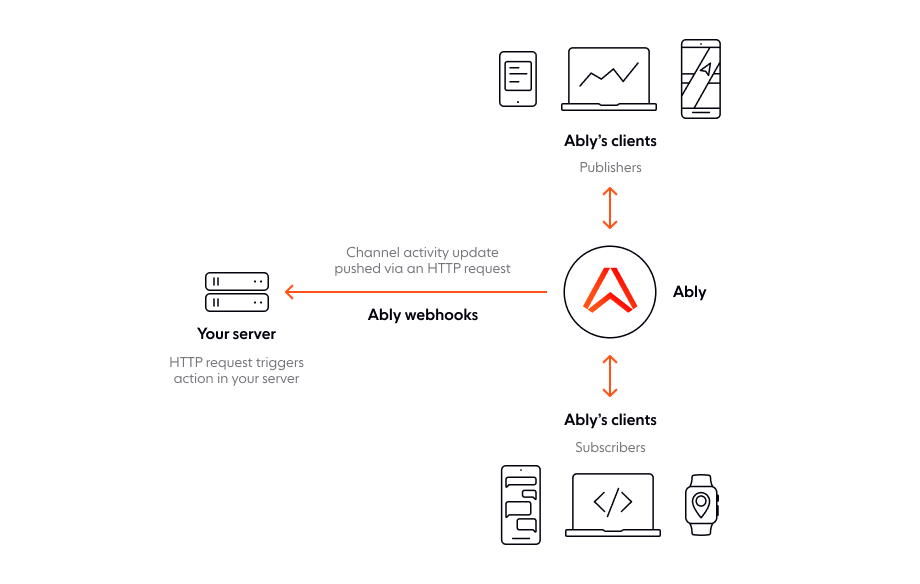

Outbound webhook integrations enable you to trigger serverless functions and notify HTTP endpoints when events occur in Ably.

Events include when messages are [published](/docs/pub-sub#publish), when [presence](/docs/presence-occupancy/presence#trigger-events) events occur, changes in channel occupancy and when channels are created or discarded. Data can be delivered individually or in batches to external services.



There are two ways to create an outbound webhook integration:

* Using the [Ably dashboard](#dashboard).
* Using the [Control API](#api).

## Channel filter <a id="filter"/>

Set a filter to restrict which channels an integration applies to using a regular expression.

The following examples demonstrate channel names that you can match against using regular expressions to control which channels a webhook rule applies to:

<Code>
```text
mychannel:public
public
public:events
public:events:conferences
public:news:americas
public:news:europe
```
</Code>

| RegEx | Channels |
| ----- | -------- |
| `^public.*` | Matches any channel that starts with `public`. This includes `public`, both `public:events` channels, and both `public:news` channels. |
| `^public$` | Matches only channels named exactly `public`. |
| `:public$` | Matches channels that end with `:public`. This includes only `mychannel:public`. |
| `^public:events$` | Matches channels named exactly `public:events`. This does not include `public:events:conferences`. |
| `^public.*europe$` | Matches channels that start with `public` and end with `europe`. This includes only `public:news:europe`. |
| `news` | Matches any channel name that includes the word `news`. This includes `public:news:americas` and `public:news:europe`.

## Event types <a id="sources"/>

You can configure webhooks to listen for the following event types:

| Event type | Description |
| ---------- | ----------- |
| `channel.lifecycle` | Triggered when a channel is created or discarded. |
| `channel.message` | Triggered when [messages](/docs/messages) are published. |
| `channel.occupancy` | Triggered when the number of users in a channel [changes](/docs/channels/options#occupancy). |
| `channel.presence` | Triggered when users enter, leave, or update their [presence](/docs/presence-occupancy/presence). |

<Aside data-type="note">
Use `channel.lifecycle` and `channel.occupancy` sources instead of a `channel.message` source on [metachannels](/docs/metadata-stats/metadata/subscribe#metachannels)
</Aside>

## Single requests <a id="single"/>

In single request mode, a `POST` request is made to your endpoint each time an event occurs.

This is useful in certain use cases where an endpoint can only process one message per request, however it can lead to the endpoint being overloaded in high-throughput scenarios. Single requests are best suited to where this a 1:1 relationship between messages being sent and the events being called.

Multiple requests can be in-flight at once, however be aware there is a [limit on concurrency](/docs/platform/pricing/limits#integrations). If it is exceeded then new messages are placed in a short 10 message queue. If that is exceeded then further messages are rejected.

Ably will retry failed `5XX` requests. If the response times out, Ably will retry twice, first after 4 seconds and then again after 20 seconds.

## Batched requests <a id="batched"/>

Batched requests are useful for endpoints that have the potential to be overloaded by requests, or have no requirement to process messages one-by-one.

Batched requests are published at most once per second, but this may vary by integration. Once a batched request is triggered, all other events will be queued so that they can be delivered in a batch in the next request. The next request will be issued within one second with the following caveats:

* Only a limited number of HTTP requests are in-flight at one time for each configured integration. Therefore, if you want to be notified quickly, you should accept requests quickly and defer any work to be done asynchronously.
* If there are more than 1,000 events queued for a payload, the oldest 1,000 events will be bundled into this payload and the remaining events will be delivered in the subsequent payload. Therefore, if your sustained rate of events is expected to be more than 1,000 per second or your servers are slow to respond, then it is possible a backlog will build up and you will not receive all events.

If a batched request fails, Ably will retry the request using an exponential backoff strategy.

The backoff delay follows the formula: `delay = delay * sqrt(2)` where the initial delay is 1 second. For example, if a webhook request fails repeatedly, the retry delays will be:

* Initial request: 1.4s wait → 1st retry.
* 1st retry: 2s wait → 2nd retry.
* 2nd retry: 2.8s wait → 3rd retry.
* 3rd retry: 4s wait → 4th retry.
* 4th retry: 5.6s wait → successful request.

The back off for consecutively failing requests will increase until it reaches 60s. All subsequent retries for failed requests will then be made at 60s intervals until a request is successful. The queue of events is retain for 5 minutes. If an event cannot be delivered within that time then events are discarded to prevent the queue from growing indefinitely.

## Limits for integrations <a id="limits"/>

Limits exist to prevent backlogs when message rates exceed your endpoint's processing capacity. If messages arrive faster than your function can handle them, unprocessed messages accumulate without visibility or management options.

### Handle high-volume scenarios <a id="high-volume"/>

For high-throughput use cases, we recommend using an intermediary queue service:

1. Configure Ably to send events to AWS Kinesis, AWS SQS, or similar queue services
2. Configure your Lambda function to consume from the queue (see [AWS Lambda with Kinesis](https://docs.aws.amazon.com/lambda/latest/dg/with-kinesis.html))

This provides better visibility into queue depth and backlogs, control over message handling through batching and filtering, and improved scalability for sustained high message rates.

## Message ordering <a id="ordering"/>

Webhooks do not always preserve message order the same way Ably channels do. This depends on the webhook configuration.

Batched webhooks preserve message order when messages are from the same publisher on the same channel. If a batch fails and gets retried, newer messages are included while maintaining correct order. Messages from different regions might arrive in separate batches, maintaining per-publisher ordering.

Single request webhooks cannot guarantee order. Each message triggers its own HTTP request, and arrival order is not predictable. HTTP/2 server support can restore ordering through request pipelining over a single connection.

Publishing via REST (not realtime) removes ordering guarantees even with batching enabled, as REST uses a connection pool where requests can complete out of order.

Given the various potential combinations of enveloped, batched, and message sources, it's helpful to understand what to expect in different scenarios.

Batched events will have the following headers:

| Header | Description |
| ------ | ----------- |
| `content-type` | The type of the payload. This will be `application/json` or `application/x-msgpack`. |
| `x-ably-version` | The version of the Webhook. Currently, this is `1.2`. |

Each batched message will have the following fields::

| Field | Description |
| ----- | ----------- |
| `name` | The event type, for example, `presence.message`, `channel.message`, or `channel.closed`. |
| `webhookId` | A unique internal ID for the configured webhook. |
| `source` | The source of the webhook, which will be one of `channel.message`, `channel.presence`, `channel.lifecycle`, or `channel.occupancy`. |
| `timestamp` | A timestamp in milliseconds since the epoch for the presence event. |
| `data` | An object containing the event data, defined below in [JSONPath format](https://goessner.net/articles/JsonPath/). |

#### Batched message events <a id="batched-message"/>

For `message` events, the `data` field will contain the following:

| Field | Description |
| ----- | ----------- |
| `data.channelId` | The name of the channel that the presence event belongs to. |
| `data.site` | An internal site identifier indicating which primary datacenter the member is present in. |
| `data.messages` | An `Array` of raw messages. |

The following example is a batched `message` payload:

<Code>
```json
{
  "items": [{
    "webhookId": "ABcDEf",
    "source": "channel.message",
    "serial": "a7bcdEFghIjklm123456789:4",
    "timestamp": 1562124922426,
    "name": "channel.message",
    "data": {
      "channelId": "chat-channel-4",
      "site": "eu-west-1-A",
      "messages": [{
        "id": "ABcDefgHIj:1:0",
        "clientId": "user-3",
        "connectionId": "ABcDefgHIj",
        "timestamp": 1123145678900,
        "data": "the message data",
        "name": "a message name"
      }]
    }
  }]
}
```
</Code>

#### Decode batched messages <a id="decode-messages"/>

The Ably SDK automatically decodes messages sent over the Realtime service into [`message`](/docs/api/realtime-sdk/types#message) objects. However, batched, enveloped webhook payloads require explicit decoding using:

* [`Message.fromEncoded`](/docs/api/realtime-sdk/messages#message-from-encoded) for an array of messages.
* [`Message`](/docs/api/realtime-sdk/types#message) for a single message.

The benefits of decoding include fully restoring `data` to its original datatype using encoding. Additionally, it supports automatic decryption when an [encryption](/docs/channels/options/encryption) key is provided. Its recommended to decode all messages received via webhooks to ensure proper data handling.

The following example demonstrates how to decode an array of messages received via a webhook:

<Code>
```javascript
webhookMessage.items.forEach((item) => {
  const messages = Ably.Realtime.Message.fromEncodedArray(item.data.messages);
  messages.forEach((message) => {
    console.log(message.toString());
  })
})
```
</Code>

### Batched presence structure <a id="batched-structure"/>

Batched presence events group multiple presence messages in a single payload. `presence` events `data` contains:

| Property | Description |
| -------- | ----------- |
| `data.channelId` | The name of the channel the presence event belongs to. |
| `data.site` | An internal site identifier, indicating the primary datacenter the member is present in. |
| `data.presence` | An `Array` of raw presence messages. |

The following is an example of a batched `presence` payload:

<Code>
```json
{
  "items": [{
    "webhookId": "ABcDEf",
    "source": "channel.presence",
    "serial": "a7bcdEFghIjklm123456789:4",
    "timestamp": 1562124922426,
    "name": "presence.message",
    "data": {
      "channelId": "education-channel",
      "site": "eu-west-1-A",
      "presence": [{
        "id": "ABcDefgHIj:1:0",
        "clientId": "bob",
        "connectionId": "ABcDefgHIj",
        "timestamp": 1123145678900,
        "data": "the message data",
        "action": 4
      }]
    }
  }]
}
```
</Code>

#### Decode batched presence <a id="decode-presence"/>

Presence messages sent [over the realtime service](/docs/channels) are automatically decoded into [`PresenceMessage`](/docs/api/realtime-sdk/types#presence-message) objects by the Ably client library. For webhooks, you need to do this manually using [`PresenceMessage.fromEncodedArray`](/docs/api/realtime-sdk/presence#presence-from-encoded-array) on the `data.presence` array, or [`PresenceMessage.fromEncoded`](/docs/api/realtime-sdk/presence#presence-from-encoded) on an individual entry. These methods convert the encoded values into [`PresenceMessage`](/docs/api/realtime-sdk/types#presence-message) objects—either as an array or a single instance.

This allows you to decode the numerical action into a [`Presence action`](/docs/api/realtime-sdk/presence#presence-action) string (such as `enter`, `update`, or `leave`), fully decode the `data` (using the `encoding`) back into its original datatype or an equivalent in the client library, and, if you're using [encryption](/docs/channels/options/encryption), pass your encryption key to decrypt the `data`.

The following example demonstrates how to decode an array of presence messages received via a webhook:

<Code>
```javascript
webhookMessage.items.forEach((item) => {
  const messages = Ably.Realtime.PresenceMessage.fromEncodedArray(item.data.messages);
  messages.forEach((message) => {
    console.log(message.toString());
  })
})
```
</Code>

### Batched channel lifecycle structure <a id="batched-lifecycle"/>

Ably includes the following fields in the `data` object for batched `channel.lifecycle` events:

| Property | Description |
| -------- | ----------- |
| `data.channelId` | The name of the channel where the lifecycle event occurred. |
| `data.status` | A [`ChannelStatus`](/docs/api/realtime-sdk/channel-metadata#channel-details) object that describes the channel's current state. |

The `name` of a `channel.lifecycle` event will be `channel.opened` or `channel.closed`.

The following is example a batched `channel lifecycle` payload:

<Code>
```json
{
  "items": [{
    "webhookId": "ABcDEf",
    "source": "channel.lifecycle",
    "timestamp": 1562124922426,
    "serial": "a7bcdEFghIjklm123456789:4",
    "name": "channel.opened",
    "data": {
      "channelId": "chat-channel-5",
      "name": "chat-channel-5",
      "status": {
        "isActive": true,
        "occupancy": {
          "metrics": {
            "connections": 1,
            "publishers": 1,
            "subscribers": 1,
            "presenceConnections": 1,
            "presenceMembers": 0,
            "presenceSubscribers": 1,
            "objectPublishers": 1,
            "objectSubscribers": 1
          }
        }
      }
    }
  }]
}
```
</Code>

## Enveloped events <a id="enveloped"/>

Enveloping events adds structured metadata such as the publisher's `clientId` and the originating channel name, alongside the payload.

This metadata is useful when processing events dynamically or when additional context about the source is required. Enveloped messages are recommended for most use cases, as they provide a consistent format for all events.

Enveloped events include the following headers:

| Header | Description |
| ------ | ----------- |
| `x-ably-version` | Specifies the Webhook version. Currently, this should be set to `1.2`. |
| `content-type` | Indicates the payload format, which can be either `application/json` or `application/x-msgpack` for enveloped messages. |

Each enveloped message contains the following fields:

| Field | Description |
| ----- | ----------- |
| `source` | The origin of the webhook event. Possible values are: `channel.message`, `channel.presence`, `channel.lifecycle`, `channel.occupancy` |
| `appId` | The Ably app that generated the event. |
| `channel` | The Ably channel where the event occurred. |
| `site` | The Ably datacenter that sent the message. |
| `timestamp` | A timestamp in milliseconds since the epoch representing when the presence event occurred. |

In addition, it will contain another field which will contain the actual message, which is named according to the message type.

### Enveloped message events <a id="enveloped-message-events"/>

For `message` events, the `messages` array contains a raw message.

The following is an example of an enveloped `message` payload:

<Code>
```json
{
  "source": "channel.message",
  "appId": "aBCdEf",
  "channel": "channel-name",
  "site": "eu-central-1-A",
  "ruleId": "1-a2Bc",
  "messages": [{
    "id": "ABcDefgHIj:1:0",
    "connectionId": "ABcDefgHIj",
    "timestamp": 1123145678900,
    "data": "some message data",
    "name": "my message name"
  }]
}
```
</Code>

#### Decode enveloped messages <a id="decode"/>

Ably SDKs automatically decode messages into `Message` objects. Messages sent via an integration need to be decoded manually.

There are two methods available for decoding messages into `Message` objects:

* `Message.fromEncodedArray()` for an array of messages.
* `Message.fromEncoded()` for single messages.

There are also equivalent methods for decoding presence messages into `PresenceMessage` objects:

* `PresenceMessage.fromEncodedArray()` for an array of presence messages.
* `PresenceMessage.fromEncoded()` for single messages.

Decoding is essential because it reconstructs the original data payload using the encoding field, ensuring the correct data type is restored, whether it's a string, binary, or structured object. If the message was encrypted, passing your encryption key to the method allows the SDK to decrypt data automatically.

Ably strongly recommends decoding all messages received over integrations before processing them to avoid issues with unexpected data formats.

The following example demonstrates how to decode an array of messages received via a webhook:

<Code>
```javascript
const messages = Ably.Realtime.Message.fromEncodedArray(item.messages);

messages.forEach((message) => {
  console.log(message.toString());
});
```
</Code>

### Enveloped presence events <a id="presence"/>

Webhook [presence](/docs/presence-occupancy/presence) events contain raw `presence` data in the `presence` array.

The following example is an enveloped `message` payload with a `presence` array:

<Code>
```json
{
  "source": "channel.message",
  "appId": "aBCdEf",
  "channel": "channel-name",
  "site": "eu-central-1-A",
  "ruleId": "1-a2Bc",
  "presence": [{
    "id": "abCdEFgHIJ:1:0",
    "clientId": "bob",
    "connectionId": "Ab1CDE2FGh",
    "timestamp": 1582270137276,
    "data": "some data in the presence object",
    "action": 4
  }]
}
```
</Code>

#### Decode enveloped presence messages <a id="presence-decode"/>

Presence messages sent over Realtime are automatically decoded into `PresenceMessage` objects by the Ably SDK. However, webhook presence messages require explicit decoding.

To decode presence messages received via webhooks, use the appropriate method:
* For multiple messages, use `PresenceMessage.fromEncodedArray()` on the presence array.
* For a single message, use `PresenceMessage.fromEncoded()` on an individual presence entry.

Both methods convert encoded presence messages into `PresenceMessage` objects, restoring the original format.

Decoding presence messages provides several advantages:
* It converts numerical presence action values into readable strings such as **enter**, **update**, or **leave**.
* It reconstructs the original data field, ensuring it matches the format it was sent in.
* If encryption is enabled, passing your encryption key will automatically decrypt the data field.

Ably strongly recommends decoding all presence messages received via webhooks to ensure proper data handling.

The following example demonstrates decoding an array of presence messages using the Ably JavaScript SDK:

<Code>
```javascript
const messages = Ably.Realtime.PresenceMessage.fromEncodedArray(item.messages);
messages.forEach((message) => {
  console.log(message.toString());
})
```
</Code>

## Non-enveloped events <a id="non-env-message"/>

You can turn off enveloping if your endpoint only needs the raw message payload or follows a strict data structure. This results in smaller payloads and eliminates the need to parse additional metadata. However, it requires you to handle raw payload decoding manually.

Non-enveloped webhook messages include headers that provide essential context about the payload, such as its source, format, and metadata. The following headers are included in all non-enveloped messages:

| Header | Description |
| ------ | ----------- |
| `content-type` | Defines the payload type: `application/json` for JSON, `text/plain` for text, or `application/octet-stream` for binary data. |
| `x-ably-version` | Webhook version, currently 1.2. |
| `x-ably-envelope-appid` | Ably `appID` from which the message originated. |
| `x-ably-envelope-channel` | Name of the Ably channel that sent the message. |
| `x-ably-envelope-rule-id` | `RuleID` that triggered the webhook event. |
| `x-ably-envelope-site` | Ably datacenter that processed the event. |
| `x-ably-envelope-source` | Event source, indicating the type of event: `channel.message`, `channel.presence`, `channel.lifecycle`, or `channel.occupancy`. |
| `x-ably-message-client-id` | `ClientID` of the connection that sent the event. |
| `x-ably-message-connection-id` | `ConnectionID` that initiated the event. |
| `x-ably-message-id` | Unique `messageID` for tracking. |
| `x-ably-message-timestamp` | Timestamp of when the message was originally sent. |

### Non-enveloped message events <a id="non-env-message"/>

For `message` events, there will be additional headers:

| Header | Description |
| ------ | ----------- |
| `x-ably-message-name` | The name of the message. |

The payload will contain the data of the message.

For example, if you publish a message to the channel `my_channel` using the following cURL request:

<Code>
```shell
curl -X POST https://main.realtime.ably.net/channels/my_channel/messages \
          -u "{{API_KEY}}" \
          -H "Content-Type: application/json" \
          --data '{ "name": "publish", "data": "example" }'
```
</Code>

The `x-ably-message-name` header would be `publish` and the payload would be `example`.


### Non-enveloped presence messages <a id="non-env-presence"/>

For `Presence` events, there will be the additional headers:

| Header | Description |
| ------ | ----------- |
| `x-ably-message-name` | The action performed by the event (`update`, `enter`, `leave`). |

The payload will contain the [data](/docs/api/realtime-sdk/presence#presence-message) of the `Presence` message.

The following example demonstrates a non-enveloped [enter](/docs/api/realtime-sdk/presence#enter) presence event:

<Code>
```javascript
realtime = new Ably.Realtime({
  key: '{{API_KEY}}',
  clientId: 'bob'
});
channel = realtime.channels.get('some_channel');
await channel.presence.enter('some data');
```
</Code>

The `x-ably-message-action` header would be `enter` and the payload would be `some data`.

## Webhook security <a id="security"/>

Ably advises you to use a secure HTTPS URL when you configure webhooks. This way, you ensure that all communication with your servers is encrypted with TLS and cannot be intercepted.

In addition, Ably optionally supports signing webhook requests so you can verify their authenticity. This applies to [batched](#batched) webhook requests, as well as any streaming integrations that also rely on HTTP-based callbacks. Ably sends the signature in the `X-Ably-Signature` header for batched requests and references the connected key in the `X-Ably-Key` header.

The following steps are required to verify the signature:

1. Start with the webhook request body. This is a JSON string encoded with content-encoding `utf-8`.
2. Identify the key based on the `keyId` indicated in the `X-Ably-Key` header.
3. Calculate the HMAC of that request body using the SHA-256 algorithm and the corresponding `keyValue` (the secret part of the key after the "`:`").
4. Encode the resulting HMAC using RFC 3548 base64.
5. Compare that result with the signature value in the `X-Ably-Signature` header.

### Sign webhook requests <a id="sign"/>

Webhook signing is the security mechanism where Ably includes a cryptographic signature in each webhook request.

Use the following steps to configure webhook signing and verify it's working correctly:

* Perform local tunneling with [ngrok](https://ngrok.com/download/linux), paired with [webhook-tester](https://github.com/tarampampam/webhook-tester).

  * Install [webhook-tester](https://github.com/tarampampam/webhook-tester?tab=readme-ov-file#-installation). The ngrok CLI tool will generate your webhook listener URL.

* Alternatively, use services like [Beeceptor](https://beeceptor.com/webhook-integration/) or [Webhook.site](https://webhook.site/) which offer zero-setup, no-login, free webhook testing endpoints for webhook monitoring, payload inspection and signature verification. These services provide you a unique, random endpoint URL, which is your webhook listener URL.

* Configure Ably with the webhook listener URL obtained here pre. Make sure you choose to [batch](#batched) messages and use a key to sign each webhook request.

* Use your [Dev console](https://ably.com/accounts/any/apps/any/console) to trigger an event. This will send a webhook event to your webhook testing/inspection tool via the webhook listener URL. You can then monitor requests and confirm that a webhook request was sent, and inspect request headers for signature verification.
