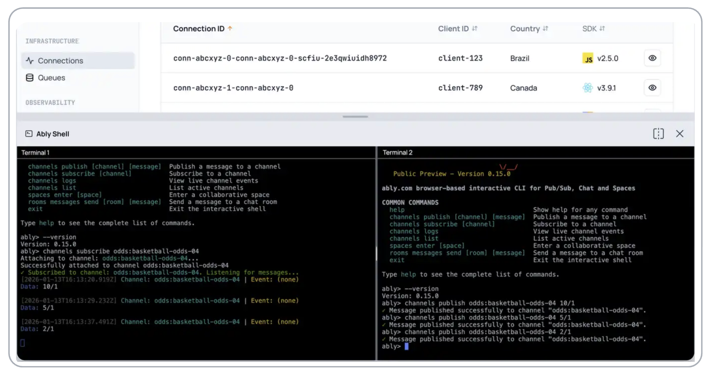

<Aside data-type="new">
The [Ably CLI](https://github.com/ably/ably-cli) is currently in Public Preview status.
</Aside>

The Ably CLI brings the full power of Ably to your terminal. You can use it to manage your Ably account and its resources, and to explore Ably's APIs and features.



It's a quick and easy way to simulate additional clients when testing how Ably works.

The Ably CLI interacts with:

* The [Control API](/docs/platform/account/control-api) to manage your Ably account and applications.
* [Pub/Sub](/docs/basics) to publish and subscribe to messages in realtime.
* [Chat](/docs/chat) to send messages, display typing indicators and react to what's happening in a chat room.
* [Spaces](/docs/spaces) to enter spaces and register member locations.

## Installation

The Ably CLI is available as an NPM package.

1. Install the Ably CLI:

<Code>
```shell
npm install -g @ably/cli
```
</Code>

2. Run the following to log in to your Ably account. This will prompt you to log into your Ably account and setup an access token for the Ably CLI. You can then set the default app and API key to use back in your terminal instance:

<Code>
```shell
ably login
```
</Code>

3. Start running commands in the CLI to create and interact with your Ably resources.

## Usage

After you have successfully authenticated and chosen your app and API key, you're ready to interact with Ably resources directly from your terminal.

For example, open two terminal instances and subscribe to one, and publish messages in the other:

To subscribe:

<Code>
```shell
ably channels subscribe channel-1
```
</Code>

To publish:

<Code>
```shell
# To publish 1 message:
ably channels publish channel-1 Hi!

# To publish 5 messages:
ably channels publish --count 5 channel-1 "Message number {{.Count}}"
```
</Code>

For a list of all available commands, run:

<Code>
```shell
ably help
```
</Code>

## Feature set

You can use the Ably CLI for undertaking operations such as:

| Operation | Description |
| --------- | ----------- |
| **Ably Accounts** ||
| List accounts | List the accounts you have access to. |
| Switch accounts | Switch between multiple Ably accounts. |
| Account statistics | Query your account statistics. |
| **Ably Apps** ||
| List apps | List all apps in your account. |
| Switch apps | Switch between multiple apps. |
| Manage apps | Create and delete apps. |
| Manage API keys | Create, update and revoke API keys in an app. |
| App statistics | Query app statistics. |
| Manage rules | Create, update and delete rules in an app. |
| Logs | Query and subscribe to logs. |
| **Integrations and Queues** ||
| Manage integrations | List, create and delete integrations. |
| Manage queues | List, create and delete queues. |
| **Pub/Sub** ||
| List channels | List active channels in an app. |
| Publish | Publish and batch publish messages. |
| Subscribe | Subscribe to messages on channels. |
| Presence | Enter and subscribe to the presence set of channels. |
| History | Query message history. |
| Occupancy | Fetch and subscribe to channel occupancy. |
| **Chat** ||
| List rooms | List chat rooms in an app. |
| Messages | Send and subscribe to messages. |
| Presence | Enter and subscribe to the presence set of chat rooms. |
| History | Query chat message history. |
| Occupancy | Fetch and subscribe to chat room occupancy. |
| Reactions | Send and subscribe to message-level and room-level reactions. |
| Typing indicators | Send and subscribe to typing indicators. |
| **Spaces** ||
| List spaces | List spaces in an app. |
| Members | Enter and subscribe the list of members. |
| Locations | Set and subscribe to member locations. |
| Cursors | Set and subscribe to member cursors. |
| Locks | Acquire and subscribe to locks. |


