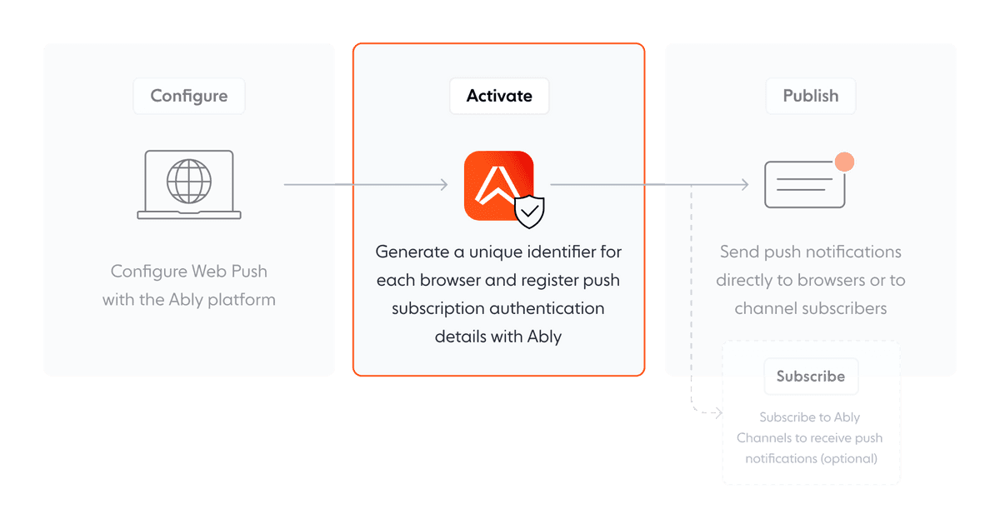

To send push notifications with Ably, you must first configure browsers using [Web Push](https://www.w3.org/TR/push-api/) and integrate it with Ably's infrastructure. You can then activate the push notifications service, either directly or via a server.

<Aside data-type='note'>
To configure devices using FCM or APNs, see [configure devices](/docs/push/configure/device).
</Aside>

## Configure web browsers <a id="configure"/>

Configuration is the first step in setting up push notifications with Ably. This step requires setting up the necessary infrastructure for your application.


The following steps configure a web browser for push notifications using the Ably JavaScript SDK:

* **Generate a VAPID (Voluntary Application Server Identification) Key:**
  * When you first activate a web browser using the Ably JavaScript [SDK](/docs/getting-started), Ably automatically creates a VAPID key pair for your application.
  * Ably will then use the same VAPID key pair for all subsequent activations in the same application.
* **Service Worker Setup:**
  * You must host a [service worker](https://developer.mozilla.org/en-US/docs/Web/API/Service_Worker_API) to use to push messages.
  * Service workers operate in the background, outside of any specific page or tab context.
  * The service worker will handle all incoming push notifications as JavaScript events.
* **Implement the service worker:**
  * Create a JavaScript file to act as your service worker.
  * In your service worker file, listen for push events using `addEventListener("push", callback)`.

The following example shows a service worker script displaying push notifications:

<Code>
```javascript
self.addEventListener("push", (event) => {
  const { notification } = event.data.json();
  self.registration.showNotification(notification.title, notification);
});
```
</Code>

### Install and set up your Ably SDK

The following example installs and sets up the Ably SDK:

<Code>
```realtime_javascript
import Ably from "ably";
import Push from "ably/push";

// pass in the push plugin via client options, along with the URL of your service worker
const client = new Ably.Realtime({
  pushServiceWorkerUrl: '/service_worker.js',
  plugins: { Push }
})
```
</Code>

## Activate browsers

To receive push notifications using Ably, each browser must first register with the service worker registration's push manager for web push notifications. Ably's SDK facilitates this registration process and provides a unified API to manage it.



### Activate directly <a id="browser"/>

Activating a browser for push notifications is typically done directly on the browser itself. Use the [`push.activate()`](/docs/api/realtime-sdk/push#activate) method to activate push notifications from a browser. The following steps describe the direct activation process:

1. Authenticate the Ably client.
2. Generate a unique identifier for the browser and save it locally.
3. Activate push notifications for the browsers with the service worker registration's push manager, obtaining a unique identifier.
4. Register the browser with Ably, providing its unique identifier (`deviceId`), browser details, and push recipient information.
5. Store the browser's identity token from Ably's response locally for authentication in subsequent updates.

Note that once activated, the browser remains registered even after the application is closed until the [`push.deactivate()`](/docs/api/realtime-sdk/push#deactivate) method is called. Calling activate again has no effect if the browser is already activated.

The following diagram demonstrates the direct activation process:


#### Activate via package manager <a id="package-man"/>

If you have installed the Ably SDK using a package manager (such as npm), you can use the `activate` method to enable push notifications. You can then initialize the push plugin with the Ably client instance.

The following example initializes an instance of the Ably realtime service and then activates the push notifications feature _for that instance_:

<Code>
```javascript
await client.push.activate();
```
</Code>

#### Activate via Content Delivery Network (CDN) <a id="no-package-man"/>

If you can't use a package manager, you can activate it via CDN by directly loading the push plugin in your HTML using a `<script>` tag.

The following example is loading the Ably push notifications library from a CDN:

<Code>
```html
<script src="https://cdn.ably.com/lib/push.umd.min-2.js"></script>
```
</Code>

When loaded, the push plugin becomes available on the global object via the `AblyPushPlugin` property. You can then initialize the push plugin with the Ably client instance.

The following example initializes an instance of the Ably realtime service and then activates the push notifications feature _for that instance_:

<Code>
```javascript
const client = new Ably.Realtime({
  ...options,
  plugins: { Push: AblyPushPlugin },
});
```
</Code>

<Aside data-type='note'>
This plugin must be passed to the Ably instance for it to be utilized.
</Aside>

#### Test your push notification activation

* Use the Ably [dashboard](https://ably.com/accounts) or [API](/docs/api/realtime-sdk/push-admin) to send a test push notification to a registered browser.
* Ensure your application correctly receives and handles the push notification.

### Activate browsers via server <a id="server"/>

In specific scenarios, especially where strict control over browser capabilities is essential, managing the activation of browsers for push notifications through the server is useful. This approach separates the registration with the Web Push service, which still happens on the browser. Meanwhile, your server manages the browsers registration with Ably. This setup provides a centralized and efficient process for controlling browser activation.

The following steps explain the server-assisted activation process:

1. The browser initiates activation by registering with Web Push to obtain a unique identifier, such as VAPID key.
2. Instead of registering with Ably, the browser sends identifier to your server. Your server then uses this identifier to register the browser with Ably using Ably's Push Admin API.
3. The server stores and manages the identifier. It is responsible for updating the identifier in Ably's system whenever there are changes, which can be triggered by the browser sending updates to the server following the Web Push service's renewal.

The following diagram demonstrates the process for activating browsers from a server:


<Aside data-type='note'>
Utilize the [push notifications admin API](/docs/api/realtime-sdk/push-admin) on your server to register browsers.
</Aside>

#### Activate browsers via server

The following examples show how to **activate** and **deactivate** Web Push notifications using a `registerCallback` and `deregisterCallback` with the `activate` method.

To activate:

<Code>
```javascript
ably.push.activate(async (deviceDetails, callback) => {
  const deviceRegistration = await registerThroughYourServer(deviceDetails);
  callback(deviceRegistration);
});
```
</Code>

To deactivate:

<Code>
```javascript
ably.push.deactivate(async (deviceDetails, callback) => {
  const deviceId = await deregisterThroughYourServer(deviceDetails);
  callback(deviceId);
});
```
</Code>

#### Test your push notification activation

* Use the Ably [dashboard](https://ably.com/accounts) or [API](/docs/api/realtime-sdk/push-admin) to send a test push notification to a registered browser.
* Ensure your application correctly receives and handles the push notification.

### Browser activation lifecycle

When the [`push.activate()`](/docs/api/realtime-sdk/push#activate) and [`push.deactivate()`](/docs/api/realtime-sdk/push#deactivate) methods are called, the browser registers Web Push.

<Aside data-type='note'>
The activation, deactivation, and update processes may fail. You should handle the outcomes of these operations appropriately within your push notification lifecycle methods.
</Aside>

- **JavaScript**:
  - For activation, pass a `registerCallback` to the `push.activate` method
  - For deactivation, pass a `deregisterCallback` to the `push.deactivate` method
  - For failed updates, pass a `updateFailedCallback` as the second argument to the `push.activate` method

