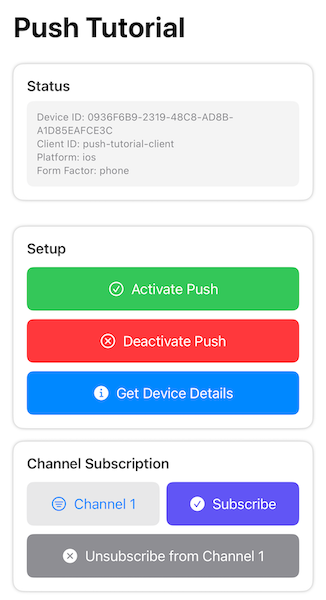

This guide will get you started with Ably Push Notifications in a new SwiftUI application.

You'll learn how to set up your `AppDelegate` to manage push notifications, register devices with Ably, send push notifications, subscribe to channel-based push, handle incoming notifications, and implement location-based push notifications.

## Prerequisites <a id="prerequisites"/>

1. [Sign up](https://ably.com/signup) for an Ably account.
2. Create a [new app](https://ably.com/accounts/any/apps/new), and create your first API key in the **API Keys** tab of the dashboard.
3. Your API key will need the `publish` and `subscribe` capabilities. For sending push notifications from your app, you'll also need the `push-admin` capability.
4. For channel-based push, add a rule for the channel with **Push notifications enabled** checked. In the dashboard left sidebar: **Configuration** → **Rules** → **Add** or **Edit** a rule,
then enable the Push notifications option. See [channel rules](https://ably.com/docs/channels#rules) for details.
5. Install [Xcode](https://developer.apple.com/xcode/).
6. You'll need a real iOS device to test push notifications (the simulator doesn't support APNs).
7. Set up Apple Push Notification service (APNs) certificates through the [Apple Developer Portal](https://developer.apple.com/).

### (Optional) Install Ably CLI <a id="install-cli"/>

Use the [Ably CLI](https://github.com/ably/cli) as an additional client to quickly test Pub/Sub features and push notifications.

1. Install the Ably CLI:

<Code>
```shell
npm install -g @ably/cli
```
</Code>

2. Run the following to log in to your Ably account and set the default app and API key:

<Code>
```shell
ably login
```
</Code>

### Set up APNs certificates <a id="setup-apns"/>

To enable push notifications, you need to configure APNs on Apple's developer portal:

1. Go to [Apple Developer Portal](https://developer.apple.com/account/resources/certificates/list).
2. Create an App ID for your application (if you don't have one already).
3. Enable the Push Notifications capability for your App ID.
4. Create an APNs certificate and download it.
5. In the Ably dashboard, navigate to your app's **Notifications** tab.
6. Scroll to the **Push Notifications Setup** section and select **Configure Push**.
7. Follow the instructions to upload your APNs certificate.

### Create a Swift project with Xcode <a id="prerequisites-create-project"/>

Create a new iOS SwiftUI project and add the Ably SDK dependency to it:

   - In Xcode, go to **File > Add Package Dependencies**
   - Enter the repository URL: https://github.com/ably/ably-cocoa
   - Select the latest version and add it to your target

Update your project settings:

1. Select the target for your app and go to the **Signing & Capabilities** tab.
2. Make sure you've selected your development team and that a provisioning profile has been created.
3. Add the **Push Notifications** capability by clicking **+ Capability**.

All further code can be added directly to your `ContentView.swift` and `AppDelegate.swift` files.

## Step 1: Set up Ably <a id="step-1"/>

Create an `AppDelegate.swift` file and add the `AppDelegate` class which should conform to the following protocols:
`UIApplicationDelegate`, `ARTPushRegistererDelegate`, `UNUserNotificationCenterDelegate`, and `CLLocationManagerDelegate`.

Set up the Ably realtime client, notification center, and location manager in your
`application:didFinishLaunchingWithOptions` delegate method as shown below:

<Code>
```swift
import Ably
import UIKit
import CoreLocation
import UserNotifications

class AppDelegate: NSObject, UIApplicationDelegate, ARTPushRegistererDelegate, UNUserNotificationCenterDelegate, CLLocationManagerDelegate {

    // MARK: - Properties
    var realtime: ARTRealtime!
    var locationManager: CLLocationManager!

    var defaultDeviceToken: String?
    var locationDeviceToken: String?

    var activatePushCallback: ((String, ARTErrorInfo?) -> ())?
    var activateLocationPushCallback: ((String, ARTErrorInfo?) -> ())?
    var locationGrantedCallback: ((Bool) -> ())?

    // MARK: - UIApplicationDelegate Methods

    func application(_ application: UIApplication, didFinishLaunchingWithOptions launchOptions: [UIApplication.LaunchOptionsKey: Any]? = nil) -> Bool {
        // Initialize Ably Realtime client with push registerer delegate
        let clientOptions = ARTClientOptions(key: "{{API_KEY}}")
        clientOptions.clientId = "push-tutorial-client"
        clientOptions.pushRegistererDelegate = self
        realtime = ARTRealtime(options: clientOptions)

        // Set up notification delegate
        UNUserNotificationCenter.current().delegate = self

        // Setup location manager for location-based push
        locationManager = CLLocationManager()
        locationManager.delegate = self
        locationManager.desiredAccuracy = kCLLocationAccuracyBest

        return true
    }
}
```
</Code>

Here you also have some properties defined to manage device tokens and callbacks for the UI which we'll use later.

## Step 2: Set up push notifications <a id="step-2"/>

To send and receive push notifications, you need to provide `ably-cocoa` with the device token received
from Apple in the `application:didRegisterForRemoteNotificationsWithDeviceToken` delegate method.
You also need to request notification permissions from the user and register your device with Ably.
To handle registration results, you'll implement the `ARTPushRegistererDelegate` methods.
Getting device details is also useful to confirm that your device is registered correctly.

Append the following code to your `AppDelegate` class:

<Code>
```swift
func application(_ application: UIApplication, didRegisterForRemoteNotificationsWithDeviceToken deviceToken: Data) {
    defaultDeviceToken = deviceToken.map { String(format: "%02x", UInt($0)) }.joined() // Convert device token data to a hex string
    print("Device Token registered: \(defaultDeviceToken!)")
    // Use Ably's global ARTPush method to register the device token with Ably
    ARTPush.didRegisterForRemoteNotifications(withDeviceToken: deviceToken, realtime: realtime)
}

func application(_ application: UIApplication, didFailToRegisterForRemoteNotificationsWithError error: Error) {
    print("Failed to register for remote notifications: \(error.localizedDescription)")
    // Use Ably's global ARTPush method to handle registration failure
    ARTPush.didFailToRegisterForRemoteNotificationsWithError(error, realtime: realtime)
}

// MARK: - Push Notifications Methods

/// Request notification permissions from user
func requestUserNotificationAuthorization() {
    // Request authorization for alerts, sounds, and badges
    UNUserNotificationCenter.current().requestAuthorization(options: [.alert, .sound, .badge]) { granted, error in
        DispatchQueue.main.async {
            if granted {
                print("Notification permissions granted")
            } else if let error = error {
                print("Notification permission error: \(error.localizedDescription)")
            }
        }
    }
}

/// Activate push notifications
func activatePushNotifications(_ callback: @escaping (String, ARTErrorInfo?) -> ()) {
    // Store callback since activation is asynchronous
    activatePushCallback = callback
    // Request notification permissions
    requestUserNotificationAuthorization()
    // Activate push notifications with Ably
    realtime.push.activate()
    print("Activating push notifications...")
}

/// Deactivate push notifications
func deactivatePush() {
    realtime.push.deactivate()
    print("Deactivating push notifications...")
}

/// Get current device registration details
func getDeviceDetails(_ callback: @escaping (ARTDeviceDetails?, ARTErrorInfo?) -> ()) {
    realtime.push.admin.deviceRegistrations.get(realtime.device.id, callback: callback)
}

// MARK: - ARTPushRegistererDelegate Methods

func didActivateAblyPush(_ error: ARTErrorInfo?) {
    print("Push activation: \(error?.localizedDescription ?? "Success")")
    if let defaultDeviceToken {
        // Notify UI about activation result
        activatePushCallback?(defaultDeviceToken, error)
    }
}

func didDeactivateAblyPush(_ error: ARTErrorInfo?) {
    print("Push deactivation: \(error?.localizedDescription ?? "Success")")
}
```
</Code>

Now you are ready to receive push notifications.

## Step 3: Receive push notifications <a id="step-3"/>

Use `UNUserNotificationCenterDelegate` methods to receive push notifications.
You've set the notification center delegate in the `application:didFinishLaunchingWithOptions` method.

Add these methods to your `AppDelegate` class:

<Code>
```swift
// MARK: - UNUserNotificationCenterDelegate Methods

/// Handle notification when app is in foreground
func userNotificationCenter(_ center: UNUserNotificationCenter,
                            willPresent notification: UNNotification,
                            withCompletionHandler completionHandler: @escaping (UNNotificationPresentationOptions) -> Void) {
    let userInfo = notification.request.content.userInfo
    print("Notification received in foreground: \(userInfo)")

    // Display notification with banner, sound, and badge
    completionHandler([.banner, .sound, .badge])
}

/// Handle notification when user taps on the notification when the app is in the background
func userNotificationCenter(_ center: UNUserNotificationCenter,
                            didReceive response: UNNotificationResponse,
                            withCompletionHandler completionHandler: @escaping () -> Void) {
    let userInfo = response.notification.request.content.userInfo
    print("Notification tapped: \(userInfo)")

    completionHandler()
}
```
</Code>

Push notifications can be sent either directly to your `deviceId` (or `clientId`),
or posted to a channel, in which case you first need to subscribe your device to that channel:

<Code>
```swift
// MARK: - Subscribe to Channels

/// Subscribe to a channel for push notifications
func subscribeToChannel(_ channelName: String) {
    let channel = realtime.channels.get(channelName)

    channel.push.subscribeDevice { error in
        if let error = error {
            print("Error subscribing to channel push: \(error.localizedDescription)")
        } else {
            print("Subscribed to push notifications on channel: \(channelName)")
        }
    }
}

/// Unsubscribe from a channel
func unsubscribeFromChannel(_ channelName: String) {
    let channel = realtime.channels.get(channelName)

    channel.push.unsubscribeDevice { error in
        if let error = error {
            print("Error unsubscribing from channel push: \(error.localizedDescription)")
        } else {
            print("Unsubscribed from push notifications on channel: \(channelName)")
        }
    }
}
```
</Code>

Sending push notifications using `deviceId` or `clientId` requires the `push-admin` capability for your API key.
Use this method for testing purposes. In a production environment, you would typically send push notifications
from your backend server (by posting messages with `push` `extras` field to a channel).

To test push notifications in your app, you can use [Ably dashboard](https://ably.com/dashboard),
[Apple developer dashboard](https://icloud.developer.apple.com/dashboard/) or Ably CLI.

To send to your client ID using Ably CLI paste the following command into your terminal:

<Code>
```shell
ably push publish --client-id push-tutorial-client \
  --title "Test push" \
  --body "Hello from CLI!" \
  --data '{"foo":"bar","baz":"qux"}'
```
</Code>

For sending pushes via a channel, we need some actual UI to be able to subscribe to this channel. So, let's build one.

## Step 4: Build the UI <a id="step-4"/>

First, in your `PushTutorialApp.swift`, add `@UIApplicationDelegateAdaptor` wrapped `appDelegate` property
to your app `@main` struct and pass it to the `ContentView`:

<Code>
```swift
import SwiftUI

@main
struct PushTutorialApp: App {
    @UIApplicationDelegateAdaptor(AppDelegate.self) var appDelegate

    var body: some Scene {
        WindowGroup {
            ContentView(appDelegate: appDelegate)
        }
    }
}
```
</Code>

Then, update your `ContentView.swift` to accept the `appDelegate` and display a few sections:

<Code>
```swift
import Ably
import SwiftUI

struct ContentView: View {
    let appDelegate: AppDelegate

    @State private var statusMessage = "Ready to start"
    @State private var selectedChannel = "exampleChannel1"

    var body: some View {
        NavigationStack {
            VStack(spacing: 0) {
                // Status Section (always visible at the top)
                StatusSection(message: $statusMessage)
                .padding()

                // Scrollable sections
                ScrollView {
                    VStack(spacing: 16) {
                        // Setup Section
                        SetupPushSection(appDelegate: appDelegate, statusMessage: $statusMessage)

                        // Subscribe to Channel Section
                        ChannelSection(appDelegate: appDelegate, statusMessage: $statusMessage, selectedChannel: $selectedChannel)
                    }
                    .padding()
                }
            }
            .navigationTitle("Push Tutorial")
        }
    }
}
```
</Code>

Each section is implemented as a separate SwiftUI `View` struct for better organization.
Since this is not a SwiftUI tutorial, we will not go into details of each section's implementation.
They are just a few buttons with some basic styling. You can add this code at the bottom of the same `ContentView.swift` file:

<Code>
```swift
// MARK: - Status Section
struct StatusSection: View {
    @Binding var message: String

    var body: some View {
        VStack(alignment: .leading, spacing: 8) {
            Text("Status")
                .font(.headline)

            Text(message)
                .font(.caption)
                .foregroundStyle(.secondary)
                .padding(12)
                .frame(maxWidth: .infinity, alignment: .leading)
                .background(Color.gray.opacity(0.1))
                .cornerRadius(8)
        }
        .padding()
        .background(Color.white)
        .cornerRadius(12)
        .shadow(radius: 2)
    }
}

// MARK: - Setup Section
struct SetupPushSection: View {
    let appDelegate: AppDelegate
    @Binding var statusMessage: String

    var body: some View {
        VStack(alignment: .leading, spacing: 12) {
            Text("Setup")
                .font(.headline)

            VStack(spacing: 10) {
                Button(action: {
                    appDelegate.activatePushNotifications { deviceToken, error in
                        if let error = error {
                            statusMessage = "Push activation failed: \(error.localizedDescription)"
                        } else {
                            statusMessage = "Push notifications activated with device token: \(deviceToken)"
                        }
                    }
                    statusMessage = "Activating push notifications..."
                }) {
                    HStack {
                        Image(systemName: "checkmark.circle")
                        Text("Activate Push")
                    }
                    .frame(maxWidth: .infinity)
                    .padding()
                    .background(Color.green)
                    .foregroundStyle(.white)
                    .cornerRadius(8)
                }

                Button(action: {
                    appDelegate.deactivatePush()
                    statusMessage = "Push notifications deactivated"
                }) {
                    HStack {
                        Image(systemName: "xmark.circle")
                        Text("Deactivate Push")
                    }
                    .frame(maxWidth: .infinity)
                    .padding()
                    .background(Color.red)
                    .foregroundStyle(.white)
                    .cornerRadius(8)
                }

                Button(action: {
                    appDelegate.getDeviceDetails { details, error in
                        if let details = details {
                            print("Device details: \(details)")
                            statusMessage = """
                            Device ID: \(details.id)
                            Client ID: \(details.clientId ?? "n/a")
                            Platform: \(details.platform)
                            Form Factor: \(details.formFactor)
                            """
                        } else {
                            statusMessage = "Failed to retrieve device details: \(error?.localizedDescription ?? "Unknown error")"
                        }
                    }
                }) {
                    HStack {
                        Image(systemName: "info.circle.fill")
                        Text("Get Device Details")
                    }
                    .frame(maxWidth: .infinity)
                    .padding()
                    .background(Color.blue)
                    .foregroundStyle(.white)
                    .cornerRadius(8)
                }
            }
        }
        .padding()
        .background(Color.white)
        .cornerRadius(12)
        .shadow(radius: 2)
    }
}

// MARK: - Channel Section

// Helper to get a user-friendly title for a channel
func titleForChannel(_ name: String) -> String {
    let titles = [
        "exampleChannel1": "Channel 1",
        "exampleChannel2": "Channel 2"
    ]
    return titles[name] ?? name
}

struct ChannelSection: View {
    let appDelegate: AppDelegate
    @Binding var statusMessage: String
    @Binding var selectedChannel: String

    var body: some View {
        VStack(alignment: .leading, spacing: 12) {
            Text("Channel Subscription")
                .font(.headline)

            VStack(spacing: 10) {
                HStack(spacing: 8) {
                    Menu {
                        Button(titleForChannel("exampleChannel1")) {
                            selectedChannel = "exampleChannel1"
                        }
                        Button(titleForChannel("exampleChannel2")) {
                            selectedChannel = "exampleChannel2"
                        }
                    } label: {
                        HStack {
                            Image(systemName: "line.3.horizontal.decrease.circle")
                            Text(titleForChannel(selectedChannel))
                        }
                        .frame(maxWidth: .infinity)
                        .padding()
                        .background(Color.gray.opacity(0.2))
                        .cornerRadius(8)
                    }

                    Button(action: {
                        appDelegate.subscribeToChannel(selectedChannel)
                        statusMessage = "Subscribed to: \(titleForChannel(selectedChannel))"
                    }) {
                        HStack {
                            Image(systemName: "checkmark.circle.fill")
                            Text("Subscribe")
                        }
                        .frame(maxWidth: .infinity)
                        .padding()
                        .background(Color.indigo)
                        .foregroundStyle(.white)
                        .cornerRadius(8)
                    }
                }

                Button(action: {
                    appDelegate.unsubscribeFromChannel(selectedChannel)
                    statusMessage = "Unsubscribed from: \(titleForChannel(selectedChannel))"
                }) {
                    HStack {
                        Image(systemName: "xmark.circle.fill")
                        Text("Unsubscribe from \(titleForChannel(selectedChannel))")
                    }
                    .frame(maxWidth: .infinity)
                    .padding()
                    .background(Color.gray)
                    .foregroundStyle(.white)
                    .cornerRadius(8)
                }
            }
        }
        .padding()
        .background(Color.white)
        .cornerRadius(12)
        .shadow(radius: 2)
    }
}
```
</Code>

Build and run your app in Xcode on a real device. You will see the UI with sections to activate
push notifications and subscribe to channels. Tap the "Activate Push" button and wait until the status message
displays the received device token. Try sending push using client ID or device ID as shown earlier.
You can get your device ID from the device details button (don't confuse it with the device token):



### Send push via channel <a id="step-4-send-channel"/>

To test pushes via channel, subscribe to "Channel 1" in the UI and post a message to the "exampleChannel1"
with a `push` `extras` field using Ably CLI:

<Code>
```shell
ably channels publish exampleChannel1 '{"name":"example","data":"Hello from CLI!","extras":{"push":{"notification":{"title":"Ably CLI","body":"Hello from CLI!"},"data":{"foo":"bar"}}}}'
```
</Code>

If you unsubscribe from this channel in the app's UI, you will no longer receive push notifications for that channel.
Send the same command again and verify that no notification is received.

You can also send push notifications right from your app. The next step will show you how.

## Step 5: Send push with code <a id="step-5"/>

Just as you can send push notifications through the Ably CLI or dashboard, you can also send them directly from your app
using `deviceId` (or `clientId`), or channel publishing methods. For channel publishing, you don't need the admin capabilities
for your API key.

Add the following methods to your `AppDelegate` class:

<Code>
```swift
// MARK: - Send Push Notifications

/// Send push notification to a specific device ID
func sendPushToDevice() {
    let recipient = [
        "deviceId": realtime.device.id
    ]
    let data = [
        "notification": [
            "title": "Push Tutorial",
            "body": "Hello from device ID!"
        ],
        "data": [
            "foo": "bar",
            "baz": "qux"
        ]
    ]
    realtime.push.admin.publish(recipient, data: data) { error in
        print("Publish result: \(error?.localizedDescription ?? "Success")")
    }
}

/// Send push notification to a specific client ID
func sendPushToClient() {
    let recipient = [
        "clientId": realtime.auth.clientId ?? "push-tutorial-client"
    ]
    let data = [
        "notification": [
            "title": "Push Tutorial",
            "body": "Hello from client ID!"
        ],
        "data": [
            "foo": "bar",
            "baz": "qux"
        ]
    ]
    realtime.push.admin.publish(recipient, data: data) { error in
        print("Publish result: \(error?.localizedDescription ?? "Success")")
    }
}
```
</Code>

Sending to a channel is just publishing a message on a channel with a `push` `extras` field:

<Code>
```swift
/// Send push notification to a specific channel by publishing a message with a push extras field
func sendPushToChannel(_ channelName: String) {
    let message = ARTMessage(name: "example", data: "Hello from channel!")
    message.extras = [
        "push": [
            "notification": [
                "title": "Channel Push",
                "body": "Sent push to \(channelName)"
            ],
            "data": [
                "foo": "bar",
                "baz": "qux"
            ]
        ]
    ] as any ARTJsonCompatible

    realtime.channels.get(channelName).publish([message]) { error in
        if let error {
            print("Error sending push to \(channelName) with error: \(error.localizedDescription)")
        } else {
            print("Sent push to \(channelName)")
        }
    }
}
```
</Code>

Now add buttons for these methods in the new `SendPushSection` view struct:

<Code>
```swift
// MARK: - Send Push Section

struct SendPushSection: View {
    let appDelegate: AppDelegate
    @Binding var statusMessage: String
    @Binding var selectedChannel: String

    var body: some View {
        VStack(alignment: .leading, spacing: 12) {
            Text("Send Push Notifications")
                .font(.headline)

            VStack(spacing: 10) {
                Button(action: {
                    appDelegate.sendPushToDevice()
                    statusMessage = "Sending push to device ID..."
                }) {
                    HStack {
                        Image(systemName: "phone.badge.checkmark")
                        Text("Send Push to Device ID")
                    }
                    .frame(maxWidth: .infinity)
                    .padding()
                    .background(Color.purple)
                    .foregroundStyle(.white)
                    .cornerRadius(8)
                }

                Button(action: {
                    appDelegate.sendPushToClient()
                    statusMessage = "Sending push to client ID..."
                }) {
                    HStack {
                        Image(systemName: "person.crop.circle.badge.checkmark")
                        Text("Send Push to Client ID")
                    }
                    .frame(maxWidth: .infinity)
                    .padding()
                    .background(Color.orange)
                    .foregroundStyle(.white)
                    .cornerRadius(8)
                }

                HStack(spacing: 8) {
                    Menu {
                        Button(titleForChannel("exampleChannel1")) {
                            selectedChannel = "exampleChannel1"
                        }
                        Button(titleForChannel("exampleChannel2")) {
                            selectedChannel = "exampleChannel2"
                        }
                    } label: {
                        HStack {
                            Image(systemName: "line.3.horizontal.decrease.circle")
                            Text(titleForChannel(selectedChannel))
                        }
                        .frame(maxWidth: .infinity)
                        .padding()
                        .background(Color.gray.opacity(0.2))
                        .cornerRadius(8)
                    }

                    Button(action: {
                        appDelegate.sendPushToChannel(selectedChannel)
                        statusMessage = "Sending push to channel: \(selectedChannel)..."
                    }) {
                        HStack {
                            Image(systemName: "checkmark.circle.fill")
                            Text("Send")
                        }
                        .frame(maxWidth: .infinity)
                        .padding()
                        .background(Color.cyan)
                        .foregroundStyle(.white)
                        .cornerRadius(8)
                    }
                }
            }
        }
        .padding()
        .background(Color.white)
        .cornerRadius(12)
        .shadow(radius: 2)
    }
}
```
</Code>

Update your `ContentView` body to include this section (add it just after the `ChannelSection`):

<Code>
```swift
// Send Push Section
SendPushSection(appDelegate: appDelegate, statusMessage: $statusMessage, selectedChannel: $selectedChannel)
```
</Code>

Build and run your app again. Use the added section to send push notifications.

## Step 6: Location pushes <a id="step-6"/>

Starting from iOS 15, you can efficiently receive location requests as push notifications.
To do this, you need to apply for the special entitlement on the [Apple Developer Portal](https://developer.apple.com/documentation/bundleresources/entitlements/com_apple_developer_location_push).

Add `Location (when in use)`, `Location (Always)`, `Location Push Service Extension`, and
`Push Notifications` capabilities to the **Signing & Capabilities** tab in the Xcode project target settings.

Add `Location Push Service Extension` target as described at the [Apple Developer Portal](https://developer.apple.com/documentation/CoreLocation/creating-a-location-push-service-extension).
For simplicity, use **Automatically manage signing**, so all needed identifiers are created for you by
Xcode (with XC prefix in their display name). Your Location Push Service Extension should have a bundle
identifier of your app with a suffix of extension's product name (e.g., `the.company.TheApp.TheExtension`).

Add these methods to your `AppDelegate` class:

<Code>
```swift
// MARK: - Location push methods

/// Enable location push monitoring
func enableLocationPush(grantedCallback: @escaping (Bool) -> (), tokenCallback: @escaping (String, ARTErrorInfo?) -> ()) {
    // Store callbacks since location permission request is asynchronous
    locationGrantedCallback = grantedCallback
    activateLocationPushCallback = tokenCallback

    switch locationManager.authorizationStatus {
    case .authorizedAlways:
        // Location permissions already granted
        locationGrantedCallback?(true)
        // Activate location push monitoring
        activateLocationPush()
        print("Location push enabled")
    case .notDetermined:
        // Request location permissions from the user with 'Always' authorization needed for location pushes
        locationManager.requestAlwaysAuthorization()
    case .denied, .restricted, .authorizedWhenInUse:
        locationGrantedCallback?(false)
        print("Location permission denied or restricted")
    @unknown default:
        break
    }
}

/// Disable location push monitoring
func disableLocationPush() {
    locationManager?.stopUpdatingLocation()
    print("Location push disabled")
}

/// Activate location push monitoring
func activateLocationPush() {
    print("Starting monitoring location pushes...")
    locationManager.startMonitoringLocationPushes { deviceToken, error in
        guard error == nil else {
            return ARTPush.didFailToRegisterForLocationNotificationsWithError(error!, realtime: self.realtime)
        }
        if let deviceToken {
            // Convert device token data to a hex string
            self.locationDeviceToken = deviceToken.map { String(format: "%02x", UInt($0)) }.joined()
            // Provide Ably with location device token
            ARTPush.didRegisterForLocationNotifications(withDeviceToken: deviceToken, realtime: self.realtime)
            print("Location push activated with device token: \(self.locationDeviceToken!)")
        }
    }
}

// MARK: - CLLocationManagerDelegate Methods

func locationManagerDidChangeAuthorization(_ manager: CLLocationManager) {
    switch manager.authorizationStatus {
    case .authorizedAlways:
        // Location permissions granted, activate location push monitoring
        locationGrantedCallback?(true)
        // Activate location push monitoring
        activateLocationPush()
        print("Location services always authorized.")
    case .notDetermined, .authorizedWhenInUse, .restricted, .denied:
        // Inform UI that location permissions were not granted
        locationGrantedCallback?(false)
        print("Location services unavailable for location pushes.")
        break
    default:
        break
    }
}
```
</Code>

Also add this in your `ARTPushRegistererDelegate` section.
It will be called after `ARTPush.didRegisterForLocationNotifications(withDeviceToken:realtime:)` completes:

<Code>
```swift
func didUpdateAblyPush(_ error: ARTErrorInfo?) {
    print("Push update: \(error?.localizedDescription ?? "Success")")
    if let locationDeviceToken {
        // Notify UI about activation result
        activateLocationPushCallback?(locationDeviceToken, error)
    }
}
```
</Code>

### Receiving location pushes <a id="step-5-receiving"/>

Once you've added the location push extension to your project, Xcode gives you a default implementation of the
`LocationPushService.swift` file in your extension target.
Use `locationManager(_:didUpdateLocations)` delegate method to handle location updates as needed.

Now add the `LocationPushSection` to your `ContentView.swift` file to enable location push from the UI:

<Code>
```swift

// MARK: - Location Push Section
struct LocationPushSection: View {
    let appDelegate: AppDelegate
    @Binding var statusMessage: String
    @State var isLocationPushEnabled = false

    var body: some View {
        VStack(alignment: .leading, spacing: 12) {
            Text("Location Push")
                .font(.headline)

            VStack(spacing: 10) {
                Button(action: {
                    appDelegate.enableLocationPush { granted in
                        if granted {
                            isLocationPushEnabled = true
                            statusMessage = "Location push authorization granted."
                        } else {
                            isLocationPushEnabled = false
                            statusMessage = "Location push authorization denied or restricted."
                        }
                    } tokenCallback: { deviceToken, error in
                        if let error = error {
                            isLocationPushEnabled = false
                            statusMessage = "Location push activation failed: \(error.localizedDescription)"
                        } else {
                            statusMessage = "Location push notifications activated with device token: \(deviceToken)"
                        }
                    }
                }) {
                    HStack {
                        Image(systemName: "mappin.circle.fill")
                        Text("Enable Location Push")
                    }
                    .frame(maxWidth: .infinity)
                    .padding()
                    .background(Color.green)
                    .foregroundStyle(.white)
                    .cornerRadius(8)
                }

                Button(action: {
                    appDelegate.disableLocationPush()
                    isLocationPushEnabled = false
                    statusMessage = "Location push disabled"
                }) {
                    HStack {
                        Image(systemName: "mappin.circle")
                        Text("Disable Location Push")
                    }
                    .frame(maxWidth: .infinity)
                    .padding()
                    .background(Color.gray)
                    .foregroundStyle(.white)
                    .cornerRadius(8)
                }

                HStack {
                    Image(systemName: isLocationPushEnabled ? "checkmark.circle.fill" : "xmark.circle")
                    Text(isLocationPushEnabled ? "Location Push: Enabled" : "Location Push: Disabled")
                    Spacer()
                }
                .font(.caption)
                .foregroundStyle(isLocationPushEnabled ? .green : .gray)
                .padding(8)
                .background(Color.gray.opacity(0.1))
                .cornerRadius(6)
            }
        }
        .padding()
        .background(Color.white)
        .cornerRadius(12)
        .shadow(radius: 2)
    }
}
```
</Code>

Don't forget to include this section in your `ContentView` body (add it just after the `SendPushSection`):

<Code>
```swift
// Location Push Section
LocationPushSection(appDelegate: appDelegate, statusMessage: $statusMessage)
```
</Code>

Build and run your app. Enable location push from the UI and grant location permissions when prompted.
Use Ably dashboard, Apple dashboard, or Ably CLI to send location push notifications to your device.

You can also use the following `cURL` command to send location pushes:

<Code>
```shell
curl -v \
  --header "authorization: bearer ${AUTHENTICATION_TOKEN}" \
  --header "apns-topic: ${BUNDLE_ID}.location-query" \
  --header "apns-push-type: location" \
  --data '{"aps":{}}' \
  --http2  https://api.development.push.apple.com:443/3/device/${DEVICE_TOKEN}
```
</Code>

Replace `${BUNDLE_ID}` with your app's bundle identifier, `${AUTHENTICATION_TOKEN}` with your APNs authentication token,
and `${DEVICE_TOKEN}` with the location device token you received in the console logs after enabling location push
(don't confuse it with the device ID).

Read how to obtain the `AUTHENTICATION_TOKEN` on [Apple Developer Portal](https://developer.apple.com/documentation/usernotifications/establishing-a-token-based-connection-to-apns).

Verify that your app receives and handles location push notifications correctly in the `LocationPushService` class.

## Next steps <a id="next-steps"/>

* Check the [push example](https://github.com/ably/ably-cocoa/tree/main/Examples/AblyPush)
* Understand [token authentication](/docs/auth/token) before going to production.
* Explore [push notification administration](/docs/push/admin) for managing devices and subscriptions.
* Learn about [channel rules](/docs/push/channel-rules) for channel-based push notifications.
* Read more about the [Push Admin API](/docs/api/realtime-sdk?lang=swift#push-admin).
* Check out the [Push Notifications](/docs/push) documentation for advanced use cases.

You can also explore the [Ably SDK for Swift](https://github.com/ably/ably-cocoa) on GitHub, or visit the [API references](/docs/api/realtime-sdk?lang=swift) for additional functionality.
