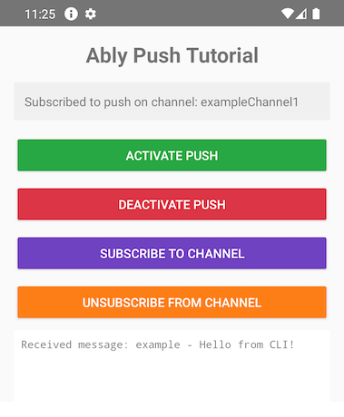
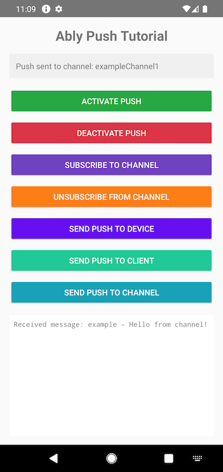

This guide will get you started with Ably Push Notifications in a new Android application using Kotlin.

You'll learn how to set up your application with Firebase Cloud Messaging (FCM), register devices with Ably, send push notifications, subscribe to channel-based push, and handle incoming notifications.

## Prerequisites <a id="prerequisites"/>

1. [Sign up](https://ably.com/signup) for an Ably account.
2. Create a [new app](https://ably.com/accounts/any/apps/new), and create your first API key in the **API Keys** tab of the dashboard.
3. Your API key will need the `publish` and `subscribe` capabilities. For sending push notifications from your app, you'll also need the `push-admin` capability.
4. For channel-based push, add a rule for the channel with **Push notifications enabled** checked. In the dashboard left sidebar: **Configuration** → **Rules** → **Add** or **Edit** a rule, then enable the Push notifications option. See [channel rules](https://ably.com/docs/channels#rules) for details.
5. Install [Android Studio](https://developer.android.com/studio).
6. A real Android device or an emulator with Google Play Services installed (required for FCM).

### (Optional) Install Ably CLI <a id="install-cli"/>

Use the [Ably CLI](https://github.com/ably/cli) as an additional client to quickly test Pub/Sub features and push notifications.

1. Install the Ably CLI:

<Code>
```shell
npm install -g @ably/cli
```
</Code>

2. Run the following to log in to your Ably account and set the default app and API key:

<Code>
```shell
ably login
```
</Code>

### Set up Firebase Cloud Messaging <a id="setup-fcm"/>

To enable push notifications, you need to configure FCM:

1. Go to the [Firebase Console](https://console.firebase.google.com/) and create a new project (or use an existing one).
2. Add an Android app to your Firebase project using your application's package name.
3. Download the `google-services.json` file and place it in your Android app module directory (`app/`).
4. In the Firebase Console, go to **Project Settings** → **Service accounts** and generate a new private key. Download the JSON file.
5. In the Ably dashboard, navigate to your app's **Notifications** tab.
6. Scroll to the **Push Notifications Setup** section and select **Configure Push**.
7. Follow the instructions to upload your Firebase service account JSON file.

### Create an Android project <a id="prerequisites-create-project"/>

Create a new Android project in Android Studio with an **Empty Views Activity** template using Kotlin, and set the minimum SDK to API 26 (Android 8.0) or higher.

Add the following to your **project-level** `build.gradle.kts`:

<Code>
```kotlin
plugins {
    id("com.google.gms.google-services") version "4.4.2" apply false
}
```
</Code>

Then add the following dependencies to your **app-level** `build.gradle.kts`:

<Code>
```kotlin
plugins {
    id("com.google.gms.google-services")
}

dependencies {
    // AppCompat for AppCompatActivity and Theme.AppCompat
    implementation("androidx.appcompat:appcompat:1.7.0")

    // Ably Android SDK (includes push notification support)
    implementation("io.ably:ably-android:1.2.+")

    // Firebase Cloud Messaging
    implementation(platform("com.google.firebase:firebase-bom:33.0.0"))
    implementation("com.google.firebase:firebase-messaging-ktx")

    // Required for LocalBroadcastManager
    implementation("androidx.localbroadcastmanager:localbroadcastmanager:1.1.0")
}
```
</Code>

Add the `INTERNET` and `POST_NOTIFICATIONS` permissions to your `AndroidManifest.xml`:

<Code>
```xml
<uses-permission android:name="android.permission.INTERNET" />
<uses-permission android:name="android.permission.POST_NOTIFICATIONS" />
```
</Code>

All further code can be added directly to your `MainActivity.kt`, `PushNotificationService.kt`, and `AblyHelper.kt` files.

## Step 1: Set up Ably <a id="step-1"/>

Create an `AblyHelper.kt` file with a singleton object to manage your Ably Realtime client across the app:

<Code>
```kotlin
import android.content.Context
import io.ably.lib.realtime.AblyRealtime
import io.ably.lib.types.ClientOptions

object AblyHelper {
    private var instance: AblyRealtime? = null

    fun getInstance(context: Context? = null): AblyRealtime {
        return instance ?: synchronized(this) {
            instance ?: run {
                val options = ClientOptions().apply {
                    key = "{{API_KEY}}"
                    clientId = "push-tutorial-client"
                }
                AblyRealtime(options).also {
                    if (context != null) it.setAndroidContext(context)
                    instance = it
                }
            }
        }
    }
}
```
</Code>

Initialize the Ably client early in your app's lifecycle by creating an `Application` class. Create a new file `PushTutorialApp.kt`:

<Code>
```kotlin
import android.app.Application

class PushTutorialApp : Application() {
    override fun onCreate() {
        super.onCreate()
        // Initialize Ably client on app startup
        AblyHelper.getInstance(this)
    }
}
```
</Code>

Register your `Application` class in `AndroidManifest.xml` inside the `<application>` element:

<Code>
```xml
<application
    android:name=".PushTutorialApp"
    ...>
```
</Code>

## Step 2: Set up push notifications <a id="step-2"/>

To receive push notifications on Android, you need to integrate with FCM. Create a `PushNotificationService.kt` file that extends `FirebaseMessagingService`. This service handles new FCM tokens and incoming push messages:

<Code>
```kotlin
import android.app.NotificationChannel
import android.app.NotificationManager
import android.os.Build
import android.util.Log
import androidx.core.app.NotificationCompat
import com.google.firebase.messaging.FirebaseMessagingService
import com.google.firebase.messaging.RemoteMessage

class PushNotificationService : FirebaseMessagingService() {

    companion object {
        private const val TAG = "PushService"
        private const val CHANNEL_ID = "push_tutorial_channel"
    }

    override fun onNewToken(token: String) {
        super.onNewToken(token)
        Log.d(TAG, "New FCM token received")
        // Re-activate push with Ably whenever the FCM token is refreshed
        try {
            AblyHelper.getInstance().push.activate()
        } catch (e: Exception) {
            Log.e(TAG, "Error updating FCM token with Ably", e)
        }
    }

    override fun onMessageReceived(remoteMessage: RemoteMessage) {
        super.onMessageReceived(remoteMessage)
        Log.d(TAG, "Message received from: ${remoteMessage.from}")

        // Display a notification when the app is in the foreground
        remoteMessage.notification?.let { notification ->
            showNotification(
                notification.title ?: "Push Notification",
                notification.body ?: "",
                remoteMessage.data
            )
        }
    }

    private fun showNotification(title: String, body: String, data: Map<String, String>) {
        val notificationManager = getSystemService(NOTIFICATION_SERVICE) as NotificationManager

        if (Build.VERSION.SDK_INT >= Build.VERSION_CODES.O) {
            val channel = NotificationChannel(
                CHANNEL_ID,
                "Push Tutorial",
                NotificationManager.IMPORTANCE_DEFAULT
            )
            notificationManager.createNotificationChannel(channel)
        }

        val notification = NotificationCompat.Builder(this, CHANNEL_ID)
            .setSmallIcon(android.R.drawable.ic_dialog_info)
            .setContentTitle(title)
            .setContentText(body)
            .setAutoCancel(true)
            .build()

        notificationManager.notify(System.currentTimeMillis().toInt(), notification)
    }
}
```
</Code>

Register the service in `AndroidManifest.xml` inside the `<application>` element:

<Code>
```xml
<service
    android:name=".PushNotificationService"
    android:exported="false">
    <intent-filter>
        <action android:name="com.google.firebase.MESSAGING_EVENT" />
    </intent-filter>
</service>
```
</Code>

Now add push activation and deactivation to your `MainActivity.kt`. The Ably Android SDK sends activation results as local broadcasts, so register a `BroadcastReceiver` to handle them:

<Code>
```kotlin
import android.content.BroadcastReceiver
import android.content.Context
import android.content.Intent
import android.content.IntentFilter
import android.os.Build
import android.util.Log
import androidx.appcompat.app.AppCompatActivity
import androidx.localbroadcastmanager.content.LocalBroadcastManager
import io.ably.lib.types.AblyException
import io.ably.lib.types.ErrorInfo
import io.ably.lib.realtime.CompletionListener
import com.google.gson.JsonObject
import io.ably.lib.types.Message
import io.ably.lib.types.MessageExtras
import io.ably.lib.types.Param

class MainActivity : AppCompatActivity() {

    companion object {
        private const val TAG = "MainActivity"
        private const val CHANNEL_NAME = "exampleChannel1"
    }

    private val realtime by lazy { AblyHelper.getInstance() }

    private val pushActivationReceiver = object : BroadcastReceiver() {
        override fun onReceive(context: Context, intent: Intent) {
            when (intent.action) {
                "io.ably.broadcast.PUSH_ACTIVATE" -> {
                    val error = if (Build.VERSION.SDK_INT >= Build.VERSION_CODES.TIRAMISU) {
                        intent.getParcelableExtra("error", ErrorInfo::class.java)
                    } else {
                        @Suppress("DEPRECATION")
                        intent.getParcelableExtra("error")
                    }
                    if (error != null) {
                        Log.e(TAG, "Push activation failed: ${error.message}")
                        updateStatus("Push activation failed: ${error.message}")
                    } else {
                        val deviceId = realtime.device().id
                        Log.d(TAG, "Push activated. Device ID: $deviceId")
                        updateStatus("Push activated. Device ID: $deviceId")
                    }
                }
                "io.ably.broadcast.PUSH_DEACTIVATE" -> {
                    val error = if (Build.VERSION.SDK_INT >= Build.VERSION_CODES.TIRAMISU) {
                        intent.getParcelableExtra("error", ErrorInfo::class.java)
                    } else {
                        @Suppress("DEPRECATION")
                        intent.getParcelableExtra("error")
                    }
                    if (error != null) {
                        Log.e(TAG, "Push deactivation failed: ${error.message}")
                    } else {
                        Log.d(TAG, "Push deactivated")
                        updateStatus("Push notifications deactivated")
                    }
                }
            }
        }
    }

    private fun updateStatus(message: String) {
        runOnUiThread {
            Log.d(TAG, message)
            // Wire this to your status TextView in Step 4
        }
    }

    fun activatePushNotifications() {
        updateStatus("Activating push notifications...")
        try {
            realtime.push.activate()
        } catch (e: AblyException) {
            updateStatus("Activation error: ${e.message}")
        }
    }

    fun deactivatePushNotifications() {
        updateStatus("Deactivating push notifications...")
        try {
            realtime.push.deactivate()
        } catch (e: AblyException) {
            updateStatus("Deactivation error: ${e.message}")
        }
    }
}
```
</Code>

Now you are ready to receive push notifications.

## Step 3: Receive push notifications <a id="step-3"/>

Push notifications delivered while your app is in the background are handled automatically by the FCM SDK and displayed as system notifications. For foreground handling, your `PushNotificationService.onMessageReceived()` method (from Step 2) displays a notification via `NotificationManager`.

To subscribe your device to a channel so it can receive channel-based push notifications, add the following methods to `MainActivity`:

<Code>
```kotlin
fun subscribeToChannel(channelName: String) {
    val channel = realtime.channels.get(channelName)
    channel.push.subscribeDeviceAsync(object : CompletionListener {
        override fun onSuccess() {
            Log.d(TAG, "Subscribed to push on channel: $channelName")
            updateStatus("Subscribed to push on channel: $channelName")
        }

        override fun onError(reason: ErrorInfo?) {
            Log.e(TAG, "Failed to subscribe: ${reason?.message}")
            updateStatus("Failed to subscribe: ${reason?.message}")
        }
    })
}

fun unsubscribeFromChannel(channelName: String) {
    val channel = realtime.channels.get(channelName)
    channel.push.unsubscribeDeviceAsync(object : CompletionListener {
        override fun onSuccess() {
            Log.d(TAG, "Unsubscribed from push on channel: $channelName")
            updateStatus("Unsubscribed from push on channel: $channelName")
        }

        override fun onError(reason: ErrorInfo?) {
            Log.e(TAG, "Failed to unsubscribe: ${reason?.message}")
            updateStatus("Failed to unsubscribe: ${reason?.message}")
        }
    })
}
```
</Code>

Also add a realtime channel subscription to receive messages while the app is in the foreground:

<Code>
```kotlin
fun subscribeToRealtime(channelName: String) {
    val channel = realtime.channels.get(channelName)
    channel.subscribe { message ->
        runOnUiThread {
            appendToLog("Received message: ${message.name} - ${message.data}")
        }
    }
}
```
</Code>

Sending push notifications using `deviceId` or `clientId` requires the `push-admin` capability for your API key. Use this method for testing purposes.
In a production environment, you would typically send push notifications from your backend server (by posting messages with `push` `extras` field to a channel).

To test push notifications, use the Ably CLI to send a push to your client ID:

<Code>
```shell
ably push publish --client-id push-tutorial-client \
  --title "Test push" \
  --body "Hello from CLI!" \
  --data '{"foo":"bar","baz":"qux"}'
```
</Code>

Or send directly to a device ID:

<Code>
```shell
ably push publish --device-id <your-device-id> \
  --title "Test push" \
  --body "Hello from device ID!"
```
</Code>

For sending pushes via a channel, we need some actual UI to subscribe to this channel. So, let's build one.

## Step 4: Build the UI <a id="step-4"/>

Create the layout file `res/layout/activity_main.xml`:

<Code>
```xml
<?xml version="1.0" encoding="utf-8"?>
<LinearLayout xmlns:android="http://schemas.android.com/apk/res/android"
    android:layout_width="match_parent"
    android:layout_height="match_parent"
    android:orientation="vertical"
    android:padding="16dp">

    <TextView
        android:layout_width="match_parent"
        android:layout_height="wrap_content"
        android:text="Ably Push Tutorial"
        android:textSize="24sp"
        android:textStyle="bold"
        android:gravity="center"
        android:paddingBottom="16dp" />

    <TextView
        android:id="@+id/statusTextView"
        android:layout_width="match_parent"
        android:layout_height="wrap_content"
        android:text="Ready to start"
        android:padding="12dp"
        android:background="#F0F0F0"
        android:textSize="14sp"
        android:layout_marginBottom="16dp" />

    <Button
        android:id="@+id/activateBtn"
        android:layout_width="match_parent"
        android:layout_height="wrap_content"
        android:text="Activate Push"
        android:textColor="#FFFFFF"
        android:backgroundTint="#28A745"
        android:layout_marginBottom="8dp" />

    <Button
        android:id="@+id/deactivateBtn"
        android:layout_width="match_parent"
        android:layout_height="wrap_content"
        android:text="Deactivate Push"
        android:textColor="#FFFFFF"
        android:backgroundTint="#DC3545"
        android:layout_marginBottom="8dp" />

    <Button
        android:id="@+id/subscribeBtn"
        android:layout_width="match_parent"
        android:layout_height="wrap_content"
        android:text="Subscribe to Channel"
        android:textColor="#FFFFFF"
        android:backgroundTint="#6F42C1"
        android:layout_marginBottom="8dp" />

    <Button
        android:id="@+id/unsubscribeBtn"
        android:layout_width="match_parent"
        android:layout_height="wrap_content"
        android:text="Unsubscribe from Channel"
        android:textColor="#FFFFFF"
        android:backgroundTint="#FD7E14"
        android:layout_marginBottom="8dp" />

    <ScrollView
        android:id="@+id/logScrollView"
        android:layout_width="match_parent"
        android:layout_height="0dp"
        android:layout_weight="1"
        android:background="#FFFFFF"
        android:padding="8dp">

        <TextView
            android:id="@+id/logTextView"
            android:layout_width="match_parent"
            android:layout_height="wrap_content"
            android:fontFamily="monospace"
            android:textSize="12sp" />
    </ScrollView>
</LinearLayout>
```
</Code>

Now update `MainActivity.kt` to wire up the UI and register the broadcast receiver:

<Code>
```kotlin
class MainActivity : AppCompatActivity() {

    companion object {
        private const val TAG = "MainActivity"
        private const val CHANNEL_NAME = "exampleChannel1"
    }

    private val realtime by lazy { AblyHelper.getInstance() }

    private lateinit var statusTextView: TextView
    private lateinit var logTextView: TextView
    private lateinit var logScrollView: ScrollView

    private val pushActivationReceiver = object : BroadcastReceiver() {
        override fun onReceive(context: Context, intent: Intent) {
            when (intent.action) {
                "io.ably.broadcast.PUSH_ACTIVATE" -> {
                    val error = if (Build.VERSION.SDK_INT >= Build.VERSION_CODES.TIRAMISU) {
                        intent.getParcelableExtra("error", ErrorInfo::class.java)
                    } else {
                        @Suppress("DEPRECATION")
                        intent.getParcelableExtra("error")
                    }
                    if (error != null) {
                        updateStatus("Push activation failed: ${error.message}")
                    } else {
                        updateStatus("Push activated. Device ID: ${realtime.device().id}")
                    }
                }
                "io.ably.broadcast.PUSH_DEACTIVATE" -> {
                    updateStatus("Push notifications deactivated")
                }
            }
        }
    }

    override fun onCreate(savedInstanceState: Bundle?) {
        super.onCreate(savedInstanceState)
        setContentView(R.layout.activity_main)

        statusTextView = findViewById(R.id.statusTextView)
        logTextView = findViewById(R.id.logTextView)
        logScrollView = findViewById(R.id.logScrollView)

        // Register broadcast receiver for push activation results
        val filter = IntentFilter().apply {
            addAction("io.ably.broadcast.PUSH_ACTIVATE")
            addAction("io.ably.broadcast.PUSH_DEACTIVATE")
        }
        LocalBroadcastManager.getInstance(this)
            .registerReceiver(pushActivationReceiver, filter)

        // Request notification permission on Android 13+
        if (Build.VERSION.SDK_INT >= Build.VERSION_CODES.TIRAMISU) {
            requestPermissions(arrayOf(android.Manifest.permission.POST_NOTIFICATIONS), 0)
        }

        // Wire up buttons
        findViewById<Button>(R.id.activateBtn).setOnClickListener {
            activatePushNotifications()
        }
        findViewById<Button>(R.id.deactivateBtn).setOnClickListener {
            deactivatePushNotifications()
        }
        findViewById<Button>(R.id.subscribeBtn).setOnClickListener {
            subscribeToChannel(CHANNEL_NAME)
        }
        findViewById<Button>(R.id.unsubscribeBtn).setOnClickListener {
            unsubscribeFromChannel(CHANNEL_NAME)
        }

        // Subscribe to realtime messages on the channel
        subscribeToRealtime(CHANNEL_NAME)
    }

    override fun onDestroy() {
        super.onDestroy()
        LocalBroadcastManager.getInstance(this)
            .unregisterReceiver(pushActivationReceiver)
    }

    private fun updateStatus(message: String) {
        runOnUiThread {
            statusTextView.text = message
            Log.d(TAG, message)
        }
    }

    private fun appendToLog(message: String) {
        runOnUiThread {
            logTextView.append("$message\n")
            logScrollView.post { logScrollView.fullScroll(ScrollView.FOCUS_DOWN) }
        }
    }

    fun activatePushNotifications() {
        updateStatus("Activating push notifications...")
        try {
            realtime.push.activate()
        } catch (e: AblyException) {
            updateStatus("Activation error: ${e.message}")
        }
    }

    fun deactivatePushNotifications() {
        updateStatus("Deactivating push notifications...")
        try {
            realtime.push.deactivate()
        } catch (e: AblyException) {
            updateStatus("Deactivation error: ${e.message}")
        }
    }

    fun subscribeToChannel(channelName: String) {
        realtime.channels.get(channelName).push.subscribeDeviceAsync(object : CompletionListener {
            override fun onSuccess() {
                updateStatus("Subscribed to push on channel: $channelName")
            }
            override fun onError(reason: ErrorInfo?) {
                updateStatus("Failed to subscribe: ${reason?.message}")
            }
        })
    }

    fun unsubscribeFromChannel(channelName: String) {
        realtime.channels.get(channelName).push.unsubscribeDeviceAsync(object : CompletionListener {
            override fun onSuccess() {
                updateStatus("Unsubscribed from push on channel: $channelName")
            }
            override fun onError(reason: ErrorInfo?) {
                updateStatus("Failed to unsubscribe: ${reason?.message}")
            }
        })
    }

    fun subscribeToRealtime(channelName: String) {
        realtime.channels.get(channelName).subscribe { message ->
            appendToLog("Received message: ${message.name} - ${message.data}")
        }
    }
}
```
</Code>

Build and run your app on an Android device or emulator. Tap **Activate Push** and wait until the status message displays your device ID. Try sending a push using the Ably CLI commands shown in Step 3.

### Send push via channel <a id="step-4-send-channel"/>

To test pushes via channel, tap **Subscribe to Channel** in the app and then publish a message to "exampleChannel1" with a `push` `extras` field using Ably CLI:

<Code>
```shell
ably channels publish exampleChannel1 '{"name":"example","data":"Hello from CLI!","extras":{"push":{"notification":{"title":"Ably CLI","body":"Hello from CLI!"},"data":{"foo":"bar"}}}}'
```
</Code>



If you tap **Unsubscribe from Channel**, you will no longer receive push notifications for that channel. Send the same command again and verify that no notification is received.

You can also send push notifications right from your app. The next step will show you how.

## Step 5: Send push with code <a id="step-5"/>

Just as you can send push notifications through the Ably CLI or dashboard, you can also send them directly from your app using `deviceId` (or `clientId`), or channel publishing methods. For channel publishing, you don't need the admin capabilities for your API key.

Add the following methods to `MainActivity`:

<Code>
```kotlin
fun sendPushToDevice() {
    val deviceId = realtime.device().id
    val recipient = arrayOf(Param("deviceId", deviceId))
    val payload = JsonObject().apply {
        add("notification", JsonObject().apply {
            addProperty("title", "Push Tutorial")
            addProperty("body", "Hello from device ID!")
        })
        add("data", JsonObject().apply {
            addProperty("foo", "bar")
            addProperty("baz", "qux")
        })
    }

    realtime.push.admin.publishAsync(recipient, payload, object : CompletionListener {
        override fun onSuccess() {
            updateStatus("Push sent to device ID: $deviceId")
        }
        override fun onError(reason: ErrorInfo?) {
            updateStatus("Failed to send push to device: ${reason?.message}")
        }
    })
}

fun sendPushToClient() {
    val clientId = realtime.auth.clientId
    val recipient = arrayOf(Param("clientId", clientId))
    val payload = JsonObject().apply {
        add("notification", JsonObject().apply {
            addProperty("title", "Push Tutorial")
            addProperty("body", "Hello from client ID!")
        })
        add("data", JsonObject().apply {
            addProperty("foo", "bar")
            addProperty("baz", "qux")
        })
    }

    realtime.push.admin.publishAsync(recipient, payload, object : CompletionListener {
        override fun onSuccess() {
            updateStatus("Push sent to client ID: $clientId")
        }
        override fun onError(reason: ErrorInfo?) {
            updateStatus("Failed to send push to client: ${reason?.message}")
        }
    })
}
```
</Code>

Sending to a channel is just publishing a message on a channel with a `push` `extras` field:

<Code>
```kotlin
fun sendPushToChannel(channelName: String) {
    val extras = JsonObject().apply {
        add("push", JsonObject().apply {
            add("notification", JsonObject().apply {
                addProperty("title", "Channel Push")
                addProperty("body", "Sent push to $channelName")
            })
            add("data", JsonObject().apply {
                addProperty("foo", "bar")
                addProperty("baz", "qux")
            })
        })
    }

    val message = Message("example", "Hello from channel!")
    message.extras = MessageExtras(extras)

    realtime.channels.get(channelName).publish(message, object : CompletionListener {
        override fun onSuccess() {
            updateStatus("Push sent to channel: $channelName")
        }
        override fun onError(reason: ErrorInfo?) {
            updateStatus("Failed to send push to channel: ${reason?.message}")
        }
    })
}
```
</Code>

Add three more buttons to `activity_main.xml` (before the `ScrollView`):

<Code>
```xml
<Button
    android:id="@+id/sendToDeviceBtn"
    android:layout_width="match_parent"
    android:layout_height="wrap_content"
    android:text="Send Push to Device"
    android:textColor="#FFFFFF"
    android:backgroundTint="#6610F2"
    android:layout_marginBottom="8dp" />

<Button
    android:id="@+id/sendToClientBtn"
    android:layout_width="match_parent"
    android:layout_height="wrap_content"
    android:text="Send Push to Client"
    android:textColor="#FFFFFF"
    android:backgroundTint="#20C997"
    android:layout_marginBottom="8dp" />

<Button
    android:id="@+id/sendToChannelBtn"
    android:layout_width="match_parent"
    android:layout_height="wrap_content"
    android:text="Send Push to Channel"
    android:textColor="#FFFFFF"
    android:backgroundTint="#17A2B8"
    android:layout_marginBottom="16dp" />
```
</Code>

Wire up the new buttons in `MainActivity.onCreate()`:

<Code>
```kotlin
findViewById<Button>(R.id.sendToDeviceBtn).setOnClickListener {
    sendPushToDevice()
}
findViewById<Button>(R.id.sendToClientBtn).setOnClickListener {
    sendPushToClient()
}
findViewById<Button>(R.id.sendToChannelBtn).setOnClickListener {
    sendPushToChannel(CHANNEL_NAME)
}
```
</Code>

Build and run your app again. Use the new buttons to send push notifications directly to your device ID, client ID, or the subscribed channel:



## Next steps <a id="next-steps"/>

* Understand [token authentication](/docs/auth/token) before going to production.
* Explore [push notification administration](/docs/push#push-admin) for managing devices and subscriptions.
* Learn about [channel rules](/docs/channels#rules) for channel-based push notifications.
* Read more about the [Push Admin API](/docs/api/realtime-sdk/push-admin).

You can also explore the [Ably SDK for Android](https://github.com/ably/ably-java) on GitHub, or visit the [API references](/docs/api/realtime-sdk?lang=kotlin) for additional functionality.
