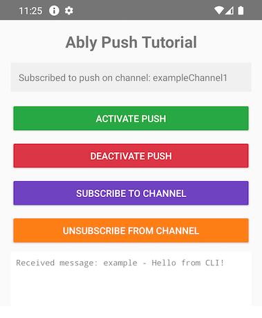

This guide will get you started with Ably Push Notifications in a new Android application using Kotlin.

You'll learn how to set up your application with Firebase Cloud Messaging (FCM), register devices with Ably, publish push notifications, subscribe to channel-based push, and handle incoming notifications.

<Aside data-type='note'>
Using an AI coding assistant? [Teach it Ably](/docs/platform/ai-llms#agent-skills) with Agent Skills for all popular AI coding agents. Run `claude plugin add ably/agent-skills` or `npx skills add ably/agent-skills` to get started.
</Aside>

## Prerequisites <a id="prerequisites"/>

1. [Sign up](https://ably.com/signup) for an Ably account.
2. Create a [new app](https://ably.com/accounts/any/apps/new), and create your first API key in the **API Keys** tab of the dashboard.
  * Your API key needs the `publish` and `subscribe` capabilities.
  * Also add the `push-admin` capability if you're using the same API key to publish a push notification. In production this would more likely be a server using a different API key.
3. Add a rule to a channel so you can test sending push notifications via a channel. Select [**Rules**](https://ably.com/accounts/any/apps/any/app_namespaces) in the Ably dashboard, add a new rule and enable the **Push notifications** option.
4. Install [Android Studio](https://developer.android.com/studio).
5. Use a real Android device or an emulator with Google Play Services installed (required for FCM).

### (Optional) Install Ably CLI <a id="install-cli"/>

Use the [Ably CLI](/docs/platform/tools/cli) as an additional client to quickly test Pub/Sub features and push notifications.

[`ably init`](/docs/cli/init) installs the Ably CLI, authenticates, and sets the default app and API key in a single command:

<Code>
```shell
npx -p @ably/cli ably init
```
</Code>

### Set up Firebase Cloud Messaging <a id="setup-fcm"/>

To enable push notifications, you need to configure FCM:

1. Go to the [Firebase Console](https://console.firebase.google.com/) and create a new project (or use an existing one).
2. Add an Android app to your Firebase project using your application's package name.
3. Download the `google-services.json` file and place it in your Android app module directory (`app/`).
4. In the Firebase Console, go to **Project Settings** → **Service accounts** and generate a new private key. Download the JSON file.
5. In the Ably dashboard, navigate to your app's **Notifications** tab.
6. Scroll to the **Push Notifications Setup** section and select **Configure Push**.
7. Follow the instructions to upload your Firebase service account JSON file.

### Create an Android project <a id="prerequisites-create-project"/>

Create a new Android project in Android Studio with an **Empty Views Activity** template using Kotlin, and set the minimum SDK to API 26 (Android 8.0) or higher.

Add the following to your **project-level** `build.gradle.kts`:

<Code>
```kotlin
plugins {
    id("com.google.gms.google-services") version "4.4.2" apply false
}
```
</Code>

Then add the following dependencies to your **app-level** `build.gradle.kts`:

<Code>
```kotlin
plugins {
    id("com.google.gms.google-services")
}

dependencies {
    // AppCompat for AppCompatActivity and Theme.AppCompat
    implementation("androidx.appcompat:appcompat:1.7.0")

    // Ably Android SDK (includes push notification support)
    implementation("io.ably:ably-android:1.2.+")

    // Firebase Cloud Messaging
    implementation(platform("com.google.firebase:firebase-bom:33.0.0"))
    implementation("com.google.firebase:firebase-messaging-ktx")

    // Required for LocalBroadcastManager
    implementation("androidx.localbroadcastmanager:localbroadcastmanager:1.1.0")
}
```
</Code>

Add the `INTERNET` and `POST_NOTIFICATIONS` permissions to your `AndroidManifest.xml`:

<Code>
```xml
<uses-permission android:name="android.permission.INTERNET" />
<uses-permission android:name="android.permission.POST_NOTIFICATIONS" />
```
</Code>

All further code can be added directly to your `MainActivity.kt`, `PushNotificationService.kt`, and `AblyHelper.kt` files.

## Step 1: Set up Ably <a id="step-1"/>

Create an `AblyHelper.kt` file with a singleton object to manage your Ably Realtime client across the app:

<Code>
```kotlin
import android.content.Context
import io.ably.lib.realtime.AblyRealtime
import io.ably.lib.types.ClientOptions

object AblyHelper {
    private var instance: AblyRealtime? = null

    fun getInstance(context: Context? = null): AblyRealtime {
        return instance ?: synchronized(this) {
            instance ?: run {
                val options = ClientOptions().apply {
                    key = "{{API_KEY}}" // Use token authentication in production
                    clientId = "push-tutorial-client"
                }
                AblyRealtime(options).also {
                    if (context != null) it.setAndroidContext(context)
                    instance = it
                }
            }
        }
    }
}
```
</Code>

Initialize the Ably client early in your app's lifecycle by creating an `Application` class. Create a new file `PushTutorialApp.kt`:

<Code>
```kotlin
import android.app.Application

class PushTutorialApp : Application() {
    override fun onCreate() {
        super.onCreate()
        // Initialize Ably client on app startup
        AblyHelper.getInstance(this)
    }
}
```
</Code>

Register your `Application` class in `AndroidManifest.xml` inside the `<application>` element:

<Code>
```xml
<application
    android:name=".PushTutorialApp"
    ...>
```
</Code>

## Step 2: Set up push notifications <a id="step-2"/>

Add push activation and deactivation to your `MainActivity.kt`. The Ably Android SDK activates push asynchronously and the result arrives via Android's broadcast system, so register a `BroadcastReceiver` to handle it (the following imports cover all steps in this guide):

<Code>
```kotlin
import android.content.BroadcastReceiver
import android.content.Context
import android.content.Intent
import android.content.IntentFilter
import android.os.Build
import android.os.Bundle
import android.util.Log
import android.widget.Button
import android.widget.ScrollView
import android.widget.TextView
import androidx.appcompat.app.AppCompatActivity
import androidx.localbroadcastmanager.content.LocalBroadcastManager
import io.ably.lib.types.AblyException
import io.ably.lib.types.ErrorInfo
import io.ably.lib.realtime.CompletionListener
import io.ably.lib.util.IntentUtils
import com.google.gson.JsonObject
import io.ably.lib.types.Message
import io.ably.lib.types.MessageExtras
import io.ably.lib.types.Param

class MainActivity : AppCompatActivity() {

    companion object {
        private const val TAG = "MainActivity"
        private const val CHANNEL_NAME = "my-first-push-channel"
    }

    private val realtime by lazy { AblyHelper.getInstance() }

    private val pushActivationReceiver = object : BroadcastReceiver() {
        override fun onReceive(context: Context, intent: Intent) {
            when (intent.action) {
                "io.ably.broadcast.PUSH_ACTIVATE" -> {
                    val error = IntentUtils.getErrorInfo(intent)
                    if (error != null) {
                        Log.e(TAG, "Push activation failed: ${error.message}")
                        updateStatus("Push activation failed: ${error.message}")
                    } else {
                        try {
                            val deviceId = realtime.device().id
                            Log.d(TAG, "Push activated. Device ID: $deviceId")
                            updateStatus("Push activated. Device ID: $deviceId")
                        } catch (e: Exception) {
                            Log.e(TAG, "Push activated but failed to get device ID: ${e.message}")
                            updateStatus("Push activated")
                        }
                    }
                }
                "io.ably.broadcast.PUSH_DEACTIVATE" -> {
                    val error = IntentUtils.getErrorInfo(intent)
                    if (error != null) {
                        Log.e(TAG, "Push deactivation failed: ${error.message}")
                    } else {
                        Log.d(TAG, "Push deactivated")
                        updateStatus("Push notifications deactivated")
                    }
                }
            }
        }
    }

    private fun updateStatus(message: String) {
        runOnUiThread {
            Log.d(TAG, message)
            // Wire this to your status TextView in Step 4
        }
    }

    fun activatePushNotifications() {
        updateStatus("Activating push notifications...")
        try {
            realtime.push.activate()
        } catch (e: AblyException) {
            updateStatus("Activation error: ${e.message}")
        }
    }

    fun deactivatePushNotifications() {
        updateStatus("Deactivating push notifications...")
        try {
            realtime.push.deactivate()
        } catch (e: AblyException) {
            updateStatus("Deactivation error: ${e.message}")
        }
    }
}
```
</Code>

Your app is now configured to receive push notifications once activated.

### Handle push notifications <a id="step-2-handle"/>

Create a `PushNotificationService.kt` file that extends `FirebaseMessagingService`. This service handles new FCM tokens and incoming push messages:

<Code>
```kotlin
import android.app.NotificationChannel
import android.app.NotificationManager
import android.os.Build
import android.util.Log
import androidx.core.app.NotificationCompat
import com.google.firebase.messaging.FirebaseMessagingService
import com.google.firebase.messaging.RemoteMessage
import io.ably.lib.types.RegistrationToken

class PushNotificationService : FirebaseMessagingService() {

    companion object {
        private const val TAG = "PushService"
        private const val CHANNEL_ID = "push_tutorial_channel"
    }

    override fun onNewToken(token: String) {
        super.onNewToken(token)
        Log.d(TAG, "New FCM token received")
        try {
            // Update the FCM token on Ably server
            AblyHelper.getInstance().push.getActivationContext().onNewRegistrationToken(RegistrationToken.Type.FCM, token)
        } catch (e: Exception) {
            Log.e(TAG, "Error updating FCM token with Ably", e)
        }
    }

    override fun onMessageReceived(remoteMessage: RemoteMessage) {
        super.onMessageReceived(remoteMessage)
        Log.d(TAG, "Message received from: ${remoteMessage.from}")

        // Display a notification when the app is in the foreground
        remoteMessage.notification?.let { notification ->
            showNotification(
                notification.title ?: "Push Notification",
                notification.body ?: "",
                remoteMessage.data
            )
        }
    }

    private fun showNotification(title: String, body: String, data: Map<String, String>) {
        val notificationManager = getSystemService(NOTIFICATION_SERVICE) as NotificationManager

        if (Build.VERSION.SDK_INT >= Build.VERSION_CODES.O) {
            val channel = NotificationChannel(
                CHANNEL_ID,
                "Push Tutorial",
                NotificationManager.IMPORTANCE_DEFAULT
            )
            notificationManager.createNotificationChannel(channel)
        }

        val notification = NotificationCompat.Builder(this, CHANNEL_ID)
            .setSmallIcon(android.R.drawable.ic_dialog_info)
            .setContentTitle(title)
            .setContentText(body)
            .setAutoCancel(true)
            .build()

        notificationManager.notify(System.currentTimeMillis().toInt(), notification)
    }
}
```
</Code>

Register the service in `AndroidManifest.xml` inside the `<application>` element:

<Code>
```xml
<service
    android:name=".PushNotificationService"
    android:exported="false">
    <intent-filter>
        <action android:name="com.google.firebase.MESSAGING_EVENT" />
    </intent-filter>
</service>
```
</Code>

Push notifications delivered while your app is in the background are handled automatically by the FCM SDK and displayed as system notifications. The `onMessageReceived()` method handles foreground notifications via `NotificationManager`.

## Step 3: Subscribe to channel push notifications <a id="step-3"/>

To subscribe your device to a channel so it can receive channel-based push notifications, add the following methods to `MainActivity`:

<Code>
```kotlin
fun subscribeToChannel(channelName: String) {
    val channel = realtime.channels.get(channelName)
    channel.push.subscribeDeviceAsync(object : CompletionListener {
        override fun onSuccess() {
            Log.d(TAG, "Subscribed to push on channel: $channelName")
            updateStatus("Subscribed to push on channel: $channelName")
        }

        override fun onError(reason: ErrorInfo?) {
            Log.e(TAG, "Failed to subscribe: ${reason?.message}")
            updateStatus("Failed to subscribe: ${reason?.message}")
        }
    })
}

fun unsubscribeFromChannel(channelName: String) {
    val channel = realtime.channels.get(channelName)
    channel.push.unsubscribeDeviceAsync(object : CompletionListener {
        override fun onSuccess() {
            Log.d(TAG, "Unsubscribed from push on channel: $channelName")
            updateStatus("Unsubscribed from push on channel: $channelName")
        }

        override fun onError(reason: ErrorInfo?) {
            Log.e(TAG, "Failed to unsubscribe: ${reason?.message}")
            updateStatus("Failed to unsubscribe: ${reason?.message}")
        }
    })
}
```
</Code>

Also add a realtime channel subscription to receive messages while the app is in the foreground:

<Code>
```kotlin
fun subscribeToRealtime(channelName: String) {
    val channel = realtime.channels.get(channelName)
    channel.subscribe { message ->
        Log.d(TAG, "Received message: ${message.name} - ${message.data}")
    }
}
```
</Code>

## Step 4: Build the UI <a id="step-4"/>

Create the layout file `res/layout/activity_main.xml`:

<Code>
```xml
<?xml version="1.0" encoding="utf-8"?>
<LinearLayout xmlns:android="http://schemas.android.com/apk/res/android"
    android:layout_width="match_parent"
    android:layout_height="match_parent"
    android:orientation="vertical"
    android:padding="16dp">

    <TextView
        android:layout_width="match_parent"
        android:layout_height="wrap_content"
        android:text="Ably Push Tutorial"
        android:textSize="24sp"
        android:textStyle="bold"
        android:gravity="center"
        android:paddingBottom="16dp" />

    <TextView
        android:id="@+id/statusTextView"
        android:layout_width="match_parent"
        android:layout_height="wrap_content"
        android:text="Ready to start"
        android:padding="12dp"
        android:background="#F0F0F0"
        android:textSize="14sp"
        android:layout_marginBottom="16dp" />

    <Button
        android:id="@+id/activateBtn"
        android:layout_width="match_parent"
        android:layout_height="wrap_content"
        android:text="Activate Push"
        android:textColor="#FFFFFF"
        android:backgroundTint="#28A745"
        android:layout_marginBottom="8dp" />

    <Button
        android:id="@+id/deactivateBtn"
        android:layout_width="match_parent"
        android:layout_height="wrap_content"
        android:text="Deactivate Push"
        android:textColor="#FFFFFF"
        android:backgroundTint="#DC3545"
        android:layout_marginBottom="8dp" />

    <Button
        android:id="@+id/subscribeBtn"
        android:layout_width="match_parent"
        android:layout_height="wrap_content"
        android:text="Subscribe to Channel"
        android:textColor="#FFFFFF"
        android:backgroundTint="#6F42C1"
        android:layout_marginBottom="8dp" />

    <Button
        android:id="@+id/unsubscribeBtn"
        android:layout_width="match_parent"
        android:layout_height="wrap_content"
        android:text="Unsubscribe from Channel"
        android:textColor="#FFFFFF"
        android:backgroundTint="#FD7E14"
        android:layout_marginBottom="8dp" />

    <ScrollView
        android:id="@+id/logScrollView"
        android:layout_width="match_parent"
        android:layout_height="0dp"
        android:layout_weight="1"
        android:background="#FFFFFF"
        android:padding="8dp">

        <TextView
            android:id="@+id/logTextView"
            android:layout_width="match_parent"
            android:layout_height="wrap_content"
            android:fontFamily="monospace"
            android:textSize="12sp" />
    </ScrollView>
</LinearLayout>
```
</Code>

Now update `MainActivity.kt` to wire up the UI and register the broadcast receiver:

<Code>
```kotlin
class MainActivity : AppCompatActivity() {

    companion object {
        private const val TAG = "MainActivity"
        private const val CHANNEL_NAME = "my-first-push-channel"
    }

    private val realtime by lazy { AblyHelper.getInstance() }

    private lateinit var statusTextView: TextView
    private lateinit var logTextView: TextView
    private lateinit var logScrollView: ScrollView

    private val pushActivationReceiver = object : BroadcastReceiver() {
        override fun onReceive(context: Context, intent: Intent) {
            when (intent.action) {
                "io.ably.broadcast.PUSH_ACTIVATE" -> {
                    val error = IntentUtils.getErrorInfo(intent)
                    if (error != null) {
                        updateStatus("Push activation failed: ${error.message}")
                    } else {
                        try {
                            updateStatus("Push activated. Device ID: ${realtime.device().id}")
                        } catch (e: Exception) {
                            updateStatus("Push activated")
                        }
                    }
                }
                "io.ably.broadcast.PUSH_DEACTIVATE" -> {
                    updateStatus("Push notifications deactivated")
                }
            }
        }
    }

    override fun onCreate(savedInstanceState: Bundle?) {
        super.onCreate(savedInstanceState)
        setContentView(R.layout.activity_main)

        statusTextView = findViewById(R.id.statusTextView)
        logTextView = findViewById(R.id.logTextView)
        logScrollView = findViewById(R.id.logScrollView)

        // Register broadcast receiver for push activation results
        val filter = IntentFilter().apply {
            addAction("io.ably.broadcast.PUSH_ACTIVATE")
            addAction("io.ably.broadcast.PUSH_DEACTIVATE")
        }
        LocalBroadcastManager.getInstance(this)
            .registerReceiver(pushActivationReceiver, filter)

        // Request notification permission on Android 13+
        if (Build.VERSION.SDK_INT >= Build.VERSION_CODES.TIRAMISU) {
            requestPermissions(arrayOf(android.Manifest.permission.POST_NOTIFICATIONS), 0)
        }

        // Wire up buttons
        findViewById<Button>(R.id.activateBtn).setOnClickListener {
            activatePushNotifications()
        }
        findViewById<Button>(R.id.deactivateBtn).setOnClickListener {
            deactivatePushNotifications()
        }
        findViewById<Button>(R.id.subscribeBtn).setOnClickListener {
            subscribeToChannel(CHANNEL_NAME)
        }
        findViewById<Button>(R.id.unsubscribeBtn).setOnClickListener {
            unsubscribeFromChannel(CHANNEL_NAME)
        }

        // Subscribe to realtime messages on the channel
        subscribeToRealtime(CHANNEL_NAME)
    }

    override fun onDestroy() {
        super.onDestroy()
        LocalBroadcastManager.getInstance(this)
            .unregisterReceiver(pushActivationReceiver)
    }

    private fun updateStatus(message: String) {
        runOnUiThread {
            statusTextView.text = message
            Log.d(TAG, message)
        }
    }

    private fun appendToLog(message: String) {
        runOnUiThread {
            logTextView.append("$message\n")
            logScrollView.post { logScrollView.fullScroll(ScrollView.FOCUS_DOWN) }
        }
    }

    fun activatePushNotifications() {
        updateStatus("Activating push notifications...")
        try {
            realtime.push.activate()
        } catch (e: AblyException) {
            updateStatus("Activation error: ${e.message}")
        }
    }

    fun deactivatePushNotifications() {
        updateStatus("Deactivating push notifications...")
        try {
            realtime.push.deactivate()
        } catch (e: AblyException) {
            updateStatus("Deactivation error: ${e.message}")
        }
    }

    fun subscribeToChannel(channelName: String) {
        realtime.channels.get(channelName).push.subscribeDeviceAsync(object : CompletionListener {
            override fun onSuccess() {
                updateStatus("Subscribed to push on channel: $channelName")
            }
            override fun onError(reason: ErrorInfo?) {
                updateStatus("Failed to subscribe: ${reason?.message}")
            }
        })
    }

    fun unsubscribeFromChannel(channelName: String) {
        realtime.channels.get(channelName).push.unsubscribeDeviceAsync(object : CompletionListener {
            override fun onSuccess() {
                updateStatus("Unsubscribed from push on channel: $channelName")
            }
            override fun onError(reason: ErrorInfo?) {
                updateStatus("Failed to unsubscribe: ${reason?.message}")
            }
        })
    }

    fun subscribeToRealtime(channelName: String) {
        realtime.channels.get(channelName).subscribe { message ->
            appendToLog("Received message: ${message.name} - ${message.data}")
        }
    }
}
```
</Code>

Build and run your app on an Android device or emulator.

## Step 5: Publish a push notification <a id="step-5"/>

In the app, tap **Activate Push** and wait until the status message displays your device ID.

### Publish directly to your device <a id="step-5-direct"/>

Publish a push notification directly to your client ID (or device ID using `--device-id` instead of `--client-id`) via the [Ably CLI](/docs/platform/tools/cli):

<Code fixed="true">
```shell
ably push publish --client-id push-tutorial-client \
  --title "Test push" \
  --body "Hello from CLI!" \
  --data '{"foo":"bar","baz":"qux"}'
```
</Code>

### Publish via a channel <a id="step-5-channel"/>

Tap **Subscribe to Channel** in the app, then publish a push notification to the channel using the [Ably CLI](/docs/platform/tools/cli):

<Code fixed="true">
```shell
ably push publish --channel my-first-push-channel \
  --title "Hello" \
  --body "World!" \
  --message '{"name":"greeting","data":"Hello World!"}'
```
</Code>



If you tap **Unsubscribe from Channel**, you will no longer receive push notifications for that channel. Run the same command again and verify that no notification is received.

To see the full list of options for publishing push notifications with the Ably CLI, run `ably push publish --help` or see the [Ably CLI push documentation](/docs/cli/push). To publish push notifications from your own server code instead of the CLI, see [Push notification publishing](https://ably.com/docs/push/publish).

## Next steps <a id="next-steps"/>

* Understand [token authentication](/docs/auth/token) before going to production.
* Explore [push notification administration](/docs/push#push-admin) for managing devices and subscriptions.
* Learn about [rules](/docs/channels#rules) for channel-based push notifications.
* Read more about the [Push Admin API](/docs/api/realtime-sdk/push-admin).
* Explore [Ably CLI push commands](/docs/cli/push) for the full list of push CLI options.

You can also explore the [Ably SDK for Android](https://github.com/ably/ably-java) on GitHub, or visit the [API references](/docs/api/realtime-sdk?lang=kotlin) for additional functionality.
