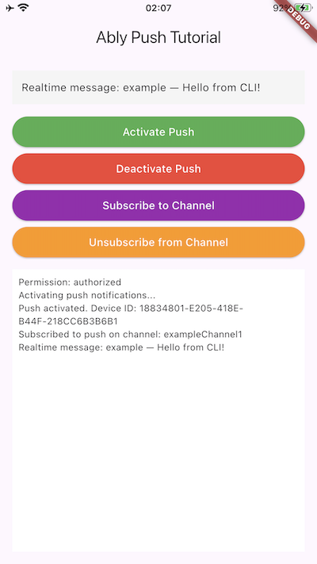

This guide will get you started with Ably Push Notifications in a Flutter application targeting Android and iOS.

You'll learn how to configure Firebase Cloud Messaging (FCM) for Android and APNs for iOS, register devices with Ably, send push notifications, subscribe to channel-based push, and handle incoming notifications.

## Prerequisites <a id="prerequisites"/>

1. [Sign up](https://ably.com/signup) for an Ably account.
2. Create a [new app](https://ably.com/accounts/any/apps/new), and create your first API key in the **API Keys** tab of the dashboard.
  * Your API key needs the `publish`, `subscribe` capabilities.
  * Also add the `push-admin` capability if you're using the same API key to send a push notification. In production this would more likely be a server using a different API key.
3. Add a rule to a channel so you can test sending push notification via a channel. Select [**Rules**](https://ably.com/accounts/any/apps/any/app_namespaces) in the Ably dashboard, add a new rule and enable the **Push notifications** option.
4. Install the [Flutter SDK](https://docs.flutter.dev/get-started/install).
5. Use a real device or an emulator with Google Play Services installed (required for FCM on Android), or a real iOS device or simulator (Xcode 14+) for APNs.

### (Optional) Install Ably CLI <a id="install-cli"/>

Use the [Ably CLI](https://github.com/ably/cli) as an additional client to quickly test Pub/Sub features and push notifications.

1. Install the Ably CLI:

<Code fixed="true">
```shell
npm install -g @ably/cli
```
</Code>

2. Run the following to log in to your Ably account and set the default app and API key:

<Code fixed="true">
```shell
ably login
```
</Code>

### Set up Firebase Cloud Messaging (Android) <a id="setup-fcm"/>

1. Go to the [Firebase Console](https://console.firebase.google.com/) and create a new project (or use an existing one).
2. Add an **Android** app to your Firebase project using your application's package name.
3. Download the `google-services.json` file and place it in your Android app module directory (`android/app/`).
4. In the Firebase Console, go to **Project configuration** → **Service accounts** and generate a new private key. Download the JSON file.
5. In the Ably dashboard left sidebar, navigate to **Push Notifications**.
6. Scroll to the **Configure push service for devices** section and press **Configure Push**.
7. Upload your Firebase service account JSON file and press **Save**.

### Set up APNs (iOS) <a id="setup-apns"/>

1. In the [Apple Developer portal](https://developer.apple.com), go to **Certificates, Identifiers & Profiles** → **Keys**.
2. Add a new key and check **Apple Push Notifications service (APNs)**, click **Register**.
3. Download the `.p8` file — you can only download it once. Note your **Key ID** and **Team ID**.
4. In the Ably dashboard left sidebar, navigate to **Push Notifications**.
5. Scroll to the **Configure push service for devices** section and press **Configure Push**.
6. Under **Apple Push Notification Service**, upload your `.p8` file, enter the **Key ID**, **Team ID**, and your app's **Bundle ID** (**Topic Header** field) and press **Save**.

### Create a Flutter project <a id="prerequisites-create-project"/>

Create a new Flutter project and navigate to the project folder:

<Code fixed="true">
```shell
flutter create ably_push_flutter --platforms android,ios
cd ably_push_flutter
```
</Code>

Add the following dependencies to your `pubspec.yaml`:

<Code fixed="true">
```text
dependencies:
  flutter:
    sdk: flutter
  ably_flutter: ^1.2.35
  firebase_core: ^3.0.0
  firebase_messaging: ^15.0.0
```
</Code>

Then run:

<Code fixed="true">
```shell
flutter pub get
```
</Code>

#### Configure Android <a id="configure-android"/>

Add the Google Services plugin to `android/build.gradle`:

<Code fixed="true">
```text
buildscript {
    dependencies {
        classpath 'com.google.gms:google-services:4.4.2'
    }
}
```
</Code>

Apply the plugin at the top of `android/app/build.gradle`:

<Code fixed="true">
```text
apply plugin: 'com.google.gms.google-services'
```
</Code>

Add the `POST_NOTIFICATIONS` permission to `android/app/src/main/AndroidManifest.xml`:

<Code fixed="true">
```xml
<uses-permission android:name="android.permission.POST_NOTIFICATIONS" />
```
</Code>

You can use the [FlutterFire CLI](https://firebase.flutter.dev/docs/cli/) to generate the `firebase_options.dart` file, which provides platform-specific Firebase configuration automatically. Run the following command in your project directory:

<Code fixed="true">
```shell
flutterfire configure --platforms=android
```
</Code>

The `--platforms=android` flag limits configuration to Android, since `ably_flutter` on iOS uses APNs directly and does not require Firebase.

#### Configure iOS <a id="configure-ios"/>

Open `ios/Runner.xcworkspace` in Xcode and add the **Push Notifications** capability:

1. Select the **Runner** target in Xcode.
2. Go to the **Signing & Capabilities** tab.
3. Click **+ Capability** and add **Push Notifications**.
4. Also add **Background Modes** and enable **Remote notifications**.

All further code can be added to `lib/ably_service.dart` and `lib/main.dart`.

## Step 1: Set up Ably <a id="step-1"/>

Create a new file `lib/ably_service.dart` to manage your Ably Pub/Sub client across the app:

<Code>
```flutter
// lib/ably_service.dart
import 'package:ably_flutter/ably_flutter.dart' as ably;

class AblyService {
  static final AblyService _instance = AblyService._internal();
  late ably.Realtime _realtime;

  factory AblyService() {
    return _instance;
  }

  AblyService._internal();

  Future<void> init() async {
    final clientOptions = ably.ClientOptions(
      key: '{{API_KEY}}', // Use token authentication in production
      clientId: 'push-tutorial-client',
    );

    _realtime = ably.Realtime(options: clientOptions);
  }

  ably.Realtime get realtime => _realtime;
}
```
</Code>

Replace the contents of `lib/main.dart` to initialize Firebase and the Ably service on startup:

<Code>
```flutter
// lib/main.dart
import 'dart:io';
import 'package:ably_flutter/ably_flutter.dart' as ably;
import 'package:firebase_core/firebase_core.dart';
import 'package:firebase_messaging/firebase_messaging.dart';
import 'package:flutter/material.dart';
import 'ably_service.dart';
import 'firebase_options.dart';

void main() async {
  WidgetsFlutterBinding.ensureInitialized();
  // Initialize Firebase only on Android, as it's required for FCM. On iOS, Ably uses APNs directly.
  if (Platform.isAndroid) {
    await Firebase.initializeApp(
      options: DefaultFirebaseOptions.currentPlatform,
    );
  }
  await AblyService().init();
  runApp(const MyApp());
}

class MyApp extends StatelessWidget {
  const MyApp({super.key});

  @override
  Widget build(BuildContext context) {
    return MaterialApp(
      title: 'Ably Push Tutorial',
      theme: ThemeData(primarySwatch: Colors.blue),
      home: const PushHomePage(),
    );
  }
}

class PushHomePage extends StatefulWidget {
  const PushHomePage({super.key});

  @override
  State<PushHomePage> createState() => _PushHomePageState();
}

class _PushHomePageState extends State<PushHomePage> {
  static const _channelName = 'my-first-push-channel';
  String _status = 'Ready';
  final List<String> _log = [];

  void _updateStatus(String message) {
    setState(() {
      _status = message;
      _log.add(message);
    });
    debugPrint(message);
  }

  @override
  void initState() {
    super.initState();
    _subscribeToRealtime();
  }

  void _subscribeToRealtime() {
    final channel = AblyService().realtime.channels.get(_channelName);
    channel.subscribe().listen((ably.Message message) {
      _updateStatus('Realtime message: ${message.name} — ${message.data}');
    });
  }

  @override
  Widget build(BuildContext context) {
    return Scaffold(
      appBar: AppBar(title: const Text('Ably Push Tutorial')),
      body: const Center(child: Text('Wire up buttons in Step 3')),
    );
  }
}
```
</Code>

## Step 2: Set up push notifications <a id="step-2"/>

Push activation with `ably_flutter` registers the device with Ably and the underlying push service (FCM on Android, APNs on iOS). Add the following methods to your `_PushHomePageState` class:

<Code>
```flutter
Future<void> _requestPermissions() async {
  if (Platform.isAndroid) {
    final settings = await FirebaseMessaging.instance.requestPermission(
      alert: true,
      badge: true,
      sound: true,
    );
    _updateStatus('Permission: ${settings.authorizationStatus.name}');
  } else {
    final granted = await AblyService().realtime.push.requestPermission();
    _updateStatus('Permission: ${granted ? 'authorized' : 'denied'}');
  }
}

Future<void> _activatePush() async {
  _updateStatus('Activating push notifications...');
  try {
    await AblyService().realtime.push.activate();
    final device = await AblyService().realtime.device();
    _updateStatus('Push activated. Device ID: ${device.id}');
  } catch (e) {
    _updateStatus('Activation failed: $e');
  }
}

Future<void> _deactivatePush() async {
  _updateStatus('Deactivating push notifications...');
  try {
    await AblyService().realtime.push.deactivate();
    _updateStatus('Push deactivated');
  } catch (e) {
    _updateStatus('Deactivation failed: $e');
  }
}
```
</Code>

Also update `initState` to call `_requestPermissions()` on startup:

<Code>
```flutter
@override
void initState() {
  super.initState();
  _requestPermissions();
  _subscribeToRealtime();
}
```
</Code>

### Handle push notifications <a id="step-2-handle"/>

Push notifications delivered while the app is in the background are displayed as system notifications automatically. For foreground notifications on Android, listen to `FirebaseMessaging.onMessage` in `initState`:

<Aside data-type='note'>
On iOS, `ably_flutter` delivers push notifications directly via APNs. Foreground push notifications are not received as Dart events on iOS.
</Aside>

<Code>
```flutter
@override
void initState() {
  super.initState();
  _requestPermissions();
  if (Platform.isAndroid) {
    FirebaseMessaging.onMessage.listen((RemoteMessage message) {
      final notification = message.notification;
      if (notification != null) {
        _updateStatus(
          'Push received: ${notification.title} — ${notification.body}',
        );
      }
    });
  }
  _subscribeToRealtime();
}
```
</Code>

## Step 3: Subscribe to channel push notifications <a id="step-3"/>

To subscribe your device to a push channel so it receives channel-based push notifications, add the following methods to `_PushHomePageState`:

<Code>
```flutter
Future<void> _subscribeToChannel() async {
  try {
    final channel = AblyService().realtime.channels.get(_channelName);
    await channel.push.subscribeDevice();
    _updateStatus('Subscribed to push on channel: $_channelName');
  } catch (e) {
    _updateStatus('Subscribe failed: $e');
  }
}

Future<void> _unsubscribeFromChannel() async {
  try {
    final channel = AblyService().realtime.channels.get(_channelName);
    await channel.push.unsubscribeDevice();
    _updateStatus('Unsubscribed from channel: $_channelName');
  } catch (e) {
    _updateStatus('Unsubscribe failed: $e');
  }
}
```
</Code>

## Step 4: Build the UI <a id="step-4"/>

Build a UI in your app to add buttons that call all push functions. Replace the `build` method of `_PushHomePageState` with the following to wire up all the controls:

<Code>
```flutter
@override
Widget build(BuildContext context) {
  return Scaffold(
    appBar: AppBar(title: const Text('Ably Push Tutorial')),
    body: Padding(
      padding: const EdgeInsets.all(16.0),
      child: Column(
        crossAxisAlignment: CrossAxisAlignment.stretch,
        children: [
          Container(
            padding: const EdgeInsets.all(12.0),
            color: Colors.grey.shade100,
            child: Text(_status, style: const TextStyle(fontSize: 14)),
          ),
          const SizedBox(height: 12),
          ElevatedButton(
            onPressed: _activatePush,
            style: ElevatedButton.styleFrom(
                backgroundColor: Colors.green,
                foregroundColor: Colors.white),
            child: const Text('Activate Push'),
          ),
          ElevatedButton(
            onPressed: _deactivatePush,
            style: ElevatedButton.styleFrom(
                backgroundColor: Colors.red,
                foregroundColor: Colors.white),
            child: const Text('Deactivate Push'),
          ),
          ElevatedButton(
            onPressed: _subscribeToChannel,
            style: ElevatedButton.styleFrom(
                backgroundColor: Colors.purple,
                foregroundColor: Colors.white),
            child: const Text('Subscribe to Channel'),
          ),
          ElevatedButton(
            onPressed: _unsubscribeFromChannel,
            style: ElevatedButton.styleFrom(
                backgroundColor: Colors.orange,
                foregroundColor: Colors.white),
            child: const Text('Unsubscribe from Channel'),
          ),
          const SizedBox(height: 12),
          Expanded(
            child: Container(
              color: Colors.white,
              padding: const EdgeInsets.all(8.0),
              child: ListView.builder(
                itemCount: _log.length,
                itemBuilder: (context, index) => Text(
                  _log[index],
                  style: const TextStyle(
                      fontFamily: 'monospace', fontSize: 12),
                ),
              ),
            ),
          ),
        ],
      ),
    ),
  );
}
```
</Code>

Run your app on a real device or compatible emulator/simulator:

<Code fixed="true">
```shell
flutter run
```
</Code>

## Step 5: Publish a push notification <a id="step-5"/>

In the app tap **Activate Push** and wait until the status message displays your device ID.

### Publish directly to your device <a id="step-5-direct"/>

Publish a push notification directly to your client ID (or device ID using `--device-id` instead of `--client-id`) via the Ably CLI:

<Code fixed="true">
```shell
ably push publish --client-id push-tutorial-client \
  --title "Hello" \
  --body "World!" \
  --data '{"foo":"bar"}'
```
</Code>

### Publish via a channel <a id="step-5-channel"/>

Tap **Subscribe to Channel** in the app, then publish a push notification to your channel using the Ably CLI:

<Code fixed="true">
```shell
ably push publish --channel my-first-push-channel \
  --title "Hello" \
  --body "World!" \
  --message '{"name":"greeting","data":"Hello World!"}'
```
</Code>

If you tap **Unsubscribe from Channel**, the device no longer receives push notifications for that channel. Send the same command again and verify that no notification is received.

To see the full list of push publishing options with the Ably CLI, run `ably push publish --help` in your terminal or visit the [Ably CLI push commands](/docs/cli/push) page. To send push notifications from your own server code instead of the CLI, see [Push notification publishing](https://ably.com/docs/push/publish).



## Next steps <a id="next-steps"/>

* Understand [token authentication](/docs/auth/token) before going to production.
* Explore [push notification administration](/docs/push#push-admin) for managing devices and subscriptions.
* Learn about [channel rules](/docs/channels#rules) for channel-based push notifications.
* Read more about the [Push Admin API](/docs/api/realtime-sdk/push-admin).

You can also explore the [Ably Flutter SDK](https://github.com/ably/ably-flutter) on GitHub, or visit the [API references](/docs/api/realtime-sdk?lang=flutter) for additional functionality.
