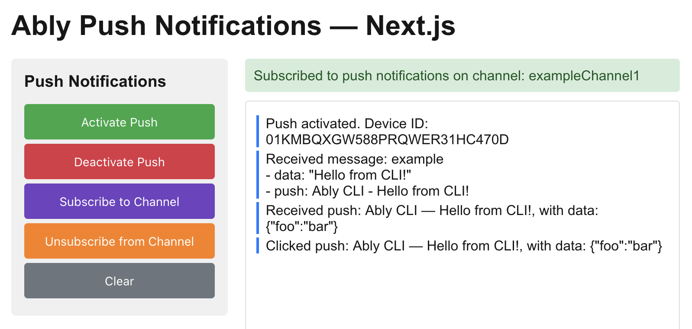
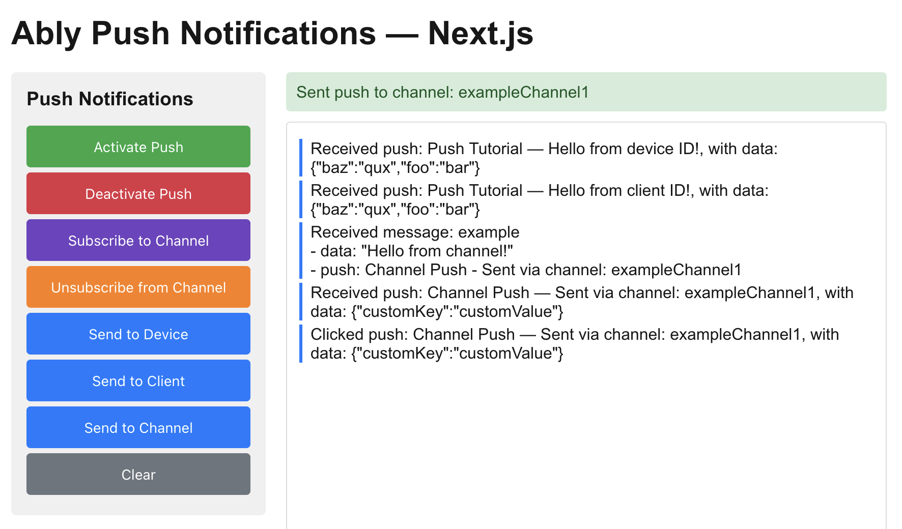

This guide will get you started with Ably Push Notifications in a Next.js application using the App Router.

You'll learn how to set up an Ably Realtime client with push notification support, register a service worker, activate push notifications, subscribe to channel-based push, send push notifications, and handle incoming notifications in both the service worker and the React component.

## Prerequisites <a id="prerequisites"/>

1. [Sign up](https://ably.com/signup) for an Ably account.
2. Create a [new app](https://ably.com/accounts/any/apps/new), and create your first API key in the **API Keys** tab of the dashboard.
3. Your API key will need the `publish` and `subscribe` capabilities. For sending push notifications from your app, you'll also need the `push-admin` capability.
4. For channel-based push, add a rule for the channel with **Push notifications enabled** checked. In the dashboard left sidebar: **Configuration** → **Rules** → **Add** or **Edit** a rule, then enable the Push notifications option. See [rules](/docs/channels#rules) for details.
5. A modern browser that supports the [Push API](https://developer.mozilla.org/en-US/docs/Web/API/Push_API) (Chrome, Firefox, or Edge recommended).
6. [Node.js](https://nodejs.org/) 18 or higher.

### (Optional) Install Ably CLI <a id="install-cli"/>

Use the [Ably CLI](https://github.com/ably/cli) as an additional client to quickly test Pub/Sub features and push notifications.

1. Install the Ably CLI:

<Code>
```shell
npm install -g @ably/cli
```
</Code>

2. Run the following to log in to your Ably account and set the default app and API key:

<Code>
```shell
ably login
```
</Code>

### Create a Next.js project <a id="create-project"/>

Create a new Next.js project using the official create command:

<Code>
```shell
npx create-next-app@latest ably-push-tutorial --typescript --app --no-tailwind --eslint --src-dir
cd ably-push-tutorial
```
</Code>

Then install the Ably SDK:

<Code>
```shell
npm install ably
```
</Code>

## Step 1: Set up Ably <a id="step-1"/>

This step initializes the Ably Realtime client with the necessary configuration for push notifications, including the API key, client ID, and service worker URL. It also subscribes to a channel to receive incoming messages.

Because the Ably SDK runs in the browser, the component must be a [Client Component](https://nextjs.org/docs/app/building-your-application/rendering/client-components). Create `src/app/push/page.tsx` with the `'use client'` directive at the top:

<Code>
```javascript
'use client';

import * as Ably from 'ably';
import AblyPushPlugin from 'ably/push';
import { useEffect, useRef, useState } from 'react';

const CHANNEL_NAME = 'exampleChannel1';

export default function PushPage() {
  const realtimeRef = useRef<Ably.Realtime | null>(null);
  const channelRef = useRef<Ably.RealtimeChannel | null>(null);
  const [status, setStatus] = useState('');
  const [output, setOutput] = useState<string[]>([]);

  // Log channel messages to the output div
  function log(message: string) {
    setOutput((prev) => [...prev, message]);
  }

  // Clear output log
  function clearOutput() {
    setOutput([]);
  }

  // Initialize Ably connection
  useEffect(() => {
    const realtime = new Ably.Realtime({
      key: '{{API_KEY}}', // Your Ably API key (do not use API key in production, use token authentication instead)
      clientId: 'push-tutorial-client',
      plugins: { Push: AblyPushPlugin },
      pushServiceWorkerUrl: '/service-worker.js',
    });

    realtimeRef.current = realtime;

    realtime.connection.once('connected', () => {
      log('Connected to Ably with clientId: ' + realtime.auth.clientId);

      const channel = realtime.channels.get(CHANNEL_NAME);
      channelRef.current = channel;

      channel.subscribe((message) => {
        let logMessage = 'Received message: ' + message.name;
        if (message.data) {
            logMessage += '\n- data: ' + JSON.stringify(message.data);
        }
        if (message.extras && message.extras.push) {
            logMessage += '\n- push: ' + message.extras.push.notification.title
                + ' - ' + message.extras.push.notification.body;
        }
        log(logMessage);
      });
    });

    return () => {
      realtime.close();
    };
  }, []);

  return (
    <main style={{ fontFamily: 'Arial, sans-serif', padding: '20px', maxWidth: '900px', margin: '0 auto', background: '#fff', color: '#171717' }}>
      <h1 style={{ marginBottom: '20px' }}>Ably Push Notifications — Next.js</h1>
      <div style={{ display: 'flex', gap: '20px' }}>
        <div style={{ border: '1px solid #ddd', borderRadius: '4px', padding: '12px', flex: 1, minHeight: '500px', background: '#fff' }}>
          {output.map((entry, i) => (
            <p key={i} style={{ margin: '4px 0', borderLeft: '3px solid #007bff', paddingLeft: '8px', color: '#171717', whiteSpace: 'pre-line' }}>{entry}</p>
          ))}
        </div>
      </div>
    </main>
  );
}
```
</Code>

Key configuration options:

- **`key`**: Your Ably API key.
- **`clientId`**: A unique identifier for this client.
- **`plugins`**: The `AblyPushPlugin` enables push notification support.
- **`pushServiceWorkerUrl`**: Path to the service worker file. In Next.js, files in `public/` are served from the root, so `/service-worker.js` maps to `public/service-worker.js`.

The `useEffect` hook ensures the Ably client is only created in the browser, and the cleanup function closes the connection when the component unmounts.

## Step 2: Set up push notifications <a id="step-2"/>

This step covers activating and deactivating push notifications. When activated, the browser prompts the user for notification permission and registers the device with Ably.

<Aside data-type='note'>
The buttons that call these functions are added to the JSX in [Step 4](#step-4). The code in this step won't be fully functional until that step is complete.
</Aside>

Add the following functions inside `PushPage`, after the `useEffect`:

<Code>
```javascript
// Activate push notifications
async function activatePush() {
  const realtime = realtimeRef.current;
  if (!realtime) return;
  try {
    setStatus('Activating push notifications...');
    await realtime.push.activate();
    setStatus('Push activated. Device ID: ' + realtime.device().id);
    log('Push activated. Device ID: ' + realtime.device().id);
  } catch (error: unknown) {
    const message = error instanceof Error ? error.message : String(error);
    setStatus('Failed to activate push: ' + message);
  }
}

// Deactivate push notifications
async function deactivatePush() {
  const realtime = realtimeRef.current;
  if (!realtime) return;
  try {
    setStatus('Deactivating push notifications...');
    await realtime.push.deactivate();
    setStatus('Push notifications deactivated.');
  } catch (error: unknown) {
    const message = error instanceof Error ? error.message : String(error);
    setStatus('Failed to deactivate push: ' + message);
  }
}
```
</Code>

When `realtime.push.activate()` is called, the Ably SDK will:

1. Register the service worker specified in `pushServiceWorkerUrl`.
2. Request notification permission from the user.
3. Obtain a push subscription from the browser's Push API.
4. Register the device with Ably's push notification service.

After successful activation, `realtime.device().id` contains the unique device ID assigned by Ably.

## Step 3: Receive push notifications <a id="step-3"/>

A service worker runs in the background and can receive push notifications even when the page is not open. In Next.js, the service worker file must be placed in the `public/` directory so it is served from the root path.

### Create the service worker <a id="step-3-service-worker"/>

Create `public/service-worker.js`:

<Code>
```javascript
// Handle push events
self.addEventListener('push', (event) => {
  const eventData = event.data.json();

  // Prepare the notification object suitable for both `showNotification` and `postMessage`
  const notification = {
    title: eventData.notification.title,
    body: eventData.notification.body,
    data: eventData.data,
  };

  // Display a native browser notification
  self.registration.showNotification(notification.title, notification);

  // Also forward to open pages (optional, for demonstration purposes)
  event.waitUntil(
    clients.matchAll({ type: 'window', includeUncontrolled: true }).then((clientList) => {
      clientList.forEach((client) => {
        client.postMessage({ type: 'tutorial-push', notification });
      });
    })
  );
});
```
</Code>

Key points about the service worker:

- `event.data.json()` — parses the push message payload sent by the server.
- `self.registration.showNotification()` — displays a native browser notification.
- `client.postMessage()` — sends data to open pages of your application.
- `push` events can only be handled in a service worker, not in the main page.

### Handle notification clicks <a id="step-3-notification-clicks"/>

Add a `notificationclick` listener in `public/service-worker.js` to handle what happens when the user clicks a notification:

<Code>
```javascript
// Handle notification clicks
self.addEventListener('notificationclick', (event) => {
  event.notification.close();

  // Open or focus the app window
  event.waitUntil(
    clients.matchAll({ type: 'window', includeUncontrolled: true }).then((clientList) => {
      const url = event.notification.data?.url || '/push';

      // Check if there's already a window open
      for (const client of clientList) {
        if ((client.url.endsWith('/push') || url === '/push') && client.focus) {
          client.postMessage({
            type: 'tutorial-push-click',
            notification: {
              title: event.notification.title,
              body: event.notification.body,
              data: event.notification.data,
            },
          });
          return client.focus();
        }
      }

      // Open a new window if none exists
      if (clients.openWindow) {
        return clients.openWindow(url);
      }
    })
  );
});
```
</Code>

When a notification is clicked, the handler closes the notification, looks for an existing window, sends it the notification data via `postMessage`, and focuses it. If no window exists, it opens a new one.

### Handle notifications in the component <a id="step-3-handle-notifications"/>

Add a second `useEffect` inside `PushPage` to receive messages from the service worker and update the log:

<Code>
```javascript
// Listen for messages from the service worker about push notifications
useEffect(() => {
  if (!navigator.serviceWorker) return;

  const handler = (event: MessageEvent) => {
    const notification = event.data?.notification;
    if (!notification) return;
    switch (event.data?.type) {
      case 'tutorial-push':
        log(`Received push: ${notification.title} — ${notification.body}, with data: ${JSON.stringify(notification.data)}`);
        break;
      case 'tutorial-push-click':
        log(`Clicked push: ${notification.title} — ${notification.body}, with data: ${JSON.stringify(notification.data)}`);
        break;
    }
  };

  navigator.serviceWorker.addEventListener('message', handler);
  return () => navigator.serviceWorker.removeEventListener('message', handler);
}, []);
```
</Code>

### Channel push notifications <a id="step-3-subscribe-channel"/>

Push notifications can be sent either directly to your `deviceId` (or `clientId`), or posted to a channel, in which case you first need to subscribe your device to that channel:

<Code>
```javascript
// Subscribe to push notifications on the channel
async function subscribeToChannel() {
  const channel = channelRef.current;
  if (!channel) return;
  try {
    await channel.push.subscribeDevice();
    setStatus('Subscribed to push notifications on channel: ' + CHANNEL_NAME);
  } catch (error: unknown) {
    const message = error instanceof Error ? error.message : String(error);
    setStatus('Failed to subscribe to channel push: ' + message);
  }
}

// Unsubscribe from push notifications on the channel
async function unsubscribeFromChannel() {
  const channel = channelRef.current;
  if (!channel) return;
  try {
    await channel.push.unsubscribeDevice();
    setStatus('Unsubscribed from push notifications on channel: ' + CHANNEL_NAME);
  } catch (error: unknown) {
    const message = error instanceof Error ? error.message : String(error);
    setStatus('Failed to unsubscribe from channel push: ' + message);
  }
}
```
</Code>

Sending push notifications using `deviceId` or `clientId` requires the `push-admin` capability for your API key. Use this method for testing purposes. In a production environment, you would typically send push notifications from your backend server (by posting messages with `push` `extras` field to a channel).

To test push notifications in your app, you can use [Ably dashboard](https://ably.com/dashboard) or Ably CLI.

To send to your client using Ably CLI paste the following command into your terminal:

<Code>
```shell
ably push publish --client-id push-tutorial-client \
  --title "Test push" \
  --body "Hello from CLI!" \
  --data '{"foo":"bar","baz":"qux"}'
```
</Code>

To send push notifications via a channel, you first need a UI to subscribe to the channel.

## Step 4: Build the UI <a id="step-4"/>

Replace the `return` statement in `PushPage` with the following to wire up all the buttons:

<Code>
```javascript
return (
  <main style={{ fontFamily: 'Arial, sans-serif', padding: '20px', maxWidth: '900px', margin: '0 auto', background: '#fff', color: '#171717' }}>
    <h1 style={{ marginBottom: '20px' }}>Ably Push Notifications — Next.js</h1>
    <div style={{ display: 'flex', gap: '20px' }}>
      <div style={{ flex: '0 0 250px', padding: '15px', background: '#f0f0f0', borderRadius: '5px', height: 'fit-content' }}>
        <h3 style={{ marginTop: 0, marginBottom: '16px' }}>Push Notifications</h3>
        <button onClick={activatePush} style={{ padding: '12px 20px', margin: '5px 0', width: '100%', display: 'block', background: '#28a745', color: '#fff', border: 'none', borderRadius: '4px', cursor: 'pointer', fontSize: '14px' }}>Activate Push</button>
        <button onClick={deactivatePush} style={{ padding: '12px 20px', margin: '5px 0', width: '100%', display: 'block', background: '#dc3545', color: '#fff', border: 'none', borderRadius: '4px', cursor: 'pointer', fontSize: '14px' }}>Deactivate Push</button>
        <button onClick={subscribeToChannel} style={{ padding: '12px 20px', margin: '5px 0', width: '100%', display: 'block', background: '#6f42c1', color: '#fff', border: 'none', borderRadius: '4px', cursor: 'pointer', fontSize: '14px' }}>Subscribe to Channel</button>
        <button onClick={unsubscribeFromChannel} style={{ padding: '12px 20px', margin: '5px 0', width: '100%', display: 'block', background: '#fd7e14', color: '#fff', border: 'none', borderRadius: '4px', cursor: 'pointer', fontSize: '14px' }}>Unsubscribe from Channel</button>
        <button onClick={clearOutput} style={{ padding: '12px 20px', margin: '5px 0', width: '100%', display: 'block', background: '#6c757d', color: '#fff', border: 'none', borderRadius: '4px', cursor: 'pointer', fontSize: '14px' }}>Clear</button>
      </div>
      <div style={{ flex: 1 }}>
        {status && (
          <div style={{ padding: '10px', marginBottom: '10px', borderRadius: '4px', background: '#d4edda', color: '#155724' }}>
            {status}
          </div>
        )}
        <div style={{ border: '1px solid #ddd', borderRadius: '4px', padding: '12px', minHeight: '500px', background: '#fff' }}>
          {output.map((entry, i) => (
            <p key={i} style={{ margin: '4px 0', borderLeft: '3px solid #007bff', paddingLeft: '8px', color: '#171717', whiteSpace: 'pre-line' }}>{entry}</p>
          ))}
        </div>
      </div>
    </div>
  </main>
);
```
</Code>

Start the development server:

<Code>
```shell
npm run dev
```
</Code>

Navigate to `http://localhost:3000/push` in your browser. Click **Activate Push**, grant notification permission, and wait for the device ID to appear in the log.

### Send push via channel <a id="step-4-send-channel"/>

To test pushes via channel, subscribe to the channel in the UI and post a message to the "exampleChannel1" with a `push` `extras` field using Ably CLI:

<Code>
```shell
ably channels publish exampleChannel1 '{"name":"example","data":"Hello from CLI!","extras":{"push":{"notification":{"title":"Ably CLI","body":"Hello from CLI!"},"data":{"foo":"bar"}}}}'
```
</Code>



If you unsubscribe from this channel in the app's UI, you will no longer receive push notifications for that channel. Send the same command again and verify that no notification is received.

You can also send push notifications right from your app. The next step will show you how.

## Step 5: Send push with code <a id="step-5"/>

Just as you can send push notifications through the Ably CLI or dashboard, you can also send them directly from your app using device ID (or client ID), or channel publishing methods. For channel publishing, you don't need the admin capabilities for your API key.

Add the following functions inside `PushPage`:

<Code>
```javascript
// Send push notification to a specific device ID
async function sendPushToDevice() {
  const realtime = realtimeRef.current;
  if (!realtime) return;
  try {
    const deviceId = realtime.device().id;
    await realtime.push.admin.publish(
      { deviceId },
      {
        notification: { title: 'Push Tutorial', body: 'Hello from device ID!' },
        data: { foo: 'bar', baz: 'qux' },
      }
    );
    setStatus('Sent push to device ID: ' + deviceId);
  } catch (error: unknown) {
    const message = error instanceof Error ? error.message : String(error);
    setStatus('Error sending to device: ' + message);
  }
}

// Send push notification to a specific client ID
async function sendPushToClient() {
  const realtime = realtimeRef.current;
  if (!realtime) return;
  try {
    const clientId = realtime.auth.clientId;
    await realtime.push.admin.publish(
      { clientId },
      {
        notification: { title: 'Push Tutorial', body: 'Hello from client ID!' },
        data: { foo: 'bar', baz: 'qux' },
      }
    );
    setStatus('Sent push to client ID: ' + clientId);
  } catch (error: unknown) {
    const message = error instanceof Error ? error.message : String(error);
    setStatus('Error sending to client: ' + message);
  }
}
```
</Code>

Sending to a channel is just publishing a message on a channel with a `push` `extras` field:

<Code>
```javascript
async function sendPushToChannel() {
  const channel = channelRef.current;
  if (!channel) return;
  try {
    await channel.publish({
      name: 'example',
      data: 'Hello from channel!',
      extras: {
        push: {
          notification: {
            title: 'Channel Push',
            body: 'Sent via channel: ' + CHANNEL_NAME,
          },
          data: { customKey: 'customValue' },
        },
      },
    });
    setStatus('Sent push to channel: ' + CHANNEL_NAME);
  } catch (error: unknown) {
    const message = error instanceof Error ? error.message : String(error);
    setStatus('Error sending to channel: ' + message);
  }
}
```
</Code>

The `extras.push` object has two parts:

- `notification`: Contains `title` and `body` displayed in the browser notification.
- `data`: Custom key-value pairs delivered to the service worker but not shown directly.

Add the three send buttons to the JSX inside the buttons `div`:

<Code>
```javascript
<button onClick={sendPushToDevice} style={{ padding: '12px 20px', margin: '5px 0', width: '100%', display: 'block', background: '#007bff', color: '#fff', border: 'none', borderRadius: '4px', cursor: 'pointer', fontSize: '14px' }}>Send to Device</button>
<button onClick={sendPushToClient} style={{ padding: '12px 20px', margin: '5px 0', width: '100%', display: 'block', background: '#007bff', color: '#fff', border: 'none', borderRadius: '4px', cursor: 'pointer', fontSize: '14px' }}>Send to Client</button>
<button onClick={sendPushToChannel} style={{ padding: '12px 20px', margin: '5px 0', width: '100%', display: 'block', background: '#007bff', color: '#fff', border: 'none', borderRadius: '4px', cursor: 'pointer', fontSize: '14px' }}>Send to Channel</button>
```
</Code>

Now you can send push notifications to your device, client, or channel using the buttons in the UI:



## Browser compatibility <a id="browser-compatibility"/>

Web Push notification support varies across browsers:

| Feature | Chrome/Edge | Firefox | Safari |
|---|---|---|---|
| Push API | Full support | Full support | Partial (macOS 13+) |
| Service Worker | Full support | Full support | Full support |
| Notification actions (buttons) | Supported | Limited | Not supported |
| Silent push | Supported | Supported | Not supported |

<Aside data-type="note">
Safari on macOS 13+ supports Web Push, but with some limitations. Notification action buttons are not supported in Safari or Firefox on macOS.
</Aside>

## Next steps <a id="next-steps"/>

* Understand [token authentication](/docs/auth/token) before going to production.
* Explore [push notification administration](/docs/push#push-admin) for managing devices and subscriptions.
* Learn about [channel rules](/docs/channels#rules) for channel-based push notifications.
* Read more about the [Push Admin API](/docs/api/realtime-sdk/push-admin).
* Check out the [Web Push Notifications](/docs/push/configure/web) documentation for advanced use cases.

You can also explore the [Ably JavaScript SDK](https://github.com/ably/ably-js) on GitHub, or visit the [API references](/docs/api/realtime-sdk?lang=javascript) for additional functionality.
